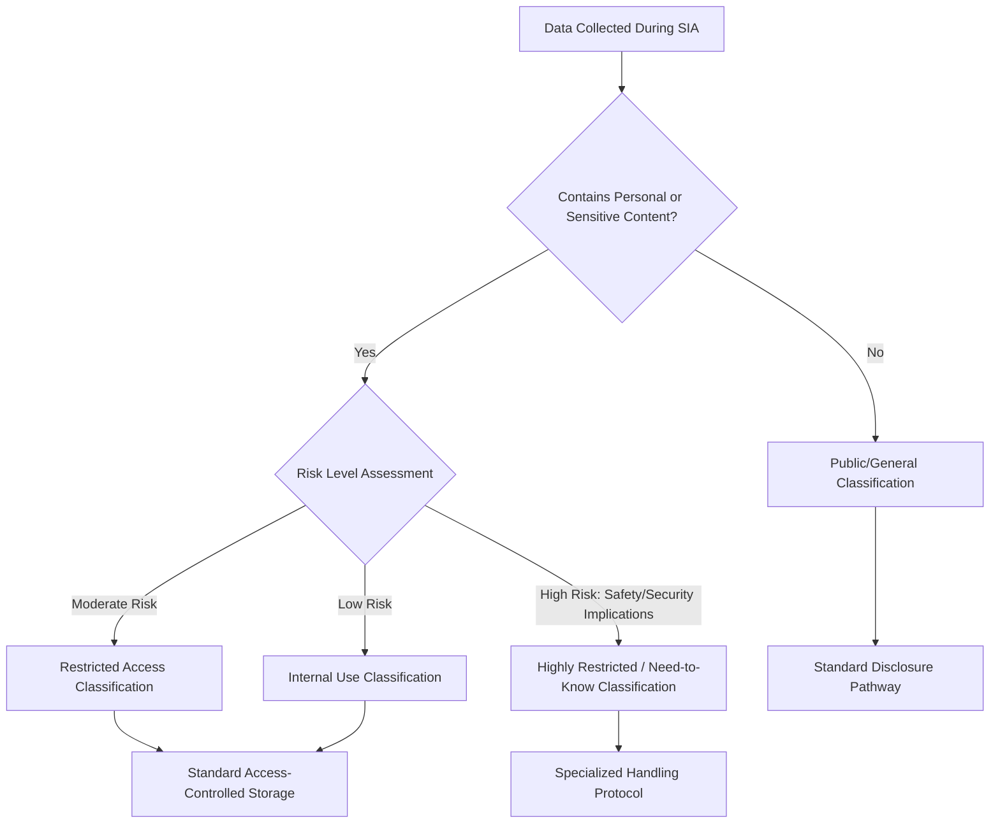

## Handling confidential and sensitive information

### Overview

Handling confidential and sensitive information in Social Impact Assessment (SIA) concerns the policies, procedures, and technical safeguards used to protect personal data, culturally sensitive knowledge, and security-critical information collected during baseline studies, consultations, and monitoring. This is distinct from general record-keeping in that it focuses specifically on classification, restriction, and protective handling rather than retention logistics.

### Why This Is a Distinct Risk Domain

**Key Points**

- SIA processes routinely collect data whose disclosure could cause harm: household income and asset data, land tenure disputes, personal identification, health status, gender-based violence disclosures, political affiliation, and in conflict settings, ethnic or sectarian identity.
- Harm from mishandled sensitive information can range from privacy violation to physical danger for respondents, particularly in politically unstable or conflict-affected contexts.
- Lender and regulatory frameworks (IFC Performance Standards, World Bank ESS10) require documented data protection measures as part of stakeholder engagement compliance, not merely as good practice.

### Core Frameworks Referenced

1. **Data protection regulations** (e.g., GDPR and equivalent national laws) — govern lawful basis for collection, data minimization, and individual rights over personal data.
2. **IASC Information Management and Data Responsibility Guidelines** — humanitarian-sector-specific guidance on sensitive data handling in displacement and crisis contexts.
3. **Do No Harm principles** — require assessing whether data collection or disclosure itself could create or exacerbate risk for respondents.
4. **IFC/World Bank Environmental and Social Standards** — require confidentiality safeguards within broader stakeholder engagement and grievance mechanism requirements.
5. **Free, Prior, and Informed Consent (FPIC) protocols** — govern handling of Indigenous traditional/cultural knowledge, which may carry sensitivities distinct from personal data protection.

### Data Sensitivity Classification Framework

### Data Classification Tiers

| Tier | Description | Example | Handling Requirement |
| --- | --- | --- | --- |
| Public | Safe for open disclosure | Aggregated demographic statistics | Standard disclosure channels |
| Internal | Not for public release but low individual risk | Draft impact assessments pre-finalization | Team-level access, standard document control |
| Restricted | Contains identifiable personal data | Named household survey responses, income data | Access-controlled systems, need-to-know basis |
| Highly restricted | Disclosure could cause physical, legal, or severe reputational harm | GBV disclosures, political/ethnic affiliation in conflict zones, informant identities | Segregated storage, minimal personnel access, specialized consent protocols |

### Consent and Data Minimization Principles

**Key Points**

- **Informed consent** for data collection should specify what data is collected, why, how it will be used, who will have access, and how long it will be retained.
- **Data minimization**: collect only what is necessary for the stated assessment purpose; avoid opportunistic over-collection "in case it's useful later."
- Respondents should be informed of their right to decline specific questions without losing access to programs or benefits — coercive linkage between data disclosure and benefit eligibility is a recognized ethical risk.
- Consent processes should be adapted for low-literacy populations (verbal consent with witness, audio-recorded consent) rather than relying solely on signed forms.

### Anonymization and Aggregation Techniques

**Key Points**

- **Anonymization** removes or irreversibly alters identifying details so individuals cannot reasonably be re-identified; **pseudonymization** (replacing names with codes while retaining a separately stored key) is a weaker, reversible alternative sometimes appropriate for internal analysis.
- Aggregation (reporting data only at group level, e.g., "household income by tenure category" rather than named individual records) is standard practice for public disclosure documents.
- **[Inference]** In small communities, aggregation alone may be insufficient to prevent re-identification (e.g., "the one household with a disability in this hamlet" is identifiable even without a name); practitioners should assess re-identification risk specific to population size and context rather than relying on aggregation as an automatic safeguard.

### Handling Culturally Sensitive Information

**Key Points**

- Indigenous and traditional knowledge (e.g., sacred site locations, traditional resource use practices) may require protection not only for privacy reasons but because disclosure itself could violate cultural protocols or enable resource exploitation.
- FPIC processes should explicitly address how such knowledge will be recorded, stored, and whether/how it may be referenced in public-facing reports (often requiring generalized rather than precise geographic references).

**Example**

A baseline study documents the general existence and importance of a sacred site near a proposed project area for impact assessment purposes, but precise coordinates and ceremonial details are withheld from the public disclosure version at the request of traditional authorities, with only the responsible regulator receiving fuller detail under a confidentiality undertaking.

### Sensitive Data in Conflict and Fragile Contexts

**Key Points**

- Recording ethnic, religious, or political affiliation data carries elevated risk in conflict-affected or authoritarian contexts, where such data could be misused for targeting if compromised.
- Data collection tools should be reviewed for necessity of such variables — collecting sensitive demographic categories "for completeness" without a clear analytical necessity increases risk without proportionate benefit.
- Where such data is genuinely necessary for equity analysis, extra safeguards apply: encrypted storage, restricted access, and consideration of whether data can be collected/analyzed by trusted local partners rather than transmitted externally.

### Technical and Procedural Safeguards

| Safeguard Category | Example Measures |
| --- | --- |
| Access control | Role-based permissions, need-to-know restriction, multi-factor authentication for digital systems |
| Storage security | Encryption at rest and in transit, physical storage in locked/restricted areas for paper records |
| Data transfer | Secure transfer protocols; avoiding unencrypted email for sensitive data sharing |
| Personnel protocols | Confidentiality agreements/NDAs for enumerators and analysts; training on data sensitivity handling |
| De-identification | Removing direct identifiers before analysis where individual-level identification is not required |
| Retention limits | Defined disposal schedules to avoid indefinite retention of sensitive records |

### Sensitivity-Handling Decision Architecture (svg_diagram)

<svg xmlns="http://www.w3.org/2000/svg" viewBox="0 0 720 320">
<text x="360" y="26" text-anchor="middle" font-size="16" font-weight="bold" fill="#1a1a1a">Confidential Data Handling Decision Flow (svg_diagram)</text>
<rect x="270" y="50" width="180" height="45" rx="6" fill="#cce5ff" stroke="#004085" />
<text x="360" y="78" text-anchor="middle" font-size="12" fill="#004085">Data Point Collected</text>
<line x1="360" y1="95" x2="360" y2="130" stroke="#333" stroke-width="2" marker-end="url(#arrowS)" />
<polygon points="360,130 460,175 360,220 260,175" fill="#fff3cd" stroke="#856404" />
<text x="360" y="172" text-anchor="middle" font-size="10" fill="#856404">Identifiable or</text>
<text x="360" y="186" text-anchor="middle" font-size="10" fill="#856404">Sensitive?</text>
<line x1="260" y1="175" x2="130" y2="175" stroke="#333" stroke-width="2" marker-end="url(#arrowS)" />
<text x="195" y="165" text-anchor="middle" font-size="10" fill="#333">No</text>
<rect x="30" y="150" width="180" height="50" rx="6" fill="#d4edda" stroke="#155724" />
<text x="120" y="180" text-anchor="middle" font-size="10" fill="#155724">Standard Handling</text>
<line x1="460" y1="175" x2="590" y2="175" stroke="#333" stroke-width="2" marker-end="url(#arrowS)" />
<text x="525" y="165" text-anchor="middle" font-size="10" fill="#333">Yes</text>
<rect x="510" y="150" width="180" height="50" rx="6" fill="#f8d7da" stroke="#721c24" />
<text x="600" y="172" text-anchor="middle" font-size="10" fill="#721c24">Classify Tier +</text>
<text x="600" y="186" text-anchor="middle" font-size="10" fill="#721c24">Apply Safeguards</text>
<line x1="600" y1="200" x2="600" y2="240" stroke="#333" stroke-width="2" marker-end="url(#arrowS)" />
<rect x="480" y="245" width="240" height="50" rx="6" fill="#e2d9f3" stroke="#4b3579" />
<text x="600" y="266" text-anchor="middle" font-size="10" fill="#4b3579">Access Control + Encryption</text>
<text x="600" y="282" text-anchor="middle" font-size="10" fill="#4b3579">+ Retention Limit</text>
</svg>

### Disclosure vs. Confidentiality Balancing

**Key Points**

- Transparency obligations (public disclosure of SIA findings) can create tension with confidentiality obligations; the resolution is typically a dual-track document structure — a full confidential version for regulators/internal use and a redacted or aggregated public version.
- Redaction decisions should be documented and justified (e.g., "Section 4.3 redacted in public version due to individual identifiability risk") rather than silently omitted, to preserve auditability of the disclosure process itself.
- In some jurisdictions, freedom-of-information or right-to-information laws may create legal obligations to disclose information that project proponents would prefer to keep confidential; legal counsel input is standard practice for resolving such conflicts.

### Common Pitfalls (Documented in Practice)

- **Over-collection**: Gathering sensitive demographic or personal data without a clear analytical need, increasing risk exposure without corresponding benefit.
- **Flat access control**: Granting all project team members access to the most sensitive data tiers rather than restricting by genuine need-to-know.
- **Unencrypted transfer**: Sharing sensitive survey data via unencrypted email or unsecured cloud drives between project partners.
- **Consent form boilerplate**: Using generic consent language that does not specify actual data uses, misleading respondents about how their information will be handled.
- **Indefinite retention**: Failing to define or enforce data disposal schedules, leaving sensitive data exposed to risk long after its original purpose has lapsed.
- **Aggregation false confidence**: Assuming aggregation alone anonymizes data in small population contexts where re-identification remains feasible.

### Worked Example: End-to-End Scenario

A SIA team conducting baseline research in a politically sensitive border region collects household survey data including livelihood, land tenure, and (where directly relevant to vulnerability analysis) displacement history.

1. The data collection tool is reviewed to remove non-essential sensitive variables (e.g., detailed political opinion questions not required for the assessment's stated purpose).
2. Consent forms explain data use in plain language, administered verbally with witness sign-off for low-literacy respondents.
3. Collected data is classified: household economic data as "Restricted," and any incidentally disclosed information about past violence or persecution as "Highly Restricted," triaged to a specialized, access-limited file separate from the general dataset.
4. Digital data is encrypted and stored with role-based access; only two senior analysts have credentials for the highly restricted tier.
5. The public disclosure report presents aggregated, de-identified statistics; a footnote documents that certain sensitive data points were excluded from public reporting due to identifiability and safety risk.
6. A retention schedule specifies disposal of raw survey data 24 months after project completion, per the data protection policy referenced in the consent form.

### Next Steps

- Draft a data classification policy template tailored to the specific project/jurisdictional context.
- Review applicable national data protection law requirements alongside lender-specific data responsibility guidelines.
- Study IASC Data Responsibility Guidelines for humanitarian/displacement-context data handling specifics.
- Examine re-identification risk assessment methods for small-population survey contexts.
- Explore secure digital data collection and storage tools appropriate for field conditions with limited connectivity.