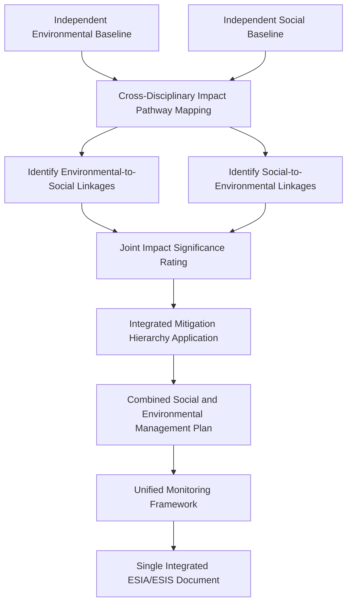

## Integrating findings into environmental and social impact statements

### Overview

Integrating findings into environmental and social impact statements addresses how Social Impact Assessment (SIA) outputs are combined with environmental impact findings into a unified Environmental and Social Impact Assessment (ESIA) or Environmental and Social Impact Statement (ESIS). This is a distinct technical competency because environmental and social disciplines historically developed separate methodologies, and integration requires reconciling differing data structures, significance-rating systems, and mitigation hierarchies into one coherent, decision-useful document.

### Why Integration Is Non-Trivial

**Key Points**

- Environmental assessment traditionally emphasizes biophysical thresholds and regulatory standards (e.g., emission limits), while social assessment emphasizes distributional, perceptual, and rights-based considerations that are less amenable to fixed numerical thresholds.
- Poorly integrated ESIAs often present environmental and social chapters as parallel, disconnected sections rather than showing how biophysical impacts translate into social consequences (and vice versa) — a structural weakness frequently flagged in regulatory and lender review.
- Integration failures can result in mitigation measures that address one domain while inadvertently worsening the other (e.g., an environmental buffer zone that triggers unaddressed economic displacement).

### Core Frameworks Referenced

1. **IFC Performance Standards** — structured as a unified framework (PS1–PS8) explicitly requiring integrated environmental and social risk management rather than siloed treatment.
2. **World Bank Environmental and Social Framework (ESF)** — organizes environmental and social standards (ESS1–ESS10) under a single integrated risk classification and management approach.
3. **Equator Principles** — require ESIA documentation to address environmental and social risks in a combined categorization (A/B/C risk categories) reflecting overall project risk.
4. **IAIA Principles of Environmental Impact Assessment Best Practice** — call for integrated, not parallel, treatment of biophysical and socioeconomic impacts.

### The Integration Process

### Identifying Cross-Disciplinary Impact Pathways

**Key Points**

- **Environmental-to-social pathways**: air/water quality degradation → health outcomes; land clearing → loss of livelihood resources; noise/vibration → property value and wellbeing effects.
- **Social-to-environmental pathways**: in-migration induced by project employment → increased pressure on local natural resources; resettlement site selection → new land clearing or habitat disturbance; livelihood shifts → changed land-use patterns.
- Cumulative impacts often require joint analysis, since environmental degradation and social vulnerability can compound (e.g., a community already economically stressed has less capacity to absorb additional environmental burden).

**Example**

A mining project's environmental team identifies a groundwater drawdown risk. The integrated assessment traces this to social impact: reduced well yields for a downstream farming community, translating into livelihood loss requiring compensation and alternative water source provision — a mitigation measure jointly designed by hydrogeologists and social specialists rather than addressed by either discipline in isolation.

### Cross-Disciplinary Impact Pathway Diagram (svg_diagram)

<svg xmlns="http://www.w3.org/2000/svg" viewBox="0 0 740 320">
<text x="370" y="26" text-anchor="middle" font-size="16" font-weight="bold" fill="#1a1a1a">Environmental-Social Linkage Mapping (svg_diagram)</text>
<rect x="40" y="60" width="200" height="50" rx="6" fill="#d4edda" stroke="#155724" />
<text x="140" y="90" text-anchor="middle" font-size="12" fill="#155724">Environmental Change</text>
<rect x="500" y="60" width="200" height="50" rx="6" fill="#cce5ff" stroke="#004085" />
<text x="600" y="90" text-anchor="middle" font-size="12" fill="#004085">Social Consequence</text>
<line x1="240" y1="80" x2="495" y2="80" stroke="#333" stroke-width="2" marker-end="url(#arrowI1)" />
<text x="370" y="70" text-anchor="middle" font-size="10" fill="#333">e.g., water quality to health/livelihood</text>
<line x1="600" y1="115" x2="600" y2="150" stroke="#333" stroke-width="1" />
<line x1="140" y1="115" x2="140" y2="150" stroke="#333" stroke-width="1" />
<line x1="500" y1="180" x2="245" y2="180" stroke="#333" stroke-width="2" marker-end="url(#arrowI1)" />
<text x="370" y="170" text-anchor="middle" font-size="10" fill="#333">e.g., in-migration to resource pressure</text>
<rect x="500" y="155" width="200" height="50" rx="6" fill="#cce5ff" stroke="#004085" />
<text x="600" y="185" text-anchor="middle" font-size="12" fill="#004085">Social Change</text>
<rect x="40" y="155" width="200" height="50" rx="6" fill="#d4edda" stroke="#155724" />
<text x="140" y="185" text-anchor="middle" font-size="12" fill="#155724">Environmental Consequence</text>
<rect x="180" y="240" width="380" height="55" rx="6" fill="#fff3cd" stroke="#856404" />
<text x="370" y="262" text-anchor="middle" font-size="11" fill="#856404">Joint Significance Rating and Cumulative</text>
<text x="370" y="280" text-anchor="middle" font-size="11" fill="#856404">Impact Assessment (bidirectional linkages)</text>
</svg>

### Reconciling Significance Rating Systems

**Key Points**

- Environmental significance ratings often rely on quantifiable thresholds (regulatory emission limits, ambient standards); social significance ratings frequently rely on qualitative and contextual judgment (magnitude, vulnerability, reversibility, community perception).
- A unified ESIA requires a common significance rating scale (e.g., negligible/minor/moderate/major) applied consistently across both disciplines, with methodology transparently documented for how qualitative social judgments and quantitative environmental thresholds are translated into the same scale.
- Where environmental and social significance ratings for a linked impact diverge substantially, the integrated report should explain the divergence rather than defaulting to one discipline's rating.

**Sample Integrated Significance Matrix**

| Impact | Environmental Rating | Social Rating | Integrated Rating | Basis for Integration |
| --- | --- | --- | --- | --- |
| Groundwater drawdown | Moderate (measured against regulatory threshold) | Major (livelihood-dependent community) | Major | Social vulnerability elevates overall significance despite environmental threshold compliance |
| Temporary construction noise | Minor (within regulatory limits) | Minor (short-term, reversible) | Minor | Consistent across both disciplines |
| Vegetation clearing for resettlement site | Moderate (habitat loss) | Major (avoids displacement conflict) | Moderate-Major (net) | Trade-off explicitly documented in mitigation rationale |

### Integrated Mitigation Hierarchy Application

**Key Points**

- The mitigation hierarchy (avoid, minimize, restore/compensate, offset) should be applied jointly, since a measure addressing one domain can create or resolve impacts in the other.
- Trade-off decisions (e.g., choosing a resettlement site that reduces social disruption but increases habitat clearing) should be explicitly documented with the rationale for the balance struck, rather than presented as if no trade-off existed.
- Combined Environmental and Social Management Plans (ESMPs) should assign clear institutional responsibility, since environmental and social mitigation measures are sometimes implemented by different teams who need coordination protocols.

### Structuring the Integrated Document

**Key Points**

- Common integration models: (a) fully merged chapters organized by impact theme rather than discipline, or (b) parallel discipline-specific chapters followed by a dedicated cross-cutting/cumulative impacts chapter that explicitly links them.
- Executive summaries should present integrated findings (e.g., "the project's most significant risk is the combined effect of X and Y") rather than separately summarizing environmental and social findings without synthesis.
- A single, unified stakeholder engagement record should underpin both environmental and social disclosure content, avoiding duplicate or inconsistent consultation records across disciplines.

**Comparison of Integration Models**

| Model | Structure | Advantage | Risk |
| --- | --- | --- | --- |
| Fully merged by theme | Chapters organized around impact topics (e.g., "Water Resources and Livelihoods") | Strong pathway visibility | Requires close interdisciplinary drafting coordination |
| Parallel + cross-cutting chapter | Separate environmental/social chapters, plus dedicated integration chapter | Easier for discipline specialists to draft independently | Risk that cross-cutting chapter is under-resourced or superficial |

### Unified Monitoring Framework

**Key Points**

- Monitoring indicators should be designed to capture cross-disciplinary linkages, not only discipline-specific metrics (e.g., tracking both water quality parameters and downstream household water-use/health indicators together).
- A single monitoring governance structure (rather than separate environmental and social monitoring teams operating independently) supports early detection of linked impacts as they emerge during implementation.

### Common Pitfalls (Documented in Practice)

- **Parallel-chapter siloing**: Presenting environmental and social findings in fully separate sections with no cross-referencing, leaving linkage analysis implicit or absent.
- **Threshold-only significance**: Applying purely quantitative environmental thresholds to determine overall project significance without adjusting for social vulnerability factors that a purely biophysical threshold does not capture.
- **Mitigation conflict**: Implementing environmental mitigation (e.g., resource-use restrictions) without assessing resulting economic/livelihood impacts on communities dependent on that resource.
- **Duplicate consultation records**: Environmental and social teams conducting separate, uncoordinated consultation processes with the same communities, creating stakeholder fatigue and inconsistent records.
- **Late-stage integration**: Attempting to merge environmental and social findings only at the final report-writing stage rather than through iterative interdisciplinary collaboration from baseline studies onward.

### Worked Example: End-to-End Scenario

A proposed hydropower project undergoes ESIA preparation.

1. Environmental baseline identifies fish population dependent on natural flow regime; social baseline identifies downstream fishing communities dependent on that fish population for livelihood and diet.
2. Cross-disciplinary pathway mapping links reservoir operation (environmental) to fisheries decline (environmental) to fishing livelihood loss (social) to potential food security impact (social).
3. Joint significance rating assigns "Major" status to this linked impact chain, reflecting both ecological and livelihood dimensions, higher than either discipline's isolated rating might suggest.
4. Integrated mitigation combines environmental flow management (minimum flow releases to support fish populations) with social livelihood diversification support for affected fishing households, coordinated between the environmental flow specialist and social livelihoods specialist.
5. The unified ESMP assigns joint responsibility to an environmental-social coordination unit, and monitoring tracks both fish population indicators and household fishing-income indicators together.
6. The final ESIA presents this as a single integrated impact narrative in the executive summary, rather than as separate environmental and social findings.

### Next Steps

- Practice mapping bidirectional environmental-social impact pathways for a specific project type.
- Study IFC/World Bank integrated risk categorization methodology (Category A/B/C) as an entry point for significance rating alignment.
- Review sample combined Environmental and Social Management Plans (ESMPs) for institutional coordination models.
- Examine cumulative impact assessment methodology for multi-project or regional contexts.
- Explore unified stakeholder engagement plan design serving both environmental and social disclosure requirements.