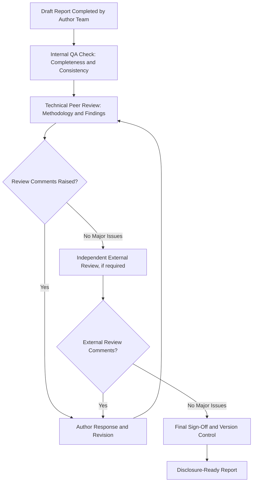

## Peer review and quality assurance of reports

### Overview

Peer review and quality assurance of reports concerns the systematic processes used to verify the technical soundness, methodological rigor, and completeness of Social Impact Assessment (SIA) reports before finalization and disclosure. This function protects against errors, bias, and gaps that could undermine regulatory acceptance, lender confidence, or community trust, and is typically distinct from the drafting team's own internal checks.

### Why Independent Review Is Structurally Necessary

**Key Points**

- Report authors are subject to confirmation bias and proximity bias — having conducted the fieldwork and analysis, they may be less able to identify gaps or unsupported inferences than an independent reviewer.
- Lender and regulatory frameworks (IFC, Equator Principles, national EIA regimes) frequently require or strongly incentivize independent technical review, particularly for higher-risk (Category A) projects.
- Peer review serves both a quality function (improving the report) and an assurance function (providing evidence of due diligence to regulators, lenders, and the public).

### Core Frameworks Referenced

1. **IAIA Quality Review Criteria for Impact Assessment** — provides structured criteria for assessing SIA/EIA report quality across dimensions such as context description, methodology, and impact prediction.
2. **IFC Independent Review requirements** — for Category A projects, often require an Independent Environmental and Social Consultant (IESC) or equivalent to review ESIA documentation.
3. **Equator Principles Independent Review** — Equator Principles Financial Institutions typically require independent review for higher-category projects prior to financial close.
4. **ISO 9001-aligned quality management principles** — adapted by some consultancies for internal document quality assurance workflows (document control, review sign-off stages).

### The Peer Review and QA Process

### Internal Quality Assurance Checks

**Key Points**

- Internal QA focuses on completeness (all required sections present), internal consistency (figures match across sections, terminology used consistently), and compliance with applicable reporting templates/standards.
- A structured checklist approach reduces reliance on reviewer memory and ensures consistent coverage across reports and reviewers.

**Sample Internal QA Checklist Categories**

| Category | Sample Check Items |
| --- | --- |
| Completeness | All required sections present per applicable standard/template; appendices referenced in text are included |
| Consistency | Population/impact figures consistent across executive summary, body, and tables; terminology used uniformly |
| Traceability | Every claim in executive summary is substantiated in report body; citations/data sources referenced |
| Compliance | Report addresses applicable regulatory/lender requirements (e.g., IFC PS references where relevant) |
| Formatting | Tables/figures numbered and cross-referenced; version and date clearly marked |

### Technical Peer Review: Methodological Scrutiny

**Key Points**

- Peer reviewers assess whether the methodology is fit for purpose: appropriate sampling approach, adequate baseline data currency, sound impact significance rating logic.
- Reviewers should verify that conclusions are proportionate to the evidence presented — flagging unsupported causal claims or overstated certainty.
- Review should explicitly check that limitations and uncertainties are disclosed rather than smoothed over, since this is a common area where reports over-state confidence.

**Example**

A peer reviewer notes that a report's claim of "no significant impact on local water access" is based on a single dry-season survey round, without addressing potential wet-season variation. The reviewer flags this as a methodological gap requiring either additional data collection or explicit acknowledgment as a limitation with a monitoring commitment to verify across seasons.

### Independent External Review

**Key Points**

- For higher-risk projects, an independent party with no role in the original drafting — often called an Independent Environmental and Social Consultant (IESC) or equivalent — conducts a review specifically for lender/regulator assurance purposes.
- Independent reviewers typically assess: consistency with applicable international standards (e.g., IFC Performance Standards), adequacy of stakeholder engagement documentation, and whether residual risks after mitigation are acceptable.
- Independent review findings are often themselves disclosed (e.g., as an annex or summary in lender due diligence documentation), adding a layer of public accountability.

### Peer Review Workflow Architecture (svg_diagram)

<svg xmlns="http://www.w3.org/2000/svg" viewBox="0 0 740 320">
<text x="370" y="26" text-anchor="middle" font-size="16" font-weight="bold" fill="#1a1a1a">Multi-Tier Report Review Architecture (svg_diagram)</text>
<rect x="40" y="55" width="180" height="50" rx="6" fill="#cce5ff" stroke="#004085" />
<text x="130" y="85" text-anchor="middle" font-size="11" fill="#004085">Draft Report</text>
<line x1="220" y1="80" x2="270" y2="80" stroke="#333" stroke-width="2" marker-end="url(#arrowQ)" />
<rect x="270" y="55" width="180" height="50" rx="6" fill="#d4edda" stroke="#155724" />
<text x="360" y="78" text-anchor="middle" font-size="11" fill="#155724">Internal QA</text>
<text x="360" y="94" text-anchor="middle" font-size="10" fill="#155724">Completeness/Consistency</text>
<line x1="450" y1="80" x2="500" y2="80" stroke="#333" stroke-width="2" marker-end="url(#arrowQ)" />
<rect x="500" y="55" width="200" height="50" rx="6" fill="#fff3cd" stroke="#856404" />
<text x="600" y="78" text-anchor="middle" font-size="11" fill="#856404">Technical Peer Review</text>
<text x="600" y="94" text-anchor="middle" font-size="10" fill="#856404">Methodology/Findings</text>
<line x1="600" y1="105" x2="600" y2="150" stroke="#333" stroke-width="2" marker-end="url(#arrowQ)" />
<rect x="480" y="155" width="240" height="50" rx="6" fill="#f8d7da" stroke="#721c24" />
<text x="600" y="178" text-anchor="middle" font-size="11" fill="#721c24">Independent External Review</text>
<text x="600" y="194" text-anchor="middle" font-size="10" fill="#721c24">(IESC, higher-risk projects)</text>
<line x1="480" y1="180" x2="220" y2="180" stroke="#333" stroke-width="1.5" stroke-dasharray="4,2" marker-end="url(#arrowQ)" />
<text x="350" y="170" text-anchor="middle" font-size="9" fill="#333">Revision loop</text>
<line x1="600" y1="205" x2="600" y2="245" stroke="#333" stroke-width="2" marker-end="url(#arrowQ)" />
<rect x="440" y="250" width="320" height="50" rx="6" fill="#e2d9f3" stroke="#4b3579" />
<text x="600" y="272" text-anchor="middle" font-size="11" fill="#4b3579">Final Sign-Off + Version Control</text>
<text x="600" y="288" text-anchor="middle" font-size="10" fill="#4b3579">Disclosure-Ready Report</text>
</svg>

### Common Review Criteria Dimensions

| Dimension | Review Question |
| --- | --- |
| Context/scope adequacy | Does the report cover all relevant affected populations and geographic scope? |
| Methodological soundness | Are data collection and analysis methods appropriate and adequately documented? |
| Impact prediction validity | Are impact predictions logically supported by baseline data and analysis, not merely asserted? |
| Mitigation adequacy | Do proposed mitigation measures proportionately address identified significant impacts? |
| Stakeholder engagement quality | Is engagement documentation sufficient to demonstrate meaningful, culturally appropriate consultation? |
| Transparency of limitations | Are data gaps, assumptions, and uncertainties clearly disclosed? |
| Regulatory/standard compliance | Does the report address all applicable legal and lender standard requirements? |

### Managing Reviewer Feedback and Revision Cycles

**Key Points**

- A structured comment-response log (tracking each reviewer comment, author response, and resolution status) supports transparency and prevents comments from being silently dropped.
- Where authors disagree with a reviewer comment, the rationale for not incorporating it should be documented rather than simply ignored, preserving an audit trail of professional judgment.
- Multiple review rounds should be version-controlled distinctly (e.g., Draft v1, Draft v2 post-peer-review, Final post-independent-review) to maintain traceability.

**Sample Comment-Response Log Format**

| Comment ID | Reviewer | Section | Comment | Author Response | Status |
| --- | --- | --- | --- | --- | --- |
| C-014 | Technical peer reviewer | Baseline | Sample size not justified for statistical claims made | Added justification and confidence interval reporting | Resolved |
| C-027 | Independent reviewer | Mitigation | Compensation entitlement matrix lacks customary tenure category | Entitlement matrix revised to include customary tenure | Resolved |

### Common Pitfalls (Documented in Practice)

- **Rubber-stamp review**: Conducting review as a formality without substantive engagement with methodology or findings, undermining the assurance function entirely.
- **Reviewer conflict of interest**: Using reviewers with insufficient independence from the project proponent or original drafting team, weakening the credibility of the review.
- **Comment attrition**: Reviewer comments raised but never tracked to resolution, resulting in unaddressed issues persisting into the final disclosed report.
- **Late-stage review**: Scheduling peer/independent review so close to a disclosure deadline that substantive revision is practically impossible, reducing review to a checkbox exercise.
- **Inconsistent standards across reviewers**: Lacking a structured review criteria framework, leading different reviewers to focus on different (and inconsistent) quality dimensions.

### Worked Example: End-to-End Scenario

A Category A infrastructure project's ESIA (including its SIA chapter) undergoes review prior to lender submission.

1. The drafting team completes internal QA using a standardized checklist, catching several inconsistent population figures between the executive summary and baseline chapter.
2. A technical peer reviewer, not involved in original fieldwork, reviews the methodology section and flags that vulnerable-group disaggregation was incomplete for the disability dimension; the author team commits to a supplementary data collection round.
3. Following revision, an Independent Environmental and Social Consultant (IESC) conducts a full review per lender requirements, checking compliance with IFC Performance Standards and adequacy of the resettlement entitlement matrix.
4. All comments across both review rounds are logged in a comment-response tracker, with author responses and resolution status documented.
5. The final report is version-marked "Final v3 – Post-Independent Review" and submitted to the lender with the independent review summary attached as an annex, providing documented assurance of the multi-tier quality process.

### Next Steps

- Develop a standardized internal QA checklist tailored to the organization's typical report types and applicable standards.
- Study IAIA quality review criteria in depth for structured technical peer review design.
- Review lender-specific independent review requirements (e.g., IFC IESC scope of work templates) for higher-risk project categories.
- Practice designing a comment-response log system integrated with version control practices.
- Examine case studies of accountability mechanism findings related to inadequate report review processes.