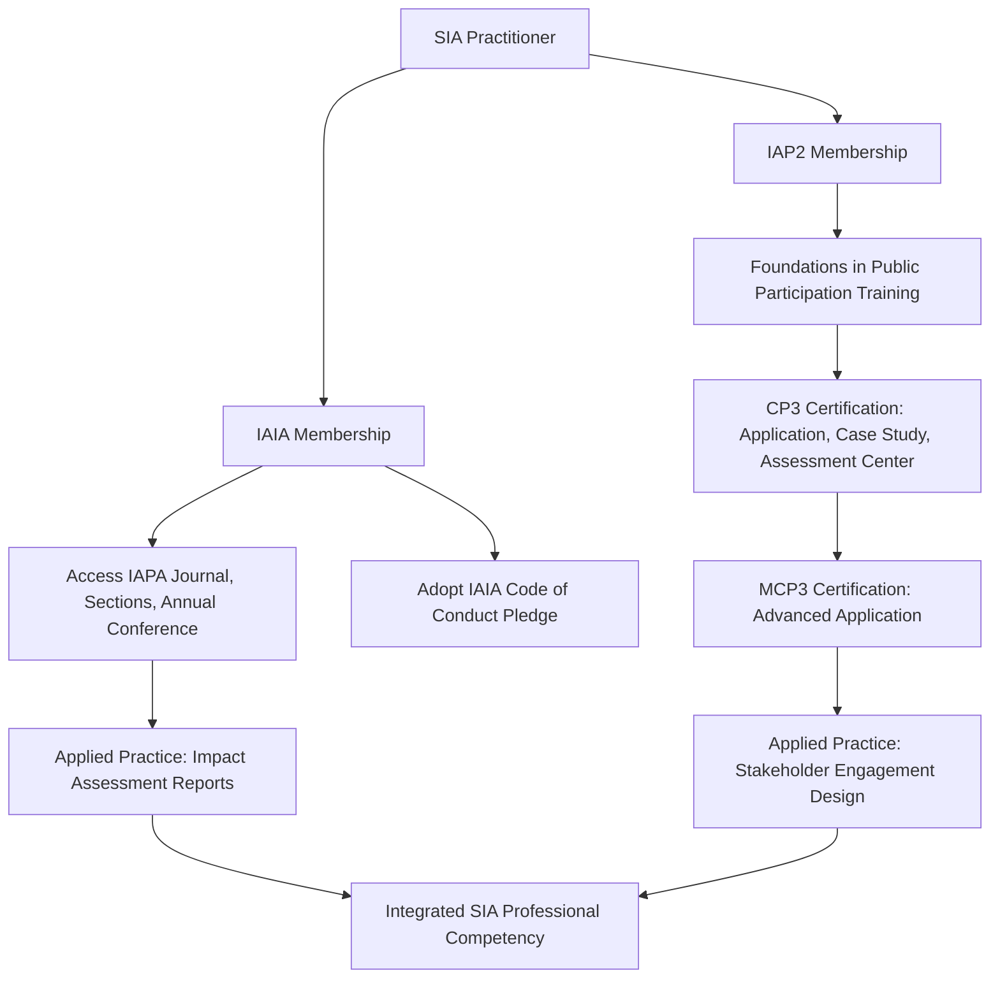

## Professional bodies including IAIA and IAP2

### Overview

Professional bodies in the SIA field provide standards development, credentialing, community of practice, and continuing professional education for practitioners. The two most referenced organizations are the International Association for Impact Assessment (IAIA) and the International Association for Public Participation (IAP2), which address complementary but distinct professional domains: impact assessment methodology and public/stakeholder engagement practice, respectively.

### International Association for Impact Assessment (IAIA)

**Key Points**

- IAIA is an international association of professionals involved with impact assessment, including both social impact assessment and environmental impact assessment. [Wikipedia](https://en.wikipedia.org/wiki/International_Association_for_Impact_Assessment)
- The organization traces its origins to the US National Environmental Policy Act (NEPA), signed into law in 1970, which required federal agencies to prepare Environmental Impact Statements, creating the practitioner community that later formalized into IAIA. [Wikipedia](https://en.wikipedia.org/wiki/International_Association_for_Impact_Assessment)
- IAIA was incorporated in 1980 in the state of Georgia, US. [Wikipedia](https://en.wikipedia.org/wiki/International_Association_for_Impact_Assessment)
- IAIA is the leading global network on best practice in the use of impact assessment for informed decision making regarding policies, projects, programs, and plans, bringing together researchers, practitioners, and users of various types of impact assessment. [IUCN](https://iucn.org/our-union/members/iucn-members/international-association-impact-assessment)
- IAIA's diverse membership includes experts from private corporations, governments, academia, civil society organizations, consultancies, and international financial institutions, and membership numbers more than 1,800 people representing 120 countries. [IUCN](https://iucn.org/our-union/members/iucn-members/international-association-impact-assessment)[IUCN](https://iucn.org/our-union/members/iucn-members/international-association-impact-assessment)

#### IAIA Membership Structure

**Key Points**

- IAIA membership is open to all individuals interested in impact assessment, subject to payment of annual dues. [IAIA](https://iaia.org/individual-membership/)
- There is no formal review or vetting process for individual members, so membership in IAIA does not imply any professional certification or endorsement of an individual's qualifications or expertise. This is an important distinction from credentialing bodies — IAIA membership signals community participation, not verified competency. [IAIA](https://iaia.org/individual-membership/)
- IAIA encourages members to make a personal pledge of commitment to a professional Code of Conduct, functioning as an ethical norm-setting mechanism rather than an enforced certification standard. [IAIA](https://iaia.org/individual-membership/)
- Current IAIA members get full access to Impact Assessment and Project Appraisal (IAPA), an international peer-reviewed journal that is the official publication of IAIA, published six times per year. [IAIA](https://iaia.org/individual-membership/)

#### IAIA Member Services and Activities

**Key Points**

- Members can connect with impact assessment experts via a searchable member directory and the IAIA Hub, an online community for exchanging ideas, joining topical Section groups, and collaborating with professionals worldwide. [IAIA](https://iaia.org/individual-membership/)
- Members receive reduced rates for IAIA's conferences, symposia, and training courses. [IAIA](https://iaia.org/individual-membership/)
- IAIA's resource library houses over 40 years of expertise in open-access publications, educational videos, and other materials. [IAIA](https://iaia.org/)
- IAIA hosts an Annual Conference as its flagship event; the 45th Annual Conference is scheduled for 19–22 May 2026 in Québec City, Canada, focused on themes of communication, misinformation, and trust in environmental assessment, including a stream on professional recognition and certification systems and how these credibility tools can be used to instill stakeholder confidence. [IAIA26](https://2026.iaia.org/)[IAIA26](https://2026.iaia.org/)

### IAIA Quality and Standards Function

**Key Points**

- Beyond membership, IAIA's primary professional-development contribution is standards guidance — quality review criteria for impact assessment reports, principles of best practice for EIA/SIA, and topic-specific guidance documents referenced throughout SIA practice (as covered in earlier sections on report structure and peer review).
- IAIA Sections (special-interest groups) allow practitioners to specialize and network within sub-disciplines such as social impact assessment, health impact assessment, or biodiversity offsets.

### International Association for Public Participation (IAP2)

**Key Points**

- IAP2 is an international association of members who seek to promote and improve the practice of public participation and public engagement in relation to individuals, governments, institutions, and other entities that affect the public interest in nations throughout the world. [Iap2](https://www.iap2.org/)
- IAP2's mission is to advance and extend the practice of public participation through professional development, certification, standards of practice, core values, advocacy and key initiatives with strategic partners around the world. [Iap2](https://www.iap2.org/)
- IAP2 is organized with national/regional affiliates (e.g., IAP2 USA); IAP2 USA is a nationwide organization that leads, advances, and advocates for best practices in public participation, providing members with tools via conferences, training, professional certification, research, and mentorship, with more than 2,500 members across 48 states. [Iap2usa](https://www.iap2usa.org/)

#### IAP2 Certification Program

**Key Points**

- IAP2's Certification Program is a professional designation available to IAP2 members that proves, through independent assessment, demonstrated basic knowledge and skills required to perform the role of a public participation (P2) professional. [Iap2](https://www.iap2.org/page/professionalcertification)
- The program offers two levels: Certified Public Participation Professional (CP3) and Master Certified Public Participation Professional (MCP3). [Wildapricot](https://iap2usa.wildapricot.org/certification/)
- The CP3 designation is awarded upon successfully completing a three-step assessment based on five Core Competencies, and the MCP3 is an application process responding to mandatory and optional criteria, available only after obtaining CP3 certification. [Wildapricot](https://iap2usa.wildapricot.org/certification/)[Wildapricot](https://iap2usa.wildapricot.org/certification/)
- Assessors use a three-step process: submission of a written application and professional portfolio, preparation and submission of a public participation plan in response to a case study, and preparation for and participation in a live, online assessment center. [Wildapricot](https://iap2usa.wildapricot.org/certification/)
- Assessors evaluate candidates across five categories of Core Competencies spanning 29 criteria, including P2 Process Planning and Application Skills. [Wildapricot](https://iap2usa.wildapricot.org/certification/)[Wildapricot](https://iap2usa.wildapricot.org/certification/)

This positions IAP2 certification as a substantively distinct credentialing mechanism compared to IAIA membership: IAP2's CP3/MCP3 designations involve competency-based independent assessment, whereas IAIA membership, as noted above, explicitly does not.

#### IAP2 Training Programs

**Key Points**

- IAP2's Foundations in Public Participation program was developed to meet the needs of practitioners conducting public involvement and community engagement in a changing world, benefiting both new and experienced practitioners and managers through structured, proven techniques. [Iap2usa](https://iap2usa.org/event-4826100)
- IAP2 offers a tiered course structure including foundational courses, certificate courses, and elective courses, alongside webinars and a training calendar for ongoing skills development.
- IAP2's well-known **Spectrum of Public Participation** (inform, consult, involve, collaborate, empower) is a widely referenced conceptual tool in SIA stakeholder engagement design, distinguishing levels of participatory intensity appropriate to different contexts.

### Comparative Positioning: IAIA vs. IAP2

| Dimension | IAIA | IAP2 |
| --- | --- | --- |
| Primary focus | Impact assessment methodology (environmental, social, health, etc.) | Public participation / stakeholder engagement practice |
| Founding context | Emerged from NEPA-driven EIA practice, incorporated 1980 | Focused specifically on participation practice and standards |
| Membership vetting | Open membership, dues-based, no vetting | Membership plus a distinct, assessed certification track |
| Credentialing | No formal individual certification tied to membership | Formal CP3/MCP3 certification via independent assessment |
| Flagship publication/event | Impact Assessment and Project Appraisal (IAPA) journal; Annual Conference | Certificate courses, Foundations in Public Participation training |
| Relevance to SIA practitioners | Core professional home for impact assessment methodology, quality standards, peer networking | Core professional home for consultation design, engagement competency validation |

### Professional Development Pathway Architecture

### Why Both Bodies Matter for SIA Practice

**Key Points**

- SIA sits at the intersection of impact assessment methodology and stakeholder engagement practice, meaning practitioners often benefit from engagement with both organizations rather than treating them as substitutes.
- IAIA provides the methodological and quality-standards backbone (as referenced throughout SIA report structuring, significance rating, and peer review practice), while IAP2 provides validated competency in the consultation and engagement processes that generate SIA's core stakeholder data.
- Employers and lenders reviewing practitioner qualifications may look for IAP2 certification specifically as evidence of engagement competency, given its assessed nature, while valuing IAIA membership and Section participation as evidence of active engagement with the impact assessment professional community.

### Common Pitfalls (Documented in Practice)

- **Certification conflation**: Assuming IAIA membership functions as a professional certification equivalent to IAP2's CP3/MCP3, when IAIA explicitly does not vet or certify individual members.
- **Single-body reliance**: Engaging only with IAIA (methodology-focused) or only with IAP2 (engagement-focused) when SIA practice draws substantively on both domains.
- **Static credential assumption**: Treating certification (e.g., CP3) as a one-time achievement rather than engaging with continuing education, since public participation practice standards and tools continue to evolve.
- **Regional affiliate confusion**: Not recognizing that IAP2 operates through national/regional affiliates (e.g., IAP2 USA) with some independently organized training and certification logistics under the global IAP2 umbrella.

### Next Steps

- Review IAIA's Quality Review Criteria for Impact Assessment documents for methodological standards referenced earlier in this course.
- Explore the IAP2 Spectrum of Public Participation as a foundational tool for stakeholder engagement planning.
- Investigate CP3 Core Competency criteria in detail as a self-assessment benchmark for engagement practice skills.
- Consider IAIA Section membership relevant to SIA specialization (e.g., social impact assessment-focused sections).
- Examine other adjacent professional bodies (e.g., national EIA/SIA regulatory practitioner associations) that may complement IAIA and IAP2 engagement.