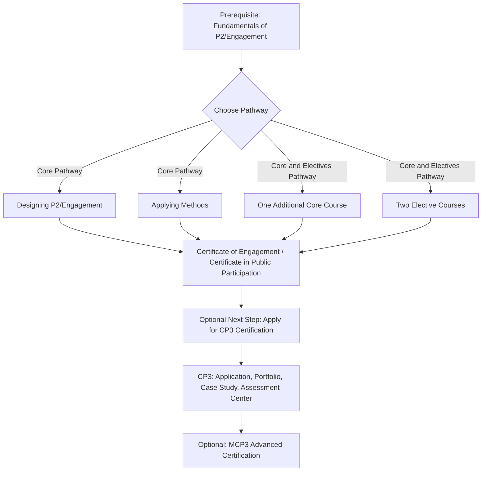

## IAP2 Certificate of Engagement pathway

### Overview

The IAP2 Certificate of Engagement (also branded regionally as the "Certificate in Public Participation") is a skills-based professional development program built on IAP2's Global Learning Pathway (GLP). It is a course-completion credential distinct from IAP2's assessed CP3/MCP3 certification, and functions as a common entry and mid-career development route for SIA practitioners whose work involves designing and delivering stakeholder engagement processes.

### Positioning Within the Broader IAP2 Credentialing Landscape

**Key Points**

- IAP2 offers two distinct credential types that are frequently conflated: (1) the **Certificate of Engagement / Certificate in Public Participation**, earned by completing a defined set of courses, and (2) the **CP3/MCP3 professional certification**, earned through independent competency assessment (covered in the prior section on professional bodies).
- The Certificate in Public Participation is explicitly described by IAP2 USA as a professional development certificate program that is a next step on the journey to becoming a P2 professional and separate from IAP2 USA's designations (CP3 & MCP3).
- Regional affiliates delivering the Certificate of Engagement (e.g., IAP2 Australasia, Engagement Institute) are explicit that completers receive a **Certificate of Completion**, and are not permitted to describe themselves as "accredited," "certified," or "endorsed" on the basis of this credential alone, regardless of membership level or training undertaken.
- This distinction matters for SIA practitioners building a professional development plan: the Certificate of Engagement builds practical skills and is often a prerequisite or preparatory step toward CP3 certification, but does not itself constitute the assessed professional certification.

### Global Learning Pathway (GLP) Course Architecture

### Prerequisite Course: Fundamentals of P2/Engagement

**Key Points**

- Fundamentals of Public Participation (P2)/Engagement is the required first course on IAP2's Global Learning Pathway and establishes the shared foundation for effective public participation practice, introducing core principles, values, and frameworks guiding engagement practice.
- This course is a prerequisite for all other IAP2 GLP courses; some regional affiliates offer an alternative Level 2 entry point ("IAP2 Way in Challenging Contexts") for practitioners with more advanced starting experience.
- Regional affiliates may waive the prerequisite for practitioners who have already completed a legacy equivalent course (e.g., the prior "Planning for Effective Public Participation" three-day course), instead requiring only a short refresher video before proceeding to Level 2 courses.

### Core Pathway Courses

**Key Points**

- The **Core Pathway** requires completion of three core courses: Fundamentals of Engagement (prerequisite), Design and Plan Engagement (or "Designing P2/Engagement"), and Apply Engagement Methods (or "Applying Methods").
- **Designing P2/Engagement** builds on Fundamentals and focuses on the Design and Plan phases of IAP2's Practice Framework, supporting practitioners responsible for shaping engagement processes and making clear, inclusive, and defensible design decisions; participants develop an actual engagement plan as a course output.
- **Applying Methods** focuses on techniques for public participation/engagement and how to implement them successfully, suited to practitioners eligible for objective-driven engagement work.
- Some regional programs (e.g., IAP2 Canada) allow substitution of specific courses depending on practitioner level (Level 1 vs. Level 2 tracks) while maintaining an equivalent overall structure of three of four core courses.

### Core and Electives Pathway

**Key Points**

- The alternative **Core and Electives Pathway** requires completion of Essentials/Fundamentals of Engagement, one additional core course, and a choice of two elective courses, totaling a defined point threshold (commonly 30 points across regional programs).
- Electives allow practitioners to tailor learning toward specific career goals or sector needs (e.g., digital engagement tools, engagement in challenging or high-conflict contexts, engagement with Indigenous or marginalized communities).
- Point-based accumulation systems mean the specific combination of courses can vary by learner while still satisfying the overall Certificate requirement.

### Points and Completion Requirements

**Key Points**

- Certificate completion is typically points-based: each course carries an assigned point value, and the learner must accumulate a threshold (30 points is the figure used by several regional affiliates) through their chosen combination of core and elective courses.
- Full attendance and active participation in all modules and sessions for each course is required to receive a Certificate of Completion for that individual course — partial attendance does not qualify.
- Course delivery format (in-person or virtual), the specific courses selected, and membership status all affect program cost, with discounted rates typically available for IAP2 members, nonprofit/community organization staff, and in some cases global pricing tiers for participants in low- and middle-income economies.

### Sample Certificate of Engagement Program Structure

| Pathway Element | Requirement | Typical Duration |
| --- | --- | --- |
| Prerequisite | Fundamentals of P2/Engagement (or equivalent Level 1/2 entry course) | 1–2 days |
| Core Pathway option | Fundamentals + Design and Plan Engagement + Apply Engagement Methods | ~30 hours total across three courses |
| Core + Electives option | Fundamentals + 1 additional core course + 2 electives | Varies by elective selection |
| Points threshold | Commonly 30 points | Cumulative across chosen courses |
| Outcome | Certificate of Completion (Certificate of Engagement / Certificate in Public Participation) | Not equivalent to CP3 certification |

### Regional Delivery Variation

**Key Points**

- The Certificate of Engagement is delivered through IAP2's national/regional affiliate network (e.g., IAP2 USA, IAP2 Canada, IAP2 Australasia, IAP2 Southern Africa), with some naming and structural variation but a shared basis in the Global Learning Pathway.
- IAP2 Southern Africa's Global Certificate in P2/Engagement, for example, is structured as a five-day programme combining a one-day prerequisite with subsequent Level 2 courses (Applying Methods and Designing P2/Engagement, each multi-day).
- Courses are delivered by IAP2-accredited trainers, with regional affiliates responsible for scheduling, marketing, and quality oversight of training delivery in their geography.

**[Inference]** Because course names, exact point values, and bundling options vary somewhat by regional affiliate (USA, Canada, Australasia, Southern Africa, and others), practitioners should verify current program structure and pricing directly with their relevant regional IAP2 affiliate rather than assuming full uniformity across all versions of the Global Learning Pathway.

### Certificate of Engagement as a Pathway Toward CP3 Certification

**Key Points**

- Practitioners seeking to become CP3-certified are typically expected to first complete the three core Global Learning Pathway courses (Fundamentals, Designing P2/Engagement, Applying Methods) to receive the Certificate in Public Participation, before applying for CP3 assessment.
- The Certificate of Engagement therefore functions as a practical prerequisite skills foundation, while CP3 certification (detailed in the previous section on professional bodies) represents the assessed, portfolio- and case-study-based competency validation step built on that foundation.

### Practice Framework and Core Values Integration

**Key Points**

- Courses across the pathway are built around IAP2's Practice Framework, IAP2 Core Values, Code of Ethics, and Diversity, Equity, and Inclusion principles, giving practitioners a consistent conceptual structure (planning, design, implementation, evaluation of engagement) applied throughout each course module.
- The pathway also addresses clarifying roles in the engagement process — helping practitioners understand who should lead and act at each stage of engagement, a frequently cited practical gap in real-world SIA consultation design.

### Common Pitfalls (Documented in Practice)

- **Credential overstatement**: Describing Certificate of Engagement completion using terms like "accredited," "certified," or "endorsed," which regional affiliates explicitly prohibit regardless of pathway or membership status.
- **Skipping the prerequisite**: Attempting to enroll directly in Design/Apply-level courses without completing the Fundamentals prerequisite (or an approved equivalent/refresher), which most affiliates do not permit.
- **Assuming pathway uniformity**: Treating course names, point values, or bundling rules as identical across all IAP2 regional affiliates without checking the specific affiliate's current program structure.
- **Treating the Certificate as the終 endpoint**: Stopping at the Certificate of Engagement when the practitioner's career goals require the assessed CP3/MCP3 designation for credibility with employers or lenders who specifically look for independently assessed competency.

### Worked Example: Building a Development Plan

An SIA practitioner new to stakeholder engagement work plans their IAP2 pathway:

1. Completes the Fundamentals of P2/Engagement prerequisite course (1–2 days) through their regional IAP2 affiliate.
2. Selects the Core Pathway, completing Designing P2/Engagement and Applying Methods to reach the required points threshold.
3. Receives the Certificate in Public Participation (Certificate of Engagement) as a Certificate of Completion — using this credential appropriately in their professional profile without overstating it as a certification.
4. Uses the practical skills and completed engagement plan/case work from these courses as a foundation to apply for CP3 certification, submitting a professional portfolio and completing the case-study and assessment center components.
5. After several years of practice, considers pursuing MCP3 as an advanced-career credential.

### Next Steps

- Identify the relevant regional IAP2 affiliate (USA, Canada, Australasia, Southern Africa, or others) for locally available course scheduling and pricing.
- Review the specific Core Pathway vs. Core and Electives Pathway trade-offs based on career specialization goals.
- Study the CP3 Core Competency criteria (from the prior professional bodies section) to understand how Certificate of Engagement coursework maps onto assessed certification requirements.
- Explore available elective courses addressing SIA-relevant engagement contexts (e.g., engagement in conflict-affected or high-vulnerability communities).
- Examine IAP2's Practice Framework and Core Values documentation in depth as the conceptual backbone underlying all GLP coursework.