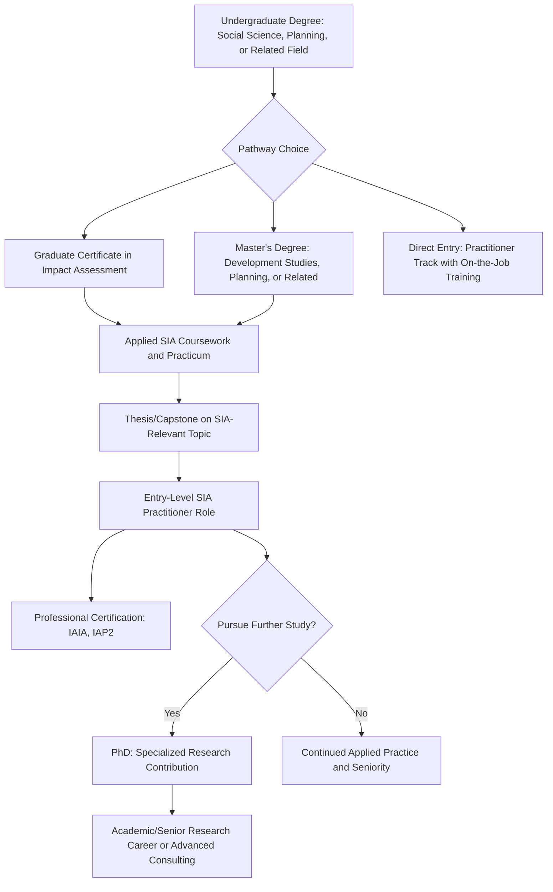

## Postgraduate and academic pathways into the field

### Overview

Postgraduate and academic pathways into Social Impact Assessment (SIA) refer to the formal higher-education routes — master's degrees, graduate certificates, doctoral study, and university-affiliated research centers — through which practitioners build the theoretical and methodological foundation for SIA practice. Unlike the professional-body credentials covered previously (IAIA, IAP2), academic pathways provide the disciplinary grounding (sociology, anthropology, planning, development studies, public policy, environmental science) from which applied SIA competency is built.

### Why Academic Grounding Matters Distinctly From Professional Certification

**Key Points**

- Professional certifications (CP3, IAIA membership) validate applied competency and community standing, but do not typically teach the underlying disciplinary theory (social change theory, political economy of development, research methodology) that informs sound SIA judgment.
- Employers in multilateral development banks, large consultancies, and government agencies frequently list a postgraduate degree in a relevant social science or planning discipline as a baseline qualification for senior SIA roles, distinct from and additional to professional certifications.
- Academic training provides depth in research design and statistical/qualitative methodology that is often only briefly covered in short professional courses, which is significant given SIA's reliance on defensible baseline data collection and analysis (as covered in earlier chapters on methodology).

### Common Disciplinary Entry Points

| Discipline | Relevance to SIA | Typical Degree Titles |
| --- | --- | --- |
| Sociology/Anthropology | Social structure, culture, community dynamics, qualitative methods | MA/MSc Sociology, Social Anthropology |
| Urban and Regional Planning | Land use, zoning, infrastructure-community interface | Master of Urban Planning (MUP), Master of City Planning |
| Development Studies | Poverty, livelihoods, international development practice | MA/MSc Development Studies |
| Environmental Science/Management | Integration with EIA, biophysical-social linkages | MSc Environmental Management, MEM |
| Public Policy/Public Administration | Policy analysis, governance, program evaluation | MPP, MPA |
| Public Health | Health Impact Assessment integration, epidemiology basics | MPH (Master of Public Health) |
| Geography | Spatial analysis, GIS, human-environment interaction | MA/MSc Human Geography |
| Disaster Management/Humanitarian Studies | Post-disaster/conflict resettlement specialization | MSc Disaster Management, Humanitarian Studies |

### Structure of a Typical Academic Pathway

### Graduate Certificates and Short-Form Postgraduate Programs

**Key Points**

- Many universities offer graduate certificates in Environmental and Social Impact Assessment or Social Impact Assessment specifically, typically requiring fewer credits than a full master's degree and designed for working professionals transitioning into the field.
- These programs often cover: SIA methodology, stakeholder engagement, regulatory frameworks (national EIA/SIA law, IFC Performance Standards), and applied case-study coursework.
- Graduate certificates can function as either a standalone credential for career changers or as a stepping stone/pathway credit toward a full master's degree at the same institution.

### Master's-Level Coursework Commonly Covered

**Key Points**

- Core methodological training: quantitative research methods (survey design, statistical analysis), qualitative research methods (interviews, focus groups, ethnographic techniques), and mixed-methods design.
- Applied impact assessment modules: EIA/SIA regulatory frameworks, significance assessment, mitigation hierarchy application, and case-study-based practicum work.
- Cross-cutting theory: social change theory, political economy of development, environmental justice, and gender and social inclusion frameworks.
- Many programs include a practicum, internship, or applied capstone project component, often in partnership with government agencies, NGOs, or consultancies, providing direct field experience alongside academic study.

### The Role of the Thesis/Capstone Project

**Key Points**

- A thesis or capstone project allows students to apply SIA methodology to a real or realistic case study, producing a work product that can function as a professional portfolio piece when entering the job market.
- Common capstone topics include a mock or partnered SIA for a proposed local development, an evaluation of a completed project's social impact outcomes, or methodological research (e.g., comparing significance-rating approaches across regulatory frameworks).
- **[Inference]** A well-executed capstone project addressing a real regional or sector-specific issue may carry more weight with prospective employers than coursework grades alone, since it demonstrates applied competency directly comparable to on-the-job deliverables, though hiring practices vary by employer and region.

### Doctoral (PhD) Pathways

**Key Points**

- PhD study in SIA-adjacent fields (sociology, planning, development studies, geography) is typically pursued by those aiming for academic careers, senior research roles in multilateral institutions, or specialized high-level advisory positions requiring original research contributions.
- Doctoral research often focuses on advancing SIA methodology itself (e.g., improving cumulative impact assessment techniques, developing new equity-analysis frameworks) rather than solely applying existing methods.
- A PhD is generally not a prerequisite for SIA practitioner roles at the consultancy or project-implementation level; it is more relevant for policy research, academic teaching, or thought-leadership positions within the field.

### University-Affiliated Research Centers and Institutes

**Key Points**

- Many universities host dedicated impact assessment or development research centers that combine graduate teaching with applied research and consulting, offering students research assistantship opportunities alongside coursework.
- These centers often maintain relationships with government agencies, multilateral development banks, and NGOs, creating direct pipelines from academic study into applied practice roles.
- Participation in such centers can provide networking and mentorship benefits that are difficult to replicate through coursework alone.

### Comparing Academic and Professional-Body Pathways

| Dimension | Academic Pathway (Master's/PhD) | Professional Body Pathway (IAIA/IAP2) |
| --- | --- | --- |
| Duration | 1–2 years (master's), 3–6 years (PhD) | Days to months per course/certification cycle |
| Depth of theory | High — disciplinary grounding in social science/planning theory | Lower — applied, competency-focused |
| Methodological rigor | Extensive research methods training | Practical application-focused, less methodological depth |
| Credential recognition | Degree recognized broadly across sectors | Certification recognized specifically within impact assessment/engagement field |
| Cost/time investment | Higher | Lower, more incremental |
| Typical entry point | Early career, career changers | Any career stage, often mid-career skill validation |

### Combining Pathways: A Common Career Model

**Key Points**

- Many established SIA practitioners combine both pathways: a relevant postgraduate degree provides theoretical and methodological grounding, while ongoing professional-body engagement (IAIA membership, IAP2 certification) provides applied competency validation and professional community connection throughout a career.
- Employers at multilateral development banks and large international consultancies frequently list both a relevant postgraduate degree and professional body engagement/certification as complementary, not substitutable, qualifications in senior role postings.

### Common Pitfalls (Documented in Practice)

- **Theory-practice gap**: Completing academic coursework without applied fieldwork or practicum experience, resulting in strong theoretical knowledge but limited practical readiness for client-facing or field-based SIA roles.
- **Discipline mismatch assumption**: Assuming only one discipline (e.g., only sociology, or only environmental science) is a valid entry point, when SIA practice draws legitimately from multiple postgraduate disciplinary backgrounds.
- **Credential silo thinking**: Treating academic and professional-body pathways as mutually exclusive rather than complementary components of a well-rounded career development plan.
- **Underestimating regional variation**: Assuming program structure, cost, and recognition are uniform globally; postgraduate program availability, funding structures, and regulatory recognition of SIA-relevant degrees vary substantially by country.
- **PhD over-pursuit for practice roles**: Pursuing doctoral study primarily to enter applied practitioner roles where a master's degree plus professional certification would typically suffice, when a PhD is more specifically suited to academic or advanced research career tracks.

### Worked Example: Building a Combined Pathway

A recent undergraduate in sociology interested in SIA practice plans their entry:

1. Enrolls in a Master's in Development Studies with a concentration or elective stream in impact assessment methodology.
2. Completes core coursework in qualitative and quantitative research methods, alongside an applied SIA/EIA regulatory frameworks module.
3. Undertakes a practicum placement with a national environmental agency, contributing to an actual SIA baseline study.
4. Completes a capstone project analyzing stakeholder engagement outcomes for a regional infrastructure project, producing a portfolio piece for job applications.
5. Upon graduating, joins a consultancy as a junior SIA analyst, and concurrently begins the IAP2 Global Learning Pathway courses to build applied engagement competency alongside academic grounding.
6. Over the following years, pursues IAIA membership and Section participation, and eventually applies for CP3 certification once sufficient practical engagement experience has been accumulated.

### Next Steps

- Research specific postgraduate program offerings (graduate certificates and master's degrees) in impact assessment, development studies, or planning relevant to the practitioner's country/region.
- Investigate university-affiliated research centers offering research assistantship or practicum placement opportunities.
- Review capstone/thesis project examples from relevant academic programs to understand typical scope and format expectations.
- Compare funding options (scholarships, assistantships, employer-sponsored study) for postgraduate study relevant to SIA career transitions.
- Explore how academic coursework maps onto professional-body competency frameworks (e.g., IAP2's Core Competencies) to plan a combined academic-professional development strategy.