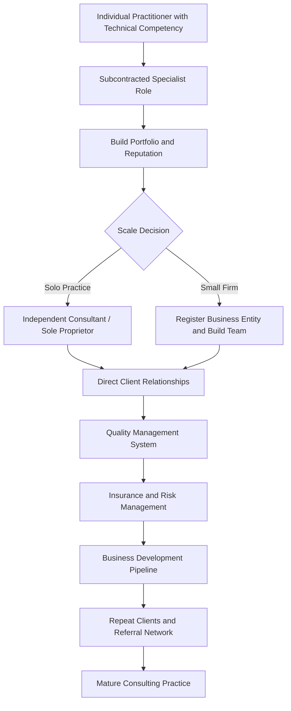

## Building a consulting practice in social impact assessment

### Overview

Building a consulting practice in Social Impact Assessment (SIA) covers the business, operational, and reputational infrastructure required to establish and sustain an independent or small-firm SIA consultancy. This extends beyond individual technical competency (covered in prior chapters) into practice management: client acquisition, team scaling, quality systems, insurance/liability, and positioning within a competitive market that includes large multidisciplinary engineering/environmental firms as well as boutique social specialists.

### The SIA Consulting Market Landscape

**Key Points**

- SIA consulting demand originates primarily from four client categories: private-sector project proponents (extractives, infrastructure, energy), government agencies (public infrastructure, policy evaluation), multilateral/bilateral development institutions (World Bank, regional development banks, bilateral aid agencies), and financial institutions conducting lender due diligence (Equator Principles banks).
- Independent SIA consultants and boutique firms typically compete on specialized social science depth, cultural/linguistic/regional expertise, and cost-effectiveness for social-only scopes, while large multidisciplinary firms compete on one-stop integrated ESIA delivery and bonding/insurance capacity for very large projects.
- Many SIA consultants begin as subcontractors to larger environmental/engineering firms before building sufficient reputation and capital to pursue prime-contractor roles directly with clients.

### Practice Building Pathway

### Establishing the Business Foundation

**Key Points**

- Legal structure choice (sole proprietorship, limited liability company/partnership, or corporation) affects personal liability exposure, tax treatment, and client eligibility requirements — many government and multilateral procurement processes require a registered legal entity rather than an individual contractor.
- Professional liability (errors and omissions) insurance is frequently a contractual requirement for lender-financed or government projects, protecting against claims arising from methodological errors or omissions in delivered reports.
- Financial infrastructure — business banking, invoicing systems, and cash-flow management — matters particularly because consulting engagements often involve payment milestones tied to deliverables, creating cash-flow gaps between mobilization and payment.

### Building Technical and Quality Infrastructure

**Key Points**

- A documented quality management system (referencing the peer review and QA processes covered earlier in this course) is often a prerequisite for prequalification with major clients, particularly development finance institutions.
- Standardized templates for common deliverables (baseline reports, stakeholder engagement logs, resettlement action plans) improve delivery efficiency and consistency across engagements while still requiring project-specific customization.
- Data management infrastructure — secure storage for sensitive consultation data (per the confidentiality practices covered earlier), version control systems, and survey/data collection tools — represents a necessary operational investment, not merely a nice-to-have.

### Team Composition and Scaling

**Key Points**

- Early-stage practices often rely on a core group of trusted associate consultants engaged on a project basis, allowing capacity flexibility without the fixed cost of permanent staff.
- As practice volume grows, transitioning some associates to permanent staff provides continuity and deeper institutional knowledge, at the cost of reduced flexibility during lean periods.
- Local/national staff and partners are frequently essential, not merely helpful, for language access, cultural competency, and government relationship navigation — many jurisdictions and clients specifically require demonstrated local capacity as part of the consulting team.

**Sample Team Composition for a Mid-Size SIA Engagement**

| Role | Function |
| --- | --- |
| Lead Social Specialist | Overall technical direction, client relationship, report sign-off |
| Field Research Coordinator | Manages data collection logistics, enumerator supervision |
| Local Enumerators/Interpreters | Household surveys, focus groups, translation |
| GIS/Data Analyst | Spatial mapping, quantitative data analysis |
| Report Writer/Editor | Drafting, plain-language summary production, QA review support |
| Local Partner Organization (subcontracted) | Government liaison, community relationships, logistics |

### Business Development and Client Acquisition

**Key Points**

- Procurement for SIA work commonly occurs through formal tender/RFP processes (especially for government and multilateral-financed projects), direct negotiation for private-sector work, and subcontracting arrangements with prime environmental/engineering firms.
- Prequalification with development finance institutions (e.g., being listed on a multilateral development bank's roster of qualified consultants) can be a significant, if time-consuming, business development investment that opens access to a substantial pipeline of tender opportunities.
- Reputation and referral networks — built through IAIA/IAP2 professional body engagement (covered in prior sections), conference presentations, and published case studies — function as a primary driver of repeat and referred business in a field where client trust in methodological rigor is paramount.

### Pricing and Proposal Development

**Key Points**

- SIA consulting is typically priced through time-and-materials (day-rate) structures, fixed-price lump-sum contracts for well-defined scopes, or a hybrid with defined deliverable milestones.
- Proposal development requires realistic scoping of fieldwork logistics (travel, translation, community access arrangements) which are frequently underestimated by less experienced consultancies, leading to margin erosion or rushed, lower-quality fieldwork.
- **[Inference]** Underpricing fieldwork logistics and timeline is a commonly cited cause of financial strain for newer SIA consultancies, though the degree of risk varies by project context (e.g., remote/fragile-context fieldwork carries substantially higher logistical uncertainty than accessible urban contexts).

### Risk Management Specific to SIA Consulting

| Risk Category | Example | Mitigation Approach |
| --- | --- | --- |
| Methodological/professional liability | Report findings later disputed or challenged in accountability mechanism proceedings | Professional liability insurance, rigorous peer review processes |
| Field safety | Security risks in conflict-affected or remote field locations | Security risk assessments, local partner vetting, evacuation planning |
| Data protection liability | Breach or mishandling of sensitive consultation data | Data protection policies and technical safeguards (per earlier confidentiality section) |
| Client payment risk | Delayed or non-payment, especially with smaller private clients | Milestone-based payment terms, upfront mobilization payments |
| Reputational risk | Association with a controversial or poorly managed project | Due diligence on prospective clients/projects before engagement |

### Ethical Positioning and Independence

**Key Points**

- SIA consultants are frequently paid by project proponents while assessing impacts on communities, creating an inherent structural tension that reputable practices manage through transparent methodology, documented limitations, and professional codes of conduct (such as the IAIA Code of Conduct referenced in the prior professional bodies section).
- Some consultancies explicitly position themselves around independence safeguards — such as contractual clauses protecting methodological independence from client influence, or transparent disclosure of funding source in all reports — as a market differentiator, particularly for lender-facing or public-disclosure work where credibility is paramount.
- Maintaining consistent ethical standards across engagements, rather than adjusting rigor based on client pressure, is foundational to long-term reputation, since SIA consulting is a relationship- and trust-driven market where credibility damage can be difficult to reverse.

### Practice Growth Trajectory Diagram (svg_diagram)

<svg xmlns="http://www.w3.org/2000/svg" viewBox="0 0 740 320">
<text x="370" y="26" text-anchor="middle" font-size="16" font-weight="bold" fill="#1a1a1a">SIA Consulting Practice Growth Stages (svg_diagram)</text>
<rect x="20" y="60" width="150" height="55" rx="6" fill="#cce5ff" stroke="#004085" />
<text x="95" y="83" text-anchor="middle" font-size="11" fill="#004085">Stage 1:</text>
<text x="95" y="99" text-anchor="middle" font-size="10" fill="#004085">Subcontracted Specialist</text>
<rect x="200" y="60" width="150" height="55" rx="6" fill="#d4edda" stroke="#155724" />
<text x="275" y="83" text-anchor="middle" font-size="11" fill="#155724">Stage 2:</text>
<text x="275" y="99" text-anchor="middle" font-size="10" fill="#155724">Independent Consultant</text>
<rect x="380" y="60" width="150" height="55" rx="6" fill="#fff3cd" stroke="#856404" />
<text x="455" y="83" text-anchor="middle" font-size="11" fill="#856404">Stage 3:</text>
<text x="455" y="99" text-anchor="middle" font-size="10" fill="#856404">Small Firm w/ Associates</text>
<rect x="560" y="60" width="160" height="55" rx="6" fill="#f8d7da" stroke="#721c24" />
<text x="640" y="83" text-anchor="middle" font-size="11" fill="#721c24">Stage 4:</text>
<text x="640" y="99" text-anchor="middle" font-size="10" fill="#721c24">Prequalified Prime Contractor</text>
<line x1="170" y1="87" x2="195" y2="87" stroke="#333" stroke-width="2" marker-end="url(#arrowP)" />
<line x1="350" y1="87" x2="375" y2="87" stroke="#333" stroke-width="2" marker-end="url(#arrowP)" />
<line x1="530" y1="87" x2="555" y2="87" stroke="#333" stroke-width="2" marker-end="url(#arrowP)" />
<rect x="60" y="150" width="620" height="130" rx="6" fill="#f1f1f1" stroke="#666" stroke-dasharray="4,3" />
<text x="370" y="175" text-anchor="middle" font-size="12" font-weight="bold" fill="#333">Underlying Infrastructure Built Across All Stages</text>
<text x="370" y="200" text-anchor="middle" font-size="10" fill="#333">Quality Management System · Professional Liability Insurance</text>
<text x="370" y="220" text-anchor="middle" font-size="10" fill="#333">Data Protection Protocols · Local Partner Relationships</text>
<text x="370" y="240" text-anchor="middle" font-size="10" fill="#333">Professional Body Engagement (IAIA/IAP2) · Referral Network</text>
<text x="370" y="260" text-anchor="middle" font-size="10" fill="#333">Ethical Independence Safeguards</text>
</svg>

### Common Pitfalls (Documented in Practice)

- **Underpricing fieldwork complexity**: Failing to adequately cost remote-area logistics, translation needs, and contingency time, leading to unsustainable margins or corner-cutting under time pressure.
- **Insufficient local partnership**: Attempting to deliver SIA work in unfamiliar regions without genuine local partner relationships, resulting in weaker community access, cultural missteps, or government relationship friction.
- **Prequalification neglect**: Under-investing in the time-consuming prequalification processes required by multilateral development banks, missing access to a substantial and stable pipeline of tender opportunities.
- **Quality system as afterthought**: Scaling a team without a documented quality management/peer review system, increasing the risk of inconsistent report quality as more associates are engaged.
- **Independence erosion under client pressure**: Softening findings or significance ratings under commercial pressure from paying clients, risking long-term reputational damage that outweighs short-term relationship preservation.
- **Single-client dependency**: Building a practice reliant on one or two major clients without diversifying the pipeline, creating high business risk if that relationship ends.

### Worked Example: Practice Growth Over Time

A social scientist begins as a subcontracted enumerator/analyst for a large environmental consultancy on several SIA projects, building both technical skill and a portfolio of work samples. After several years:

1. They register as an independent consultant, securing direct contracts with smaller private clients and continuing subcontract work with the larger firm for bigger projects.
2. They invest in professional liability insurance and develop standardized baseline-study and stakeholder-engagement-log templates to improve delivery consistency.
3. As demand grows, they formalize a small firm, engaging a network of trusted local associates and a data analyst on a project basis rather than hiring permanent staff initially.
4. They pursue prequalification with a regional development bank's consultant roster, investing significant unpaid time in the application process, which subsequently opens access to a stream of tender opportunities.
5. They establish a documented quality management system, referencing internal QA checklists and independent peer review protocols, both to satisfy prequalification requirements and to manage quality consistency as team size grows.
6. Over time, professional body engagement (IAIA conference presentations, IAP2 CP3 certification) and consistent, independent methodological rigor build a referral network that reduces reliance on formal tender competition alone.

### Next Steps

- Research legal entity registration and professional liability insurance requirements applicable to the practitioner's jurisdiction.
- Investigate prequalification/roster requirements for relevant multilateral development banks and major private-sector clients.
- Develop standardized internal templates and a documented quality management system aligned with the peer review practices covered earlier in this course.
- Build a local partner network in target geographic markets ahead of pursuing work in unfamiliar regions.
- Study pricing models (day-rate, lump-sum, hybrid) and typical fieldwork cost structures for realistic proposal development.