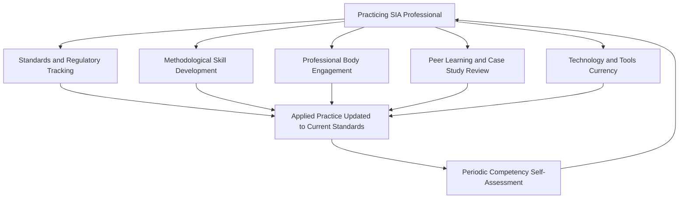

## Continuing education and staying current with evolving standards

### Overview

Continuing education and staying current with evolving standards addresses how Social Impact Assessment (SIA) practitioners maintain and update their competency over a career, given that regulatory frameworks, lender standards, methodological best practice, and technology all change materially over time. Unlike initial credentialing (covered in prior sections on IAIA, IAP2, and academic pathways), this is an ongoing, career-long discipline rather than a one-time achievement.

### Why Standards and Practice Continue to Evolve

**Key Points**

- International standards bodies periodically revise their frameworks — for example, IFC Performance Standards, World Bank Environmental and Social Framework standards, and Equator Principles versions are updated on multi-year cycles to reflect emerging risks and lessons learned from implementation.
- National regulatory frameworks for EIA/SIA are subject to legislative change, and practitioners working across multiple jurisdictions must track requirements separately for each.
- Methodological practice evolves as the field learns from documented failures (e.g., accountability mechanism investigations revealing gaps in consultation or resettlement practice) and as new tools (digital data collection, remote sensing, participatory GIS) become mainstream.
- Professional bodies themselves periodically revise foundational frameworks — for instance, IAP2 has undertaken public review processes to evolve its Spectrum of Public Participation, indicating that even widely adopted conceptual tools are not static.

### Core Categories of Continuing Education

### Standards and Regulatory Tracking

**Key Points**

- Practitioners should establish a routine process for monitoring updates to the specific standards frameworks relevant to their practice area — IFC Performance Standards, World Bank ESF, Equator Principles, and applicable national EIA/SIA legislation.
- Subscribing to official update channels (standards body newsletters, regulatory gazette notifications, lender policy announcements) is more reliable than relying on secondhand summaries, which can lag or misrepresent the substance of a revision.
- When a standard is revised, practitioners should assess retroactive applicability questions — whether ongoing projects are grandfathered under prior standards or must transition to new requirements — since this affects both compliance obligations and client advisory responsibilities.

### Methodological Skill Development

**Key Points**

- Beyond static credentialing, practitioners benefit from periodically revisiting core methodological skills: sampling design, significance-rating frameworks, cumulative impact assessment techniques, and stakeholder engagement design — since these areas continue to see practice refinement documented in updated guidance and case studies.
- Skill development should be responsive to gaps revealed by peer review and quality assurance findings (as covered in the earlier reporting chapter) — recurring reviewer comments across multiple engagements often signal a specific area warranting targeted continuing education.
- Cross-training into adjacent specializations (e.g., a generalist SIA practitioner developing deeper Health Impact Assessment competency, per the earlier public health chapter) broadens applicability and career resilience as sector demand shifts.

### Professional Body Engagement as a Continuing Education Channel

**Key Points**

- IAIA's Annual Conference and Section activities (referenced in the professional bodies section) provide structured exposure to emerging practice themes; the 45th Annual Conference's focus on trust, misinformation, and professional recognition/certification systems in environmental assessment illustrates how conference programming tracks live shifts in practitioner concerns.
- IAP2's ongoing evolution of foundational frameworks — such as its stated process to evolve the Spectrum of P2/Engagement — means practitioners relying on that tool for engagement design should track official communications rather than assuming the framework is permanently fixed.
- Membership in professional bodies typically includes access to journals (e.g., Impact Assessment and Project Appraisal), enewsletters, and members-only updates that surface regulatory and methodological developments practitioners might otherwise miss.

### Peer Learning and Case Study Review

**Key Points**

- Reviewing published accountability mechanism findings (e.g., cases where independent complaint mechanisms identified gaps in consultation, resettlement, or disclosure practice) provides concrete, real-world lessons that abstract guidance documents cannot fully convey.
- Participation in practitioner communities — whether formal (IAIA Hub, Section working groups) or informal (peer networks, mentorship relationships) — supports knowledge exchange about practical implementation challenges not always captured in published standards.
- Mentorship, in either direction (being mentored or mentoring more junior practitioners), reinforces and updates one's own understanding of current best practice while supporting field-wide capacity building.

### Technology and Tools Currency

**Key Points**

- Digital data collection tools, participatory GIS platforms, and remote sensing applications for baseline studies and monitoring continue to evolve, and practitioners who do not periodically update their technical toolkit risk falling behind more efficient or rigorous data collection standards adopted by competitors and clients alike.
- Where SIA work intersects with rapidly evolving digital tools, practitioners should apply the same "recent/unfamiliar technology" diligence used elsewhere in this course — verifying current documentation and best practice rather than relying on potentially outdated prior knowledge of a given tool or platform.
- **[Inference]** The rate of change in specific data-collection and analysis technologies varies considerably; some tools (basic mobile survey platforms) have matured and stabilized, while others (AI-assisted qualitative analysis, satellite-based rapid damage assessment) are evolving quickly enough that periodic re-verification of current capability and limitations is warranted before relying on them for consequential findings.

### Structuring a Personal Continuing Education Plan

| Component | Suggested Cadence | Example Activity |
| --- | --- | --- |
| Standards/regulatory review | Ongoing, triggered by update notifications | Review IFC PS or national EIA law amendments as issued |
| Conference/professional body engagement | Annual | Attend IAIA Annual Conference or regional equivalent |
| Formal coursework/certification renewal | Every 1–3 years | IAP2 elective courses, CP3 renewal requirements if applicable |
| Case study/lessons-learned review | Quarterly | Review recent accountability mechanism findings relevant to practice area |
| Peer network engagement | Ongoing | Participate in IAIA Section working groups, mentorship |
| Tools/technology skills update | Annual or as tools materially change | Trial new data collection or GIS tools relevant to practice |

### Continuing Education Cycle Diagram (svg_diagram)

<svg xmlns="http://www.w3.org/2000/svg" viewBox="0 0 700 340">
<text x="350" y="26" text-anchor="middle" font-size="16" font-weight="bold" fill="#1a1a1a">Continuing Competency Maintenance Cycle (svg_diagram)</text>
<circle cx="350" cy="180" r="120" fill="none" stroke="#666" stroke-width="1.5" stroke-dasharray="3,3" />
<rect x="290" y="50" width="120" height="45" rx="6" fill="#cce5ff" stroke="#004085" />
<text x="350" y="77" text-anchor="middle" font-size="10" fill="#004085">Standards Tracking</text>
<rect x="470" y="130" width="130" height="45" rx="6" fill="#d4edda" stroke="#155724" />
<text x="535" y="157" text-anchor="middle" font-size="10" fill="#155724">Professional Body</text>
<rect x="440" y="250" width="140" height="45" rx="6" fill="#fff3cd" stroke="#856404" />
<text x="510" y="277" text-anchor="middle" font-size="10" fill="#856404">Case Study Review</text>
<rect x="180" y="285" width="140" height="45" rx="6" fill="#f8d7da" stroke="#721c24" />
<text x="250" y="312" text-anchor="middle" font-size="10" fill="#721c24">Skill Development</text>
<rect x="90" y="150" width="140" height="45" rx="6" fill="#e2d9f3" stroke="#4b3579" />
<text x="160" y="177" text-anchor="middle" font-size="10" fill="#4b3579">Tools Currency</text>
<circle cx="350" cy="180" r="4" fill="#333" />
</svg>

### Institutionalizing Continuing Education Within a Practice

**Key Points**

- Consulting practices (per the prior section on building a consulting practice) benefit from formalizing continuing education expectations across their team — allocating time/budget for conference attendance, tracking which standards revisions have been reviewed and by whom, and incorporating lessons-learned review into internal quality management processes.
- A documented record of continuing education activity can itself serve as evidence of due diligence and professional currency when responding to prequalification requirements or client due diligence questions about team competency.
- Firms should avoid treating continuing education purely as an individual practitioner responsibility; institutional support (paid time, budget, structured internal knowledge-sharing sessions) improves consistency across a growing team.

### Common Pitfalls (Documented in Practice)

- **Static credential reliance**: Treating an initial certification (CP3, academic degree) as a permanent competency marker without ongoing updating, risking application of outdated methodology or unawareness of revised standards.
- **Passive information consumption**: Relying solely on secondhand summaries or informal hearsay about standards changes rather than verifying against primary sources (official standards body publications, regulatory texts).
- **Conference attendance without follow-through**: Attending professional conferences without a structured mechanism to translate exposure to new ideas into actual practice changes or internal knowledge-sharing.
- **Tool stagnation**: Continuing to use familiar but outdated data collection or analysis tools without periodically assessing whether more efficient or rigorous alternatives have become standard practice.
- **Individual-only learning culture**: Failing to institutionalize continuing education at the firm level, leaving competency currency dependent entirely on individual practitioner initiative with no organizational consistency.

### Worked Example: A Practitioner's Annual Continuing Education Cycle

An established SIA consultant structures their ongoing professional development:

1. Maintains subscriptions to IFC, World Bank ESF, and relevant national regulatory update notifications, reviewing and summarizing material changes for their team when they occur.
2. Attends the IAIA Annual Conference yearly, prioritizing sessions on topics identified as gaps from recent client feedback or peer review findings (e.g., a session on evolving cumulative impact assessment methodology).
3. Completes one IAP2 elective course annually addressing an underdeveloped skill area, such as digital engagement methods.
4. Sets a quarterly team meeting specifically to review recent accountability mechanism findings and discuss implications for the firm's own practice standards.
5. Trials one new data collection or analysis tool per year against current documentation and best-practice guidance, assessing whether it merits integration into standard practice.
6. Documents all continuing education activity in an internal log, which supports both personal career tracking and firm-level prequalification submissions requiring evidence of team competency currency.

### Next Steps

- Establish subscription/monitoring channels for the specific standards frameworks (IFC PS, World Bank ESF, relevant national law) governing current practice areas.
- Set a personal or firm-level annual continuing education plan using the component/cadence table above as a starting structure.
- Identify recent accountability mechanism findings relevant to practice sector for case study review.
- Assess current data collection and analysis toolkit against newly available or updated technologies, verifying claims against current documentation before adoption.
- Explore mentorship opportunities, in either direction, as an ongoing peer-learning mechanism.