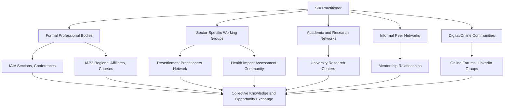

## Networking and communities of practice

### Overview

Networking and communities of practice refer to the formal and informal professional relationship structures through which Social Impact Assessment (SIA) practitioners exchange knowledge, build reputation, access opportunities, and collectively advance field standards. This complements the individual continuing-education and credentialing pathways covered in prior sections by focusing specifically on the relational and collective-learning dimension of career development.

### Distinguishing Networking From Communities of Practice

**Key Points**

- **Networking** typically refers to individually-oriented relationship building aimed at career advancement — client referrals, job opportunities, and reputational visibility.
- **Communities of practice** refer to more structured, often ongoing groups of practitioners who share a domain of interest and collectively develop shared practice, tools, and knowledge over time — a concept originating in organizational learning theory (Wenger).
- Both are mutually reinforcing: professional networks often form within or around communities of practice, and communities of practice provide the sustained interaction that transforms transactional networking into durable professional relationships.

### Structural Channels for Networking and Community Engagement

### IAIA Sections as Communities of Practice

**Key Points**

- IAIA's Section structure (referenced in the professional bodies section) functions as a built-in communities-of-practice mechanism, allowing practitioners to specialize and network within sub-disciplines such as social impact assessment, health impact assessment, indigenous peoples and impact assessment, or biodiversity offsets.
- Section-specific programming at the Annual Conference and through the IAIA Hub online community provides structured, recurring touchpoints for practitioners with shared specialization to exchange practice-specific knowledge, distinct from the broader general-membership conference programming.
- Active Section participation (contributing to discussions, co-authoring guidance documents, presenting case studies) builds professional visibility within a specific specialization more effectively than general membership alone.

### Sector-Specific Practitioner Networks

**Key Points**

- Beyond IAIA/IAP2's general structures, specialized practitioner networks exist around specific SIA sub-domains covered elsewhere in this course — for example, resettlement practitioner networks connected to World Bank/IFC resettlement specialist communities, or Health Impact Assessment practitioner groups connected to public health institutions.
- These networks often form around shared practical challenges specific to a sector (e.g., post-disaster resettlement practitioners sharing lessons on land tenure verification methods) rather than general impact assessment methodology, offering deeper practical exchange for practitioners specializing in a given sector.
- Participation in such networks is often less formally structured than IAIA/IAP2 membership — sometimes organized through working groups convened by multilateral institutions, informal listservs, or periodic sector-specific workshops.

### Academic and Research Networks

**Key Points**

- University-affiliated research centers (covered in the postgraduate pathways section) often maintain networks connecting alumni, current researchers, and practitioner partners, providing a bridge between academic and applied practice communities.
- Academic conferences and journals (including IAIA's Impact Assessment and Project Appraisal) serve as both knowledge-dissemination channels and informal networking venues where practitioners and researchers can identify potential collaborators or employers.
- Engaging with academic networks even after completing formal study helps practicing consultants stay connected to emerging methodological research, complementing the standards-tracking continuing education activities covered previously.

### Informal Peer Networks and Mentorship

**Key Points**

- Informal peer relationships — built through shared project experience, professional body engagement, or academic cohorts — often provide the most candid, practically-oriented professional exchange, since peers can discuss real implementation challenges without the formality of published guidance or institutional positioning.
- Mentorship relationships, whether formal (structured programs offered by some professional bodies) or informal, support knowledge transfer in both directions: mentees gain practical guidance, while mentors refine and re-articulate their own understanding of best practice.
- **[Inference]** Practitioners entering fragile or unfamiliar geographic/sector contexts often benefit disproportionately from informal peer networks with direct local or sector experience, since published standards and formal guidance may not capture context-specific practical nuances; the value of this varies by how well-documented the specific context already is in formal literature.

### Digital and Online Communities of Practice

**Key Points**

- Online platforms — professional body member portals (e.g., the IAIA Hub), LinkedIn groups, and topic-specific forums — extend community-of-practice engagement beyond in-person events, particularly valuable for practitioners in regions with limited access to in-person conferences.
- Digital communities can lower participation barriers (cost, travel time) but may also produce shallower engagement compared to sustained in-person or small-group relationships; many practitioners use digital channels as a complement to, rather than substitute for, deeper relationship-building venues.
- Practitioners should apply the same source-verification diligence to informally shared guidance in online communities as they would to any secondhand information — online community discussion is valuable for practical exchange but is not a substitute for verifying against primary standards documents when methodological accuracy matters.

### Networking Value Across Career Stages

| Career Stage | Primary Networking Value | Example Activity |

 

| Early career | Learning practical norms, finding mentors, initial job/project opportunities | Attending IAIA/IAP2 conferences as a member, joining a Section |

| Mid-career | Building specialized reputation, referral pipeline development | Presenting case studies, active Section leadership roles |

| Senior/consulting practice owner | Business development, prequalification relationship-building, thought leadership | Conference keynote/panel participation, mentoring junior practitioners |

| Academic/research-track | Collaborator identification, publication co-authorship, grant partnerships | Research network engagement, journal editorial involvement |

### Networking Value Map (svg_diagram)

<svg xmlns="http://www.w3.org/2000/svg" viewBox="0 0 720 300">
<text x="360" y="26" text-anchor="middle" font-size="16" font-weight="bold" fill="#1a1a1a">Career-Stage Networking Value Map (svg_diagram)</text>
<line x1="60" y1="260" x2="680" y2="260" stroke="#333" stroke-width="2" />
<line x1="60" y1="260" x2="60" y2="50" stroke="#333" stroke-width="2" />
<text x="370" y="285" text-anchor="middle" font-size="11" fill="#333">Career Stage Progression</text>
<text x="35" y="155" text-anchor="middle" font-size="11" fill="#333" transform="rotate(-90 35 155)">Networking Emphasis</text>
<rect x="90" y="180" width="130" height="60" fill="#cce5ff" stroke="#004085" />
<text x="155" y="205" text-anchor="middle" font-size="10" fill="#004085">Early Career:</text>
<text x="155" y="220" text-anchor="middle" font-size="9" fill="#004085">Mentorship, Learning</text>
<rect x="250" y="140" width="130" height="100" fill="#d4edda" stroke="#155724" />
<text x="315" y="165" text-anchor="middle" font-size="10" fill="#155724">Mid-Career:</text>
<text x="315" y="180" text-anchor="middle" font-size="9" fill="#155724">Specialized Reputation,</text>
<text x="315" y="195" text-anchor="middle" font-size="9" fill="#155724">Referral Networks</text>
<rect x="410" y="90" width="140" height="150" fill="#fff3cd" stroke="#856404" />
<text x="480" y="115" text-anchor="middle" font-size="10" fill="#856404">Senior/Practice Owner:</text>
<text x="480" y="130" text-anchor="middle" font-size="9" fill="#856404">Business Development,</text>
<text x="480" y="145" text-anchor="middle" font-size="9" fill="#856404">Thought Leadership,</text>
<text x="480" y="160" text-anchor="middle" font-size="9" fill="#856404">Prequalification Relations</text>
<rect x="580" y="120" width="120" height="120" fill="#e2d9f3" stroke="#4b3579" />
<text x="640" y="145" text-anchor="middle" font-size="10" fill="#4b3579">Academic/Research:</text>
<text x="640" y="160" text-anchor="middle" font-size="9" fill="#4b3579">Collaboration,</text>
<text x="640" y="175" text-anchor="middle" font-size="9" fill="#4b3579">Publication</text>
</svg>

### Building a Sustainable Networking Practice

**Key Points**

- Effective long-term networking is generally reciprocal rather than purely extractive — practitioners who consistently offer value (sharing knowledge, making introductions, providing peer review feedback) tend to build more durable professional relationships than those who engage only when seeking something.
- Consistency matters more than intensity: sustained, moderate engagement with a professional community (regular conference attendance, ongoing Section participation) tends to build stronger long-term relationships than sporadic, high-intensity engagement followed by long absences.
- For consulting practice owners (per the earlier section on building a consulting practice), networking investment should be treated as a deliberate business development activity with allocated time and, where relevant, budget — not merely an incidental byproduct of other professional activities.

### Common Pitfalls (Documented in Practice)

- **Transactional-only engagement**: Approaching professional networks purely for immediate opportunity extraction (job leads, client referrals) without reciprocal contribution, which tends to erode long-term relationship quality.
- **Single-channel reliance**: Relying exclusively on one networking channel (e.g., only digital/online communities, or only one professional body) rather than diversifying across formal bodies, sector-specific networks, and informal peer relationships.
- **Passive membership without engagement**: Holding professional body membership without active participation (Section involvement, conference attendance, discussion contribution), missing most of the practical relationship-building value membership can offer.
- **Overreliance on informal guidance**: Treating informally shared practical advice from peer networks as equivalent in authority to verified primary standards documents, when the two serve different but complementary purposes.
- **Neglecting mentorship in both directions**: Senior practitioners failing to mentor junior colleagues, missing both a field-capacity-building contribution and the practice of the mentor's own understanding that teaching reinforces.

### Worked Example: Building a Networking Strategy Over a Career

An SIA practitioner structures their networking engagement deliberately:

1. In early career, joins IAIA as a member, attends the Annual Conference, and identifies a Section aligned with their specialization interest (e.g., social impact assessment or health impact assessment).
2. Seeks an informal mentor among more senior practitioners encountered through Section activities or academic network connections from their postgraduate program.
3. As competency grows, begins presenting case studies at IAIA conferences and contributing to Section discussions, building visibility within their specialization.
4. Maintains an informal peer network from academic cohort and early-career colleagues, using it for candid practical exchange on implementation challenges not fully addressed by formal guidance.
5. As a consulting practice owner, allocates dedicated time for conference participation and prequalification relationship-building with development finance institution contacts, treating this explicitly as business development.
6. In later career, formally mentors junior practitioners, both contributing to field capacity and refreshing their own grounding in foundational practice as they articulate it to others.

### Next Steps

- Identify and join an IAIA Section or equivalent sector-specific network aligned with a current or target specialization.
- Seek out or establish an informal peer network from academic, early-career, or professional-body connections for candid practical exchange.
- Consider both being mentored and, as experience grows, mentoring others as a mutual professional development mechanism.
- Evaluate current reliance across formal, sector-specific, informal, and digital networking channels to identify underused avenues.
- For consulting practice owners, formalize networking as a deliberate business development activity with allocated time and follow-through mechanisms.