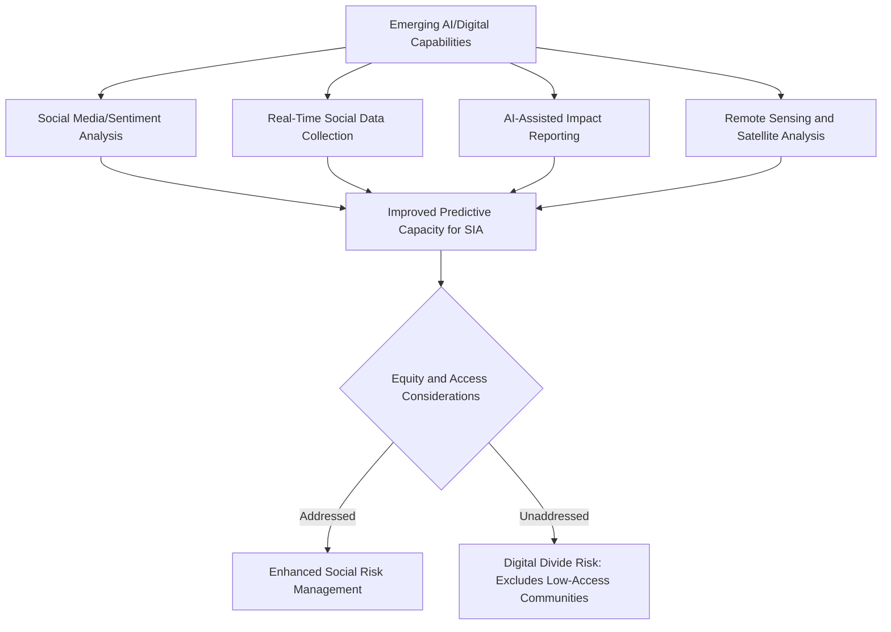

## Emerging trends and the future of the field

### Overview

This section synthesizes documented trends shaping the future of Social Impact Assessment (SIA) practice as of 2026: the integration of AI and digital tools into methodology, growing emphasis on human rights due diligence and trauma-informed practice, professional fragmentation risks, and evolving questions of equity in a digitally-augmented field. It draws on current published analysis of the state of the art in SIA and closely related fields.

### State of the Field: Documented Advances

**Key Points**

- Recent scholarship characterizes SIA as having made significant advances in paradigm and discourse while noting that several existential threats remain for the field. [Taylor & Francis Online](https://www.tandfonline.com/doi/full/10.1080/14615517.2026.2639326)
- Documented areas of advancing practice include greater attention to human rights due diligence; Indigenous peoples' rights, self-determination and the principle of free, prior and informed consent (FPIC); psychosocial impacts; trauma-informed impact assessment; genuine and meaningful community engagement; benefit sharing; and livelihood impacts. [Taylor & Francis Online](https://www.tandfonline.com/doi/full/10.1080/14615517.2026.2639326)
- At the same time, growing interest in the field brings fragmentation and narrow task definition in social practice and social performance — meaning that as SIA-adjacent specializations multiply (health impact assessment, human rights impact assessment, resettlement specialization), there is a documented risk of practitioners and institutions losing a unified, integrated view of social impact management across the project lifecycle. [Taylor & Francis Online](https://www.tandfonline.com/doi/full/10.1080/14615517.2026.2639326)

### Artificial Intelligence and Digital Tools in SIA Methodology

**Key Points**

- Social media content analysis, sentiment mining, and real-time social data collection can provide insights into community perceptions, social trends, and emerging impacts, representing a documented methodological opportunity for the field. [Taylor & Francis Online](https://www.tandfonline.com/doi/full/10.1080/14615517.2026.2639326)
- These technologies will likely improve the predictive capacity of SIAs, enhancing social risk management, according to recent analysis. [Taylor & Francis Online](https://www.tandfonline.com/doi/full/10.1080/14615517.2026.2639326)
- However, the same analysis cautions that there are limitations to digital technology in terms of who has access and who doesn't, and who has time to use it — directly implicating equity concerns central to SIA's own analytical framework (as covered in earlier chapters on vulnerable-group and equity analysis). [Taylor & Francis Online](https://www.tandfonline.com/doi/full/10.1080/14615517.2026.2639326)

### AI in Impact Assessment: Emerging Practice Themes

**Key Points**

- Dedicated recent research specifically on artificial intelligence in impact assessment more broadly has examined emerging practice, strengths, weaknesses, opportunities and threats of AI application in impact assessment, drawing in part on innovations highlighted at IAIA's 2025 conference. [DOI](https://doi.org/10.1080/14615517.2025.2594274)
- This body of work signals that AI application in impact assessment is an active area of professional and scholarly investigation rather than a settled methodology, and practitioners should expect continued evolution and debate over appropriate use cases (e.g., baseline data synthesis, sentiment analysis) versus inappropriate ones (e.g., substituting AI-generated inference for genuine community consultation).

### Human Rights and Rights-Based Framing

**Key Points**

- The growing emphasis on human rights due diligence and FPIC reflects a broader shift in SIA practice toward explicitly rights-based framing, rather than purely technical/managerial impact prediction — consistent with the FPIC and Pinheiro Principles references covered in earlier sector-specific chapters (e.g., post-disaster/conflict resettlement).
- This trend intersects with broader responsible-technology discourse: work connecting AI's human rights implications to business practice is an active professional area, with specialists focused specifically on human rights impacts of technology development and deployment — an adjacent field increasingly relevant to SIA practitioners assessing projects with significant digital/AI components.

### Trauma-Informed and Psychosocial Impact Assessment

**Key Points**

- The documented shift toward trauma-informed impact assessment and greater attention to psychosocial impacts extends themes already covered in this course's sector-specific chapters (post-disaster/conflict resettlement psychosocial dimensions, mental health integration in health policy SIA).
- This represents a maturation of the field beyond primarily economic/demographic impact tracking toward more holistic wellbeing-oriented assessment, requiring practitioners to build competency in trauma-informed engagement techniques that avoid re-traumatizing respondents during data collection.

### Professional Fragmentation as a Field-Level Risk

**Key Points**

- The identified risk of fragmentation and narrow task definition suggests that as SIA sub-specializations grow (as covered throughout the Sector-Specific Applications chapter), there is a documented tension between deep specialization and maintaining an integrated, whole-of-lifecycle view of social performance management.
- This has direct implications for the professional development pathways covered in this chapter: practitioners should be aware that deep specialization (e.g., only resettlement, or only health impact assessment) carries a field-level risk of losing sight of cross-cutting social impact management principles that unify the discipline.

### AI in Adjacent Social-Sector Practice

**Key Points**

- Broader social-sector and CSR analysis for 2026 indicates organizations are beginning to use AI to analyze participation patterns, predict engagement drop-offs, surface needs faster, and streamline impact reporting, with AI increasingly treated as a foundational capability for social impact teams rather than merely a productivity tool. [Goodera](https://www.goodera.com/blog/corporate-social-responsibility-trends)[Goodera](https://www.goodera.com/blog/corporate-social-responsibility-trends)
- Recommended practice from this adjacent literature is to treat AI as an augmentation layer for teams rather than a replacement, paired with building internal guardrails for ethical AI use in social programs — a framing directly transferable to SIA practice, particularly around AI-assisted stakeholder analysis or reporting. [Goodera](https://www.goodera.com/blog/corporate-social-responsibility-trends)[Goodera](https://www.goodera.com/blog/corporate-social-responsibility-trends)
- Broader social-sector commentary specifically cautions that as more leaders turn to AI for decision-making, these tools must enhance rather than replace community perspectives, warning that unintentional deployment strategies risk creating sophisticated solutions that fail in practice and deepen the very inequities practitioners are trying to address. This caution is particularly salient for SIA, given the field's core commitment to genuine community engagement. [FSG](https://www.fsg.org/blog/future-of-social-impact-what-to-watch-in-2026/)[FSG](https://www.fsg.org/blog/future-of-social-impact-what-to-watch-in-2026/)
- The same commentary notes AI lacks the track record and precedent that organizations typically rely on when assessing new tools, making it genuinely difficult to distinguish transformative potential from expensive distraction — a caution SIA practitioners should apply directly to any AI tool adoption decision. [FSG](https://www.fsg.org/blog/future-of-social-impact-what-to-watch-in-2026/)

### Emerging Trends Landscape Diagram (svg_diagram)

<svg xmlns="http://www.w3.org/2000/svg" viewBox="0 0 740 340">
<text x="370" y="26" text-anchor="middle" font-size="16" font-weight="bold" fill="#1a1a1a">Emerging Trends Shaping SIA's Future (svg_diagram)</text>
<rect x="30" y="55" width="200" height="60" rx="6" fill="#cce5ff" stroke="#004085" />
<text x="130" y="80" text-anchor="middle" font-size="11" fill="#004085">AI &amp; Digital Tools</text>
<text x="130" y="98" text-anchor="middle" font-size="9" fill="#004085">Sentiment mining, real-time data</text>
<rect x="270" y="55" width="200" height="60" rx="6" fill="#d4edda" stroke="#155724" />
<text x="370" y="80" text-anchor="middle" font-size="11" fill="#155724">Rights-Based Framing</text>
<text x="370" y="98" text-anchor="middle" font-size="9" fill="#155724">HR due diligence, FPIC</text>
<rect x="510" y="55" width="200" height="60" rx="6" fill="#fff3cd" stroke="#856404" />
<text x="610" y="80" text-anchor="middle" font-size="11" fill="#856404">Trauma-Informed Practice</text>
<text x="610" y="98" text-anchor="middle" font-size="9" fill="#856404">Psychosocial impact focus</text>
<line x1="130" y1="115" x2="370" y2="160" stroke="#333" stroke-width="1" />
<line x1="370" y1="115" x2="370" y2="160" stroke="#333" stroke-width="1" />
<line x1="610" y1="115" x2="370" y2="160" stroke="#333" stroke-width="1" />
<rect x="220" y="160" width="300" height="55" rx="6" fill="#e2d9f3" stroke="#4b3579" />
<text x="370" y="182" text-anchor="middle" font-size="11" fill="#4b3579">Convergent Field Evolution</text>
<text x="370" y="200" text-anchor="middle" font-size="9" fill="#4b3579">Holistic, rights-aware, tech-augmented</text>
<line x1="370" y1="215" x2="370" y2="250" stroke="#333" stroke-width="1.5" marker-end="url(#arrowT)" />
<rect x="140" y="255" width="230" height="55" rx="6" fill="#f8d7da" stroke="#721c24" />
<text x="255" y="277" text-anchor="middle" font-size="10" fill="#721c24">Risk: Fragmentation and</text>
<text x="255" y="293" text-anchor="middle" font-size="10" fill="#721c24">Narrow Task Definition</text>
<rect x="380" y="255" width="230" height="55" rx="6" fill="#f8d7da" stroke="#721c24" />
<text x="495" y="277" text-anchor="middle" font-size="10" fill="#721c24">Risk: Digital Divide</text>
<text x="495" y="293" text-anchor="middle" font-size="10" fill="#721c24">Excludes Low-Access Groups</text>
</svg>

### Implications for Professional Practice and Career Development

**Key Points**

- Practitioners building continuing education plans (per the earlier section) should specifically monitor developments in AI application to impact assessment, given active professional and scholarly investigation of this area at IAIA and in dedicated journal special issues.
- Consulting practices (per the earlier section on building a practice) should approach AI tool adoption cautiously and incrementally, applying the same "augmentation not replacement" framing documented in adjacent social-sector literature, and building internal ethical-use guardrails before broad deployment in client-facing work.
- The documented risk of professional fragmentation reinforces the value of the networking and communities-of-practice activities covered in the prior section — cross-specialization engagement (e.g., a resettlement specialist engaging with health impact assessment peers) helps counteract the narrowing of task definition the field's own literature has identified as a risk.
- Practitioners should treat "equity of access to digital tools" as a first-class methodological consideration, not an afterthought, when designing SIA data collection and engagement approaches that increasingly incorporate digital and AI-assisted methods.

### Common Pitfalls (Documented and Anticipated)

- **Uncritical AI adoption**: Deploying AI-assisted sentiment analysis or reporting tools without accounting for the documented digital access and time disparities that could bias whose voices are captured.
- **Overclaiming predictive capacity**: Treating AI-enhanced predictive capacity claims as more validated than current evidence supports, given that AI application to impact assessment remains an actively developing area without long track records.
- **Fragmentation without integration**: Pursuing deep specialization (as covered throughout the sector-specific chapters) without maintaining cross-cutting engagement that counters the field's documented fragmentation risk.
- **Technology-first design**: Designing engagement or data collection processes around available digital tools rather than around genuine community engagement needs, risking the exact substitution-of-community-perspective concern raised in current social-sector analysis.
- **Static skepticism or static enthusiasm**: Either dismissing AI/digital tools entirely or adopting them uncritically, rather than maintaining the evidence-based, incrementally verified approach recommended by current practice literature.

### Worked Example: Navigating an Emerging Trend Responsibly

An SIA consultancy considers incorporating social media sentiment analysis into a baseline study for a proposed infrastructure project.

1. The team reviews current literature on AI application in impact assessment to understand documented strengths, weaknesses, and open questions rather than assuming the tool's reliability.
2. They explicitly assess digital access patterns in the affected community, identifying that a significant portion of older and lower-income residents have limited social media presence — meaning sentiment analysis alone would systematically underrepresent their perspectives.
3. The team treats sentiment analysis as a supplementary data source (per the "augmentation not replacement" principle) alongside, not instead of, in-person consultation and household surveys.
4. Ethical guardrails are documented: sentiment data is used only for identifying discussion themes to explore further in direct consultation, never as a standalone basis for impact significance conclusions.
5. Findings and methodology limitations (including the digital-access gap) are transparently disclosed in the final report, consistent with the transparency practices covered in earlier reporting chapters.

### Next Steps

- Follow ongoing IAIA scholarship and conference programming (including dedicated Impact Assessment and Project Appraisal special issues) tracking AI application in impact assessment.
- Study current guidance on trauma-informed engagement techniques as a distinct emerging competency area.
- Review FPIC and human rights due diligence frameworks in greater depth as rights-based framing continues to gain prominence in the field.
- Examine emerging "responsible AI" and technology human-rights-impact frameworks as adjacent competency areas relevant to projects with significant digital/AI components.
- Engage cross-specialization professional networks (per the prior networking section) as a deliberate counter-measure to the field's documented fragmentation risk.