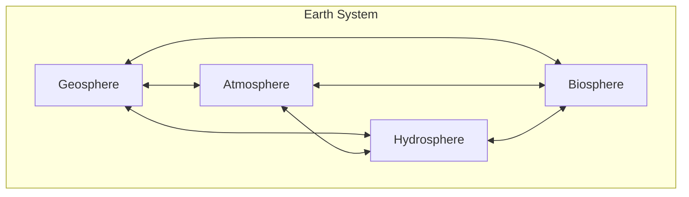

## What Is Earth Science

### Definition and Scope

Earth science is the collective term for the scientific disciplines concerned with the planet Earth — its composition, structure, physical processes, history, and its interactions with the atmosphere, oceans, and living organisms. It is an umbrella field that integrates physics, chemistry, biology, and mathematics to study Earth as an interconnected system rather than as isolated parts.

Earth science addresses questions such as:

- What is Earth made of, and how is it structured internally?
- What processes shape the surface (mountains, valleys, coastlines)?
- How do the atmosphere and oceans behave, and how do they influence climate and weather?
- How has Earth changed over its 4.6-billion-year history?
- How do Earth's systems interact with and support life?

### Major Branches

Earth science is typically divided into four principal branches, each focusing on a different component of the Earth system:

**Geology**

The study of the solid Earth — rocks, minerals, landforms, plate tectonics, earthquakes, volcanoes, and the geologic history recorded in rock layers. Subfields include mineralogy, petrology, structural geology, seismology, and paleontology.

**Meteorology**

The study of the atmosphere, weather patterns, and short-term atmospheric phenomena such as storms, precipitation, and wind systems. Meteorology underpins weather forecasting and atmospheric science.

**Oceanography**

The study of the oceans — their physical properties (currents, tides, temperature, salinity), chemistry, biology, and the geology of the ocean floor. Oceanography examines how oceans regulate climate and support marine ecosystems.

**Astronomy (Earth in space context)**

Within Earth science curricula, astronomy typically covers Earth's place in the solar system and universe — its relationship to the Sun, Moon, and other celestial bodies, and phenomena such as seasons, tides, and eclipses that result from these relationships.

Some curricula also identify **climatology** (long-term atmospheric patterns) and **environmental science** (human interactions with Earth systems) as related or overlapping branches.

### Earth as a System

A central concept in modern Earth science is that the planet operates as a set of interacting **spheres**, each representing a major component:

| Sphere | Composition | Examples of Processes |
| --- | --- | --- |
| Geosphere | Solid Earth: crust, mantle, core, rocks, and soil | Plate tectonics, volcanism, erosion |
| Atmosphere | Layer of gases surrounding Earth | Weather, wind circulation, greenhouse effect |
| Hydrosphere | All water: oceans, lakes, rivers, groundwater, ice | Water cycle, ocean currents, glaciation |
| Biosphere | All living organisms | Photosynthesis, decomposition, ecosystem cycling |

These spheres are not independent; changes in one sphere routinely produce effects in the others. For example, a volcanic eruption (geosphere) releases ash and gases into the atmosphere, which can alter climate patterns, which in turn affects ocean temperatures (hydrosphere) and ecosystems (biosphere).

**Example:** Deforestation (biosphere disturbance) reduces the land's capacity to absorb carbon dioxide, contributing to atmospheric CO₂ increases, which influences global temperature (atmosphere), which can alter precipitation patterns and river flow (hydrosphere), which then affects soil erosion rates (geosphere).

### Illustration: Earth's Interacting Spheres

<svg xmlns="http://www.w3.org/2000/svg" viewBox="0 0 500 500">
<text x="250" y="30" text-anchor="middle" font-size="18" font-weight="bold" fill="#1a1a1a">Earth's Four Spheres (svg_diagram)</text>
<circle cx="250" cy="270" r="200" fill="#87CEEB" opacity="0.3" stroke="#4682B4" stroke-width="2" />
<text x="250" y="90" text-anchor="middle" font-size="16" fill="#2b6ca3">Atmosphere</text>
<circle cx="250" cy="270" r="150" fill="#4169E1" opacity="0.3" stroke="#27408B" stroke-width="2" />
<text x="250" y="140" text-anchor="middle" font-size="16" fill="#1c3d7a">Hydrosphere</text>
<circle cx="250" cy="270" r="100" fill="#8B4513" opacity="0.4" stroke="#5c2e0d" stroke-width="2" />
<text x="250" y="190" text-anchor="middle" font-size="16" fill="#4a2508">Geosphere</text>
<circle cx="250" cy="270" r="50" fill="#228B22" opacity="0.6" stroke="#145214" stroke-width="2" />
<text x="250" y="275" text-anchor="middle" font-size="14" fill="#ffffff">Biosphere</text>

<text x="250" y="480" text-anchor="middle" font-size="12" fill="`#555555`">Nested spheres interact continuously across boundaries</text>

</svg>

### Historical Development

Earth science emerged from the convergence of several older disciplines. Natural philosophy in antiquity included early observations of rocks, rivers, and celestial motion. Modern geology took shape in the 18th–19th centuries through the work of figures such as James Hutton, who articulated the principle of **uniformitarianism** — the idea that geological processes observed today (erosion, sedimentation) have operated at similar rates throughout Earth's history and can be used to interpret the past.

The 20th century brought two major unifying frameworks:

- **Plate tectonics** (1960s), which explained the movement of continents, the distribution of earthquakes and volcanoes, and the formation of ocean basins through the motion of rigid lithospheric plates.
- **Earth system science** (late 20th century), which formalized the view of Earth as an integrated system of interacting spheres, partly driven by satellite observation capabilities that allowed scientists to monitor global-scale processes simultaneously.

### Methods and Tools

Earth scientists use a combination of field observation, laboratory analysis, and remote sensing:

- **Field methods**: rock and soil sampling, structural mapping, fossil collection, seismic monitoring instruments
- **Laboratory analysis**: mineral identification, radiometric dating, chemical composition analysis of rock and water samples
- **Remote sensing**: satellites and aircraft-based sensors that measure surface temperature, vegetation cover, ice extent, and atmospheric composition
- **Modeling and simulation**: computational models used to simulate climate systems, plate movement, and ocean circulation, allowing scientists to test hypotheses about future or past conditions

[Inference] The relative emphasis on modeling versus field methods varies significantly by subfield and by the specific research question being addressed.

### Time Scales in Earth Science

A distinguishing feature of Earth science is the need to reason across vastly different time scales:

$$t_{geologic} \sim 10^6 \text{ to } 10^9 \text{ years}, \quad t_{meteorologic} \sim 10^{-1} \text{ to } 10^1 \text{ days}$$

Geological processes such as mountain building or continental drift occur over millions to billions of years, while atmospheric processes such as storm formation occur over hours to days. Earth scientists must be comfortable moving between these scales — interpreting a single rock layer as evidence of an event spanning thousands of years, while also modeling a weather system that evolves within 24 hours.

### Why Earth Science Matters

**Key Points**

- Provides the scientific basis for predicting natural hazards (earthquakes, volcanic eruptions, hurricanes, floods)
- Informs resource management, including water supplies, fossil fuels, minerals, and soil for agriculture
- Underpins understanding of climate change and its long-term planetary effects
- Supports environmental policy and conservation decisions
- Establishes the geological and atmospheric context necessary for other sciences, including biology (evolutionary history) and planetary science (comparative study of other planets)

### Relationship to Other Sciences

Earth science is inherently interdisciplinary. It draws on:

- **Physics** — for understanding heat flow, seismic wave propagation, and fluid dynamics in the atmosphere and oceans
- **Chemistry** — for analyzing mineral composition, atmospheric gas reactions, and ocean chemistry
- **Biology** — for studying the fossil record, ecosystem interactions, and biogeochemical cycles
- **Mathematics** — for modeling systems such as climate, plate motion, and radioactive decay used in dating rocks

[Unverified] The precise boundary between "Earth science" and "environmental science" as academic disciplines varies by institution and country, with some programs treating them as fully separate degrees and others treating environmental science as a subfield of Earth science.

### Common Misconceptions

- Earth science is not limited to the study of rocks; it encompasses atmosphere, oceans, and the biosphere as well.
- Earth science and geography are related but distinct: geography often emphasizes human-environment interaction and spatial analysis, while Earth science emphasizes physical processes and Earth history.
- Earth science is not a purely observational or descriptive field; it relies heavily on quantitative modeling, laboratory experimentation, and physical/chemical principles.

**Next Topics**

- The Geosphere: Structure and Composition of Earth
- The Rock Cycle
- Plate Tectonics Theory
- The Atmosphere: Layers and Composition
- The Hydrosphere and the Water Cycle
- Introduction to Earth's Geologic Time Scale
- Earth System Science and Biogeochemical Cycles
- Tools and Techniques in Earth Science Research