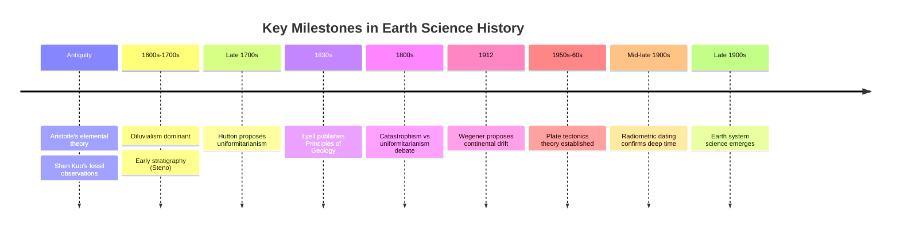

## History and Philosophy of Earth Science

### Overview

The history and philosophy of Earth science examines how humans have understood the planet over time and the conceptual frameworks — assumptions, methods, and reasoning styles — that have shaped Earth scientific inquiry. This includes tracing the evolution from mythological and speculative explanations of Earth's features to systematic, evidence-based scientific frameworks, as well as examining the epistemological principles that distinguish Earth science from experimental sciences like physics or chemistry.

### Early and Pre-Scientific Understanding

Before the emergence of geology as a formal discipline, explanations of Earth's features were largely mythological, religious, or philosophical.

**Ancient and Classical Contributions**

- Ancient Greek philosophers such as Aristotle proposed early ideas about the formation of rocks, the cycle of water, and the causes of earthquakes, often within a framework of the four classical elements (earth, water, air, fire).
- Chinese scholars, notably Shen Kuo (11th century), made early observations connecting marine fossils found in mountains to the idea that land and sea had changed positions over time.
- Persian scholar Ibn Sina (Avicenna, 11th century) proposed explanations for mountain formation involving erosion and uplift, anticipating later geological concepts.

**Biblical and Diluvial Frameworks**

In Europe through the medieval period and into the 17th–18th centuries, Earth's features were commonly explained through **diluvialism** — the idea that most surface features resulted from a single catastrophic flood (often linked to the biblical deluge). This framework dominated until it was gradually challenged by accumulating field evidence.

### The Birth of Modern Geology (18th–19th Century)

**Catastrophism vs. Uniformitarianism**

A foundational philosophical debate in Earth science history was between two competing frameworks for interpreting Earth's history:

- **Catastrophism**, associated with Georges Cuvier, held that Earth's features were produced by sudden, large-scale catastrophic events distinct from processes observed in the present.
- **Uniformitarianism**, articulated by James Hutton in the late 18th century and later popularized by Charles Lyell in *Principles of Geology* (1830–1833), held that the same gradual processes observed today (erosion, sedimentation, volcanism) have operated at similar rates and intensities throughout Earth's history, and that these processes are sufficient to explain the geologic record given enough time.

Hutton's famous formulation, often summarized as "the present is the key to the past," became a foundational methodological principle in geology. [Inference] This exact phrasing is commonly attributed to Hutton in popular science writing, though the precise wording used in his own publications differs; the concept itself is well documented as his contribution.

Hutton's observations of unconformities (surfaces representing gaps in the rock record) led him to propose that Earth's history extended far beyond the timescales implied by biblical chronology, famously concluding that he could find "no vestige of a beginning, no prospect of an end" — pointing to a vastly ancient Earth.

**Table: Catastrophism vs. Uniformitarianism**

| Aspect | Catastrophism | Uniformitarianism |
| --- | --- | --- |
| Primary proponent | Georges Cuvier | James Hutton, Charles Lyell |
| Core claim | Sudden, large-scale events shaped Earth | Gradual, ongoing processes shaped Earth |
| Timescale implied | Relatively short Earth history | Vastly long Earth history |
| Modern status | Largely rejected in original form; some catastrophic events (e.g., asteroid impacts) are now accepted as real but rare punctuating events | Forms the basis of modern geologic reasoning, refined by punctuated events |

[Inference] Modern geology does not treat these as strictly opposing frameworks; it incorporates gradual processes as the norm while accepting that rare catastrophic events (large impacts, massive volcanic episodes) have also played significant roles — sometimes called **neo-catastrophism** or an integrated view.

### The Discovery of Deep Time

One of the most significant philosophical shifts in Earth science was the recognition of **deep time** — the concept that Earth's history spans an immense span of time, far exceeding human experience or historical record.

- Hutton's field observations at Siccar Point, Scotland, showing angled rock layers overlain by horizontal layers (an angular unconformity), provided visual evidence of enormous time gaps in the rock record.
- Lyell's systematic compilation of gradual process rates reinforced the idea that observable present-day processes, projected over immense timescales, could account for all observed geological features.
- The later development of radiometric dating in the 20th century (using known rates of radioactive decay) provided the first quantitative method to assign absolute ages to rocks, confirming that Earth is approximately 4.6 billion years old.

$$N(t) = N_0 e^{-\lambda t}$$

This decay equation, where $N_0$ is the initial quantity of a radioactive isotope, $N(t)$ is the quantity remaining after time $t$, and $\lambda$ is the decay constant, underlies radiometric dating techniques that later confirmed the deep-time framework Hutton had proposed on purely observational grounds.

### The Plate Tectonics Revolution

**Continental Drift (Early 20th Century)**

Alfred Wegener proposed in 1912 that continents had once been joined in a single landmass (which he called Pangaea) and had since drifted apart. His evidence included the jigsaw-puzzle fit of continental coastlines, matching fossil distributions across continents now separated by oceans, and correlating rock formations.

Wegener's hypothesis was largely rejected by the geological community for several decades, primarily because he could not identify a plausible physical mechanism capable of moving continents through solid ocean floor.

**Plate Tectonics (1950s–1960s)**

The theory was vindicated and reformulated as **plate tectonics** following mid-20th-century discoveries:

- Mapping of the mid-ocean ridge system and seafloor spreading (Harry Hess, 1960s)
- Paleomagnetic striping patterns on the ocean floor, showing symmetric magnetic reversals on either side of mid-ocean ridges
- Global seismicity patterns showing that earthquakes concentrate along specific boundary zones, consistent with rigid plate boundaries

This shift is frequently cited as a textbook example of a **scientific paradigm shift**, in the sense described by philosopher of science Thomas Kuhn — a period where an accumulation of anomalies unexplainable by the prevailing framework (a static Earth) leads to a wholesale replacement by a new framework (mobile plates) that better accounts for the evidence.

**Example:** Under the old static-Earth framework, the presence of identical fossil species on the coasts of Africa and South America required an implausible explanation (land bridges that later sank). Under plate tectonics, the explanation became straightforward: the continents were once joined and later separated.

### Philosophical Foundations of Earth Science

Earth science differs philosophically from laboratory-based experimental sciences in several important ways:

**Historical (Retrodictive) Science**

Much of Earth science is concerned with reconstructing past events (the formation of a mountain range, an ancient climate, a mass extinction) rather than predicting future outcomes of controlled experiments. This requires reasoning from present-day evidence back to past causes, a form of inference sometimes called **retrodiction** rather than prediction.

**Uniformitarian Reasoning**

Because Earth scientists cannot directly observe most past events, they rely on the uniformitarian principle that physical and chemical laws have remained constant, and that processes observed today can be used as analogs for interpreting past evidence (e.g., studying modern river deposits to interpret ancient riverbed sediments).

**Field-Based, Non-Repeatable Observation**

Unlike a controlled laboratory experiment, many Earth science observations (a specific volcanic eruption, a particular earthquake, the formation of a specific rock outcrop) are unique, non-repeatable events. Earth scientists compensate through comparative studies across many similar events (e.g., studying many volcanoes to generalize about eruption behavior) and through modeling.

**Systems Thinking**

Modern Earth science philosophy emphasizes understanding Earth as a complex, interconnected system with feedback loops, rather than analyzing components (rocks, air, water, life) in isolation. This systems-based framework emerged prominently in the late 20th century alongside satellite-based global observation capabilities.

**==Multiple Working Hypotheses==**

Geologist T.C. Chamberlin's 1890 essay on the "method of multiple working hypotheses" remains an influential methodological principle in Earth science: rather than committing early to a single explanatory theory, researchers are encouraged to develop and test several plausible hypotheses simultaneously to reduce confirmation bias.

### Scientific Revolutions in Earth Science: A Summary Framework

**Example:** This pattern is visible both in the shift from catastrophism to uniformitarianism in the 19th century and in the shift from a static-Earth model to plate tectonics in the 20th century.

### Modern Philosophical Issues in Earth Science

- **Uncertainty and prediction**: Earth science increasingly grapples with the philosophy of prediction under uncertainty, particularly in climate science, where complex system models produce probabilistic rather than deterministic forecasts.
- **Anthropocene debate**: An ongoing discussion within Earth science concerns whether human influence on Earth systems (climate, sediment deposition, species extinction rates) warrants formal recognition of a new geological epoch, the "Anthropocene." [Unverified] As of recent years, this remains a matter of active debate within stratigraphic and geological governing bodies rather than a formally ratified unit of geologic time, and its status may have changed since.
- **Interdisciplinary integration**: Contemporary Earth science philosophy emphasizes integrating physical, chemical, biological, and social science perspectives, reflecting the recognition that human activity is now a significant driver of planetary-scale change.

**Key Points**

- Earth science evolved from mythological and diluvial explanations toward evidence-based, uniformitarian reasoning.
- The uniformitarianism–catastrophism debate established core methodological principles still used today, refined into a synthesis that accepts both gradual processes and rare catastrophic events.
- The recognition of deep time fundamentally reshaped how Earth's history is understood and measured.
- The plate tectonics revolution exemplifies a Kuhnian paradigm shift, replacing a static-Earth model with a dynamic, evidence-supported framework.
- Earth science's philosophy is distinguished by historical (retrodictive) reasoning, reliance on uniformitarian assumptions, and systems-based thinking.

**Next Topics**

- James Hutton and the Discovery of Deep Time
- Charles Lyell and Uniformitarianism
- Alfred Wegener and Continental Drift
- The Development of Plate Tectonic Theory
- Radiometric Dating and the Geologic Time Scale
- Thomas Kuhn and Scientific Paradigm Shifts (Philosophy of Science)
- The Anthropocene Debate
- Earth System Science as a Modern Framework