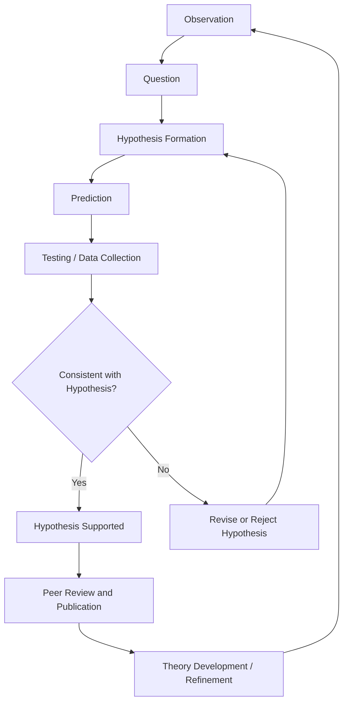

## The Scientific Method in Earth Science

### Overview

The scientific method in Earth science follows the same general logical structure used across the natural sciences — observation, hypothesis formation, testing, and refinement — but is adapted to accommodate the unique challenges of studying a planet-scale, largely non-repeatable, and historically deep system. Earth scientists frequently cannot manipulate variables in a controlled laboratory setting the way a chemist or physicist can; instead, they rely heavily on field observation, natural experiments, comparative analysis, and computational modeling.

### The General Scientific Method

The classical scientific method proceeds through an iterative cycle:

**Key Points**

- The cycle is iterative, not linear; hypotheses are continually refined as new data emerges.
- A hypothesis that survives repeated rigorous testing and gains broad explanatory power may eventually be elevated to a scientific theory (e.g., plate tectonics).
- No hypothesis is ever proven with absolute certainty; it is only supported by accumulating evidence or falsified by contradicting evidence.

### Adaptations of the Scientific Method for Earth Science

**Historical/Retrodictive Reasoning**

Much of Earth science investigates events that occurred in the past — the formation of a mountain range, an ancient climate shift, a mass extinction — rather than testable events that can be reproduced on demand. Earth scientists therefore often reason **retrodictively**: starting from present-day evidence (rock layers, fossils, isotopic ratios) and inferring the most plausible sequence of past causes.

**Uniformitarian Assumption**

Central to this retrodictive reasoning is the uniformitarian principle — that the physical and chemical laws governing processes today also governed them in the past. This allows scientists to use present-day analogs (e.g., modern river deposits) to interpret ancient evidence (ancient riverbed sediments) with justified confidence.

**Natural Experiments**

Because Earth scientists usually cannot control variables at a planetary scale, they often rely on **natural experiments** — comparing naturally occurring variations across different locations or times as a substitute for a controlled laboratory setup.

**Example:** To study the effect of atmospheric CO₂ on global temperature, scientists cannot run a controlled experiment on the whole planet. Instead, they compare ice core records from different geological periods where CO₂ concentrations varied naturally, using these as natural experimental conditions.

**Multiple Working Hypotheses**

Given the complexity and non-repeatability of many Earth processes, Earth scientists frequently apply T.C. Chamberlin's method of **multiple working hypotheses** — simultaneously considering several plausible explanations for an observation rather than prematurely committing to one, in order to reduce confirmation bias.

### Types of Evidence Used in Earth Science

| Evidence Type | Description | Example Use |
| --- | --- | --- |
| Field observation | Direct study of rock outcrops, landforms, or active processes | Mapping fault lines, describing sediment layers |
| Laboratory analysis | Controlled measurement of samples collected in the field | Radiometric dating, mineral composition analysis |
| Remote sensing | Satellite or aerial data collection | Measuring ice sheet extent, sea surface temperature |
| Proxy data | Indirect indicators of past conditions | Tree rings, ice cores, and sediment layers used to infer past climate |
| Computational modeling | Simulations based on physical laws and observed data | Climate models, plate motion simulations, seismic wave propagation models |

### Hypothesis Testing in Earth Science: A Worked Example

**Example: Testing a Hypothesis About Sediment Deposition**

1. **Observation**: A river delta shows alternating layers of coarse sand and fine silt.
2. **Question**: What caused the alternating layers?
3. **Hypothesis**: The layers reflect seasonal changes in river flow (coarse sand during high-flow seasons, fine silt during low-flow seasons).
4. **Prediction**: If the hypothesis is correct, the number of coarse-fine layer pairs in a given depth of sediment should correspond to the number of years represented by that depth (assuming a known deposition rate).
5. **Testing**: Researchers count layer pairs and compare against independently dated sediment (e.g., via radiometric methods or known historical flood records).
6. **Evaluation**: If layer counts align with expected time spans, the hypothesis is supported; if not, alternative explanations (e.g., episodic storm events instead of seasonal cycles) must be considered.

This layered evidence — called **varves** when referring to annual sediment layers — illustrates how Earth scientists combine direct observation with quantitative testing to evaluate hypotheses about processes they cannot directly witness.

### The Role of Models in Earth Science

Because many Earth processes operate over scales (spatial or temporal) that are impossible to observe directly or reproduce experimentally, computational and physical models play a central role in hypothesis testing.

**Types of models commonly used:**

- **Physical/analog models**: scaled-down laboratory recreations of processes (e.g., flume tanks simulating river erosion, tectonic sandbox models simulating fault formation)
- **Mathematical models**: equations describing physical relationships (e.g., heat flow equations, radioactive decay equations)
- **Computational/numerical models**: simulations run on computers that solve complex systems of equations to predict system behavior (e.g., global climate models, seismic hazard models)

$$\frac{\partial T}{\partial t} = \alpha \nabla^2 T$$

This heat diffusion equation, where $T$ is temperature, $t$ is time, and $\alpha$ is thermal diffusivity, exemplifies the type of physical law incorporated into models used to study heat flow within Earth's interior — a process too slow and too deep to observe directly.

[Inference] The accuracy of any given Earth science model depends heavily on the quality and resolution of input data as well as the model's underlying assumptions; results from complex system models such as climate or tectonic simulations are generally expressed with associated uncertainty ranges rather than as single definitive outcomes.

### Peer Review and the Self-Correcting Nature of Earth Science

Like all scientific disciplines, Earth science relies on **peer review** — independent evaluation of research methods, data, and conclusions by other qualified scientists before publication — as a quality-control mechanism. This process, combined with the requirement that hypotheses be testable and falsifiable, allows the field to self-correct over time.

**Example:** Alfred Wegener's continental drift hypothesis was initially rejected by the geological community largely because it lacked a plausible physical mechanism. Decades later, new evidence (seafloor spreading, paleomagnetism) provided that missing mechanism, and the scientific community revised its consensus — illustrating the self-correcting nature of the scientific process rather than a failure of it.

### Falsifiability in Earth Science

A hypothesis is only considered scientific if it makes predictions that could, in principle, be shown false by evidence. This criterion, associated with philosopher Karl Popper, applies to Earth science as much as to experimental sciences, though it can be more challenging to apply given the historical and complex nature of many Earth processes.

**Example of a falsifiable Earth science hypothesis:** "If the Chicxulub impact caused the end-Cretaceous mass extinction, then a layer of iridium-enriched sediment (consistent with an extraterrestrial source) should be found globally at the Cretaceous-Paleogene boundary." This prediction was later tested and supported by the discovery of the global iridium layer, providing strong supporting evidence for the impact hypothesis.

**Example of a non-falsifiable claim** (and thus not scientific in this framework): A claim that an unobservable, undetectable process caused a geological feature, with no proposed evidence that could ever confirm or contradict it.

### Distinguishing Hypothesis, Theory, and Law in Earth Science

| Term | Definition | Example in Earth Science |
| --- | --- | --- |
| Hypothesis | A testable, tentative explanation for an observation | "This valley was carved by glacial ice, not river erosion." |
| Theory | A well-substantiated explanation supported by extensive, repeated evidence and observation | Plate tectonic theory, theory of uniformitarianism |
| Scientific Law | A descriptive statement of a consistent physical relationship, often mathematically expressed | Law of superposition (in undisturbed rock sequences, older layers lie beneath younger ones) |

[Inference] In common usage, "theory" in a scientific context (as with plate tectonics) denotes a robust, well-evidenced explanatory framework, which differs from the colloquial use of "theory" to mean an unproven guess.

### Limitations and Challenges Specific to Earth Science

- **Non-repeatability**: Many key events (a specific earthquake, a specific extinction event) cannot be repeated for controlled study.
- **Incomplete records**: The geologic record is incomplete due to erosion, non-deposition, and metamorphism, requiring careful inference to fill gaps.
- **Spatial and temporal scale**: Processes range from microscopic mineral formation to continent-scale tectonics, and from seconds (earthquake rupture) to billions of years (planetary cooling), requiring different methodological approaches at each scale.
- **System complexity**: Earth's interconnected spheres (geosphere, atmosphere, hydrosphere, biosphere) create feedback loops that complicate isolating single causal variables.

**Key Points**

- Earth science follows the standard scientific method but adapts it to accommodate historical, non-repeatable, and system-scale phenomena.
- Uniformitarian reasoning and natural experiments substitute for controlled laboratory experimentation in many cases.
- Multiple working hypotheses and rigorous peer review help mitigate the interpretive challenges inherent in studying an incomplete, complex geologic record.
- Falsifiability remains a defining criterion of scientific hypotheses in Earth science, even when applied to historical or system-scale claims.

**Next Topics**

- Uniformitarianism as a Methodological Principle
- Natural Experiments and Proxy Data in Earth Science
- Radiometric Dating Techniques
- Computational Modeling in Climate and Geoscience
- The Law of Superposition and Relative Dating
- Peer Review and Scientific Consensus Building
- Case Study: The Chicxulub Impact Hypothesis