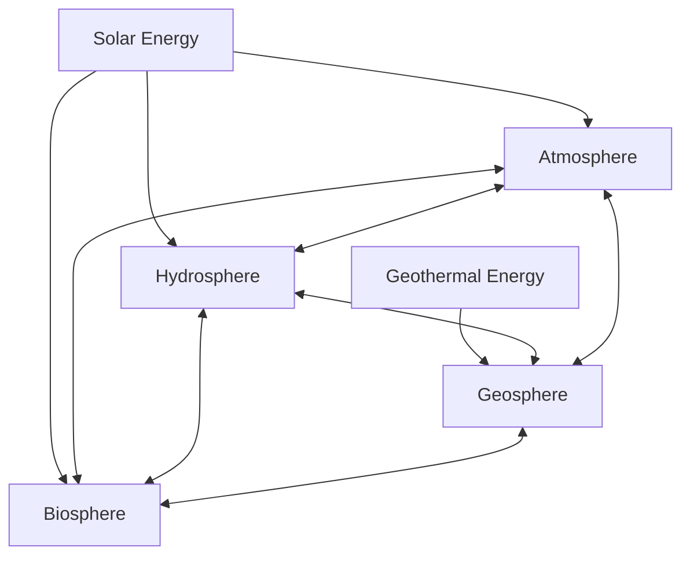

## Earth as an Integrated System

### Overview

Earth system science treats the planet not as a collection of separate, independently functioning parts, but as a single, complex, interconnected system in which the geosphere, atmosphere, hydrosphere, biosphere, and cryosphere continuously exchange matter and energy. Changes introduced in one component propagate — often nonlinearly — through the others via feedback loops, making Earth's behavior fundamentally different from the sum of its isolated parts.

### The Five Major Subsystems (Spheres)

| Sphere | Definition | Key Components |
| --- | --- | --- |
| Geosphere | The solid Earth, including crust, mantle, and core | Rocks, minerals, tectonic plates, soil |
| Atmosphere | The gaseous envelope surrounding Earth | Nitrogen, oxygen, water vapor, greenhouse gases |
| Hydrosphere | All water on, above, and below Earth's surface | Oceans, rivers, lakes, groundwater |
| Cryosphere | Frozen water components (often treated as a subset of the hydrosphere) | Glaciers, ice sheets, sea ice, permafrost |
| Biosphere | All living organisms and their interactions with other spheres | Plants, animals, microorganisms, ecosystems |

Some frameworks treat the cryosphere as a distinct fifth sphere due to its unique role in reflecting solar radiation and its outsized sensitivity to temperature change; other frameworks fold it into the hydrosphere. [Unverified] The exact number of "official" spheres varies somewhat by textbook and curriculum, though geosphere, atmosphere, hydrosphere, and biosphere form the near-universal core set.

### Matter and Energy Flow Between Spheres

The Earth system is powered primarily by two energy sources:

- **Solar energy**, driving atmospheric and ocean circulation, the water cycle, and photosynthesis
- **Internal (geothermal) energy**, derived from radioactive decay and residual heat from planetary formation, driving plate tectonics, volcanism, and mantle convection

Matter cycles through the spheres via **biogeochemical cycles** — pathways by which chemical elements move between living organisms and the physical environment.

### Key Biogeochemical Cycles

**The Water Cycle (Hydrologic Cycle)**

Water moves continuously between the atmosphere, hydrosphere, geosphere, and biosphere through evaporation, condensation, precipitation, infiltration, and runoff. This cycle links atmospheric processes (cloud formation) directly to geospheric processes (erosion, groundwater recharge) and biospheric processes (transpiration from plants).

**The Carbon Cycle**

Carbon moves between the atmosphere (as CO₂), the biosphere (via photosynthesis and respiration), the hydrosphere (dissolved in oceans), and the geosphere (stored in rocks, fossil fuels, and sediments) over timescales ranging from days (respiration) to millions of years (carbonate rock formation).

$$\text{CO}_2 + \text{H}_2\text{O} \xrightarrow{\text{photosynthesis}} \text{C}_6\text{H}_{12}\text{O}_6 + \text{O}_2$$

This reaction illustrates a direct biosphere-atmosphere carbon exchange, one of many pathways in the broader carbon cycle.

**The Nitrogen Cycle**

Nitrogen moves between the atmosphere (as N₂ gas), the biosphere (via nitrogen-fixing organisms), and the geosphere/hydrosphere (via decomposition and runoff), demonstrating interdependence between atmospheric composition and biological processes.

**The Rock Cycle**

Though centered on the geosphere, the rock cycle interacts with all other spheres: weathering by atmospheric and hydrospheric agents breaks down rock, biological activity contributes to soil formation, and sediments can incorporate organic material from the biosphere before being buried and lithified.

### Feedback Loops: The Mechanism of Interconnection

A **feedback loop** occurs when a change in one part of the system triggers a response that either amplifies (positive feedback) or dampens (negative feedback) the original change.

**Positive (Amplifying) Feedback Example: Ice-Albedo Feedback**

1. Rising global temperatures cause polar ice to melt.
2. Ice has high albedo (reflectivity); its loss exposes darker ocean or land surfaces.
3. Darker surfaces absorb more solar energy, causing further warming.
4. Further warming causes more ice melt, reinforcing the cycle.

**Negative (Dampening) Feedback Example: Silicate Weathering**

1. Increased atmospheric CO₂ raises global temperature.
2. Higher temperatures increase rates of chemical weathering of silicate rocks, which consumes atmospheric CO₂.
3. Reduced atmospheric CO₂ lowers global temperature.
4. This negative feedback acts as a long-term (geologic-timescale) thermostat on Earth's climate.

**Key Points**

- Positive feedback loops amplify an initial change and can drive a system toward a new, often less stable state.
- Negative feedback loops counteract an initial change, tending to stabilize the system around an equilibrium.
- Most real-world Earth system responses (e.g., overall climate response to CO₂) involve a combination of multiple competing positive and negative feedbacks, making net outcomes complex to predict with precision.

[Inference] The relative strength of competing feedbacks (e.g., ice-albedo vs. silicate weathering) operates on very different timescales — ice-albedo feedback acts over years to decades, while silicate weathering feedback acts over tens of thousands to millions of years — meaning short-term system behavior can differ substantially from long-term equilibrium behavior.

### Illustration: Earth System Feedback Diagram

<svg xmlns="http://www.w3.org/2000/svg" viewBox="0 0 550 400">
<text x="275" y="30" text-anchor="middle" font-size="16" font-weight="bold" fill="#1a1a1a">Ice-Albedo Positive Feedback Loop (svg_diagram)</text>
<rect x="30" y="70" width="140" height="60" rx="8" fill="#ffe0e0" stroke="#c0392b" stroke-width="2" />
<text x="100" y="95" text-anchor="middle" font-size="12" fill="#7a1f1f">Rising Global</text>
<text x="100" y="112" text-anchor="middle" font-size="12" fill="#7a1f1f">Temperature</text>
<rect x="300" y="70" width="140" height="60" rx="8" fill="#dbeafe" stroke="#2563eb" stroke-width="2" />
<text x="370" y="95" text-anchor="middle" font-size="12" fill="#1e3a8a">Polar Ice</text>
<text x="370" y="112" text-anchor="middle" font-size="12" fill="#1e3a8a">Melts</text>
<rect x="300" y="230" width="140" height="60" rx="8" fill="#fef3c7" stroke="#b45309" stroke-width="2" />
<text x="370" y="255" text-anchor="middle" font-size="12" fill="#78350f">Lower Surface</text>
<text x="370" y="272" text-anchor="middle" font-size="12" fill="#78350f">Albedo</text>
<rect x="30" y="230" width="140" height="60" rx="8" fill="#fde2e2" stroke="#c0392b" stroke-width="2" />
<text x="100" y="255" text-anchor="middle" font-size="12" fill="#7a1f1f">More Solar</text>
<text x="100" y="272" text-anchor="middle" font-size="12" fill="#7a1f1f">Energy Absorbed</text>
<path d="M170,100 L300,100" stroke="#333" stroke-width="2" marker-end="url(#arrow)" />
<path d="M370,130 L370,230" stroke="#333" stroke-width="2" marker-end="url(#arrow)" />
<path d="M300,260 L170,260" stroke="#333" stroke-width="2" marker-end="url(#arrow)" />
<path d="M100,230 L100,130" stroke="#333" stroke-width="2" marker-end="url(#arrow)" />
<text x="275" y="370" text-anchor="middle" font-size="11" fill="`#555555`">Each stage reinforces the next, amplifying the initial warming</text>

</svg>

### Case Study: The Interconnection Illustrated by Volcanic Eruptions

**Example: Mount Pinatubo Eruption (1991)**

1. **Geosphere event**: A major volcanic eruption releases sulfur dioxide (SO₂) and ash into the atmosphere.
2. **Atmospheric effect**: SO₂ converts to sulfate aerosols in the stratosphere, reflecting incoming solar radiation.
3. **Climate effect**: Global average temperatures measurably decreased for one to two years following the eruption.
4. **Hydrospheric effect**: Altered temperature gradients affected precipitation patterns and monsoon behavior in some regions.
5. **Biospheric effect**: Changes in temperature and precipitation affected plant growth cycles and agricultural yields in some regions during the cooling period.

This case demonstrates how a single geospheric event cascades through the atmosphere, hydrosphere, and biosphere, illustrating the fundamentally interconnected nature of the Earth system.

### Human Activity as a System Driver

Modern Earth system science increasingly incorporates human activity as a significant driver of system-wide change, given the scale of anthropogenic influence on atmospheric composition, land use, and biodiversity.

**Example:** Fossil fuel combustion (a human activity) releases carbon stored in the geosphere over geological timescales into the atmosphere on a timescale of decades, altering the carbon cycle's natural balance and demonstrating how human systems now function as an active component of Earth system dynamics rather than an external influence upon it.

[Inference] The magnitude and long-term consequences of human-driven perturbations to Earth system cycles are the subject of ongoing scientific research and modeling refinement, and specific quantitative projections carry uncertainty ranges that should be evaluated through current peer-reviewed sources rather than treated as fixed figures.

### Why Systems Thinking Matters in Earth Science

- **Predictive power**: Understanding feedback loops allows scientists to anticipate cascading effects of a change in one sphere (e.g., predicting climate effects from deforestation).
- **Resource management**: Systems thinking informs sustainable management of water, soil, and atmospheric resources by accounting for cross-sphere consequences of interventions.
- **Hazard assessment**: Recognizing system interconnections helps forecast compound hazards (e.g., how a drought in the hydrosphere can increase wildfire risk in the biosphere, which can then affect air quality in the atmosphere).
- **Historical interpretation**: Systems thinking helps explain major past events, such as mass extinctions, as the result of cascading effects across spheres rather than isolated single causes.

**Key Points**

- Earth functions as an integrated system of interacting spheres: geosphere, atmosphere, hydrosphere, cryosphere, and biosphere.
- Matter and energy continuously cycle between spheres via processes such as the water, carbon, nitrogen, and rock cycles.
- Feedback loops — positive (amplifying) and negative (dampening) — govern how changes propagate and stabilize (or destabilize) within the system.
- Case studies such as volcanic eruptions demonstrate real-world cascading effects across all spheres.
- Human activity is increasingly recognized as an active driver within the Earth system rather than an external factor.

**Next Topics**

- The Water Cycle in Detail
- The Carbon Cycle and Climate Regulation
- The Rock Cycle and Its Sphere Interactions
- Positive and Negative Feedback Mechanisms in Climate Systems
- The Cryosphere and Ice-Albedo Dynamics
- Biogeochemical Cycling: Nitrogen, Phosphorus, and Sulfur
- Anthropogenic Impacts on Earth System Cycles
- Case Studies in Cascading Earth System Events