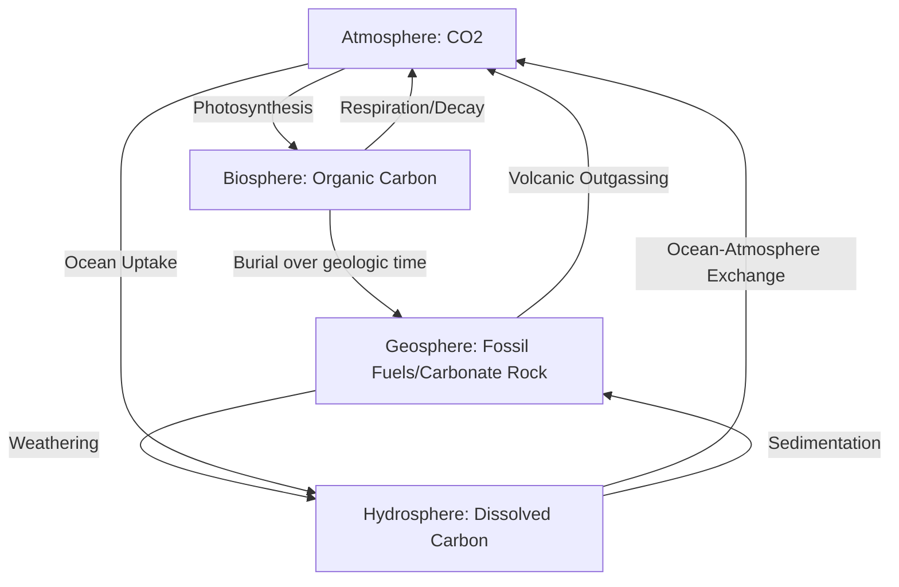

## Spheres of the Earth System

### Overview

The Earth system is conventionally divided into four major interacting spheres: the **geosphere** (lithosphere and interior), **hydrosphere**, **atmosphere**, and **biosphere**. Some frameworks add the **cryosphere** (ice and snow) and **anthroposphere** (human systems) as distinct subsystems given their growing significance in Earth system science. Each sphere represents a physically and chemically distinct domain, but none functions in isolation — matter and energy continuously cycle across boundaries through processes such as the water cycle, carbon cycle, and plate tectonics.

### The Geosphere

**Definition**: The geosphere comprises all solid and molten rock material of the Earth, from the surface crust to the innermost core.

**Structure (by composition)**:

- **Crust**: Thin outermost layer; oceanic crust (~5–10 km, basaltic, denser) and continental crust (~30–50 km, granitic, less dense)
- **Mantle**: Silicate rock extending to ~2,900 km depth; includes the rigid lithospheric mantle and the ductile asthenosphere below it
- **Outer core**: Liquid iron-nickel alloy, ~2,900–5,150 km depth; convection here generates Earth's magnetic field via the geodynamo
- **Inner core**: Solid iron-nickel, ~5,150–6,371 km depth; solid despite extreme temperature due to immense pressure

**Structure (by mechanical behavior)**:

- **Lithosphere**: Rigid outer shell (crust + uppermost mantle), broken into tectonic plates
- **Asthenosphere**: Partially molten, ductile layer allowing plate motion

**Key Points**:

- Plate tectonics drives the geosphere's interaction with other spheres — volcanism releases gases into the atmosphere, weathering draws down atmospheric CO₂, and seafloor spreading recycles hydrospheric water into the mantle via subduction.
- Radioactive decay of isotopes (uranium-238, thorium-232, potassium-40) in the mantle and crust is the primary source of Earth's internal heat driving mantle convection [Inference: precise heat-source proportions vary by model and are subject to ongoing geophysical research].

**Example**: A volcanic eruption exemplifies geosphere-atmosphere coupling — magma (geosphere) releases sulfur dioxide and CO₂ into the atmosphere, which can alter regional or global climate for months to years depending on eruption magnitude and altitude reached by ejecta.

### The Hydrosphere

**Definition**: All water on, under, and above Earth's surface, in liquid, solid, and vapor forms.

**Components**:

- **Oceans**: ~96.5% of total water volume; average salinity ~35 ppt
- **Ice sheets and glaciers**: ~1.7% of total water (often classified separately as the cryosphere)
- **Groundwater**: Stored in aquifers within porous/fractured rock
- **Surface freshwater**: Rivers, lakes, wetlands (<0.01% of total water despite high ecological importance)
- **Atmospheric water vapor**: Small in volume but critical for weather and the water cycle

**Key Points**:

- The hydrologic (water) cycle links the hydrosphere to all other spheres through evaporation, transpiration, condensation, precipitation, infiltration, and runoff.
- Ocean currents (thermohaline circulation) redistribute heat globally, moderating climate — a slowdown in this circulation is linked to significant regional climate shifts [Inference: the magnitude and timing of future thermohaline changes remain an active area of climate research].
- Residence time varies drastically by reservoir: atmospheric water averages ~9 days, while deep groundwater and glacial ice can persist for thousands of years.

### The Atmosphere

**Definition**: The gaseous envelope surrounding Earth, held in place by gravity.

**Composition (dry air, by volume)**:

- Nitrogen (N₂): ~78%
- Oxygen (O₂): ~21%
- Argon (Ar): ~0.93%
- Carbon dioxide (CO₂): ~0.04% (rising due to anthropogenic emissions)
- Trace gases and variable water vapor (0–4%)

**Layered Structure (by temperature profile)**:

- **Troposphere** (0–~12 km): Weather occurs here; temperature decreases with altitude
- **Stratosphere** (~12–50 km): Contains the ozone layer; temperature increases with altitude due to UV absorption by ozone
- **Mesosphere** (~50–85 km): Coldest layer; most meteors burn up here
- **Thermosphere** (~85–600 km): Temperature increases sharply with altitude; hosts the ionosphere and auroras
- **Exosphere** (~600 km and beyond): Gradual transition to space; particles can escape Earth's gravity

**Key Points**:

- The atmosphere regulates planetary temperature via the greenhouse effect, in which gases like CO₂, methane, and water vapor absorb and re-emit longwave radiation.
- Atmospheric circulation (Hadley, Ferrel, and Polar cells) redistributes heat from equator to poles, driven by differential solar heating and modified by the Coriolis effect.

### The Biosphere

**Definition**: The sum of all living organisms and the zones of Earth (parts of the geosphere, hydrosphere, and atmosphere) that support life.

**Extent**: Ranges from ocean trenches (>10 km depth) to the upper troposphere, though the vast majority of biomass is concentrated within a much narrower band near the surface.

**Key Points**:

- The biosphere actively modifies other spheres: photosynthetic organisms shaped the Great Oxidation Event, fundamentally altering the early atmosphere from anoxic to oxygen-rich.
- Biogeochemical cycles (carbon, nitrogen, phosphorus, sulfur) move essential elements between the biosphere and the geosphere, hydrosphere, and atmosphere.
- Ecosystems function as feedback regulators — e.g., forests sequester atmospheric carbon; ocean phytoplankton produce a substantial share of atmospheric oxygen.

### The Cryosphere (Extended Classification)

**Definition**: All frozen water on Earth — glaciers, ice sheets, sea ice, permafrost, and snow cover.

**Key Points**:

- Ice-albedo feedback: bright ice/snow reflects solar radiation; as it melts, darker surfaces (ocean, soil) absorb more heat, accelerating further melting.
- Permafrost thaw can release stored organic carbon as CO₂ and methane, representing a potential feedback that could amplify warming trends [Inference: the magnitude and timing of large-scale permafrost carbon release is an active research question with significant uncertainty].

### Interactions Between Spheres

Earth system science emphasizes that these spheres are not isolated but tightly coupled through continuous exchanges of matter and energy.

| Interaction | Example Process |
| --- | --- |
| Geosphere ↔ Atmosphere | Volcanic outgassing; silicate weathering consuming CO₂ |
| Geosphere ↔ Hydrosphere | Erosion, sediment transport, groundwater-rock interaction |
| Atmosphere ↔ Hydrosphere | Evaporation, precipitation, ocean-atmosphere heat exchange (e.g., El Niño) |
| Biosphere ↔ Atmosphere | Photosynthesis/respiration exchanging O₂ and CO₂ |
| Biosphere ↔ Hydrosphere | Nutrient cycling in aquatic ecosystems |
| Biosphere ↔ Geosphere | Fossil fuel formation; bioweathering of rock |

**Diagram: Sphere Interaction Overview (svg_diagram)**

<svg xmlns="http://www.w3.org/2000/svg" viewBox="0 0 640 640">
<text x="320" y="30" text-anchor="middle" font-size="18" font-weight="bold" fill="#1a1a1a">Spheres of the Earth System (svg_diagram)</text>
<circle cx="320" cy="340" r="130" fill="#fde68a" stroke="#b45309" stroke-width="2" />
<text x="320" y="345" text-anchor="middle" font-size="16" font-weight="bold" fill="#7c2d12">Geosphere</text>
<circle cx="220" cy="230" r="110" fill="#93c5fd" stroke="#1d4ed8" stroke-width="2" fill-opacity="0.75" />
<text x="180" y="180" text-anchor="middle" font-size="16" font-weight="bold" fill="#1e3a8a">Hydrosphere</text>
<circle cx="420" cy="230" r="110" fill="#bbf7d0" stroke="#15803d" stroke-width="2" fill-opacity="0.75" />
<text x="460" y="180" text-anchor="middle" font-size="16" font-weight="bold" fill="#14532d">Atmosphere</text>
<circle cx="320" cy="420" r="90" fill="#fca5a5" stroke="#b91c1c" stroke-width="2" fill-opacity="0.75" />
<text x="320" y="500" text-anchor="middle" font-size="16" font-weight="bold" fill="#7f1d1d">Biosphere</text>

<text x="320" y="290" text-anchor="middle" font-size="11" fill="`#374151`">Weathering</text>

<text x="270" y="230" text-anchor="middle" font-size="11" fill="`#374151`">Evaporation /</text>

<text x="270" y="245" text-anchor="middle" font-size="11" fill="`#374151`">Precipitation</text>

<text x="380" y="230" text-anchor="middle" font-size="11" fill="`#374151`">Gas Exchange</text>

<text x="320" y="400" text-anchor="middle" font-size="11" fill="`#374151`">Photosynthesis /</text>

<text x="320" y="413" text-anchor="middle" font-size="11" fill="`#374151`">Respiration</text>

<text x="320" y="600" text-anchor="middle" font-size="12" fill="`#4b5563`" font-style="italic">Overlapping regions represent zones of continuous matter/energy exchange</text>

</svg>

**Cycle Diagram: Carbon Movement Across Spheres**

### Earth System as a Complex System

**Key Points**:

- Feedback loops can be **positive** (amplifying change, e.g., ice-albedo feedback) or **negative** (stabilizing, e.g., increased plant growth under higher CO₂ partially offsetting atmospheric CO₂ rise, known as CO₂ fertilization).
- The concept of **Earth system science** emerged in the late 20th century, integrating geology, oceanography, atmospheric science, and ecology to study Earth holistically rather than as separate disciplines.
- Human activity is increasingly treated as a distinct driving force, leading some scientists to propose the **Anthroposphere** as a fifth sphere, reflecting humanity's role in altering atmospheric composition, land cover, and biogeochemical cycles at a planetary scale.

### Practical Example: Hurricane Formation as Multi-Sphere Interaction

A hurricane demonstrates integrated sphere interaction:

1. **Hydrosphere**: Warm ocean water (>26.5°C) provides latent heat energy through evaporation.
2. **Atmosphere**: Warm, moist air rises, condenses (releasing latent heat), and organizes under low wind shear; Coriolis effect induces rotation.
3. **Geosphere**: Landfall interaction — storm surge reshapes coastlines; friction over land disrupts the storm's energy source.
4. **Biosphere**: Coastal ecosystems (mangroves, reefs) can buffer storm surge impact; storms redistribute nutrients and reshape habitats.

### Related Topics

- Plate Tectonics and Continental Drift
- The Rock Cycle
- The Hydrologic (Water) Cycle
- Biogeochemical Cycles (Carbon, Nitrogen, Phosphorus)
- Atmospheric Circulation and Global Wind Patterns
- Ocean Currents and Thermohaline Circulation
- Earth's Energy Budget and the Greenhouse Effect
- Cryosphere Dynamics and Ice-Albedo Feedback
- Earth System Feedback Loops (Positive and Negative)
- The Anthropocene and Human Impact on Earth Systems