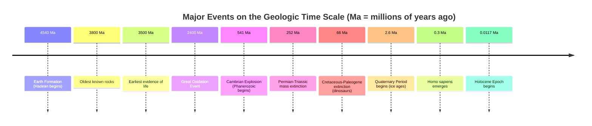

## Scales of Space and Time

### Overview

Earth science requires reasoning across scales that span many orders of magnitude — from atomic-scale mineral bonding to the size of the observable universe, and from femtosecond chemical reactions to the 4.54-billion-year age of the Earth. Developing fluency in these scales is foundational because many Earth processes (plate motion, mountain building, climate change) are imperceptible on human timeframes yet produce dramatic cumulative effects. This topic covers spatial scale, temporal scale, the geologic time scale, and the methods used to measure and reason across both.

### Spatial Scales in Earth Science

**Key Points**:

- Spatial scale in Earth science ranges from microscopic (mineral crystal lattices, ~$10^{-10}$ m) to planetary and cosmic (Earth's diameter ~$1.27 \times 10^7$ m; observable universe ~$8.8 \times 10^{26}$ m).
- Different subdisciplines operate natively at different scales: mineralogy/crystallography at the nanometer-to-millimeter scale; structural geology and geomorphology at the meter-to-kilometer scale; plate tectonics and oceanography at the scale of thousands of kilometers; planetary/astronomical Earth science at scales beyond Earth itself.

**Representative Spatial Scale Table**:

| Scale | Order of Magnitude (m) | Example |
| --- | --- | --- |
| Atomic/crystal lattice | $10^{-10}$ | Silicate mineral bonds |
| Mineral grain | $10^{-3}$ | Quartz crystal in sandstone |
| Hand sample/outcrop | $10^{0}$ – $10^{1}$ | Rock exposure at a roadcut |
| Landform | $10^{2}$ – $10^{4}$ | Volcano, river valley |
| Regional/tectonic plate | $10^{5}$ – $10^{7}$ | Pacific Plate |
| Planetary | $10^{7}$ | Earth's circumference (~$4.0 \times 10^7$ m) |
| Solar system | $10^{11}$ – $10^{13}$ | Earth-Sun distance (~$1.5 \times 10^{11}$ m) |

**Example**: A geologist studying a fault must simultaneously consider the microscopic scale (mineral shear fabrics under a microscope), the outcrop scale (visible fault plane), and the regional scale (the fault's role within a broader plate boundary system) — a single feature interpreted across nested spatial scales.

### Temporal Scales in Earth Science

**Key Points**:

- Earth science temporal scales range from instantaneous geophysical events (seismic wave propagation, milliseconds to minutes) to deep time processes spanning billions of years (mountain building, supercontinent cycles).
- **Human/historical timescale**: seconds to centuries — earthquakes, floods, instrumental climate records.
- **Geomorphic timescale**: decades to ~$10^6$ years — river meander migration, glacial advance/retreat, soil formation.
- **Tectonic timescale**: $10^5$ to $10^8$ years — mountain building (orogeny), ocean basin opening/closing, supercontinent assembly and breakup (the Wilson Cycle, ~300–500 million year periodicity).
- **Deep/geologic timescale**: $10^8$ to $10^9$+ years — the full 4.54-billion-year history of Earth, evolution of life, atmospheric composition change.

**Example**: The Atlantic Ocean has been widening at roughly 2–3 cm per year (comparable to fingernail growth rate) since the breakup of Pangaea roughly 180 million years ago — an imperceptibly slow process on human timescales that has produced an ocean basin thousands of kilometers wide over geologic time.

### The Geologic Time Scale

**Definition**: The standardized chronological framework subdividing Earth's 4.54-billion-year history into hierarchical units based on rock strata (chronostratigraphy) and time (geochronology).

**Hierarchy (largest to smallest)**:

1. **Eon** — largest unit (e.g., Hadean, Archean, Proterozoic, Phanerozoic)
2. **Era** — subdivides eons (e.g., Paleozoic, Mesozoic, Cenozoic)
3. **Period** — subdivides eras (e.g., Jurassic, Cretaceous)
4. **Epoch** — subdivides periods (e.g., Pleistocene, Holocene)
5. **Age** — smallest formal unit, subdivides epochs

**Major Eons and Approximate Boundaries**:

| Eon | Time Range (Ma = million years ago) | Notable Feature |
| --- | --- | --- |
| Hadean | 4,540–4,000 Ma | Earth formation; no rock record preserved |
| Archean | 4,000–2,500 Ma | Oldest continental crust; earliest life (prokaryotes) |
| Proterozoic | 2,500–541 Ma | Great Oxidation Event; first eukaryotes; multicellular life |
| Phanerozoic | 541 Ma–present | Abundant fossil record; complex life diversification |

**Key Points**:

- Boundaries are defined by **GSSPs (Global Boundary Stratotype Section and Points)**, physical rock locations marking the internationally ratified base of a time unit, maintained by the International Commission on Stratigraphy (ICS).
- Some boundaries are instead defined by a **GSSA (Global Standard Stratigraphic Age)** — a numerically defined age used when no suitable physical rock marker exists (e.g., the Hadean-Archean boundary).
- Major boundaries often correspond to mass extinction events or fundamental shifts in the fossil record — the Permian-Triassic boundary (~252 Ma) marks the largest mass extinction in Earth's history, and the Cretaceous-Paleogene boundary (~66 Ma) marks the extinction of non-avian dinosaurs.

**Diagram: Geologic Time Scale Nested Hierarchy (svg_diagram)**

<svg xmlns="http://www.w3.org/2000/svg" viewBox="0 0 640 420">
<text x="320" y="30" text-anchor="middle" font-size="18" font-weight="bold" fill="#1a1a1a">Geologic Time Scale Hierarchy (svg_diagram)</text>
<rect x="40" y="60" width="560" height="320" fill="#fef3c7" stroke="#92400e" stroke-width="2" />
<text x="60" y="85" font-size="14" font-weight="bold" fill="#78350f">EON</text>
<rect x="70" y="100" width="500" height="260" fill="#fed7aa" stroke="#c2410c" stroke-width="2" />
<text x="90" y="125" font-size="13" font-weight="bold" fill="#7c2d12">ERA</text>
<rect x="100" y="140" width="440" height="200" fill="#fecaca" stroke="#b91c1c" stroke-width="2" />
<text x="120" y="165" font-size="13" font-weight="bold" fill="#7f1d1d">PERIOD</text>
<rect x="130" y="180" width="380" height="140" fill="#fbcfe8" stroke="#be185d" stroke-width="2" />
<text x="150" y="205" font-size="13" font-weight="bold" fill="#831843">EPOCH</text>
<rect x="160" y="220" width="320" height="80" fill="#e9d5ff" stroke="#7e22ce" stroke-width="2" />
<text x="180" y="245" font-size="13" font-weight="bold" fill="#581c87">AGE</text>
<text x="320" y="270" text-anchor="middle" font-size="11" fill="#4c1d95">(Smallest formal unit)</text>

<text x="320" y="400" text-anchor="middle" font-size="12" fill="`#4b5563`" font-style="italic">Each level subdivides the one above it, largest to smallest</text>

</svg>

### Methods of Measuring Geologic Time

**Relative Dating** (establishes sequence, not numerical age):

- **Law of Superposition**: In undeformed sedimentary sequences, older layers lie beneath younger layers.
- **Principle of Original Horizontality**: Sediments are deposited in horizontal layers; tilted layers indicate later deformation.
- **Principle of Cross-Cutting Relationships**: A feature that cuts across another (e.g., a fault or intrusion) is younger than the feature it cuts.
- **Principle of Faunal Succession**: Fossil assemblages succeed one another in a recognizable, predictable order, allowing correlation between rock units in different locations.

**Absolute (Numerical) Dating**:

- **Radiometric dating**: Uses the known, constant decay rate (half-life) of radioactive isotopes to calculate elapsed time since a mineral crystallized. Common systems include:
  - Uranium-lead (U-Pb): half-life ~4.47 billion years (U-238); used for very old rocks (zircon crystals)
  - Potassium-argon (K-Ar) / Argon-argon (Ar-Ar): used for volcanic rocks
  - Carbon-14 (¹⁴C): half-life ~5,730 years; effective only up to ~50,000–60,000 years, used for recent organic material
- **Radiometric dating formula**:

$$N(t) = N_0 e^{-\lambda t}$$

where $N(t)$ is the remaining parent isotope quantity, $N_0$ is the initial quantity, $\lambda$ is the decay constant, and $t$ is elapsed time.

- **Dendrochronology**: Counting/cross-matching tree growth rings; effective for the past ~10,000 years with well-developed chronologies.
- **Ice core stratigraphy**: Annual layers in glacial ice, combined with trapped gas bubbles, provide climate and atmospheric records extending back hundreds of thousands of years (e.g., Antarctic cores).
- **Varve counting**: Annual sediment layer counting in glacial lake deposits.

**Key Points**:

- Radiometric dating relies on the assumption that decay rates are constant and unaffected by ordinary chemical/physical conditions, which has been extensively verified experimentally [Inference: extreme conditions such as those in specific astrophysical or laboratory contexts have prompted minor rate-variation studies, but these do not affect standard geochronological applications].
- Multiple independent dating methods applied to the same material and cross-checked against each other (cross-validation) strengthen confidence in numerical age assignments.

### Reasoning Across Scales: The "Deep Time" Problem

**Key Points**:

- Human cognition is poorly adapted to intuitively grasp durations of millions or billions of years; this is often called the **"deep time" problem**, a term popularized by John McPhee.
- A common pedagogical device is compressing Earth's 4.54-billion-year history into a single calendar year (the "Cosmic Calendar" or "Geologic Year" analogy): on this scale, humans (Homo sapiens) appear only in the final minutes of December 31st, while the Cambrian Explosion occurs in mid-December and the origin of life occurs in early-to-mid February.
- This compression illustrates that recorded human history — millennia — represents an infinitesimally small fraction of Earth's total history, reinforcing why direct observation must be supplemented with proxy records (rock strata, isotopes, fossils) to reconstruct Earth's past.

**Example**: If Earth's history were scaled to a single 24-hour day starting at midnight, the first life would appear around 4:00 AM, complex multicellular life would not appear until roughly 9:30 PM, dinosaurs would go extinct at about 11:41 PM, and all of recorded human civilization would occupy less than the final half-second before midnight.

### Scale Diagram: Timeline of Major Earth Events

### Interconnection of Spatial and Temporal Scales

**Key Points**:

- Spatial and temporal scales are often correlated in Earth processes: small-scale, short-duration events (a single earthquake rupture, seconds) are nested within larger-scale, longer-duration processes (a fault system accumulating strain over centuries, itself part of plate tectonic motion over millions of years).
- This nested relationship is sometimes formalized in **rate-versus-scale** thinking: processes with larger spatial extents generally (though not universally) require correspondingly longer timescales to produce comparable amounts of change [Inference: this is a general heuristic rather than a strict physical law, since some large-scale events, such as bolide impacts, occur nearly instantaneously].

### Related Topics

- Radiometric Dating Techniques and Isotope Systems
- Stratigraphic Principles (Superposition, Correlation)
- The Geologic Time Scale: Eons, Eras, and Periods in Detail
- Plate Tectonic Rates and the Wilson Cycle
- Mass Extinction Events Through Earth History
- Paleoclimate Proxies (Ice Cores, Varves, Sediment Records)
- Uniformitarianism vs. Catastrophism in Earth History
- The Age of the Solar System and Earth's Formation
- Dendrochronology and Other Annual-Layer Dating Methods