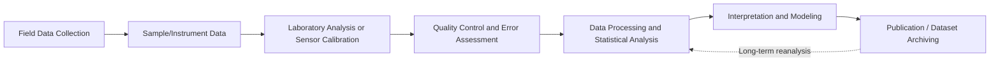

## Measurement and Data in Earth Science

### Overview

Earth science relies on a diverse toolkit of measurement techniques, ranging from direct field sampling to remote satellite sensing, to quantify processes that operate across vastly different spatial and temporal scales. Because many Earth phenomena cannot be directly observed or experimentally controlled (e.g., core dynamics, deep-time climate), measurement in this field often depends on proxy data, indirect inference, and statistical treatment of uncertainty. This topic covers measurement types, common instrumentation, data collection methods, proxy records, error/uncertainty handling, and data representation.

### Categories of Measurement

**Direct Measurement**:

- Physical sampling and instrumentation applied directly to the object of study (e.g., a thermometer measuring air temperature, a seismometer recording ground motion, a core sample extracted from an ice sheet or ocean floor).

**Indirect/Proxy Measurement**:

- Inference of a variable from a correlated, measurable substitute when the variable of interest cannot be measured directly (e.g., oxygen isotope ratios in ice cores as a proxy for past atmospheric temperature).

**Remote Sensing**:

- Measurement from a distance, typically via satellite or aircraft-based sensors, using electromagnetic radiation (visible, infrared, microwave, radar) reflected or emitted from Earth's surface or atmosphere.

**Key Points**:

- The choice of measurement type is often dictated by the temporal/spatial scale under study — instrumental records are limited to roughly the last 150–200 years, while proxy records extend measurement capability across geologic time.
- Combining multiple measurement types (multi-proxy approaches) increases confidence in reconstructions, particularly for paleoclimate and paleoenvironmental studies.

### Common Instrumentation by Subdiscipline

| Subdiscipline | Instrument | Measures |
| --- | --- | --- |
| Seismology | Seismometer | Ground motion / seismic waves |
| Meteorology | Thermometer, barometer, hygrometer, anemometer | Temperature, pressure, humidity, wind speed |
| Oceanography | CTD sensor (Conductivity, Temperature, Depth) | Salinity, temperature, depth profile |
| Geodesy | GNSS/GPS receiver | Surface displacement, plate motion |
| Hydrology | Stream gauge, piezometer | Streamflow discharge, groundwater level |
| Geochronology | Mass spectrometer | Isotopic ratios for radiometric dating |
| Volcanology | Tiltmeter, gas analyzer (spectrometer) | Ground deformation, volcanic gas emissions |
| Climatology | Ice core drill, dendrochronometer | Paleoclimate proxy layers |

**Example**: A **CTD sensor** lowered from a research vessel continuously records conductivity (used to derive salinity), temperature, and pressure (used to derive depth) as it descends, producing a vertical ocean profile used to study water mass structure and ocean stratification.

### Remote Sensing and Satellite Data

**Key Points**:

- Remote sensing platforms include polar-orbiting satellites (e.g., Landsat, Sentinel), geostationary satellites (e.g., GOES for weather), and airborne LiDAR/radar systems.
- **Passive sensors** detect naturally reflected or emitted radiation (e.g., optical imagery, thermal infrared); **active sensors** emit their own signal and measure the return (e.g., radar altimetry, LiDAR).
- **Synthetic Aperture Radar (SAR)** and **InSAR (Interferometric SAR)** measure ground surface deformation at millimeter-scale precision, widely used to monitor volcanic inflation, earthquake displacement, and land subsidence.
- **GRACE/GRACE-FO** satellites measure minute variations in Earth's gravity field, used to track changes in ice sheet mass, groundwater storage, and ocean mass.

**Example**: Landsat's continuous imaging record since 1972 allows scientists to quantify decades of land cover change, such as deforestation rates or glacier retreat, at consistent spatial resolution.

### Proxy Data in Earth Science

**Definition**: Preserved physical, chemical, or biological materials that record environmental conditions indirectly, used to reconstruct past conditions beyond the instrumental record.

**Common Proxies**:

- **Ice cores**: Trapped air bubbles record past atmospheric gas composition; oxygen isotope ratios ($\delta^{18}O$) indicate past temperature.
- **Tree rings (dendrochronology)**: Ring width and density reflect annual growing conditions (temperature, precipitation).
- **Sediment cores**: Layering, grain size, and microfossil (e.g., foraminifera) assemblages reflect past depositional environments.
- **Coral bands**: Annual growth bands and geochemical composition reflect sea surface temperature and ocean chemistry.
- **Speleothems (cave formations)**: Isotopic composition of stalagmites/stalactites reflects past precipitation and temperature.

**Key Points**:

- Proxy data requires a **transfer function** — a calibrated relationship between the proxy signal and the environmental variable of interest, typically established using modern instrumental data as a calibration baseline.
- Proxy interpretation carries inherent uncertainty from factors such as post-depositional alteration, biological variability, and calibration limitations [Inference: the degree of uncertainty varies significantly depending on proxy type, preservation quality, and calibration robustness].

### Data Types and Structures

**Key Points**:

- **Spatial data**: Represented as either **vector** (points, lines, polygons — e.g., fault traces, sample locations) or **raster** (gridded cells — e.g., satellite imagery, digital elevation models).
- **Time series data**: Sequential measurements at regular or irregular intervals (e.g., daily temperature records, continuous seismograph output).
- **Geospatial data formats**: Common standards include GeoTIFF (raster), Shapefile and GeoJSON (vector), and NetCDF (multidimensional gridded climate/ocean data).
- **Digital Elevation Models (DEMs)**: Raster representations of terrain surface elevation, commonly derived from LiDAR, photogrammetry, or radar interferometry (e.g., SRTM — Shuttle Radar Topography Mission).

### Measurement Error and Uncertainty

**Key Points**:

- **Precision** refers to the reproducibility of repeated measurements; **accuracy** refers to closeness to the true value. A measurement can be precise without being accurate (systematic bias) and vice versa.
- **Systematic error (bias)**: Consistent deviation from the true value due to instrument calibration issues or methodological flaws; can often be corrected once identified.
- **Random error**: Unpredictable variation from measurement to measurement, generally reduced by increasing sample size and averaging.
- **Uncertainty propagation**: When derived quantities are calculated from multiple measured variables, individual measurement uncertainties combine and must be tracked through calculations.
- Radiometric dates and other quantitative results are conventionally reported with an associated uncertainty range (e.g., "$66.0 \pm 0.1$ million years"), reflecting the statistical confidence interval of the measurement rather than absolute certainty.

**Example**: A stream gauge that consistently reads 5% higher than actual discharge due to a calibration drift exhibits systematic error; day-to-day fluctuations in that gauge's reading under identical flow conditions, caused by sensor noise, exhibit random error.

### Data Collection Methods

**Field-Based Methods**:

- **Sampling**: Physical collection of rock, sediment, water, ice, or biological specimens for laboratory analysis.
- **Field surveys**: Direct observation and measurement (e.g., structural geology strike/dip measurements using a compass-clinometer, or topographic surveying with a total station).
- **Monitoring networks**: Continuous, spatially distributed sensor arrays (e.g., seismograph networks, weather station networks, GNSS geodetic networks) that provide long-term, real-time data streams.

**Laboratory-Based Methods**:

- **Mass spectrometry**: Determines isotopic ratios for dating and provenance studies.
- **X-ray diffraction (XRD)**: Identifies mineral composition based on crystal lattice diffraction patterns.
- **Spectroscopy**: Determines chemical composition based on the interaction of matter with electromagnetic radiation.

### Data Workflow: From Field to Interpretation

### Data Visualization in Earth Science

**Key Points**:

- **Maps**: Represent spatial distribution of variables (e.g., seismic hazard maps, geologic maps, choropleth maps of precipitation).
- **Cross-sections**: Represent subsurface structure along a vertical transect, commonly used in structural geology and stratigraphy.
- **Time-series plots**: Represent temporal trends (e.g., global temperature anomaly graphs, river discharge hydrographs).
- **Stratigraphic columns**: Represent vertical sequences of rock layers with associated age and lithology information.

**Diagram: Measurement-to-Interpretation Pipeline (svg_diagram)**

<svg xmlns="http://www.w3.org/2000/svg" viewBox="0 0 640 300">
<text x="320" y="30" text-anchor="middle" font-size="18" font-weight="bold" fill="#1a1a1a">Measurement Data Pipeline (svg_diagram)</text>
<rect x="20" y="80" width="140" height="60" rx="8" fill="#bfdbfe" stroke="#1d4ed8" stroke-width="2" />
<text x="90" y="115" text-anchor="middle" font-size="13" fill="#1e3a8a">Raw Measurement</text>
<rect x="200" y="80" width="140" height="60" rx="8" fill="#bbf7d0" stroke="#15803d" stroke-width="2" />
<text x="270" y="105" text-anchor="middle" font-size="13" fill="#14532d">Calibration &amp;</text>
<text x="270" y="122" text-anchor="middle" font-size="13" fill="#14532d">Error Correction</text>
<rect x="380" y="80" width="140" height="60" rx="8" fill="#fde68a" stroke="#b45309" stroke-width="2" />
<text x="450" y="105" text-anchor="middle" font-size="13" fill="#78350f">Processed</text>
<text x="450" y="122" text-anchor="middle" font-size="13" fill="#78350f">Dataset</text>
<rect x="200" y="200" width="140" height="60" rx="8" fill="#fca5a5" stroke="#b91c1c" stroke-width="2" />
<text x="270" y="235" text-anchor="middle" font-size="13" fill="#7f1d1d">Scientific Interpretation</text>
<path d="M160 110 L200 110" stroke="#374151" stroke-width="2" marker-end="url(#arrow1)" />
<path d="M340 110 L380 110" stroke="#374151" stroke-width="2" marker-end="url(#arrow1)" />
<path d="M450 140 L450 170 L270 170 L270 200" stroke="#374151" stroke-width="2" fill="none" marker-end="url(#arrow1)" />
</svg>

### Standards, Metadata, and Reproducibility

**Key Points**:

- **Metadata** (data describing data — collection date, location, instrument specifications, units, calibration method) is essential for data to be usable and comparable across studies and institutions.
- International standards bodies (e.g., the International Commission on Stratigraphy, World Meteorological Organization) establish measurement protocols and reference standards to ensure consistency across research groups and nations.
- Open data repositories (e.g., NOAA's National Centers for Environmental Information, USGS Earthquake Hazards Program databases) support reproducibility by archiving raw and processed datasets for public access.
- Reported measurement behavior and instrument performance may vary depending on manufacturer specifications, environmental deployment conditions, and calibration maintenance schedules.

### Related Topics

- Statistical Methods for Earth Science Data (Regression, Time-Series Analysis)
- Geographic Information Systems (GIS) Fundamentals
- Remote Sensing Platforms and Sensor Types
- Paleoclimate Proxy Calibration Techniques
- Seismic Network Design and Earthquake Monitoring
- Digital Elevation Models and Terrain Analysis
- Error Analysis and Uncertainty Quantification
- Geochronological Dating Methods
- Data Standards and Metadata in Environmental Science