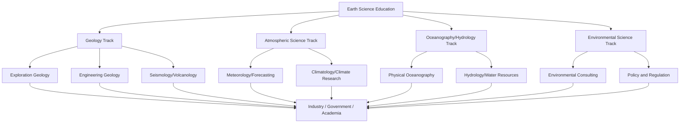

## Careers and Applications of Earth Science

### Overview

Earth science translates into a wide array of professional applications across resource management, hazard mitigation, environmental protection, engineering, and policy. Careers in the field span government agencies, private industry, academia, and non-profit organizations, drawing on core Earth science subdisciplines — geology, meteorology, oceanography, hydrology, and environmental science — to address practical societal needs. This topic surveys career pathways, required competencies, industry sectors, and real-world applications.

### Core Career Pathways by Subdiscipline

**Geology-Based Careers**:

- **Exploration geologist**: Locates and assesses mineral, oil, and gas deposits for extraction industries.
- **Engineering geologist**: Evaluates ground conditions for construction, dam, tunnel, and infrastructure projects.
- **Environmental geologist**: Assesses soil and groundwater contamination, land-use suitability, and site remediation needs.
- **Seismologist**: Studies earthquake mechanics, monitors seismic activity, and contributes to hazard assessment and building code development.
- **Volcanologist**: Monitors active volcanoes, assesses eruption hazards, and studies volcanic processes.
- **Paleontologist**: Studies fossil records to reconstruct past life and environments, often working in academia, museums, or petroleum exploration.

**Atmospheric and Climate Careers**:

- **Meteorologist**: Forecasts weather using atmospheric data and numerical models; works in broadcast media, aviation, agriculture, or government agencies.
- **Climatologist**: Studies long-term climate patterns, variability, and change; contributes to climate modeling and policy analysis.
- **Atmospheric research scientist**: Conducts research on atmospheric chemistry, air quality, and climate dynamics, often in academic or government research settings.

**Ocean and Water-Based Careers**:

- **Oceanographer**: Studies physical, chemical, biological, or geological aspects of oceans; supports fisheries management, shipping, and climate research.
- **Hydrologist**: Manages water resources, models streamflow and groundwater systems, and supports flood forecasting and water supply planning.
- **Hydrogeologist**: Specializes in groundwater systems, aquifer characterization, and contamination assessment.

**Environmental and Policy Careers**:

- **Environmental consultant**: Conducts site assessments, environmental impact studies, and regulatory compliance work for industry and government clients.
- **Geospatial analyst / GIS specialist**: Applies geographic information systems to map, model, and analyze spatial Earth science data across virtually all subdisciplines.
- **Science policy analyst**: Translates Earth science research into policy recommendations for government agencies, NGOs, or international bodies.

**Key Points**:

- Many Earth science careers are inherently interdisciplinary — a hydrogeologist may draw on chemistry, fluid mechanics, and geology simultaneously; a climatologist may integrate atmospheric physics, oceanography, and statistics.
- Career paths often bridge academic research and applied practice; the same foundational training (e.g., a geology degree) can lead to careers as varied as academic research, resource exploration, hazard mitigation, or environmental regulation.

### Industry Sectors Employing Earth Scientists

| Sector | Example Roles | Typical Employers |
| --- | --- | --- |
| Energy and resources | Exploration geologist, geophysicist | Oil/gas companies, mining companies |
| Government and public service | Seismologist, hydrologist, meteorologist | USGS, NOAA, state geological surveys |
| Environmental consulting | Environmental geologist, remediation specialist | Private consulting firms |
| Construction and engineering | Engineering geologist, geotechnical engineer | Civil engineering firms, infrastructure developers |
| Academia and research | Professor, research scientist | Universities, research institutes |
| Insurance and risk assessment | Catastrophe modeler, risk analyst | Insurance/reinsurance companies |
| Agriculture | Agroclimatologist, soil scientist | Agricultural companies, extension services |
| Technology | Remote sensing analyst, data scientist | Geospatial tech companies, satellite firms |

**Example**: Catastrophe modelers in the insurance industry apply seismology, meteorology, and statistical modeling to estimate the probability and financial impact of natural disasters (earthquakes, hurricanes, floods), directly informing insurance premium pricing and reinsurance risk pooling.

### Practical Applications of Earth Science

**Natural Hazard Mitigation**:

- Seismic hazard maps inform building codes and land-use zoning in earthquake-prone regions.
- Volcanic monitoring networks (seismometers, gas sensors, satellite deformation tracking) provide early warning for eruptions.
- Flood forecasting models, built on hydrological data, support emergency planning and infrastructure design.
- Landslide susceptibility mapping guides development restrictions in unstable terrain.

**Resource Exploration and Management**:

- Geophysical surveying (seismic reflection, gravity, magnetic surveys) locates subsurface oil, gas, and mineral deposits.
- Hydrogeological assessment guides sustainable groundwater extraction and aquifer management.
- Soil science supports agricultural productivity assessment and land management planning.

**Environmental Protection and Remediation**:

- Site characterization and contaminant transport modeling guide cleanup of polluted soil and groundwater (e.g., Superfund site remediation in the U.S.).
- Environmental impact assessments evaluate the potential effects of proposed construction, mining, or infrastructure projects before approval.

**Climate Science and Policy**:

- Climate modeling informs international policy frameworks (e.g., IPCC assessment reports) and national adaptation planning.
- Paleoclimate reconstruction provides historical context for evaluating the rate and magnitude of current climate change.

**Infrastructure and Engineering**:

- Geotechnical site investigation informs foundation design for buildings, bridges, and dams.
- Coastal geology informs erosion management and infrastructure resilience planning in vulnerable coastal zones.

**Example**: Before constructing a major dam, engineering geologists conduct extensive site investigation — assessing bedrock stability, fault proximity, seismic risk, and reservoir-induced seismicity potential — to ensure the structure's long-term safety and viability.

### Career Pathway Overview

### Educational and Skill Requirements

**Key Points**:

- Entry-level positions (e.g., field technician, junior environmental consultant) typically require a bachelor's degree in geology, environmental science, or a related Earth science field.
- Research-oriented and specialized roles (e.g., academic researcher, government research scientist, senior seismologist) typically require a graduate degree (M.S. or Ph.D.).
- Core technical competencies commonly include: field mapping and sampling techniques, GIS and remote sensing software proficiency, statistical and data analysis skills, and increasingly, programming/scripting (e.g., Python, R) for data processing and modeling.
- Professional licensure (e.g., Professional Geologist / P.G. certification in the United States) is often required for consulting or engineering geology roles involving public safety or regulatory sign-off; specific licensure requirements vary by jurisdiction.

**Example**: A student pursuing hydrogeology as a career path would typically combine coursework in geology and hydrology with training in groundwater flow modeling software (e.g., MODFLOW) and statistical analysis, positioning them for roles in environmental consulting, water utility management, or government water resource agencies.

### Emerging and Interdisciplinary Career Directions

**Key Points**:

- Growing integration of Earth science with data science and machine learning has created roles such as **geospatial data scientist** and **climate data analyst**, applying computational methods to large Earth observation datasets.
- Renewable energy expansion has created demand for Earth scientists in **geothermal resource assessment** and **site suitability analysis for wind/solar installations**.
- Climate adaptation and resilience planning has expanded demand for Earth scientists in urban planning, coastal management, and disaster risk reduction roles within both government and private sectors.
- Space and planetary science increasingly draws on Earth science training for **planetary geology** roles supporting exploration missions (e.g., Mars geology, lunar resource assessment) [Inference: the scale and structure of this job market segment is comparatively small and evolving alongside space exploration program funding].

### Diagram: Earth Science Application Domains (svg_diagram)

<svg xmlns="http://www.w3.org/2000/svg" viewBox="0 0 640 380">
<text x="320" y="30" text-anchor="middle" font-size="18" font-weight="bold" fill="#1a1a1a">Earth Science Application Domains (svg_diagram)</text>
<circle cx="320" cy="210" r="70" fill="#e0e7ff" stroke="#4338ca" stroke-width="2" />
<text x="320" y="205" text-anchor="middle" font-size="13" font-weight="bold" fill="#312e81">Earth</text>
<text x="320" y="222" text-anchor="middle" font-size="13" font-weight="bold" fill="#312e81">Science</text>
<circle cx="150" cy="120" r="65" fill="#fde68a" stroke="#b45309" stroke-width="2" fill-opacity="0.85" />
<text x="150" y="115" text-anchor="middle" font-size="12" font-weight="bold" fill="#78350f">Hazard</text>
<text x="150" y="130" text-anchor="middle" font-size="12" font-weight="bold" fill="#78350f">Mitigation</text>
<circle cx="490" cy="120" r="65" fill="#bbf7d0" stroke="#15803d" stroke-width="2" fill-opacity="0.85" />
<text x="490" y="115" text-anchor="middle" font-size="12" font-weight="bold" fill="#14532d">Resource</text>
<text x="490" y="130" text-anchor="middle" font-size="12" font-weight="bold" fill="#14532d">Exploration</text>
<circle cx="150" cy="300" r="65" fill="#fca5a5" stroke="#b91c1c" stroke-width="2" fill-opacity="0.85" />
<text x="150" y="295" text-anchor="middle" font-size="12" font-weight="bold" fill="#7f1d1d">Environmental</text>
<text x="150" y="310" text-anchor="middle" font-size="12" font-weight="bold" fill="#7f1d1d">Protection</text>
<circle cx="490" cy="300" r="65" fill="#bfdbfe" stroke="#1d4ed8" stroke-width="2" fill-opacity="0.85" />
<text x="490" y="295" text-anchor="middle" font-size="12" font-weight="bold" fill="#1e3a8a">Climate</text>
<text x="490" y="310" text-anchor="middle" font-size="12" font-weight="bold" fill="#1e3a8a">Policy</text>
</svg>

### Related Topics

- Geotechnical Engineering and Site Investigation Methods
- Natural Hazard Risk Assessment and Mitigation Planning
- Professional Licensure in Geology and Environmental Science
- GIS and Remote Sensing Applications in Industry
- Groundwater Resource Management and Hydrogeology
- Climate Policy and the Role of Scientific Assessment (IPCC)
- Environmental Impact Assessment Processes
- Renewable Energy Site Assessment (Geothermal, Wind, Solar)
- Planetary Geology and Space Exploration Applications