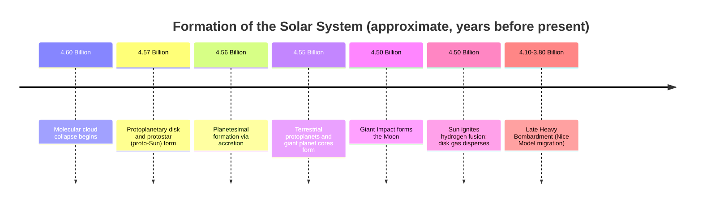

## Origin of the Solar System

### Overview

The prevailing scientific model for solar system formation is the **Nebular Hypothesis**, which explains the origin of the Sun, planets, moons, asteroids, and comets from the gravitational collapse of a single rotating cloud of gas and dust roughly 4.6 billion years ago. This model, refined continuously since its 18th-century origins, accounts for key observed features of the solar system — the near-coplanar, roughly circular orbits of the planets, the same direction of orbital and rotational motion (prograde motion) for most bodies, and the compositional gradient from rocky inner planets to gas/ice-dominated outer planets.

### Historical Development of the Model

**Key Points**:

- The Nebular Hypothesis originated with philosopher Immanuel Kant (1755) and mathematician Pierre-Simon Laplace (1796), who independently proposed that the solar system formed from a rotating, flattening cloud of gas.
- Early versions faced the **angular momentum problem**: the Sun contains ~99.8% of the solar system's mass but only about 2% of its angular momentum, a discrepancy the original hypothesis could not adequately explain.
- Modern solutions to the angular momentum problem invoke **magnetic braking** (magnetic field coupling between the young Sun and the surrounding disk transferring angular momentum outward) and the loss of high-angular-momentum material via disk winds and outflows [Inference: the precise relative contribution of each mechanism remains an active area of astrophysical modeling].
- The modern, refined framework is often called the **Solar Nebular Disk Model (SNDM)**.

### Stage 1: Molecular Cloud Collapse

**Key Points**:

- The solar system formed from a **giant molecular cloud (GMC)** — a large, cold (~10–20 K), diffuse region of gas (primarily hydrogen and helium) and dust within the interstellar medium.
- Gravitational collapse of a denser clump within the cloud is thought to have been triggered by an external disturbance, such as the shockwave from a nearby **supernova explosion** [Inference: this triggering mechanism is well-supported by isotopic evidence but remains one of several proposed triggers, alongside cloud-cloud collisions or spiral density waves].
- Evidence for a supernova trigger comes from the presence of short-lived radioactive isotope decay products (e.g., aluminum-26, iron-60) found in ancient meteorites, which could only have been produced and injected by a nearby massive star's death.
- As the cloud fragment collapsed under its own gravity, conservation of angular momentum caused it to spin faster and flatten into a rotating disk — analogous to a spinning figure skater pulling in their arms.

### Stage 2: Protoplanetary Disk Formation

**Definition**: The **protoplanetary disk** (or solar nebula) is the flattened, rotating disk of gas and dust that formed around the young, still-forming Sun (protostar) at its center.

**Key Points**:

- The central concentration of collapsing material became dense and hot enough to form the **protostar**, which would eventually ignite hydrogen fusion and become the Sun.
- The disk exhibited a strong **temperature gradient**: hot near the center (>1,500 K close to the protostar) and progressively colder toward the outer edges (<150 K beyond several astronomical units).
- This temperature gradient established the **frost line** (also called the snow line) — the distance from the Sun beyond which volatile compounds (water, ammonia, methane) could condense into ice. Inside the frost line, only rock and metal could condense; beyond it, ice-rich material was also available.
- In the modern solar system, the frost line is estimated to have been located at roughly 2.7–5 AU during the early formation period [Inference: the exact historical location is inferred from meteorite composition and disk modeling, as it cannot be directly observed retroactively].

### Stage 3: Planetesimal Formation (Accretion)

**Key Points**:

- Dust grains within the disk collided and stuck together through electrostatic forces and later, low-velocity gravitational attraction, gradually building up larger bodies.
- This process, called **accretion**, proceeded through a size hierarchy: dust grains (µm scale) → pebbles (cm scale) → planetesimals (km scale) → protoplanets (hundreds to thousands of km).
- The **streaming instability** is a leading mechanism proposed to explain the jump from small pebbles to kilometer-scale planetesimals, in which local concentrations of solid particles gravitationally clump together rapidly, bypassing a slower, less efficient growth phase [Inference: streaming instability is a well-supported model in current planet-formation research but is one of several competing/complementary mechanisms still being refined].
- Once planetesimals reached sufficient size (roughly >1 km), gravitational attraction between bodies became the dominant force driving further growth, a phase known as **runaway growth**.

### Stage 4: Terrestrial Planet Formation

**Key Points**:

- Inside the frost line, planetesimals composed primarily of rock and metal accreted into **protoplanets**, which then collided and merged over tens of millions of years to form the terrestrial planets (Mercury, Venus, Earth, Mars).
- This late-stage assembly involved giant impacts between Moon-to-Mars-sized protoplanets, with the **Giant Impact Hypothesis** for Earth's Moon formation being the most well-supported example — a Mars-sized protoplanet (often called Theia) is hypothesized to have collided with the proto-Earth roughly 4.5 billion years ago, ejecting debris that later coalesced into the Moon.
- Heat generated by accretion, radioactive decay, and giant impacts caused terrestrial planets to partially or fully melt, driving **planetary differentiation** — the separation of material by density into a core, mantle, and crust.

### Stage 5: Giant Planet Formation

**Key Points**:

- Beyond the frost line, the availability of ice in addition to rock and metal allowed planetesimals to grow much larger and faster, forming massive solid cores.
- The leading model for gas giant formation (Jupiter, Saturn) is **core accretion**: a solid core of roughly 10 Earth masses formed first, then gravitationally captured large envelopes of hydrogen and helium gas directly from the surrounding nebula before the gas dispersed.
- An alternative/competing model, **disk instability**, proposes that regions of the gas disk became gravitationally unstable and collapsed directly to form giant planets without first requiring a large solid core; this mechanism is considered more relevant to certain exoplanet systems and remains debated for the formation of Jupiter and Saturn specifically [Inference: the relative applicability of core accretion versus disk instability to our own solar system's giant planets is an unresolved area of ongoing research].
- Ice giants (Uranus, Neptune) are thought to have formed more slowly and accreted comparatively smaller gas envelopes, consistent with their lower hydrogen/helium content relative to Jupiter and Saturn.

### Stage 6: Disk Dispersal and the Late Heavy Bombardment

**Key Points**:

- The Sun's ignition of hydrogen fusion and subsequent stellar wind, combined with photoevaporation from intense radiation, cleared away remaining gas and dust from the disk within roughly 10 million years, ending the primary phase of planet formation.
- Leftover planetesimals that did not accrete into planets remain today as **asteroids** (primarily rocky/metallic, concentrated in the asteroid belt between Mars and Jupiter) and **comets** (icy bodies, primarily in the Kuiper Belt and the more distant, hypothesized Oort Cloud).
- The **Nice Model** proposes that gravitational interactions and migration of the giant planets (particularly a resonance crossing between Jupiter and Saturn) destabilized the outer planetesimal disk, triggering the **Late Heavy Bombardment** — a period of intensified impact cratering on inner solar system bodies around 4.1–3.8 billion years ago, evidenced by lunar crater dating [Inference: the precise timing, intensity, and even the existence of a distinct bombardment "spike" versus a more gradual decline remains debated among planetary scientists].

### Solar System Formation Timeline

### Diagram: Protoplanetary Disk Structure and Frost Line (svg_diagram)

<svg xmlns="http://www.w3.org/2000/svg" viewBox="0 0 640 320">
<text x="320" y="30" text-anchor="middle" font-size="18" font-weight="bold" fill="#1a1a1a">Protoplanetary Disk Structure (svg_diagram)</text>
<ellipse cx="320" cy="180" rx="280" ry="60" fill="#fde68a" fill-opacity="0.5" stroke="#b45309" stroke-width="1.5" />
<ellipse cx="320" cy="180" rx="180" ry="40" fill="#fca5a5" fill-opacity="0.6" stroke="#b91c1c" stroke-width="1.5" />
<circle cx="320" cy="180" r="30" fill="#fbbf24" stroke="#92400e" stroke-width="2" />
<text x="320" y="185" text-anchor="middle" font-size="12" font-weight="bold" fill="#78350f">Proto-Sun</text>
<line x1="200" y1="150" x2="200" y2="210" stroke="#1d4ed8" stroke-width="2" stroke-dasharray="6,4" />
<text x="200" y="140" text-anchor="middle" font-size="11" fill="#1e3a8a">Frost Line</text>

<text x="150" y="230" text-anchor="middle" font-size="11" fill="`#7f1d1d`">Rock/Metal Zone</text>

<text x="150" y="245" text-anchor="middle" font-size="10" fill="`#7f1d1d`">(Terrestrial Planets)</text>

<text x="480" y="230" text-anchor="middle" font-size="11" fill="`#78350f`">Ice/Gas Zone</text>

<text x="480" y="245" text-anchor="middle" font-size="10" fill="`#78350f`">(Giant Planets)</text>

<text x="320" y="290" text-anchor="middle" font-size="12" fill="`#4b5563`" font-style="italic">Composition gradient across the disk shapes planet type by distance from the Sun</text>

</svg>

### Compositional Gradient: Evidence Supporting the Model

**Key Points**:

- The systematic increase in planetary size and volatile content with distance from the Sun (small rocky inner planets → massive gas/ice giants → smaller icy outer bodies) is direct observational evidence consistent with the frost-line-driven accretion model.
- Meteorites, particularly **chondrites**, preserve some of the oldest unaltered material from the early solar nebula and are used to date the solar system's formation and study its initial chemical composition via radiometric dating (e.g., calcium-aluminum-rich inclusions, or CAIs, dated to approximately 4.567 billion years ago).
- Observations of protoplanetary disks around other young stars (e.g., via ALMA telescope imaging) show similar disk structures and, in some cases, visible gaps interpreted as forming planets, providing direct observational support for the general nebular model applied to our own solar system's formation.

### Related Topics

- Planetary Differentiation and Core-Mantle-Crust Formation
- The Giant Impact Hypothesis and Lunar Formation
- Meteorite Classification and Radiometric Dating of the Solar System
- The Nice Model and Outer Planet Migration
- Asteroid Belt and Kuiper Belt Formation
- Exoplanetary Systems and Comparative Disk Observations
- Stellar Nucleosynthesis and the Origin of Heavy Elements
- The Late Heavy Bombardment and Early Lunar Cratering Record