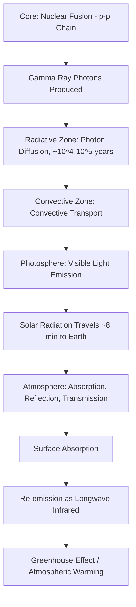

## The Sun and Solar Energy

### Overview

The Sun is a main-sequence G-type star and the dominant source of energy driving nearly all processes on Earth's surface, including atmospheric circulation, the water cycle, photosynthesis, and climate. This topic covers the Sun's internal structure, the physics of solar energy generation via nuclear fusion, the mechanisms of energy transport and emission, solar activity phenomena, and the pathway by which solar radiation reaches and interacts with Earth.

### Basic Solar Properties

**Key Points**:

- The Sun is classified as a **G2V star** — a main-sequence (V) star of spectral type G, with a surface temperature of approximately 5,778 K.
- **Mass**: ~$1.989 \times 10^{30}$ kg (~333,000 Earth masses); constitutes ~99.86% of the total mass of the solar system.
- **Radius**: ~696,000 km (~109 times Earth's radius).
- **Composition (by mass)**: approximately 73% hydrogen, 25% helium, and ~2% heavier elements ("metals" in astronomical terminology).
- **Age**: approximately 4.6 billion years, roughly midway through its estimated ~10-billion-year main-sequence lifetime.

### Internal Structure

**Layers (core to surface)**:

1. **Core**: Innermost region (~0–0.2 solar radii), where temperature reaches ~15 million K and pressure is extreme enough to sustain nuclear fusion.
2. **Radiative zone**: Extends from ~0.2 to ~0.7 solar radii; energy moves outward via radiative diffusion — photons are repeatedly absorbed and re-emitted, a process that can take tens of thousands to over 100,000 years for energy to traverse this zone [Inference: the exact transit time estimate depends on the specific opacity model used, with commonly cited figures ranging from roughly 10,000 to 170,000 years].
3. **Convective zone**: Extends from ~0.7 solar radii to the surface; energy moves via convection currents due to decreasing opacity and temperature, with hot plasma rising and cooler plasma sinking (visible at the surface as granulation).
4. **Photosphere**: The visible "surface" of the Sun (~500 km thick), with an effective temperature of ~5,778 K; this is the layer that emits most of the light we observe.
5. **Chromosphere**: A thin layer above the photosphere (~2,000 km thick), visible during solar eclipses as a reddish glow due to hydrogen-alpha emission.
6. **Corona**: The outermost atmospheric layer, extending millions of kilometers into space, with temperatures paradoxically reaching 1–3 million K — far hotter than the photosphere beneath it (the **coronal heating problem**, still an active area of solar physics research regarding the exact mechanism, though magnetic wave and reconnection processes are the leading candidates).

**Diagram: Solar Internal Structure (svg_diagram)**

<svg xmlns="http://www.w3.org/2000/svg" viewBox="0 0 640 400">
<text x="320" y="30" text-anchor="middle" font-size="18" font-weight="bold" fill="#1a1a1a">Internal Structure of the Sun (svg_diagram)</text>
<circle cx="320" cy="220" r="170" fill="#fef9c3" stroke="#a16207" stroke-width="1" />
<circle cx="320" cy="220" r="130" fill="#fde68a" stroke="#b45309" stroke-width="1" />
<circle cx="320" cy="220" r="80" fill="#fb923c" stroke="#c2410c" stroke-width="1" />
<circle cx="320" cy="220" r="35" fill="#dc2626" stroke="#7f1d1d" stroke-width="1" />

<text x="320" y="225" text-anchor="middle" font-size="11" font-weight="bold" fill="`#ffffff`">Core</text>

<text x="320" y="160" text-anchor="middle" font-size="11" font-weight="bold" fill="`#7c2d12`">Radiative Zone</text>

<text x="320" y="105" text-anchor="middle" font-size="11" font-weight="bold" fill="`#78350f`">Convective Zone</text>

<text x="320" y="60" text-anchor="middle" font-size="11" font-weight="bold" fill="`#374151`">Photosphere</text>

<text x="120" y="220" text-anchor="middle" font-size="10" fill="`#4b5563`">~15M K</text>

<text x="490" y="220" text-anchor="middle" font-size="10" fill="`#4b5563`">~5,778 K (surface)</text>

</svg>

### Nuclear Fusion: The Energy Source

**Definition**: The Sun generates energy through **nuclear fusion**, converting hydrogen nuclei into helium in the extreme temperature and pressure conditions of the core.

**Dominant Process: The Proton-Proton (p-p) Chain**:

- The p-p chain accounts for the vast majority of the Sun's energy output, being the dominant fusion pathway in stars with core temperatures similar to the Sun's (~15 million K).
- Net reaction: four hydrogen nuclei (protons) fuse into one helium-4 nucleus, releasing energy as gamma rays, positrons, and neutrinos:

$$4\,^1H \rightarrow\ ^4He + 2e^+ + 2\nu_e + \text{energy}$$

- The mass of the resulting helium nucleus is slightly less than the combined mass of four protons; this "missing" mass is converted directly into energy according to Einstein's mass-energy equivalence:

$$E = mc^2$$

**Key Points**:

- A smaller fraction of solar energy is produced via the **CNO cycle** (carbon-nitrogen-oxygen cycle), which uses carbon as a catalyst; this cycle becomes dominant in stars more massive and hotter than the Sun, contributing only a minor fraction (roughly 1–2%) of the Sun's total output [Inference: the precise CNO contribution percentage is refined periodically as solar neutrino detection improves; direct experimental confirmation of CNO neutrinos from the Sun was first achieved by the Borexino experiment].
- Solar neutrinos produced during fusion travel from the core to Earth in about 8 minutes, essentially unimpeded by matter, and provide direct observational evidence of ongoing fusion reactions deep within the Sun's core.
- The Sun converts approximately 600 million tons of hydrogen into helium every second, though only a tiny fraction of this mass (about 4 million tons per second) is converted into radiated energy per $E=mc^2$.

### Energy Transport and Emission

**Key Points**:

- Energy generated in the core does not travel directly to the surface as a straight beam; it undergoes prolonged radiative diffusion through the radiative zone before convective transport carries it the rest of the way to the photosphere.
- The Sun approximates a **blackbody radiator**, and its emission spectrum follows the **Stefan-Boltzmann Law**, relating total energy radiated to temperature:

$$P = \sigma A T^4$$

where $P$ is total power radiated, $\sigma$ is the Stefan-Boltzmann constant, $A$ is surface area, and $T$ is absolute temperature.

- The Sun's total energy output, the **solar luminosity**, is approximately $3.828 \times 10^{26}$ watts.
- The **solar constant** — the amount of solar energy received per unit area at Earth's average distance from the Sun (1 AU), measured perpendicular to the incoming rays — is approximately 1,361 W/m².

### Solar Activity and the Solar Cycle

**Key Points**:

- **Sunspots**: Cooler, darker regions on the photosphere (~3,500–4,500 K compared to the surrounding ~5,778 K) caused by concentrated magnetic field lines suppressing convective heat transport.
- **Solar cycle**: Sunspot activity follows an approximately 11-year cycle of rising and falling frequency, associated with the periodic reversal of the Sun's overall magnetic field polarity (making the complete magnetic cycle approximately 22 years).
- **Solar flares**: Sudden, intense bursts of radiation released when magnetic energy stored in the corona is suddenly released, often near sunspot regions.
- **Coronal Mass Ejections (CMEs)**: Large expulsions of plasma and magnetic field from the corona into space; when directed toward Earth, they can interact with the magnetosphere to produce geomagnetic storms, disrupting satellite operations, power grids, and radio communication, while also intensifying auroral displays.
- **Solar wind**: A continuous outflow of charged particles (mostly protons and electrons) streaming from the corona, which shapes the heliosphere and interacts with planetary magnetic fields throughout the solar system.

### Solar Radiation and Earth's Energy Budget

**Key Points**:

- Solar radiation reaching Earth spans the electromagnetic spectrum, though the atmosphere selectively absorbs, reflects, and transmits different wavelengths — most incoming ultraviolet radiation is absorbed by stratospheric ozone, while much of the visible spectrum reaches the surface largely unimpeded.
- Of the total solar radiation reaching Earth's outer atmosphere, a portion is reflected back to space by clouds, atmosphere, and surface (the **planetary albedo**, averaging around 30% for Earth as a whole), while the remainder is absorbed by the atmosphere and surface, ultimately re-radiated as longwave infrared radiation.
- This absorbed and re-radiated energy underpins the **greenhouse effect**, in which atmospheric gases (water vapor, CO₂, methane) trap a portion of outgoing longwave radiation, maintaining Earth's surface temperature significantly warmer than it would be without an atmosphere.
- Solar energy input is not uniform across Earth's surface; it varies systematically with **latitude** (due to the angle of incidence of sunlight), **season** (due to axial tilt), and **time of day** (due to Earth's rotation), driving atmospheric and oceanic circulation patterns.

### Solar Energy Flow: From Core to Earth

### Practical and Applied Relevance

**Example**: Solar irradiance monitoring by satellites (e.g., NASA's Total and Spectral Solar Irradiance Sensor, TSIS) tracks minute variations in the solar constant over the solar cycle, informing climate models about the relatively small (~0.1%) contribution of solar variability to overall climate forcing compared to anthropogenic greenhouse gas effects [Inference: the precise magnitude of solar forcing's contribution relative to other climate drivers is refined as satellite records lengthen and models improve].

**Example**: Space weather forecasting agencies (e.g., NOAA's Space Weather Prediction Center) monitor solar flares and CMEs to issue geomagnetic storm warnings, allowing power grid operators and satellite operators to take protective measures against induced electrical currents and radiation exposure.

### Related Topics

- Nuclear Fusion Physics and Stellar Nucleosynthesis
- Solar Radiation and Earth's Energy Budget
- The Greenhouse Effect and Radiative Forcing
- Space Weather and Geomagnetic Storms
- Insolation, Latitude, and Seasonal Variation
- Stellar Classification and the Hertzsprung-Russell Diagram
- Solar Neutrino Detection and Astrophysics
- Renewable Energy: Solar Power Technology and Applications