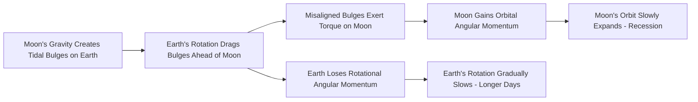

## The Earth and Moon System

### Overview

Earth and its single natural satellite, the Moon, form a dynamically coupled system whose mutual gravitational interaction shapes tides, orbital stability, day length, and even the geometry of solar and lunar eclipses. The Earth-Moon system is unusual among terrestrial planets — the Moon is disproportionately large relative to its parent planet (about 27% of Earth's diameter), a ratio far higher than any other moon-to-planet relationship among the rocky planets, with the exception of the Pluto-Charon system among dwarf planets. This topic covers the Moon's formation, physical properties, orbital dynamics, phases, eclipses, and tidal interactions with Earth.

### Physical Properties of the Moon

**Key Points**:

- **Diameter**: ~3,474 km (about 27% of Earth's diameter)
- **Mass**: ~$7.35 \times 10^{22}$ kg (about 1.2% of Earth's mass)
- **Average density**: ~3,340 kg/m³ (notably lower than Earth's ~5,510 kg/m³, reflecting a smaller or absent iron core)
- **Surface gravity**: ~1.62 m/s² (about 1/6 of Earth's surface gravity)
- **No substantial atmosphere**: The Moon retains only an extremely tenuous exosphere, insufficient to support weather, sound transmission, or significant erosion by wind
- **Surface features**: Dominated by **maria** (dark, basaltic plains formed by ancient volcanic flooding) and **highlands** (lighter, heavily cratered older terrain), along with impact craters ranging from microscopic to hundreds of kilometers across

### Formation of the Moon: The Giant Impact Hypothesis

**Key Points**:

- The leading scientific model for lunar formation is the **Giant Impact Hypothesis**, proposing that a Mars-sized protoplanet (informally named **Theia**) collided with the proto-Earth approximately 4.5 billion years ago.
- Debris ejected from this collision — a mixture of material from both Theia and Earth's mantle — is hypothesized to have coalesced in orbit around Earth, forming the Moon relatively quickly (potentially within decades to a few thousand years, based on dynamical simulations) [Inference: exact formation timescale estimates depend on the specific simulation model and remain refined by ongoing research].
- Supporting evidence includes: the similarity of oxygen isotope ratios between lunar and terrestrial rocks (suggesting a shared or well-mixed source of material), the Moon's relatively small iron core (consistent with formation primarily from mantle material rather than core material), and the current angular momentum of the Earth-Moon system, which matches predictions from impact simulations.
- Alternative historical hypotheses — **fission** (the Moon spinning off from a rapidly rotating early Earth), **capture** (Earth gravitationally capturing a pre-formed Moon), and **co-formation** (the Moon and Earth forming together from the same nebular material) — are now considered inconsistent with the full range of geochemical and dynamical evidence, though the Giant Impact Hypothesis itself continues to be refined as new isotopic data and improved simulations become available.

### Orbital Dynamics of the Moon

**Key Points**:

- The Moon orbits Earth at an average distance of ~384,400 km, with a **sidereal period** (time to complete one orbit relative to fixed stars) of approximately 27.3 days.
- The Moon's orbit is slightly elliptical (eccentricity ~0.055), producing variation between **perigee** (closest approach, ~356,500 km) and **apogee** (farthest point, ~406,700 km).
- The Moon is in **synchronous rotation** (tidally locked) with Earth — its rotational period exactly matches its orbital period, meaning the same lunar hemisphere always faces Earth (the "near side"), while the far side remains permanently hidden from direct Earth-based view (though not permanently dark, as it still experiences day/night cycles from sunlight).
- The Moon's orbital plane is inclined about 5.1° relative to the ecliptic, which is why eclipses do not occur every month despite the Moon completing a monthly orbit.

### Lunar Phases

**Key Points**:

- Lunar phases result from the changing relative geometry of the Sun, Earth, and Moon, which determines how much of the Moon's sunlit hemisphere is visible from Earth — phases are not caused by Earth's shadow.
- The **synodic month** (time between successive identical phases, e.g., new moon to new moon) is approximately 29.5 days — slightly longer than the sidereal month because Earth's own orbital motion around the Sun requires the Moon to travel slightly farther to "catch up" to the same Sun-Earth-Moon geometry.

**Phase Sequence**: New Moon → Waxing Crescent → First Quarter → Waxing Gibbous → Full Moon → Waning Gibbous → Last Quarter → Waning Crescent → (New Moon)

**Diagram: Lunar Phase Geometry (svg_diagram)**

<svg xmlns="http://www.w3.org/2000/svg" viewBox="0 0 640 400">
<text x="320" y="30" text-anchor="middle" font-size="18" font-weight="bold" fill="#1a1a1a">Lunar Phase Geometry (svg_diagram)</text>
<circle cx="320" cy="220" r="30" fill="#3b82f6" stroke="#1e3a8a" stroke-width="1.5" />
<text x="320" y="225" text-anchor="middle" font-size="11" font-weight="bold" fill="#ffffff">Earth</text>
<circle cx="320" cy="220" r="130" fill="none" stroke="#94a3b8" stroke-width="1" stroke-dasharray="3,3" />
<circle cx="320" cy="90" r="12" fill="#1f2937" />
<text x="320" y="70" text-anchor="middle" font-size="10" fill="#374151">New Moon</text>
<circle cx="412" cy="128" r="12" fill="#d1d5db" />
<text x="450" y="120" text-anchor="middle" font-size="10" fill="#374151">Waxing Crescent</text>
<circle cx="450" cy="220" r="12" fill="#d1d5db" />
<text x="500" y="220" text-anchor="middle" font-size="10" fill="#374151">First Quarter</text>
<circle cx="412" cy="312" r="12" fill="#d1d5db" />
<text x="450" y="335" text-anchor="middle" font-size="10" fill="#374151">Waxing Gibbous</text>
<circle cx="320" cy="350" r="12" fill="#fef9c3" stroke="#a16207" stroke-width="1" />
<text x="320" y="378" text-anchor="middle" font-size="10" fill="#374151">Full Moon</text>
<circle cx="228" cy="312" r="12" fill="#d1d5db" />
<text x="190" y="335" text-anchor="middle" font-size="10" fill="#374151">Waning Gibbous</text>
<circle cx="190" cy="220" r="12" fill="#d1d5db" />
<text x="140" y="220" text-anchor="middle" font-size="10" fill="#374151">Last Quarter</text>
<circle cx="228" cy="128" r="12" fill="#d1d5db" />
<text x="190" y="120" text-anchor="middle" font-size="10" fill="#374151">Waning Crescent</text>

<text x="320" y="20" text-anchor="middle" font-size="0" fill="none" />

<line x1="0" y1="220" x2="60" y2="220" stroke="`#fbbf24`" stroke-width="3" />

<text x="30" y="240" text-anchor="middle" font-size="9" fill="`#a16207`">Sunlight direction</text>

</svg>

### Eclipses

**Solar Eclipse**:

- Occurs when the Moon passes directly between the Sun and Earth (at new moon), casting a shadow on Earth's surface; visible only from within the narrow shadow path.
- Types: **total** (Moon fully covers the Sun's disk, visible within the narrow umbral path), **partial** (Moon covers only part of the Sun, visible from the wider penumbral region), and **annular** (Moon is near apogee and appears too small to fully cover the Sun, leaving a visible ring of sunlight, sometimes called a "ring of fire").

**Lunar Eclipse**:

- Occurs when Earth passes directly between the Sun and Moon (at full moon), causing Earth's shadow to fall on the Moon; visible from the entire night-side hemisphere of Earth simultaneously, unlike solar eclipses.
- During a total lunar eclipse, the Moon often appears reddish (the "Blood Moon" effect) due to sunlight refracted through Earth's atmosphere, with shorter wavelengths scattered away and longer (red) wavelengths bent onto the lunar surface — the same physical mechanism responsible for red sunsets.

**Key Points**:

- Eclipses do not occur every month because the Moon's orbital plane is inclined ~5.1° relative to the ecliptic; eclipses can only occur when the Sun, Earth, and Moon align near the points where the two orbital planes intersect (the **lunar nodes**).
- The **Saros cycle** (approximately 18 years, 11 days) is a period after which the Sun, Earth, and Moon return to approximately the same relative geometry, causing eclipses to recur in a predictable, though not identical, pattern.

### Tidal Interactions

**Key Points**:

- Ocean tides result primarily from the differential gravitational pull of the Moon (and to a lesser extent, the Sun) across Earth's diameter, creating a bulge of water on the side of Earth facing the Moon and a corresponding bulge on the opposite side (due to inertial/centrifugal effects in the Earth-Moon system's mutual orbit).
- **Spring tides** (larger tidal range) occur during new and full moons, when the Sun and Moon are aligned and their tidal forces reinforce each other; **neap tides** (smaller tidal range) occur during first and last quarter moons, when solar and lunar tidal forces partially cancel.
- **Tidal locking mechanism**: Earth's gravity has slowed the Moon's rotation over time until it matched its orbital period; simultaneously, tidal friction from the Moon's pull on Earth's oceans is gradually slowing Earth's own rotation and transferring angular momentum to the Moon's orbit.
- As a direct consequence, the Moon is slowly receding from Earth at a rate of approximately 3.8 cm per year, a value measured precisely using retroreflectors placed on the lunar surface by Apollo missions and reflected via Earth-based laser ranging.
- Earth's day length is correspondingly increasing very gradually over geologic time as rotational angular momentum transfers to the Moon's orbit [Inference: the long-term rate of day-length increase is inferred from tidal rhythmite geological records and is not perfectly constant, having varied historically due to continental configuration and tidal dissipation efficiency].

### Earth-Moon Angular Momentum Transfer

### The Moon's Role in Earth's Habitability

**Key Points**:

- The Moon's gravitational influence is thought to help stabilize the tilt (obliquity) of Earth's rotational axis over long timescales, preventing large chaotic variations that might otherwise occur, a stabilizing influence explored extensively in planetary dynamics literature [Inference: the precise magnitude of this stabilizing effect, and how essential it is compared to other stabilizing factors, remains a topic of ongoing research and some scientific debate].
- Tidal forces and the resulting mixing of coastal and intertidal environments are hypothesized by some researchers to have played a role in early biological evolution, though this remains a hypothesis rather than an established mechanism [Speculation: direct causal evidence linking lunar tides to specific evolutionary origin-of-life events is not conclusively established].

### Related Topics

- The Giant Impact Hypothesis in Detail
- Tidal Forces and Tidal Locking Mechanics
- Eclipse Prediction and the Saros Cycle
- Lunar Geology: Maria, Highlands, and Impact Cratering
- Milankovitch Cycles and Axial Tilt Stability
- Ocean Tides and Coastal Tidal Range Variation
- Lunar Exploration Missions and Sample Return Science
- Comparative Planetology: Moons of the Terrestrial Planets