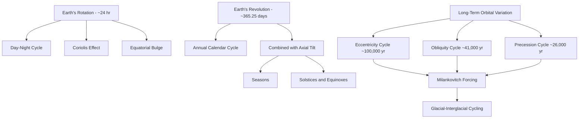

## Earth's Rotation and Revolution

### Overview

Earth's two primary motions — **rotation** (spinning on its own axis) and **revolution** (orbiting the Sun) — underlie fundamental patterns experienced across the planet, including the day-night cycle, the seasons, time zones, and long-term deviations in insolation that drive climate variability. While these motions appear simple at first glance, each involves specific physical mechanisms, measurable variations, and secondary effects that have significant scientific and practical consequences.

### Earth's Rotation

**Definition**: Rotation is Earth's spin around its own axis, an imaginary line running through the North and South Poles.

**Key Points**:

- Earth completes one rotation relative to the distant stars (a **sidereal day**) in approximately 23 hours, 56 minutes, 4 seconds.
- The more commonly used **solar day** (24 hours) is measured relative to the Sun's position and is slightly longer than the sidereal day because Earth must rotate slightly more than 360° for the Sun to return to the same position in the sky, since Earth has also moved along its orbit during that time.
- Rotation occurs from **west to east** (counterclockwise when viewed from above the North Pole), which is why the Sun, Moon, and stars appear to rise in the east and set in the west.
- Rotational velocity varies with latitude: it is greatest at the equator (~1,670 km/h) and decreases toward the poles (reaching zero at the poles themselves), since all points on Earth complete one rotation in the same time but points near the equator travel a much greater circumferential distance.

**Effects of Rotation**:

- **Day-night cycle**: Produced directly by rotation, as different portions of Earth's surface face toward or away from the Sun.
- **Coriolis effect**: An apparent deflection of moving objects (air masses, ocean currents, projectiles) caused by Earth's rotation — deflection is to the right of motion in the Northern Hemisphere and to the left in the Southern Hemisphere, with zero deflection at the equator and maximum deflection at the poles. This effect fundamentally shapes global wind belts, ocean gyres, and the rotational direction of cyclones.
- **Equatorial bulge**: Earth is not a perfect sphere but an **oblate spheroid** — centrifugal effects from rotation cause a slight bulge at the equator (equatorial diameter ~12,756 km vs. polar diameter ~12,714 km).

### Variations in Rotation

**Key Points**:

- Earth's rotation rate is not perfectly constant. **Tidal friction** from the Moon's gravitational pull is gradually slowing Earth's rotation, lengthening the day by roughly 1.7–2.3 milliseconds per century [Inference: the precise long-term rate has varied over geologic history depending on continental configuration and is derived from tidal rhythmite and coral growth-band proxy records, so estimates carry some uncertainty].
- Short-term irregularities in rotation rate also occur due to redistribution of Earth's mass (e.g., changes in ice sheet mass, core-mantle interactions, atmospheric and oceanic circulation shifts), monitored precisely using atomic clocks and very-long-baseline interferometry (VLBI).
- **Leap seconds** have historically been periodically added to Coordinated Universal Time (UTC) to reconcile atomic clock time with the gradually slowing and irregularly varying actual rotation of Earth, though international timekeeping bodies have been evaluating and adjusting this practice in recent years.
- **Precession**: A slow, conical wobble of Earth's rotational axis, completing one full cycle approximately every 26,000 years, caused by gravitational torque from the Sun and Moon acting on Earth's equatorial bulge. This causes the identity of the "North Star" to change over millennia and contributes to long-term climate cycling (as part of the Milankovitch cycles).

### Earth's Revolution

**Definition**: Revolution is Earth's orbital motion around the Sun.

**Key Points**:

- Earth completes one full revolution in approximately 365.25 days (one **sidereal year**), the fractional quarter-day being the reason a leap day is added to the calendar approximately every four years to keep the calendar synchronized with the astronomical year.
- Earth's orbit is a slight ellipse (eccentricity ~0.017, nearly circular), with **perihelion** (closest approach to the Sun, ~147.1 million km) occurring in early January and **aphelion** (farthest point, ~152.1 million km) occurring in early July [Inference: exact perihelion/aphelion dates shift slightly year to year due to calendar and orbital perturbation effects].
- Orbital velocity varies according to Kepler's Second Law: Earth moves fastest near perihelion and slowest near aphelion, though this velocity variation is a comparatively minor effect on seasonal intensity relative to axial tilt.
- Earth's average orbital speed is approximately 107,000 km/h (~29.8 km/s).

### The Cause of Seasons: Axial Tilt

**Key Points**:

- Earth's axis is tilted approximately 23.5° relative to the plane of its orbit (the ecliptic plane) — this **axial tilt (obliquity)**, not variation in Earth-Sun distance, is the primary cause of seasons.
- As Earth revolves around the Sun while maintaining a fixed axial tilt direction in space, different hemispheres receive more direct solar radiation at different points in the orbit, producing summer (when a hemisphere is tilted toward the Sun) and winter (when tilted away).
- Two mechanisms combine to intensify seasonal temperature differences in the tilted hemisphere: (1) more direct (higher-angle) sunlight delivers greater energy per unit surface area, and (2) longer daylight hours allow more cumulative solar energy input.
- **Solstices**: Points in Earth's orbit where axial tilt is maximally aligned with or against the Sun, producing the longest and shortest days of the year (around June 21 and December 21 in each hemisphere respectively, opposite between hemispheres).
- **Equinoxes**: Points where Earth's axis is tilted neither toward nor away from the Sun, producing approximately equal day and night length worldwide (around March 20 and September 22).

**Diagram: Seasons and Axial Tilt (svg_diagram)**

<svg xmlns="http://www.w3.org/2000/svg" viewBox="0 0 640 320">
<text x="320" y="30" text-anchor="middle" font-size="18" font-weight="bold" fill="#1a1a1a">Earth's Axial Tilt and Seasons (svg_diagram)</text>
<circle cx="320" cy="180" r="20" fill="#fbbf24" />
<text x="320" y="185" text-anchor="middle" font-size="10" font-weight="bold" fill="#78350f">Sun</text>
<ellipse cx="320" cy="180" rx="250" ry="90" fill="none" stroke="#94a3b8" stroke-width="1" stroke-dasharray="3,3" />
<g transform="translate(90,180) rotate(-23.5)">
<circle cx="0" cy="0" r="22" fill="#3b82f6" stroke="#1e3a8a" stroke-width="1.5" />
<line x1="0" y1="-32" x2="0" y2="32" stroke="#1f2937" stroke-width="2" />
</g>
<text x="90" y="230" text-anchor="middle" font-size="10" fill="#374151">N. Hemisphere Summer</text>
<text x="90" y="243" text-anchor="middle" font-size="9" fill="#6b7280">(Tilted toward Sun)</text>
<g transform="translate(550,180) rotate(-23.5)">
<circle cx="0" cy="0" r="22" fill="#3b82f6" stroke="#1e3a8a" stroke-width="1.5" />
<line x1="0" y1="-32" x2="0" y2="32" stroke="#1f2937" stroke-width="2" />
</g>
<text x="550" y="230" text-anchor="middle" font-size="10" fill="#374151">N. Hemisphere Winter</text>
<text x="550" y="243" text-anchor="middle" font-size="9" fill="#6b7280">(Tilted away from Sun)</text>

<text x="320" y="300" text-anchor="middle" font-size="11" fill="`#4b5563`" font-style="italic">Axial tilt direction remains fixed in space throughout the orbit</text>

</svg>

### Rotation and Revolution: Comparative Summary

| Property | Rotation | Revolution |
| --- | --- | --- |
| Definition | Spin on own axis | Orbit around the Sun |
| Period | ~24 hours (solar day) | ~365.25 days |
| Direction | West to east | Counterclockwise (viewed from North) |
| Primary effect | Day-night cycle, Coriolis effect | Seasons, year length |
| Axis relationship | Axis fixed in orientation, tilted 23.5° | Tilt causes uneven solar distribution |

### Long-Term Orbital Variations: Milankovitch Cycles

**Key Points**:

- **Eccentricity**: Earth's orbital shape varies from nearly circular to more elliptical over a cycle of approximately 100,000 years, modulating the difference between perihelion and aphelion solar input.
- **Obliquity**: Axial tilt varies between approximately 22.1° and 24.5° over a cycle of about 41,000 years, affecting the intensity of seasonal contrast.
- **Precession**: The 26,000-year wobble of the rotational axis changes which hemisphere experiences summer at perihelion versus aphelion, influencing the relative intensity of seasons between hemispheres over time.
- These three orbital cycles combine to alter the distribution and intensity of solar radiation received at different latitudes over tens of thousands of years, and are widely credited as a major pacing mechanism for the glacial-interglacial cycles observed in the Pleistocene ice age record [Inference: while Milankovitch forcing is well-established as a pacing mechanism, the precise amplification pathways involving ice-albedo feedback, greenhouse gas feedbacks, and ocean circulation remain active areas of paleoclimate research].

### Rotation-Revolution Interaction Timeline

### Practical Applications

**Example**: Time zone systems are a direct practical consequence of Earth's rotation — since the planet rotates 360° in 24 hours, it rotates roughly 15° per hour, which is the basis for the 24 standard time zones (with numerous local exceptions and offsets for political and geographic convenience).

**Example**: Satellite orbit planning must account precisely for Earth's rotation and axial tilt; **geostationary satellites** are placed directly above the equator at an altitude (~35,786 km) where their orbital period exactly matches Earth's rotational period, allowing them to remain fixed relative to a point on the surface.

### Related Topics

- The Coriolis Effect and Global Wind Circulation
- Milankovitch Cycles and Paleoclimate Forcing
- Precession, Nutation, and Axial Wobble
- Time Zones, UTC, and Leap Second Policy
- Solstices, Equinoxes, and Calendar Systems
- Satellite Orbits and Geostationary Mechanics
- Earth's Shape: Geoid and Oblate Spheroid Geodesy
- Paleoclimate Evidence for Orbital Forcing (Ice Cores, Sediment Records)