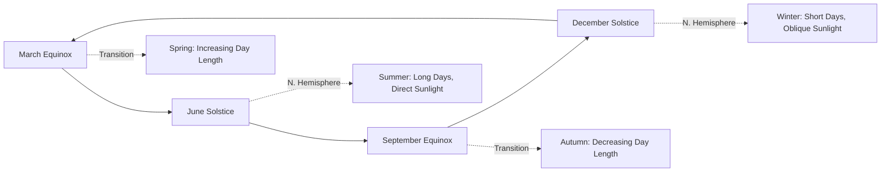

## Seasons and Solstices

### Overview

Seasons are the periodic climatic and daylight variations experienced across most of Earth's surface as the planet revolves around the Sun while maintaining a fixed axial tilt. Solstices and equinoxes mark the key astronomical turning points of this annual cycle. While seasonal effects are experienced universally, their causes, intensity, and timing vary significantly by latitude, and are frequently misunderstood as being caused by changing Earth-Sun distance rather than axial tilt.

### The Fundamental Cause of Seasons

**Key Points**:

- Seasons are caused by Earth's **axial tilt (obliquity)** of approximately 23.5° relative to the plane of its orbit (the ecliptic), combined with the fact that this tilt direction remains essentially fixed in space as Earth revolves around the Sun over the course of a year.
- As Earth orbits the Sun, this fixed tilt causes each hemisphere to alternately lean toward and away from the Sun at different points in the orbit, producing systematic changes in the angle and duration of sunlight received.
- Seasons are **not** caused by variation in Earth-Sun distance: Earth is actually closest to the Sun (perihelion, ~147.1 million km) in early January, during Northern Hemisphere winter, and farthest (aphelion, ~152.1 million km) in early July, during Northern Hemisphere summer — the opposite of what a distance-based explanation would predict.
- Two combined tilt-driven mechanisms intensify summer conditions in the hemisphere tilted toward the Sun: (1) sunlight strikes the surface at a more direct (higher) angle, concentrating the same amount of energy over a smaller surface area, and (2) daylight duration is longer, allowing more cumulative solar energy input per day.

### Solstices

**Definition**: A solstice occurs at the two points in Earth's orbit where the axial tilt is maximally aligned toward or away from the Sun, producing the greatest disparity in day length between hemispheres.

**June Solstice** (around June 20–21):

- The Northern Hemisphere is tilted maximally toward the Sun, experiencing its longest day and shortest night of the year (**summer solstice** in the Northern Hemisphere).
- Simultaneously, the Southern Hemisphere experiences its shortest day and longest night (**winter solstice** in the Southern Hemisphere).
- The subsolar point (where the Sun is directly overhead at solar noon) reaches its northernmost position, the **Tropic of Cancer** (~23.5°N).

**December Solstice** (around December 21–22):

- The roles reverse: the Northern Hemisphere experiences its winter solstice (shortest day), while the Southern Hemisphere experiences its summer solstice (longest day).
- The subsolar point reaches its southernmost position, the **Tropic of Capricorn** (~23.5°S).

**Key Points**:

- Exact solstice dates and times shift slightly year to year (by up to about a day) due to the mismatch between the 365.25-day solar year and the 365-day calendar year, corrected periodically by leap years.
- At the summer solstice, locations at or above the Arctic Circle (~66.5°N) experience continuous daylight (the "midnight sun"), while locations at or below the Antarctic Circle (~66.5°S) experience continuous darkness, with the pattern reversing at the December solstice.

### Equinoxes

**Definition**: An equinox occurs at the two points in Earth's orbit where the axial tilt is oriented perpendicular to the Sun-Earth line — neither hemisphere is tilted toward or away from the Sun.

**March Equinox** (around March 19–21):

- Often called the **vernal (spring) equinox** in the Northern Hemisphere and the autumnal equinox in the Southern Hemisphere.
- The subsolar point crosses the equator moving northward.

**September Equinox** (around September 22–23):

- Often called the **autumnal equinox** in the Northern Hemisphere and the vernal equinox in the Southern Hemisphere.
- The subsolar point crosses the equator moving southward.

**Key Points**:

- At an equinox, all locations on Earth (excluding polar regions with extreme atmospheric refraction effects) experience approximately equal day and night length (~12 hours each), giving the equinox its name (from Latin, "equal night").
- The term "equinox" describes an instant in time (the precise moment the Sun crosses the celestial equator), not an entire day, though it is colloquially referred to as marking an entire day.

### Diagram: Earth's Position at Solstices and Equinoxes (svg_diagram)

<svg xmlns="http://www.w3.org/2000/svg" viewBox="0 0 640 400">
<text x="320" y="30" text-anchor="middle" font-size="18" font-weight="bold" fill="#1a1a1a">Earth's Orbital Position: Seasons (svg_diagram)</text>
<circle cx="320" cy="220" r="22" fill="#fbbf24" />
<text x="320" y="225" text-anchor="middle" font-size="10" font-weight="bold" fill="#78350f">Sun</text>
<ellipse cx="320" cy="220" rx="240" ry="150" fill="none" stroke="#94a3b8" stroke-width="1" stroke-dasharray="3,3" />
<g transform="translate(320,80) rotate(-23.5)">
<circle cx="0" cy="0" r="18" fill="#3b82f6" stroke="#1e3a8a" stroke-width="1.5" />
<line x1="0" y1="-26" x2="0" y2="26" stroke="#1f2937" stroke-width="2" />
</g>
<text x="320" y="45" text-anchor="middle" font-size="10" fill="#374151">June Solstice</text>
<text x="320" y="58" text-anchor="middle" font-size="9" fill="#6b7280">N. Summer / S. Winter</text>
<g transform="translate(560,220) rotate(-23.5)">
<circle cx="0" cy="0" r="18" fill="#3b82f6" stroke="#1e3a8a" stroke-width="1.5" />
<line x1="0" y1="-26" x2="0" y2="26" stroke="#1f2937" stroke-width="2" />
</g>
<text x="600" y="260" text-anchor="middle" font-size="10" fill="#374151">Sept. Equinox</text>
<g transform="translate(320,360) rotate(-23.5)">
<circle cx="0" cy="0" r="18" fill="#3b82f6" stroke="#1e3a8a" stroke-width="1.5" />
<line x1="0" y1="-26" x2="0" y2="26" stroke="#1f2937" stroke-width="2" />
</g>
<text x="320" y="395" text-anchor="middle" font-size="10" fill="#374151">Dec. Solstice (N. Winter / S. Summer)</text>
<g transform="translate(80,220) rotate(-23.5)">
<circle cx="0" cy="0" r="18" fill="#3b82f6" stroke="#1e3a8a" stroke-width="1.5" />
<line x1="0" y1="-26" x2="0" y2="26" stroke="#1f2937" stroke-width="2" />
</g>
<text x="60" y="260" text-anchor="middle" font-size="10" fill="#374151">March Equinox</text>
</svg>

### Latitudinal Variation in Seasonal Intensity

**Key Points**:

- **Equatorial regions** (near 0° latitude) experience minimal seasonal temperature variation because the subsolar point never strays far from directly overhead throughout the year; seasonal variation here is often characterized more by precipitation patterns (wet/dry seasons) than temperature.
- **Mid-latitude regions** (roughly 30°–60°) experience the most pronounced four-season pattern (spring, summer, autumn, winter), as they undergo the largest swings in day length and solar angle over the year.
- **Polar regions** (poleward of ~66.5°) experience the most extreme seasonal variation in daylight, ranging from continuous daylight in summer to continuous darkness in winter, though temperature variation, while significant, is moderated somewhat by the persistent low sun angle year-round.

### Seasonal Lag

**Key Points**:

- Peak seasonal temperatures typically occur several weeks after the corresponding solstice (e.g., the hottest part of Northern Hemisphere summer is usually in late July, not late June) — a phenomenon called **seasonal lag** or **thermal lag**.
- This lag occurs because land and ocean surfaces continue absorbing net incoming solar energy for a period after the solstice, since the rate of energy input still exceeds the rate of energy loss for several weeks; temperatures peak only once this balance reverses.
- The magnitude of seasonal lag varies by region, generally being longer near large bodies of water (due to water's high heat capacity) and shorter in continental interiors.

### Table: Solstice and Equinox Summary

| Event | Approx. Date | Subsolar Point | N. Hemisphere | S. Hemisphere |
| --- | --- | --- | --- | --- |
| March Equinox | Mar 19–21 | Equator (0°) | Spring begins | Autumn begins |
| June Solstice | Jun 20–21 | Tropic of Cancer (23.5°N) | Summer begins | Winter begins |
| September Equinox | Sep 22–23 | Equator (0°) | Autumn begins | Spring begins |
| December Solstice | Dec 21–22 | Tropic of Capricorn (23.5°S) | Winter begins | Summer begins |

### Cultural and Practical Significance

**Key Points**:

- Solstices and equinoxes have held significant cultural and agricultural importance across human history, marking planting and harvest cycles and forming the basis for numerous traditional calendars and seasonal festivals across diverse cultures worldwide [Inference: the specific cultural practices and their exact astronomical alignment precision vary considerably by civilization and historical period].
- Modern applications include agricultural planning (frost date estimation, growing season length), solar energy system design (panel angle optimization varies by seasonal sun angle), and building/architectural design accounting for seasonal solar heat gain.

### Seasonal Cycle Flow

### Related Topics

- Axial Tilt and Earth's Orbital Geometry
- Milankovitch Cycles and Long-Term Seasonal Forcing
- Insolation and the Angle of Incidence
- Seasonal Lag and Thermal Inertia of Land vs. Ocean
- Polar Day and Polar Night Phenomena
- Agricultural and Cultural Calendars Based on Solar Events
- Climate Zones and Latitudinal Temperature Patterns
- Solar Energy System Design and Seasonal Sun Angle