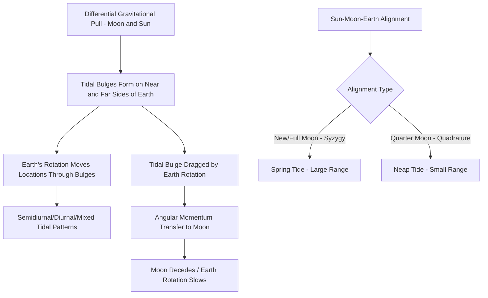

## Tides and Tidal Forces

### Overview

Tides are the periodic rise and fall of ocean water levels caused by the differential gravitational pull of the Moon and Sun across Earth's diameter, combined with the effects of Earth's rotation. Tidal forces are not unique to oceans — they act on the solid Earth (Earth tides) and the atmosphere as well, though ocean tides are by far the most visible and practically significant expression of the phenomenon. This topic covers the physical origin of tidal forces, tidal patterns, the influence of the Sun and Moon, coastal tidal variation, and broader applications and consequences of tidal dynamics.

### The Physical Origin of Tidal Forces

**Definition**: A tidal force arises from the **differential gravitational pull** exerted by one body on different parts of another body, because gravitational force weakens with distance according to the inverse square law.

**Key Points**:

- The side of Earth facing the Moon experiences a stronger gravitational pull than Earth's center, while the side facing away experiences a weaker pull than the center — this differential creates a stretching effect, producing tidal bulges on **both** the near and far sides of Earth relative to the Moon.
- The bulge on the near side occurs because water there is pulled toward the Moon more strongly than the solid Earth beneath it; the bulge on the far side occurs because the solid Earth is pulled toward the Moon more strongly than the water there, effectively leaving that water "behind."
- Tidal force follows an inverse-cube relationship with distance (rather than the inverse-square relationship of ordinary gravitational force), because it depends on the *difference* in gravitational pull across a body's diameter:

$$F_{tidal} \propto \frac{2GMr}{d^3}$$

where $G$ is the gravitational constant, $M$ is the mass of the tide-raising body, $r$ is the radius of the body experiencing the tide (e.g., Earth), and $d$ is the distance between the two bodies' centers.

- This inverse-cube dependence explains why the Moon, despite being far less massive than the Sun, generates a tidal force on Earth roughly twice as strong as the Sun's — the Moon's much closer proximity outweighs the Sun's far greater mass.

### Diagram: Tidal Bulge Formation (svg_diagram)

<svg xmlns="http://www.w3.org/2000/svg" viewBox="0 0 640 300">
<text x="320" y="30" text-anchor="middle" font-size="18" font-weight="bold" fill="#1a1a1a">Tidal Bulge Formation (svg_diagram)</text>
<ellipse cx="320" cy="180" rx="130" ry="90" fill="#93c5fd" stroke="#1d4ed8" stroke-width="2" />
<circle cx="320" cy="180" r="70" fill="#3b82f6" stroke="#1e3a8a" stroke-width="1.5" />
<text x="320" y="185" text-anchor="middle" font-size="12" font-weight="bold" fill="#ffffff">Earth</text>
<circle cx="560" cy="180" r="18" fill="#d1d5db" stroke="#6b7280" stroke-width="1.5" />
<text x="560" y="220" text-anchor="middle" font-size="11" fill="#374151">Moon</text>

<text x="450" y="170" text-anchor="middle" font-size="10" fill="`#1e3a8a`">Near-side bulge</text>

<text x="190" y="170" text-anchor="middle" font-size="10" fill="`#1e3a8a`">Far-side bulge</text>

<line x1="390" y1="180" x2="540" y2="180" stroke="#374151" stroke-width="1.5" stroke-dasharray="4,3" marker-end="url(#arrowT)" />
<text x="320" y="280" text-anchor="middle" font-size="11" fill="`#4b5563`" font-style="italic">Bulges form on both sides due to differential gravitational pull</text>

</svg>

### Tidal Bulges and Earth's Rotation

**Key Points**:

- As Earth rotates on its axis roughly every 24 hours, a given coastal location passes through the two tidal bulges, generally experiencing two high tides and two low tides per day (a **semidiurnal** tidal pattern) at most coastal locations, though the actual pattern varies by local coastal geometry and basin resonance.
- Because the Moon is also orbiting Earth (in the same direction as Earth's rotation) while Earth rotates, the time between successive high tides is slightly longer than 12 hours — approximately 12 hours 25 minutes — meaning tide times shift later each day by roughly 50 minutes.
- Local tidal patterns are strongly influenced by coastline shape, ocean basin geometry, water depth, and resonance effects, producing significant regional variation beyond the simplified "two bulges" model.

### Tidal Patterns

**Semidiurnal Tide**: Two high tides and two low tides of roughly equal height each day (~24 hr 50 min cycle); common along the U.S. Atlantic coast.

**Diurnal Tide**: One high tide and one low tide per day; less common, occurring in specific basin geometries such as parts of the Gulf of Mexico.

**Mixed Semidiurnal Tide**: Two high and two low tides per day, but with significant inequality in successive high or low tide heights; common along the U.S. Pacific coast.

### The Role of the Sun: Spring and Neap Tides

**Key Points**:

- The Sun also generates tidal force on Earth, though at roughly 46% the strength of the Moon's tidal force, due to its much greater distance despite its much larger mass.
- **Spring tides**: Occur during **new moon** and **full moon**, when the Sun, Earth, and Moon are aligned (**syzygy**), causing solar and lunar tidal forces to reinforce each other and produce the largest tidal range (highest highs, lowest lows). The term "spring" refers to the tide "springing up," unrelated to the season.
- **Neap tides**: Occur during the **first quarter** and **last quarter** moon phases, when the Sun and Moon are at right angles relative to Earth, causing their tidal forces to partially cancel and produce the smallest tidal range.

**Diagram: Spring vs. Neap Tide Configuration (svg_diagram)**

<svg xmlns="http://www.w3.org/2000/svg" viewBox="0 0 640 300">
<text x="320" y="30" text-anchor="middle" font-size="18" font-weight="bold" fill="#1a1a1a">Spring vs. Neap Tide Alignment (svg_diagram)</text>

<text x="160" y="60" text-anchor="middle" font-size="13" font-weight="bold" fill="`#1e3a8a`">Spring Tide (Syzygy)</text>

<circle cx="60" cy="100" r="14" fill="`#fbbf24`" />

<circle cx="160" cy="100" r="16" fill="`#3b82f6`" />

<circle cx="260" cy="100" r="8" fill="`#d1d5db`" />

<line x1="74" y1="100" x2="252" y2="100" stroke="`#9ca3af`" stroke-width="1" stroke-dasharray="3,2" />

<text x="60" y="130" text-anchor="middle" font-size="9" fill="`#374151`">Sun</text>

<text x="160" y="135" text-anchor="middle" font-size="9" fill="`#374151`">Earth</text>

<text x="260" y="130" text-anchor="middle" font-size="9" fill="`#374151`">Moon</text>

<text x="480" y="60" text-anchor="middle" font-size="13" font-weight="bold" fill="`#b91c1c`">Neap Tide (Quadrature)</text>

<circle cx="380" cy="130" r="14" fill="`#fbbf24`" />

<circle cx="480" cy="130" r="16" fill="`#3b82f6`" />

<circle cx="480" cy="70" r="8" fill="`#d1d5db`" />

<line x1="396" y1="130" x2="464" y2="130" stroke="`#9ca3af`" stroke-width="1" stroke-dasharray="3,2" />

<line x1="480" y1="114" x2="480" y2="80" stroke="`#9ca3af`" stroke-width="1" stroke-dasharray="3,2" />

<text x="380" y="160" text-anchor="middle" font-size="9" fill="`#374151`">Sun</text>

<text x="480" y="160" text-anchor="middle" font-size="9" fill="`#374151`">Earth</text>

<text x="500" y="65" text-anchor="middle" font-size="9" fill="`#374151`">Moon</text>

<text x="320" y="250" text-anchor="middle" font-size="11" fill="`#4b5563`" font-style="italic">Spring tides: forces align (new/full moon). Neap tides: forces oppose at 90° (quarter moons)</text>

</svg>

### Tidal Range and Coastal Factors

**Key Points**:

- **Tidal range** (the vertical difference between high and low tide) varies enormously by location, from less than 1 meter in some enclosed seas to over 15 meters in the Bay of Fundy, Canada, which holds the record for the largest tidal range on Earth, attributed largely to resonance between the natural oscillation period of the bay and the tidal forcing period.
- Coastal geometry — funnel-shaped bays, narrow channels, and continental shelf width — significantly amplifies or dampens tidal range through resonance and constriction effects, meaning tidal range cannot be predicted from open-ocean tidal theory alone.
- **Tidal bores** (a wave that travels up a river against the current) can occur in certain funnel-shaped estuaries when an incoming tide is forced into a narrowing channel.

### Earth Tides and Atmospheric Tides

**Key Points**:

- **Earth tides (solid Earth tides)**: The solid body of Earth itself deforms measurably (by centimeters) in response to the same lunar and solar tidal forces that produce ocean tides, detectable using precision instruments such as gravimeters and used in geodesy and some geophysical monitoring applications.
- **Atmospheric tides**: Periodic oscillations in atmospheric pressure driven partly by gravitational tidal forces and partly (more significantly) by solar heating cycles; these are of practical relevance in upper-atmosphere and satellite orbit modeling contexts.

### Tidal Friction and Long-Term Consequences

**Key Points**:

- Ocean tidal bulges are dragged slightly ahead of the Moon's position by Earth's faster rotation, creating a gravitational torque between the misaligned bulge and the Moon.
- This torque transfers angular momentum from Earth's rotation to the Moon's orbit, gradually slowing Earth's rotation (lengthening the day) while causing the Moon to slowly recede from Earth (~3.8 cm/year, measured via lunar laser ranging).
- Over geologic timescales, this process is well-documented through tidal rhythmite sedimentary records, which preserve evidence that day length was shorter and the Moon was closer to Earth in the distant geologic past [Inference: specific numerical reconstructions of ancient day length from these records carry measurement uncertainty and depend on interpretation of the sedimentary record's completeness].

### Practical Applications of Tidal Science

**Key Points**:

- **Tidal prediction**: Coastal engineering, shipping/navigation, and fishing industries rely on precise tidal prediction tables, generated from harmonic analysis of long-term tide gauge records combined with astronomical calculations of Sun-Moon-Earth geometry.
- **Tidal energy**: Tidal range and tidal stream energy generation technologies harness the kinetic and potential energy of tidal flow, most viable in locations with large tidal ranges or strong tidal currents (e.g., the Rance Tidal Power Station in France, one of the world's earliest large-scale tidal power installations).
- **Intertidal ecosystems**: The zone between high and low tide marks (the intertidal zone) supports specialized ecosystems adapted to regular submersion and exposure cycles, a subject of significant interest in coastal ecology.

### Tidal Force Summary Flow

### Related Topics

- Lunar Orbital Dynamics and Tidal Locking
- The Bay of Fundy and Tidal Resonance Phenomena
- Tidal Energy Generation Technology
- Intertidal Zone Ecology and Adaptation
- Earth Tides and Geodetic Measurement
- Tidal Rhythmites as Paleo-Rotation Proxies
- Harmonic Analysis in Tidal Prediction
- Coastal Engineering and Tidal Range Considerations