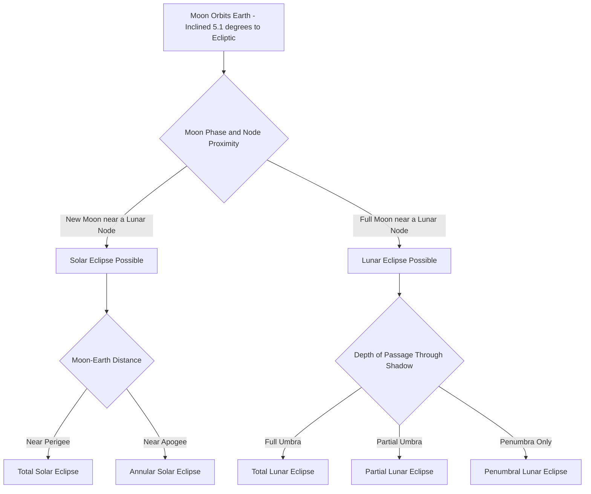

## Eclipses

### Overview

An eclipse occurs when one celestial body passes into the shadow of another, or when one body passes directly between an observer and a light source, temporarily blocking or dimming the light received. In the Earth-Moon-Sun system, this produces two primary types of eclipses — **solar eclipses** and **lunar eclipses** — each governed by precise geometric alignment requirements that make eclipses periodic, predictable, but not monthly events despite the Moon's monthly orbital cycle.

### Geometric Requirements for Eclipses

**Key Points**:

- Eclipses require close alignment of the Sun, Earth, and Moon, but such alignment does not occur every month because the Moon's orbital plane is inclined approximately 5.1° relative to the ecliptic (Earth's orbital plane around the Sun).
- Eclipses can only occur when a new moon or full moon coincides closely with the Moon's position at or near one of the two points where its orbital plane crosses the ecliptic, called the **lunar nodes** (the ascending node and descending node).
- If the Moon's orbit were perfectly aligned with the ecliptic, a solar eclipse would occur at every new moon and a lunar eclipse at every full moon; the 5.1° inclination is precisely why this does not happen, restricting eclipses to specific "eclipse seasons" occurring roughly twice per year.

### Solar Eclipses

**Definition**: A solar eclipse occurs when the Moon passes directly between the Sun and Earth, casting a shadow onto Earth's surface. This can only occur at **new moon**.

**Shadow Geometry**:

- **Umbra**: The Moon's central, darkest shadow cone, within which the Sun's disk is completely blocked; only a narrow path on Earth's surface (typically ~100–160 km wide) falls within the umbra during any given eclipse.
- **Penumbra**: The lighter, outer shadow region, within which only part of the Sun's disk is blocked, producing a partial eclipse for observers within this broader zone.
- **Antumbra**: An extension of the umbra beyond the point where it converges to a point; observers within the antumbra see an annular eclipse rather than a total eclipse.

**Types of Solar Eclipses**:

- **Total solar eclipse**: The Moon completely covers the Sun's disk, visible only from within the narrow path of the umbra; occurs when the Moon is relatively close to Earth (near perigee) at the time of eclipse.
- **Partial solar eclipse**: The Moon covers only part of the Sun's disk, visible from the wider penumbral region surrounding the path of totality.
- **Annular solar eclipse**: The Moon is near apogee (farther from Earth) and appears too small in the sky to fully cover the Sun, leaving a visible bright ring ("ring of fire") around the Moon's silhouette at maximum eclipse.
- **Hybrid solar eclipse**: A rarer type in which the eclipse appears total along part of its path and annular along another part, due to the curvature of Earth's surface relative to the tip of the Moon's shadow.

**Diagram: Solar Eclipse Shadow Geometry (svg_diagram)**

<svg xmlns="http://www.w3.org/2000/svg" viewBox="0 0 640 300">
<text x="320" y="30" text-anchor="middle" font-size="18" font-weight="bold" fill="#1a1a1a">Solar Eclipse Geometry (svg_diagram)</text>
<circle cx="80" cy="180" r="40" fill="#fbbf24" />
<text x="80" y="185" text-anchor="middle" font-size="11" fill="#78350f">Sun</text>
<circle cx="330" cy="180" r="16" fill="#374151" />
<text x="330" y="215" text-anchor="middle" font-size="10" fill="#374151">Moon</text>
<polygon points="120,150 120,210 400,180" fill="#1f2937" fill-opacity="0.85" />
<polygon points="120,140 120,220 560,260 560,100" fill="#94a3b8" fill-opacity="0.35" />
<ellipse cx="440" cy="180" rx="90" ry="60" fill="#3b82f6" stroke="#1e3a8a" stroke-width="1.5" />
<text x="440" y="185" text-anchor="middle" font-size="11" font-weight="bold" fill="#ffffff">Earth</text>

<text x="360" y="150" text-anchor="middle" font-size="9" fill="`#f9fafb`">Umbra</text>

<text x="500" y="120" text-anchor="middle" font-size="9" fill="`#374151`">Penumbra</text>

<text x="320" y="270" text-anchor="middle" font-size="11" fill="`#4b5563`" font-style="italic">Umbra path: total eclipse. Penumbra: partial eclipse</text>

</svg>

### Lunar Eclipses

**Definition**: A lunar eclipse occurs when Earth passes directly between the Sun and the Moon, causing Earth's shadow to fall on the Moon's surface. This can only occur at **full moon**.

**Types of Lunar Eclipses**:

- **Total lunar eclipse**: The entire Moon passes through Earth's umbra, often producing a reddish appearance (the "Blood Moon" effect) due to sunlight refracted through Earth's atmosphere onto the lunar surface, with the atmosphere scattering shorter (blue) wavelengths and bending longer (red) wavelengths onto the Moon — the same mechanism responsible for red sunsets.
- **Partial lunar eclipse**: Only part of the Moon passes through Earth's umbra, with the remainder in the lighter penumbra.
- **Penumbral lunar eclipse**: The Moon passes only through Earth's penumbra, producing a subtle dimming that can be difficult to detect visually without instrumentation.

**Key Points**:

- Unlike solar eclipses, which are visible only from a narrow path, lunar eclipses are visible from the **entire night-side hemisphere** of Earth simultaneously, since Earth's shadow is large enough to encompass the Moon's disk as viewed from any nighttime location.
- Lunar eclipses are generally safe to observe directly without special equipment, unlike solar eclipses, since they involve dimmed reflected light rather than direct solar radiation.

### Comparison Table: Solar vs. Lunar Eclipses

| Property | Solar Eclipse | Lunar Eclipse |
| --- | --- | --- |
| Occurs at | New moon | Full moon |
| Shadow cast by | Moon (onto Earth) | Earth (onto Moon) |
| Visibility | Narrow path on Earth | Entire night-side hemisphere |
| Frequency (per year) | 2–5 (varies) | 2–4 typically |
| Duration of totality | Minutes (max ~7.5 min) | Up to ~1 hour 45 min |
| Viewing safety | Requires eye protection | Safe to view directly |

### The Saros Cycle

**Definition**: The **Saros cycle** is a period of approximately 18 years, 11 days, and 8 hours after which the Sun, Earth, and Moon return to nearly the same relative geometric configuration, causing eclipses to recur in a predictable pattern.

**Key Points**:

- The Saros cycle arises because it represents a near-exact common multiple of three distinct lunar periods: the **synodic month** (29.53 days, new moon to new moon), the **draconic month** (27.21 days, node to node), and the **anomalistic month** (27.55 days, perigee to perigee).
- Because the Saros period includes an extra 8 hours beyond whole days, successive eclipses in the same Saros series occur roughly 120° farther west in longitude each time, meaning the eclipse is visible from a different geographic region despite following the same series pattern.
- Saros cycles group eclipses into "families" or "series," with a given series typically producing eclipses over a span of roughly 1,200–1,300 years before the geometric alignment drifts too far to produce further eclipses in that series.

### Eclipse Prediction and Historical Significance

**Key Points**:

- Eclipse prediction has ancient roots — Babylonian astronomers identified cyclical eclipse patterns (a precursor to the Saros cycle concept) over two millennia ago through long-term systematic observation, though modern eclipse prediction relies on precise orbital mechanics calculations accounting for perturbations from other solar system bodies.
- Historical solar eclipse observations have contributed significantly to scientific milestones, notably the 1919 solar eclipse expedition led by Arthur Eddington, which measured the gravitational bending of starlight near the Sun during totality, providing early observational support for Einstein's general theory of relativity.
- Modern eclipse prediction is calculated using precise numerical ephemeris models (e.g., NASA's eclipse prediction datasets), accounting for the small but measurable long-term changes in Earth's rotation rate and the Moon's orbital distance.

### Eclipse Occurrence Flow

### Observational Safety and Practical Considerations

**Key Points**:

- Direct viewing of the Sun during any phase of a solar eclipse other than the brief moment of totality requires certified solar filters (e.g., eclipse glasses meeting ISO 12312-2 safety standards) to prevent serious and potentially permanent retinal damage, since even a thin crescent of exposed solar disk emits sufficient intensity to cause harm.
- During the brief period of totality in a total solar eclipse, it is safe to view the corona directly without filters, but observers must resume eye protection immediately as totality ends, since behavior and timing of totality can vary by exact viewing location within the path.
- Lunar eclipses pose no equivalent viewing hazard and can be safely observed with the naked eye, binoculars, or telescopes throughout their entire duration.

### Related Topics

- Lunar Orbital Inclination and Nodal Precession
- The Saros Cycle and Eclipse Series Prediction
- Historical Eclipse Observations and Scientific Discovery
- Solar Corona Structure and Eclipse-Based Solar Research
- Eclipse Photography and Observational Astronomy Techniques
- Annular vs. Total Eclipse Path Geometry
- Ancient Astronomical Record-Keeping and Eclipse Cycles
- General Relativity and the 1919 Eddington Eclipse Expedition