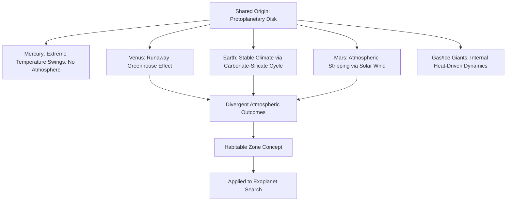

## Comparative Planetology

### Overview

Comparative planetology is the study of planetary bodies through systematic comparison of their formation, composition, structure, atmospheres, and surface processes, using Earth as a reference baseline to better understand planetary evolution generally. By examining why planets that formed from the same protoplanetary disk turned out so differently, comparative planetology reveals the physical processes governing habitability, geological activity, and atmospheric evolution across the solar system and, increasingly, in exoplanetary systems.

### Rationale and Methodology

**Key Points**:

- Comparative planetology treats Earth not as a unique, isolated case study but as one data point within a broader population of planetary bodies, allowing scientists to test hypotheses about planetary processes against a range of natural "experiments" (e.g., comparing greenhouse effects on Venus, Earth, and Mars).
- Data sources include planetary spacecraft missions (flybys, orbiters, landers, rovers), remote telescopic observation (spectroscopy, radar), meteorite analysis, and computer modeling of planetary interiors and atmospheres.
- Key comparative variables include: planetary mass and size, distance from the Sun, atmospheric composition and pressure, internal heat and geological activity, magnetic field presence, and surface age (inferred from impact crater density).

### Terrestrial Planets: A Comparative Overview

| Property | Mercury | Venus | Earth | Mars |
| --- | --- | --- | --- | --- |
| Distance from Sun (AU) | 0.39 | 0.72 | 1.00 | 1.52 |
| Diameter (km) | 4,879 | 12,104 | 12,742 | 6,779 |
| Surface temperature (avg) | ~167°C (extreme swings) | ~464°C | ~15°C | ~-63°C |
| Atmosphere | Negligible | Thick CO₂ (~92 bar) | N₂/O₂ (~1 bar) | Thin CO₂ (~0.006 bar) |
| Magnetic field | Weak | None/negligible | Strong | None (remnant crustal only) |
| Active plate tectonics | No | No | Yes | No |
| Known moons | 0 | 0 | 1 | 2 (small, likely captured) |

### Mercury: A Study in Extremes

**Key Points**:

- Mercury's proximity to the Sun and lack of a substantial atmosphere produce the most extreme surface temperature range of any solar system body (from below -170°C at night to over 400°C during the day).
- Mercury possesses a surprisingly strong magnetic field for its small size, generated by a still partially molten core that is disproportionately large relative to the planet's overall radius, suggesting significant early heat retention or a distinct differentiation history.
- Mercury's surface closely resembles the Moon's, being heavily cratered with minimal erosion or resurfacing due to its lack of atmosphere and geological activity.

### Venus: The Runaway Greenhouse Case Study

**Key Points**:

- Venus provides the clearest natural example of a **runaway greenhouse effect**: an initially Earth-like inventory of water and CO₂ is hypothesized to have been driven into an extreme greenhouse state as solar heating increased over time, evaporating surface water and allowing CO₂ to accumulate in the atmosphere rather than being sequestered in rock via the carbonate-silicate cycle as it is on Earth.
- Venus's atmosphere, composed of ~96% CO₂ at ~92 times Earth's surface pressure, traps heat so effectively that its surface temperature (~464°C) exceeds even Mercury's despite being nearly twice as far from the Sun.
- Venus rotates retrograde (opposite to most solar system bodies) and extremely slowly, with a rotational period (243 Earth days) longer than its orbital period (225 Earth days) — the cause of this unusual rotation remains debated, with a large ancient impact being one proposed explanation [Inference: the precise mechanism responsible for Venus's retrograde, slow rotation is not conclusively established and remains an active research question].
- Venus lacks plate tectonics in the Earth-like sense but shows evidence of significant volcanic resurfacing, with its relatively young, sparsely cratered surface (average age estimated at a few hundred million years) suggesting episodic global resurfacing events rather than continuous plate recycling [Inference: the exact mechanism and periodicity of Venusian resurfacing remains a topic of ongoing research and debate].

### Earth: The Habitability Baseline

**Key Points**:

- Earth uniquely combines liquid surface water, a nitrogen-oxygen atmosphere, active plate tectonics, and a strong global magnetic field — a combination not replicated elsewhere in the solar system.
- Earth's **carbonate-silicate cycle** acts as a long-term climate thermostat: silicate weathering consumes atmospheric CO₂ over geologic timescales, with the rate of weathering increasing with temperature, providing a negative feedback that has helped stabilize Earth's climate over billions of years — a regulatory mechanism notably absent or ineffective on Venus and Mars.
- Earth's magnetic field, generated by convection in its liquid outer core, is hypothesized to help shield the atmosphere from erosion by the solar wind, a process considered a significant contributor to the atmospheric loss observed on Mars [Inference: while magnetic shielding is a widely cited factor in comparative atmospheric retention, the relative importance of magnetic field absence versus other factors like gravity and solar wind exposure duration in Mars's atmospheric loss remains an area of active study].

### Mars: The Cautionary Tale of Atmospheric Loss

**Key Points**:

- Mars shows extensive geological and mineralogical evidence of a warmer, wetter early history, including dry river valley networks, ancient lakebeds, and hydrated mineral deposits, suggesting the planet once hosted substantial liquid surface water.
- Mars's low mass (about 10.7% of Earth's) resulted in weaker gravity and more rapid cooling of its interior, contributing to the loss of a global magnetic field early in its history (evidenced by localized remnant crustal magnetism rather than an active global field).
- Without a protective global magnetic field, Mars's atmosphere is believed to have been gradually stripped away by solar wind erosion over billions of years, a process directly measured in progress by NASA's MAVEN mission, leaving the planet with a thin atmosphere (~0.6% of Earth's surface pressure) insufficient to sustain stable liquid surface water today.
- Mars exhibits no evidence of active plate tectonics, instead showing a single-plate ("stagnant lid") geological regime, though it hosts the largest known volcano in the solar system (Olympus Mons, ~22 km high) and the largest known canyon system (Valles Marineris).

### Gas and Ice Giants: Comparative Structure

| Property | Jupiter | Saturn | Uranus | Neptune |
| --- | --- | --- | --- | --- |
| Composition | H/He dominant | H/He dominant | H/He + ices | H/He + ices |
| Distinguishing feature | Great Red Spot; strongest magnetic field | Prominent ring system | Extreme axial tilt (~98°) | Strongest winds in solar system |
| Internal heat | Significant excess heat | Significant excess heat | Minimal excess heat | Significant excess heat |
| Known moons (approx.) | 95+ | 140+ | 28 | 16 |

**Key Points**:

- Jupiter and Saturn both radiate significantly more energy than they receive from the Sun, attributed to ongoing gravitational contraction and, in Saturn's case, possible helium rain within its interior releasing gravitational potential energy as heat.
- Uranus's extreme axial tilt (~98°, essentially rotating on its side) is hypothesized to result from a massive early collision, though this remains a leading hypothesis rather than a settled conclusion [Inference: alternative explanations involving early satellite system dynamics have also been proposed and the precise formation scenario remains debated].
- Neptune exhibits the strongest sustained winds recorded in the solar system (locally exceeding 2,000 km/h), despite receiving only about 0.1% of the solar energy that Earth receives, indicating that internal heat rather than solar heating is the dominant driver of its atmospheric dynamics.

### Diagram: Comparative Planetary Size and Zone (svg_diagram)

<svg xmlns="http://www.w3.org/2000/svg" viewBox="0 0 640 260">
<text x="320" y="30" text-anchor="middle" font-size="18" font-weight="bold" fill="#1a1a1a">Comparative Planetary Sizes (svg_diagram)</text>
<circle cx="70" cy="190" r="6" fill="#94a3b8" />
<text x="70" y="215" text-anchor="middle" font-size="9" fill="#374151">Mercury</text>
<circle cx="140" cy="190" r="14" fill="#eab308" />
<text x="140" y="215" text-anchor="middle" font-size="9" fill="#374151">Venus</text>
<circle cx="220" cy="190" r="15" fill="#3b82f6" />
<text x="220" y="220" text-anchor="middle" font-size="9" fill="#374151">Earth</text>
<circle cx="290" cy="190" r="8" fill="#ef4444" />
<text x="290" y="215" text-anchor="middle" font-size="9" fill="#374151">Mars</text>
<circle cx="420" cy="170" r="55" fill="#f97316" />
<text x="420" y="240" text-anchor="middle" font-size="9" fill="#374151">Jupiter</text>
<circle cx="540" cy="180" r="45" fill="#fcd34d" />
<text x="540" y="240" text-anchor="middle" font-size="9" fill="#374151">Saturn</text>

<text x="320" y="80" text-anchor="middle" font-size="11" fill="`#4b5563`" font-style="italic">Relative sizes approximate; distances compressed for illustration</text>

</svg>

### Comparative Atmospheric Evolution

**Key Points**:

- All three inner rocky planets with substantial atmospheres (Venus, Earth, Mars) are thought to have originally outgassed similar volatile inventories (CO₂, water vapor, nitrogen) from volcanic activity early in their history, making their divergent present-day atmospheres a striking illustration of how distance from the Sun and planetary characteristics (mass, magnetic field, geological activity) shape long-term atmospheric evolution.
- Venus (runaway greenhouse), Earth (climate-stabilizing carbon cycle), and Mars (atmospheric stripping) represent three distinct evolutionary outcomes from broadly similar starting conditions, making this trio a central case study in planetary habitability research and in modeling the "habitable zone" concept for exoplanets.

### Comparative Planetology Applied to Exoplanets

**Key Points**:

- Comparative planetology methodology directly informs the search for potentially habitable exoplanets by defining the **circumstellar habitable zone** (the orbital distance range where liquid surface water could theoretically exist), using the Venus-Earth-Mars comparison as a foundational reference case.
- Atmospheric spectroscopy of exoplanets (e.g., via the James Webb Space Telescope) applies techniques and comparative frameworks developed from solar system planetary atmospheric studies to infer the composition and potential habitability of planets orbiting other stars [Inference: exoplanet atmospheric characterization remains a rapidly developing field, and interpretations of specific spectroscopic signatures continue to be refined and debated as new data and modeling techniques emerge].

### Comparative Planetology Framework

### Related Topics

- The Runaway Greenhouse Effect on Venus
- Martian Geology and Evidence of Ancient Water
- The Carbonate-Silicate Cycle as a Climate Thermostat
- Planetary Magnetic Fields and Atmospheric Retention
- The Circumstellar Habitable Zone Concept
- Exoplanet Atmospheric Characterization and Spectroscopy
- Gas Giant Interior Structure and Internal Heat Sources
- Planetary Formation and Compositional Gradients