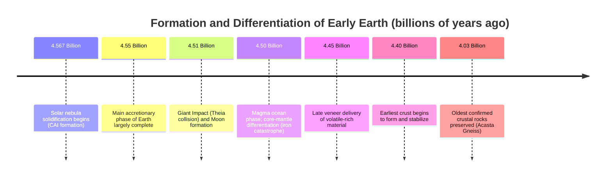

## Formation and Differentiation of Early Earth

### Overview

Earth's formation from the solar nebula approximately 4.54 billion years ago was followed by a period of intense internal reorganization known as **planetary differentiation**, in which the initially homogeneous accreted material separated into distinct compositional layers based on density. This process fundamentally established Earth's layered internal structure — core, mantle, and crust — and set the stage for subsequent processes including magnetic field generation, plate tectonics, and atmospheric evolution. This topic covers Earth's accretionary formation, the heat sources driving differentiation, the mechanics of layer separation, and the resulting early structural configuration.

### Accretion of Early Earth

**Key Points**:

- Earth formed through **accretion** within the solar nebula's inner region (inside the frost line), as dust grains progressively collided and stuck together, building up through planetesimals and protoplanets over a period of tens of millions of years.
- Radiometric dating of the oldest meteoritic material (calcium-aluminum-rich inclusions, or CAIs) places the beginning of solar system solid formation at approximately 4.567 billion years ago, with Earth's main accretionary phase largely completed within about 10–100 million years thereafter [Inference: precise accretion completion timing estimates vary across different isotopic dating systems and modeling approaches].
- Earth's growth involved numerous large-body collisions, culminating in the **Giant Impact** with a Mars-sized protoplanet (Theia) approximately 4.5 billion years ago, an event hypothesized to have both formed the Moon and delivered substantial additional mass and energy to the growing Earth.

### Heat Sources Driving Early Earth

**Key Points**:

- Several heat sources combined to raise early Earth's internal temperature sufficiently to enable widespread melting, a prerequisite for differentiation:
  - **Accretionary heat**: Kinetic energy released as infalling planetesimals and protoplanets collided with the growing Earth, converting kinetic energy into thermal energy.
  - **Radioactive decay**: Heat released from the decay of radioactive isotopes present in accreted material, particularly short-lived isotopes such as aluminum-26 (half-life ~717,000 years) and iron-60, which were far more abundant and thus more thermally significant during Earth's earliest history than the longer-lived isotopes (uranium-238, thorium-232, potassium-40) that dominate present-day radiogenic heat production.
  - **Gravitational potential energy release**: As denser material sank toward the center during differentiation itself, the conversion of gravitational potential energy to heat created a self-reinforcing feedback that further promoted continued differentiation.
  - **The Giant Impact**: The Theia collision is thought to have delivered an enormous, catastrophic pulse of energy, likely melting a substantial portion of early Earth's outer layers.
- The combined effect of these heat sources is believed to have produced a **magma ocean** — a global or near-global layer of molten rock covering early Earth's surface to significant depth, providing the low-viscosity conditions necessary for efficient large-scale density-based separation of materials [Inference: the exact depth, duration, and degree of global coverage of the magma ocean phase remain subjects of ongoing geochemical and modeling research].

### The Process of Planetary Differentiation

**Definition**: Planetary differentiation is the physical and chemical process by which an initially homogeneous body separates into layers of differing composition and density, with denser materials sinking toward the center and lighter materials rising toward the surface.

**Key Points**:

- Within the magma ocean, dense iron and nickel (along with siderophile, or "iron-loving," elements) sank toward Earth's center due to their higher density relative to silicate rock, forming the **core**.
- Lighter silicate minerals, rich in elements such as silicon, magnesium, and oxygen, remained in the outer regions, forming the **mantle** and eventually the **crust** as the outermost material cooled and solidified.
- This gravity-driven separation process is sometimes referred to as the **iron catastrophe**, describing the relatively rapid (in geological terms) sinking of molten iron through the silicate mantle to form the core, a process estimated to have occurred within tens of millions of years of Earth's initial accretion [Inference: the specific rate and mechanism (percolation versus diapiric sinking of iron blobs) of core formation remain actively debated in geochemical and geodynamic modeling literature].
- Evidence for the timing of core formation comes primarily from the **hafnium-tungsten (Hf-W) isotopic system**: hafnium is lithophile (remains in the silicate mantle) while tungsten is siderophile (partitions into the core), so measuring the degree of hafnium-tungsten isotopic decoupling in mantle-derived rocks constrains how quickly core formation occurred relative to the decay of short-lived hafnium-182.

### Diagram: Differentiation Process (svg_diagram)

<svg xmlns="http://www.w3.org/2000/svg" viewBox="0 0 640 320">
<text x="320" y="30" text-anchor="middle" font-size="18" font-weight="bold" fill="#1a1a1a">Planetary Differentiation of Early Earth (svg_diagram)</text>

<text x="120" y="65" text-anchor="middle" font-size="13" font-weight="bold" fill="`#374151`">Homogeneous Accretion</text>

<circle cx="120" cy="160" r="70" fill="`#a8a29e`" stroke="`#57534e`" stroke-width="1.5" />

<circle cx="100" cy="145" r="8" fill="`#78716c`" />

<circle cx="140" cy="170" r="6" fill="`#78716c`" />

<circle cx="110" cy="185" r="7" fill="`#78716c`" />

<circle cx="150" cy="130" r="5" fill="`#78716c`" />

<path d="M210 160 L280 160" stroke="#374151" stroke-width="2" marker-end="url(#arrowD)" />
<text x="245" y="145" text-anchor="middle" font-size="10" fill="#374151">Melting &amp;</text>
<text x="245" y="180" text-anchor="middle" font-size="10" fill="#374151">Sinking</text>

<text x="480" y="65" text-anchor="middle" font-size="13" font-weight="bold" fill="`#374151`">Differentiated Layers</text>

<circle cx="480" cy="160" r="70" fill="`#fde68a`" stroke="`#b45309`" stroke-width="1.5" />

<circle cx="480" cy="160" r="45" fill="`#fb923c`" stroke="`#c2410c`" stroke-width="1.5" />

<circle cx="480" cy="160" r="20" fill="`#dc2626`" stroke="`#7f1d1d`" stroke-width="1.5" />

<text x="480" y="165" text-anchor="middle" font-size="9" font-weight="bold" fill="`#ffffff`">Core</text>

<text x="480" y="115" text-anchor="middle" font-size="9" fill="`#78350f`">Mantle</text>

<text x="480" y="95" text-anchor="middle" font-size="9" fill="`#4b5563`">Crust</text>

<text x="320" y="280" text-anchor="middle" font-size="11" fill="`#4b5563`" font-style="italic">Dense iron/nickel sinks to form the core; lighter silicates rise to form mantle and crust</text>

</svg>

### Resulting Layered Structure

**Key Points**:

- Differentiation produced Earth's fundamental compositional layering, later further subdivided by mechanical behavior (lithosphere/asthenosphere) as Earth continued to cool:
  - **Core**: Iron-nickel dominated, further differentiating over time into a solid inner core and liquid outer core as Earth progressively cooled from the outside in.
  - **Mantle**: Silicate-dominated, magnesium- and iron-rich rock (peridotite composition), constituting the largest layer by volume (~84% of Earth's total volume).
  - **Crust**: The thin, least dense outermost layer, further divided into denser basaltic oceanic crust and less dense granitic continental crust, with continental crust forming later through subsequent partial melting and differentiation processes within the mantle and early crust.
- This layered structure is confirmed observationally through **seismology**: the behavior of seismic waves as they pass through and reflect off boundaries between layers of differing density and physical state (e.g., the abrupt change in wave behavior at the core-mantle boundary) provides direct evidence of Earth's internal compositional structure.

### The Late Veneer and Volatile Delivery

**Key Points**:

- Following core formation, Earth is hypothesized to have received a **late veneer** — a relatively small amount of additional material (comprising water-rich and volatile-rich asteroids or comets) delivered via impacts after the main phase of core formation had concluded.
- This concept helps explain the presence of certain highly siderophile elements (which should have been almost entirely removed into the core during earlier differentiation) still found in Earth's mantle at higher-than-expected concentrations, suggesting their delivery occurred after core formation was largely complete.
- The late veneer hypothesis is also invoked as a potential contributor (alongside other proposed sources) to Earth's water and volatile inventory, though the relative contribution of late veneer delivery versus water retained from Earth's original accretionary material remains an actively debated question in planetary science [Inference: multiple competing hypotheses for the origin of Earth's water exist, and current isotopic evidence does not yet definitively favor a single source].

### Timeline of Early Earth Formation

### Evidence Supporting the Differentiation Model

**Key Points**:

- **Meteorite analogs**: Iron meteorites are interpreted as fragments of the differentiated cores of shattered early planetesimals, while stony (chondritic) meteorites represent undifferentiated primitive material, together providing a natural analog for the differentiation process believed to have occurred within Earth itself.
- **Seismological evidence**: Variations in seismic wave velocity and the reflection/refraction of waves at internal boundaries (Mohorovičić discontinuity at the crust-mantle boundary; core-mantle boundary at ~2,900 km depth) directly confirm the presence and approximate depths of Earth's differentiated layers.
- **Geochemical evidence**: The depletion of siderophile elements in mantle-derived rocks relative to their abundance in undifferentiated chondritic meteorites is consistent with those elements having been removed into the core during differentiation.

### Related Topics

- The Giant Impact Hypothesis and Moon Formation
- Core-Mantle Boundary Structure and Seismological Evidence
- The Hafnium-Tungsten Isotopic System and Core Formation Timing
- Radiogenic Heat Production and Earth's Thermal History
- The Late Veneer Hypothesis and the Origin of Earth's Water
- Meteorite Classification as Analogs for Planetary Differentiation
- The Oldest Rocks on Earth (Acasta Gneiss, Jack Hills Zircons)
- Mantle Convection and Its Relationship to Early Differentiation