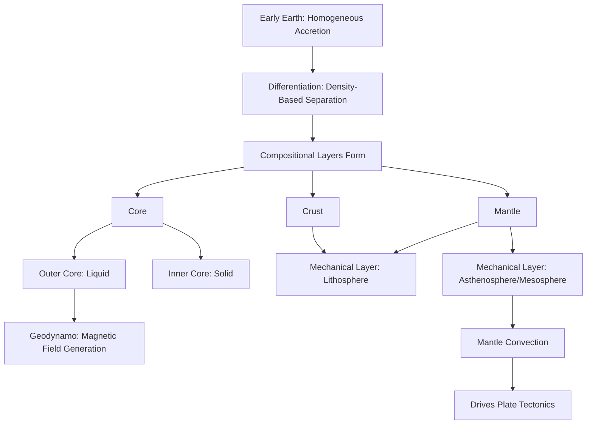

## Earth's Interior Layers

### Overview

Earth's interior is organized into distinct layers, classified either by **chemical composition** (crust, mantle, core) or by **physical/mechanical properties** (lithosphere, asthenosphere, mesosphere, outer core, inner core). This layered structure, established during early planetary differentiation, has been mapped in remarkable detail primarily through seismological methods, since direct sampling is limited to only the outermost few kilometers of the crust. This topic covers both classification schemes, the depth and properties of each layer, and the methods used to study Earth's otherwise inaccessible interior.

### Two Classification Schemes

**Key Points**:

- **Compositional layering** describes differences in chemical makeup, dividing Earth into the crust, mantle, and core based on distinct chemistry established during differentiation.
- **Mechanical (rheological) layering** describes differences in physical behavior under stress (rigid vs. ductile vs. liquid), dividing Earth into the lithosphere, asthenosphere, mesosphere, outer core, and inner core.
- These two schemes overlap but are not identical — for example, the lithosphere (a mechanical layer) includes both the entire crust and the uppermost, rigid part of the mantle (a compositional layer).

### Compositional Layers

**Crust**:

- The thin, outermost, chemically distinct layer, divided into two types:
  - **Oceanic crust**: ~5–10 km thick, composed primarily of basalt, denser (~3,000 kg/m³) than continental crust, continuously formed at mid-ocean ridges and recycled via subduction.
  - **Continental crust**: ~30–50 km thick on average (up to ~70 km beneath major mountain ranges), composed primarily of granitic rock, less dense (~2,700 kg/m³) than oceanic crust, and generally much older since it is not efficiently recycled by subduction.
- The **Mohorovičić discontinuity (Moho)** marks the compositional boundary between the crust and the underlying mantle, identified by an abrupt increase in seismic wave velocity.

**Mantle**:

- Extends from the Moho to the core-mantle boundary at ~2,900 km depth, comprising approximately 84% of Earth's total volume.
- Composed primarily of **peridotite**, an iron- and magnesium-rich silicate rock; composition becomes progressively denser with depth due to increasing pressure-induced mineral phase changes rather than significant chemical composition change.
- Subdivided into the **upper mantle** (Moho to ~660 km) and **lower mantle** (~660 km to the core-mantle boundary), separated by the **transition zone**, where increasing pressure causes minerals to reorganize into denser crystal structures without a change in overall chemical composition.

**Core**:

- Extends from the core-mantle boundary (~2,900 km) to Earth's center (~6,371 km), composed primarily of iron and nickel, with a smaller fraction of lighter elements (such as sulfur, oxygen, or silicon) whose exact composition and proportion remain subjects of ongoing geophysical research [Inference: the precise identity and amount of the lighter alloying element(s) in the core is inferred indirectly from seismic density measurements and high-pressure laboratory experiments, and is not directly sampled or fully resolved].
- Subdivided into the **liquid outer core** and **solid inner core**, distinguished by physical state rather than significant compositional difference.

### Mechanical Layers

**Lithosphere**:

- The rigid, brittle outer shell of Earth, comprising the entire crust plus the uppermost, rigid portion of the mantle; thickness varies from ~5–10 km beneath young oceanic ridges to over 200 km beneath old continental interiors (cratons).
- Broken into large, rigid tectonic plates that move relative to one another, forming the physical basis for plate tectonic theory.

**Asthenosphere**:

- A ductile, partially molten (1–5% partial melt) layer of the upper mantle beneath the lithosphere, extending to roughly 660 km depth (though its lower boundary is gradational and debated); its low viscosity allows tectonic plates to move atop it.

**Mesosphere (Lower Mantle)**:

- The solid, though still slowly convecting, lower mantle below the asthenosphere, extending to the core-mantle boundary; behaves as a solid over short timescales but flows very slowly (over millions of years) due to immense heat and pressure.

**Outer Core**:

- Liquid iron-nickel alloy, extending from ~2,900 km to ~5,150 km depth; convective motion within this layer, combined with Earth's rotation, generates Earth's magnetic field through the **geodynamo** process.

**Inner Core**:

- Solid iron-nickel, extending from ~5,150 km to Earth's center (~6,371 km); remains solid despite extreme temperature (estimated ~5,200°C, comparable to the Sun's surface) because of the immense pressure at this depth, which raises the melting point of iron above the ambient temperature.

### Diagram: Earth's Interior Layers — Both Classification Schemes (svg_diagram)

<svg xmlns="http://www.w3.org/2000/svg" viewBox="0 0 640 420">
<text x="320" y="30" text-anchor="middle" font-size="18" font-weight="bold" fill="#1a1a1a">Earth's Interior: Composition vs. Mechanics (svg_diagram)</text>

<text x="170" y="60" text-anchor="middle" font-size="13" font-weight="bold" fill="`#374151`">Compositional</text>

<circle cx="170" cy="240" r="170" fill="`#fef9c3`" stroke="`#a16207`" stroke-width="1" />

<circle cx="170" cy="240" r="130" fill="`#fde68a`" stroke="`#b45309`" stroke-width="1" />

<circle cx="170" cy="240" r="60" fill="`#dc2626`" stroke="`#7f1d1d`" stroke-width="1" />

<text x="170" y="90" text-anchor="middle" font-size="10" fill="`#4b5563`">Crust</text>

<text x="170" y="130" text-anchor="middle" font-size="10" font-weight="bold" fill="`#78350f`">Mantle</text>

<text x="170" y="245" text-anchor="middle" font-size="10" font-weight="bold" fill="`#ffffff`">Core</text>

<text x="480" y="60" text-anchor="middle" font-size="13" font-weight="bold" fill="`#374151`">Mechanical</text>

<circle cx="480" cy="240" r="170" fill="`#fef9c3`" stroke="`#a16207`" stroke-width="1" />

<circle cx="480" cy="240" r="150" fill="`#fca5a5`" stroke="`#b91c1c`" stroke-width="1" />

<circle cx="480" cy="240" r="115" fill="`#bbf7d0`" stroke="`#15803d`" stroke-width="1" />

<circle cx="480" cy="240" r="65" fill="`#93c5fd`" stroke="`#1d4ed8`" stroke-width="1" />

<circle cx="480" cy="240" r="30" fill="`#dc2626`" stroke="`#7f1d1d`" stroke-width="1" />

<text x="480" y="95" text-anchor="middle" font-size="9" fill="`#78350f`">Lithosphere</text>

<text x="480" y="115" text-anchor="middle" font-size="9" fill="`#7f1d1d`">Asthenosphere</text>

<text x="480" y="150" text-anchor="middle" font-size="9" fill="`#14532d`">Mesosphere</text>

<text x="480" y="205" text-anchor="middle" font-size="9" fill="`#1e3a8a`">Outer Core</text>

<text x="480" y="245" text-anchor="middle" font-size="8" font-weight="bold" fill="`#ffffff`">Inner Core</text>

</svg>

### Depth and Property Reference Table

| Layer | Depth Range | State | Key Composition |
| --- | --- | --- | --- |
| Crust (oceanic) | 0–10 km | Solid | Basalt |
| Crust (continental) | 0–70 km | Solid | Granite |
| Upper Mantle | ~10–660 km | Solid/ductile (asthenosphere) | Peridotite |
| Lower Mantle | ~660–2,900 km | Solid, slow-flowing | Peridotite (denser phases) |
| Outer Core | ~2,900–5,150 km | Liquid | Iron-nickel alloy |
| Inner Core | ~5,150–6,371 km | Solid | Iron-nickel alloy |

### Seismological Evidence: How We Know Earth's Interior Structure

**Key Points**:

- Since direct sampling is limited to shallow crustal depths (the deepest borehole, the Kola Superdeep Borehole, reached only ~12.3 km), knowledge of Earth's deep interior relies almost entirely on **seismology** — the study of how seismic waves generated by earthquakes travel through and reflect off Earth's internal layers.
- **P-waves (primary/compressional waves)** can travel through both solid and liquid material, while **S-waves (secondary/shear waves)** can only travel through solids; the discovery that S-waves do not pass through the outer core provided the key evidence that the outer core is liquid.
- Sudden changes in seismic wave velocity and direction at internal boundaries (Moho, core-mantle boundary, inner-outer core boundary) reveal the depths and physical states of Earth's internal layers, while a "shadow zone" where direct P-waves fail to reach certain surface locations provided the original evidence for the core's existence and approximate size.
- Additional evidence comes from **high-pressure laboratory experiments** (using diamond anvil cells to replicate deep Earth pressures and temperatures) and **gravitational and magnetic field measurements**, which constrain interior density distribution and core dynamics respectively.

### Earth's Internal Heat and Convection

**Key Points**:

- Earth's interior remains hot due to residual heat from formation/differentiation combined with ongoing radioactive decay (primarily of uranium-238, thorium-232, and potassium-40) within the mantle and crust.
- This internal heat drives **mantle convection** — the slow, large-scale circulation of solid mantle rock (flowing at rates of centimeters per year, comparable to fingernail growth) — which is the fundamental driving mechanism behind plate tectonics.
- Convection in the liquid outer core, combined with Earth's rotation (the **Coriolis effect** acting on core fluid motion), generates Earth's magnetic field through the **geodynamo** mechanism.

### Interior Structure Formation Flow

### Related Topics

- Seismic Wave Behavior and Earth's Interior Mapping
- The Geodynamo and Earth's Magnetic Field Generation
- Mantle Convection and Plate Tectonic Driving Forces
- The Mohorovičić Discontinuity and Crust-Mantle Boundary
- High-Pressure Mineral Physics and Mantle Phase Transitions
- Planetary Differentiation and Core Formation
- The Kola Superdeep Borehole and Limits of Direct Sampling
- Earth's Thermal History and Radiogenic Heat Production