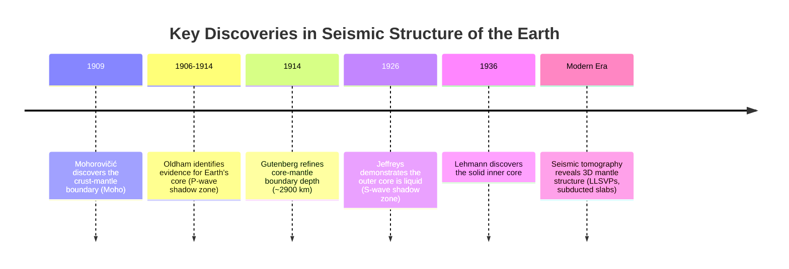
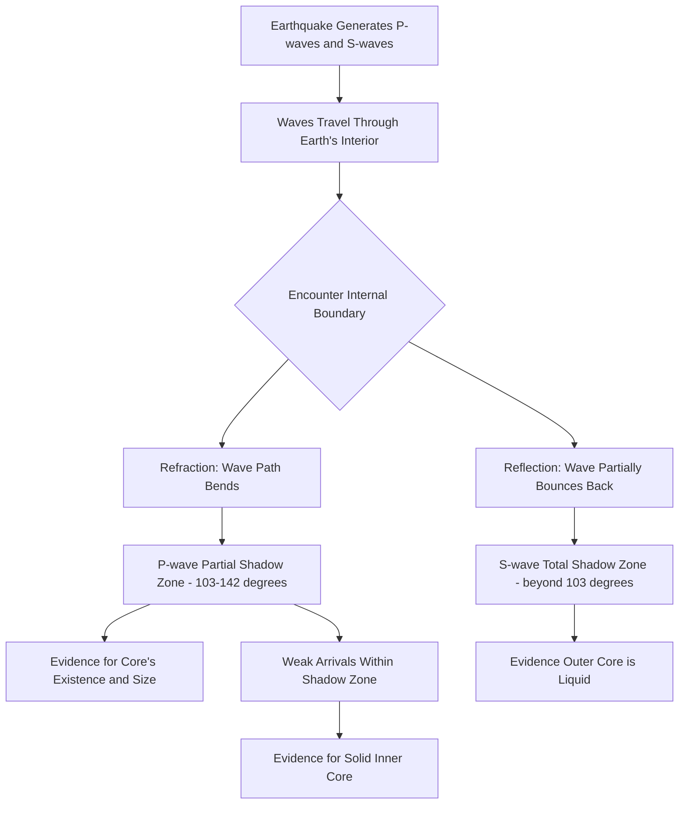

## Seismic Evidence for Earth's Structure

### Overview

Seismology — the study of seismic waves generated primarily by earthquakes — provides the primary method by which scientists have mapped Earth's internal structure, since direct physical access is limited to only the outermost few kilometers of the crust. By analyzing how seismic waves travel, bend, reflect, and are blocked as they pass through Earth's interior, seismologists have reconstructed the depths, physical states, and approximate compositions of Earth's internal layers with remarkable precision. This topic covers seismic wave types, wave behavior at internal boundaries, the key historical discoveries that established Earth's layered structure, and modern seismic imaging techniques.

### Types of Seismic Waves

**Body Waves** (travel through Earth's interior):

- **P-waves (Primary/Compressional waves)**: The fastest seismic waves, traveling through solids, liquids, and gases by compressing and expanding material in the direction of wave travel (longitudinal motion). Because they can pass through liquid, P-waves are able to travel through Earth's liquid outer core.
- **S-waves (Secondary/Shear waves)**: Slower than P-waves, traveling only through solids by shearing material perpendicular to the direction of wave travel (transverse motion). S-waves cannot travel through liquids or gases because these media lack the shear strength to transmit transverse motion.

**Surface Waves** (travel along Earth's surface):

- **Love waves**: Cause horizontal, side-to-side ground motion; generally the fastest surface waves and often the most destructive to structures.
- **Rayleigh waves**: Cause a rolling, elliptical ground motion (combining vertical and horizontal components), similar to ocean waves.
- Surface waves travel more slowly than body waves but often carry greater destructive energy in earthquakes due to their larger amplitude and longer duration at the surface.

**Key Points**:

- The differing physical requirements for P-wave versus S-wave propagation (specifically, S-waves' inability to travel through liquid) form the single most important piece of evidence for the liquid state of Earth's outer core.
- Seismic wave velocity generally increases with depth within a given layer due to increasing pressure and density, but changes abruptly at compositional or phase boundaries, producing detectable **discontinuities**.

### Wave Behavior at Internal Boundaries

**Key Points**:

- When a seismic wave encounters a boundary between materials of differing density or physical state, it undergoes **refraction** (bending, due to a change in wave velocity) and **reflection** (partial bouncing back), similar to how light bends and reflects at an interface between two different media.
- The degree and pattern of refraction and reflection at a given depth reveal the presence, sharpness, and nature of a boundary, allowing seismologists to map internal structure without direct physical access.
- **Seismic shadow zones**: Regions on Earth's surface where direct seismic waves from a given earthquake fail to arrive, due to specific patterns of refraction, reflection, or blocking at internal boundaries. The existence and geometry of shadow zones provided some of the earliest and most important evidence for the size and properties of Earth's core.

### Diagram: Seismic Wave Paths and the Core Shadow Zone (svg_diagram)

<svg xmlns="http://www.w3.org/2000/svg" viewBox="0 0 640 400">
<text x="320" y="30" text-anchor="middle" font-size="18" font-weight="bold" fill="#1a1a1a">Seismic Shadow Zone Geometry (svg_diagram)</text>
<circle cx="320" cy="220" r="170" fill="#fde68a" stroke="#b45309" stroke-width="1.5" />
<circle cx="320" cy="220" r="80" fill="#dc2626" stroke="#7f1d1d" stroke-width="1.5" />
<text x="320" y="225" text-anchor="middle" font-size="10" font-weight="bold" fill="#ffffff">Core</text>
<circle cx="320" cy="52" r="6" fill="#1f2937" />
<text x="320" y="42" text-anchor="middle" font-size="9" fill="#374151">Earthquake Focus</text>
<path d="M320,52 Q260,140 200,220" stroke="#1d4ed8" stroke-width="2" fill="none" />
<path d="M320,52 Q380,140 440,220" stroke="#1d4ed8" stroke-width="2" fill="none" />
<path d="M320,52 Q160,180 100,270" stroke="#b91c1c" stroke-width="2" fill="none" stroke-dasharray="4,3" />
<path d="M320,52 Q480,180 540,270" stroke="#b91c1c" stroke-width="2" fill="none" stroke-dasharray="4,3" />

<text x="150" y="300" text-anchor="middle" font-size="10" fill="`#b91c1c`">P-wave Shadow Zone</text>

<text x="490" y="300" text-anchor="middle" font-size="10" fill="`#b91c1c`">(103°-142° from source)</text>

<text x="200" y="200" text-anchor="middle" font-size="9" fill="`#1e3a8a`">Direct P-waves</text>

<text x="320" y="380" text-anchor="middle" font-size="11" fill="`#4b5563`" font-style="italic">Core refraction bends waves away, creating a zone with no direct P-wave arrivals</text>

</svg>

### Historical Discoveries in Seismological Structure Mapping

**Key Points**:

- **Mohorovičić discontinuity (1909)**: Croatian seismologist Andrija Mohorovičić discovered an abrupt increase in seismic wave velocity at a shallow depth beneath the crust, identifying the boundary (now called the "Moho") between the crust and the underlying mantle.
- **Core discovery (1906–1914)**: Richard Dixon Oldham first identified evidence for Earth's core based on the observed P-wave shadow zone (a ring-shaped region roughly 103°–142° of angular distance from an earthquake's epicenter where direct P-waves fail to arrive, caused by strong refraction as waves pass through the core). Beno Gutenberg subsequently refined the depth estimate of the core-mantle boundary to approximately 2,900 km, a figure that closely matches modern determinations.
- **Liquid outer core (1926)**: Harold Jeffreys demonstrated, based on the complete absence of direct S-wave arrivals beyond a certain angular distance (the S-wave shadow zone, which is total, unlike the partial P-wave shadow zone), that the outer core must be liquid, since S-waves cannot propagate through liquid at all.
- **Solid inner core (1936)**: Danish seismologist Inge Lehmann discovered weak seismic wave arrivals within the theoretical P-wave shadow zone, deducing the existence of a smaller, solid inner core within the liquid outer core, off which some P-waves reflect and refract to reach shadow-zone locations that a uniform liquid core alone could not explain.

### The Shadow Zones Explained

**P-wave Shadow Zone**:

- A ring-shaped region on Earth's surface, roughly 103° to 142° angular distance from an earthquake's focus, where direct P-waves are absent because the core's differing density strongly refracts (bends) P-waves away from this zone.
- The shadow zone is partial rather than total because weaker, indirect P-waves (reflected or refracted through the inner core, or via other complex paths) can still reach parts of this region, which is precisely how the solid inner core was ultimately detected.

**S-wave Shadow Zone**:

- A much larger region, beyond approximately 103° angular distance from the earthquake's focus, where S-waves are entirely absent, because S-waves cannot travel through the liquid outer core at all.
- This total absence (rather than mere attenuation) of S-waves beyond 103° is the definitive evidence establishing that the outer core is liquid.

### Modern Seismic Imaging Techniques

**Key Points**:

- **Seismic tomography**: An imaging technique analogous to medical CT scanning, using data from thousands of earthquakes recorded at seismic stations worldwide to reconstruct detailed three-dimensional maps of seismic wave velocity variations within Earth's interior, revealing features such as subducting tectonic plates and mantle plumes.
- **Receiver functions**: Analysis techniques that use the conversion of P-waves to S-waves (and vice versa) at internal boundaries beneath a specific seismic station to determine precise local crustal and upper mantle thickness and structure.
- **Global seismic networks**: Coordinated international networks of seismometers (such as the Global Seismographic Network) provide the continuous, widely distributed data needed for both routine earthquake monitoring and long-term structural imaging research.
- Modern seismic tomography has revealed large-scale mantle structures such as **Large Low-Shear-Velocity Provinces (LLSVPs)** at the base of the mantle beneath Africa and the Pacific, whose exact composition and origin remain active areas of geophysical research [Inference: the precise nature, origin, and long-term stability of LLSVPs are not yet fully resolved and represent an ongoing area of scientific investigation].

### Seismic Evidence Discovery Timeline

### Seismic Evidence Reasoning Flow

### Related Topics

- P-wave and S-wave Physics and Wave Propagation
- Seismic Tomography and Three-Dimensional Mantle Imaging
- The History of Seismology as a Scientific Discipline
- Earthquake Location and Magnitude Determination Methods
- The Core-Mantle Boundary and Large Low-Shear-Velocity Provinces
- Global Seismic Networks and Earthquake Monitoring Infrastructure
- Mantle Plumes and Deep Earth Convection Patterns
- Planetary Seismology: Applying These Methods Beyond Earth