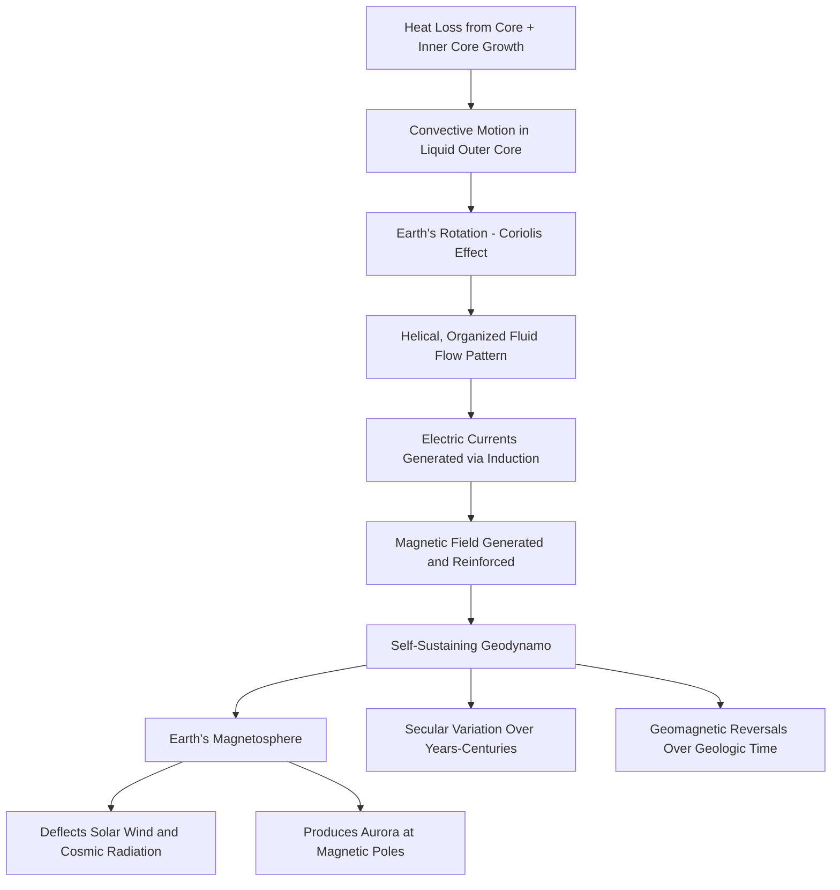

## The Geodynamo and Earth's Magnetic Field

### Overview

Earth's magnetic field, extending from its interior far into surrounding space, is generated by the **geodynamo** — a process driven by convective motion of electrically conductive liquid iron in the outer core, combined with Earth's rotation. This field plays a critical protective role, shielding the atmosphere and surface from solar wind and cosmic radiation, while also enabling both ancient and modern navigation. This topic covers the physical mechanism of the geodynamo, the structure of the magnetic field, its historical variability, and its broader significance for Earth's habitability and geological record.

### The Geodynamo Mechanism

**Definition**: The geodynamo is the self-sustaining process by which convective motion of electrically conductive fluid in Earth's outer core generates and maintains Earth's magnetic field.

**Key Points**:

- The geodynamo requires three essential ingredients: (1) a large volume of electrically conductive fluid (the liquid iron-nickel outer core), (2) sufficient energy to drive vigorous convective motion within that fluid, and (3) rotation (which organizes the convective flow through the Coriolis effect into helical patterns favorable for magnetic field generation).
- Convection in the outer core is driven by a combination of heat loss from the core to the mantle and **compositional convection** — as the solid inner core slowly grows by freezing outward, it excludes lighter alloying elements (such as sulfur or oxygen) into the surrounding liquid outer core, and this buoyant, less-dense material rises, contributing significantly to driving convective flow.
- As electrically conductive fluid moves through Earth's existing magnetic field, it generates electric currents (via electromagnetic induction); these currents in turn generate their own magnetic fields, which can reinforce the original field in a self-sustaining feedback loop — this is the basic principle of a **self-exciting dynamo**.
- The geodynamo is fundamentally a chaotic, self-organizing system; sustaining it requires ongoing energy input, and the process is understood primarily through magnetohydrodynamic (MHD) computer simulations combined with geomagnetic observational data, since direct observation of core dynamics is not possible [Inference: the precise relative contributions of thermal versus compositional convection to the total energy budget driving the geodynamo remain subjects of ongoing geophysical modeling research].

### Diagram: The Geodynamo Mechanism (svg_diagram)

<svg xmlns="http://www.w3.org/2000/svg" viewBox="0 0 640 340">
<text x="320" y="30" text-anchor="middle" font-size="18" font-weight="bold" fill="#1a1a1a">The Geodynamo Mechanism (svg_diagram)</text>
<circle cx="320" cy="200" r="140" fill="#fde68a" stroke="#b45309" stroke-width="1.5" />
<circle cx="320" cy="200" r="90" fill="#fb923c" stroke="#c2410c" stroke-width="1.5" />
<circle cx="320" cy="200" r="35" fill="#7f1d1d" stroke="#450a0a" stroke-width="1.5" />
<text x="320" y="205" text-anchor="middle" font-size="9" font-weight="bold" fill="#ffffff">Inner Core</text>
<text x="320" y="150" text-anchor="middle" font-size="10" font-weight="bold" fill="#78350f">Outer Core (Liquid Fe-Ni)</text>
<path d="M280,240 C260,260 270,290 300,300" stroke="#1d4ed8" stroke-width="2" fill="none" marker-end="url(#arrowG)" />
<path d="M360,240 C380,260 370,290 340,300" stroke="#1d4ed8" stroke-width="2" fill="none" marker-end="url(#arrowG)" />
<text x="320" y="325" text-anchor="middle" font-size="9" fill="#1e3a8a">Helical Convective Flow (Coriolis-organized)</text>
<path d="M100,80 Q320,20 540,80" stroke="#374151" stroke-width="1.5" fill="none" stroke-dasharray="4,3" marker-end="url(#arrowG)" />
<text x="320" y="60" text-anchor="middle" font-size="9" fill="#374151">Generated Magnetic Field Lines</text>
</svg>

### Structure of Earth's Magnetic Field

**Key Points**:

- To first approximation, Earth's magnetic field resembles that of a simple bar magnet (a **magnetic dipole**), with field lines emerging from the vicinity of the geographic south pole region, curving around Earth through space, and re-entering near the geographic north pole region.
- The **magnetic poles** (where field lines are vertical) do not coincide exactly with the **geographic poles** (the points where Earth's rotational axis intersects the surface); the angular difference between true north and magnetic north at a given location is called **magnetic declination**.
- Earth's magnetic field extends far beyond the planet's surface, forming the **magnetosphere** — a region of space dominated by Earth's magnetic field rather than the Sun's, which deflects most incoming solar wind particles around the planet.
- The magnetosphere is compressed on the side facing the Sun (to roughly 6–10 Earth radii) by solar wind pressure and stretched into a long tail (the **magnetotail**) on the side facing away from the Sun, extending well beyond the Moon's orbit.

### Magnetic Field Variability

**Secular Variation**:

- Earth's magnetic field is not static; its intensity, direction, and structure change gradually over years to centuries, a phenomenon called **secular variation**, driven by ongoing changes in outer core fluid flow patterns.
- Magnetic declination at any given location changes measurably over years to decades, requiring periodic updates to magnetic navigation charts and compass correction tables.

**Geomagnetic Reversals**:

- Over geologic timescales, Earth's magnetic field periodically undergoes complete **polarity reversals**, in which the north and south magnetic poles effectively swap positions; reversals occur irregularly, with average intervals between reversals varying considerably (from tens of thousands to millions of years) rather than following a fixed periodic cycle.
- The most recent complete reversal, the **Brunhes-Matuyama reversal**, occurred approximately 780,000 years ago.
- Evidence for past reversals comes from **paleomagnetism**: as molten rock (particularly basalt erupted at mid-ocean ridges) cools and solidifies, magnetic minerals within it align with Earth's magnetic field at that time and lock in a permanent record; the striped, symmetric pattern of alternating magnetic polarity preserved in oceanic crust on either side of mid-ocean ridges provided crucial early evidence supporting the theory of seafloor spreading and plate tectonics.
- The mechanism, precise duration, and predictability of reversal events remain active areas of geophysical research, though computer simulations of the geodynamo have successfully reproduced reversal-like behavior, lending support to current theoretical models [Inference: current models can reproduce reversal-like behavior, but they do not yet allow reliable prediction of when the next reversal will occur].

### Geomagnetic Excursions

**Key Points**:

- A **geomagnetic excursion** is a shorter-lived, incomplete departure from normal polarity (in which the field weakens significantly and may partially or briefly reverse before returning to its original orientation), distinct from a full, sustained polarity reversal.
- Excursions are documented in the paleomagnetic record more frequently than full reversals and are of particular interest to researchers studying the field's current behavior, given ongoing observed weakening in specific regions such as the South Atlantic Anomaly [Inference: whether the currently observed field weakening represents the early stage of an excursion, a full reversal, or simply normal secular variation is not yet determinable from current data alone].

### The Protective Role of the Magnetic Field

**Key Points**:

- Earth's magnetosphere deflects the majority of incoming solar wind particles and charged cosmic radiation around the planet, substantially reducing atmospheric erosion and surface radiation exposure compared to a planet lacking a global magnetic field.
- The comparative case of Mars — which lost its global magnetic field early in its history and subsequently experienced substantial atmospheric loss attributed in significant part to unshielded solar wind stripping — is frequently cited as illustrative of the protective role a magnetic field can play in supporting long-term atmospheric retention and planetary habitability [Inference: while magnetic shielding is considered a significant contributing factor in this comparison, the precise relative importance of magnetic field loss versus other factors in Mars's atmospheric history remains an active research question].
- Charged particles that do enter the magnetosphere, particularly near the magnetic poles where field lines converge, interact with atmospheric gases to produce the **aurora** (aurora borealis in the north, aurora australis in the south).

### Practical Applications

**Example**: Compass-based navigation relies directly on Earth's magnetic field alignment, though accurate use requires correcting for magnetic declination, which varies by geographic location and changes gradually over time due to secular variation — a correction factor printed on topographic maps and navigational charts and periodically updated.

**Example**: Geomagnetic storms, triggered by solar coronal mass ejections interacting with Earth's magnetosphere, can induce damaging electrical currents in power grids and disrupt satellite operations and radio communications, motivating continuous space weather monitoring by agencies such as NOAA's Space Weather Prediction Center.

### Geodynamo Process Flow

### Related Topics

- Paleomagnetism and Evidence for Seafloor Spreading
- Geomagnetic Reversals and the Geomagnetic Polarity Time Scale
- The Magnetosphere, Solar Wind, and Space Weather
- Comparative Planetary Magnetism (Mars, Mercury, Jupiter)
- Magnetohydrodynamic Simulation of the Geodynamo
- Aurora Formation and Charged Particle Interactions
- Compass Navigation and Magnetic Declination Correction
- The South Atlantic Anomaly and Current Field Weakening