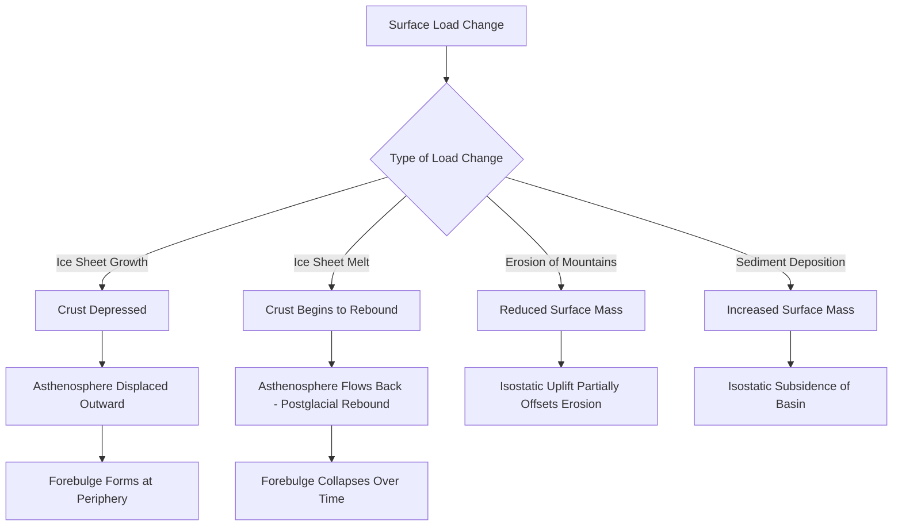

## Gravity and Isostasy

### Overview

Earth's gravitational field, while broadly uniform, exhibits measurable local and regional variations tied to differences in subsurface density and topography. **Isostasy** — the principle of gravitational equilibrium between Earth's rigid lithosphere and the underlying, more fluid asthenosphere — explains how topographic features such as mountains and ocean basins are supported and how the crust responds to changes in surface load over time. This topic covers the physics of gravitational measurement, the concept and models of isostasy, isostatic adjustment processes, and their applications in geodesy and geology.

### Earth's Gravitational Field

**Key Points**:

- Gravitational acceleration at Earth's surface averages approximately 9.8 m/s², but varies measurably by location due to several factors: latitude (due to the equatorial bulge and centrifugal effect of rotation), elevation (distance from Earth's center), and local subsurface density variations.
- Newton's law of universal gravitation describes the underlying gravitational force between any two masses:

$$F = G\frac{m_1 m_2}{r^2}$$

- **Gravity anomalies** are deviations of measured gravitational acceleration from a theoretical reference value predicted for an idealized, uniform Earth at a given latitude and elevation; these anomalies reveal subsurface density variations and are a key tool in geophysical exploration.
- **Bouguer anomaly**: A gravity anomaly calculation that corrects for elevation and the gravitational effect of the rock mass between the measurement point and sea level, isolating the gravitational signal attributable to subsurface density variations (useful for identifying buried geological structures such as dense ore bodies or low-density sedimentary basins).
- **Free-air anomaly**: A gravity anomaly calculation that corrects only for elevation (not for the mass of rock beneath the measurement point), commonly used as an initial step in isostatic analysis, since a properly isostatically compensated region shows a free-air anomaly close to zero.

### The Principle of Isostasy

**Definition**: Isostasy is the state of gravitational equilibrium between Earth's less dense, rigid lithosphere and the denser, more fluid-like asthenosphere beneath it, in which the lithosphere "floats" on the asthenosphere in a manner analogous to how an iceberg floats on water.

**Key Points**:

- Just as an iceberg's visible height above water is balanced by a much larger submerged portion (per Archimedes' principle of buoyancy), a mountain range's elevation above the surrounding terrain is balanced by a corresponding "root" of thicker, low-density crust extending deep into the denser mantle beneath it.
- This buoyant equilibrium means that regions with thicker crust (e.g., mountain ranges, continents) tend to stand higher in elevation, while regions with thinner crust (e.g., ocean basins) tend to sit lower, consistent with each achieving gravitational balance relative to the denser mantle beneath.
- Isostasy explains observed **negative gravity anomalies** over major mountain ranges: despite the visible excess of rock mass above sea level, gravitational measurements are often lower than expected, because the low-density crustal root extending into the mantle beneath the mountain more than compensates for the visible topographic mass.

### Historical Models of Isostasy

**Airy Model (Airy Isostasy)**:

- Proposed by George Biddell Airy (1855), this model assumes crustal blocks of **uniform density** but **variable thickness** floating on the denser mantle; higher-elevation regions (mountains) correspond to proportionally deeper crustal roots, analogous to icebergs of differing total size but the same material density floating at different heights based on their total mass.

**Pratt Model (Pratt Isostasy)**:

- Proposed by John Henry Pratt (1855), this model assumes crustal blocks of **uniform thickness** (or a common base depth) but **variable density**; higher-elevation regions correspond to lower-density crustal material, while lower-elevation regions correspond to higher-density material, all reaching the same base depth.

**Key Points**:

- Both models successfully explain the general principle of isostatic compensation, though modern geophysical understanding recognizes that the true Earth exhibits characteristics of both models to varying degrees depending on the specific region and its geological history, along with additional complexities not captured by either simplified model (such as lithospheric flexural strength, discussed below) [Inference: the relative applicability of Airy versus Pratt compensation, or a hybrid, varies by specific tectonic setting and remains a matter of regional geophysical interpretation rather than a single universal answer].

### Diagram: Airy vs. Pratt Isostatic Models (svg_diagram)

<svg xmlns="http://www.w3.org/2000/svg" viewBox="0 0 640 320">
<text x="320" y="30" text-anchor="middle" font-size="18" font-weight="bold" fill="#1a1a1a">Airy vs. Pratt Isostasy Models (svg_diagram)</text>

<text x="150" y="60" text-anchor="middle" font-size="13" font-weight="bold" fill="`#374151`">Airy Model</text>

<line x1="30" y1="120" x2="270" y2="120" stroke="`#9ca3af`" stroke-width="1" stroke-dasharray="3,2" />

<rect x="50" y="80" width="40" height="60" fill="`#93c5fd`" stroke="`#1d4ed8`" />

<rect x="110" y="60" width="40" height="110" fill="`#93c5fd`" stroke="`#1d4ed8`" />

<rect x="170" y="40" width="40" height="150" fill="`#93c5fd`" stroke="`#1d4ed8`" />

<rect x="230" y="90" width="30" height="50" fill="`#93c5fd`" stroke="`#1d4ed8`" />

<rect x="20" y="140" width="260" height="60" fill="`#fca5a5`" stroke="`#b91c1c`" />

<text x="150" y="220" text-anchor="middle" font-size="9" fill="`#374151`">Same density, variable thickness (deeper roots under mountains)</text>

<text x="480" y="60" text-anchor="middle" font-size="13" font-weight="bold" fill="`#374151`">Pratt Model</text>

<line x1="360" y1="120" x2="600" y2="120" stroke="`#9ca3af`" stroke-width="1" stroke-dasharray="3,2" />

<rect x="380" y="100" width="40" height="90" fill="`#fde68a`" stroke="`#b45309`" />

<rect x="440" y="70" width="40" height="120" fill="`#fdba74`" stroke="`#c2410c`" />

<rect x="500" y="50" width="40" height="140" fill="`#fca5a5`" stroke="`#b91c1c`" />

<rect x="560" y="90" width="30" height="100" fill="`#fef9c3`" stroke="`#a16207`" />

<line x1="360" y1="190" x2="600" y2="190" stroke="`#374151`" stroke-width="1.5" />

<text x="480" y="220" text-anchor="middle" font-size="9" fill="`#374151`">Variable density, common base depth</text>

</svg>

### Isostatic Adjustment (Glacial Isostatic Adjustment)

**Key Points**:

- When surface loads on the lithosphere change significantly (such as the accumulation or removal of large ice sheets, sediment deposition, or erosion), the crust responds by slowly sinking or rising toward a new equilibrium position — a process called **isostatic adjustment**.
- **Glacial isostatic adjustment (GIA)**, also known as **postglacial rebound**, is the ongoing, gradual uplift of land areas that were depressed by the weight of massive ice sheets during the last glacial period; regions such as Scandinavia and Hudson Bay in Canada continue to rise measurably (up to ~1 cm/year in some locations) thousands of years after the ice sheets that once depressed them melted.
- This adjustment is not instantaneous because the asthenosphere, while behaving as a fluid over geologic timescales, has significant viscosity; the rate of adjustment (isostatic response time) depends on asthenospheric viscosity and provides one of the key methods for estimating that viscosity from geological and geodetic observation.
- **Forebulge collapse**: Areas immediately surrounding a formerly glaciated region often experienced a compensating upward bulge during glaciation (as displaced mantle material moved outward from beneath the ice load); as the ice sheet retreats and the central region rebounds, this peripheral forebulge subsides, a pattern documented along parts of the U.S. Atlantic coast relative to formerly glaciated regions to the north.

### Isostasy Beyond Mountain Building

**Key Points**:

- Isostatic principles apply broadly, not only to mountain ranges: sedimentary basins subside isostatically as sediment accumulates and adds mass, oceanic crust subsides as it cools and thickens with age (moving away from mid-ocean ridges), and erosion of a mountain range causes gradual isostatic uplift of the remaining root as overlying mass is removed, partially compensating for material lost to erosion.
- **Isostatic rebound from erosion** means that as a mountain range erodes, the crust beneath it slowly rises in response to the reduced surface load, meaning that erosion of a mountain does not simply lower it by the amount of material removed — a portion of the elevation loss is offset by this compensating uplift over geologic time [Inference: the precise proportion of erosional elevation loss offset by isostatic rebound depends on the specific crustal and mantle properties of the region and is not a universal fixed fraction].

### Flexural Isostasy: A Refinement

**Key Points**:

- Both the Airy and Pratt models treat crustal blocks as independent, freely floating columns, but the lithosphere actually has significant mechanical strength and behaves more like an elastic plate that can bend and distribute loads over a broader area rather than compensating purely locally.
- **Flexural isostasy** accounts for this elastic strength, explaining phenomena such as the slight depression of the crust immediately surrounding a large load (e.g., a volcanic island or a foreland basin adjacent to a mountain belt), which simple column-based Airy or Pratt models do not predict.

### Applications of Isostatic Principles

**Example**: Regional gravity surveys, combined with isostatic modeling, are used in geophysical exploration to distinguish "real" density anomalies (such as buried ore deposits or subsurface salt domes, of interest for resource exploration) from anomalies simply explained by expected isostatic compensation of surface topography.

**Example**: Precise satellite geodesy (e.g., GRACE and GRACE-FO gravity mission data) is used to monitor ongoing glacial isostatic adjustment in formerly glaciated regions, providing a valuable independent method for studying past ice sheet extent and current mantle viscosity, with direct relevance to interpreting modern sea-level change measurements (since some observed vertical land motion reflects ongoing GIA rather than current ice mass changes).

### Isostatic Equilibrium and Response Flow

### Related Topics

- Postglacial Rebound and Glacial Isostatic Adjustment
- Gravity Anomalies and Geophysical Exploration Methods
- Lithospheric Flexure and Elastic Plate Modeling
- Mountain Building (Orogeny) and Crustal Root Formation
- Sea-Level Change and Vertical Land Motion Corrections
- Sedimentary Basin Subsidence Mechanisms
- Satellite Geodesy: GRACE and Gravity Field Measurement
- Mantle Viscosity Estimation from Isostatic Response Rates