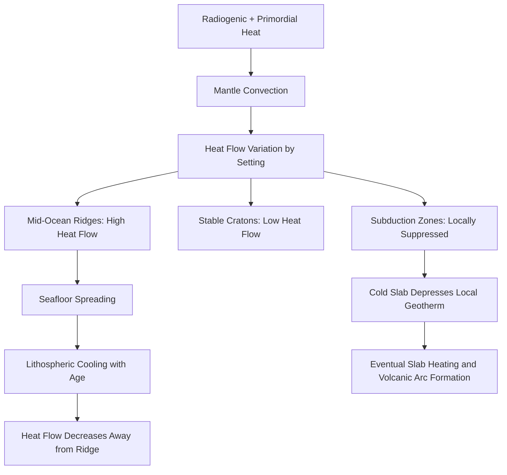

## Heat Flow and the Geothermal Gradient

### Definitions and Fundamental Concepts

**Geothermal gradient** is the rate of increase in temperature with increasing depth in the Earth's interior. It is typically expressed in degrees Celsius per kilometer ($°C/km$) and averages approximately $25$–$30°C/km$ in the upper crust, though this value varies substantially by tectonic setting.

**Heat flow** (or heat flux, denoted $q$) is the rate of thermal energy transfer per unit area, expressed in milliwatts per square meter ($mW/m^2$). It quantifies the amount of heat escaping from the Earth's interior to the surface over time.

The relationship between heat flow, the geothermal gradient, and thermal conductivity is expressed by Fourier's Law of heat conduction:

$$q = -k\frac{dT}{dz}$$

Where:

- $q$ = heat flow ($W/m^2$)
- $k$ = thermal conductivity of the rock ($W/m\cdot K$)
- $\frac{dT}{dz}$ = geothermal gradient (temperature change per unit depth)
- The negative sign indicates heat flows from high to low temperature (i.e., outward, opposite the direction of increasing depth)

This equation is the central quantitative tool of geothermics: heat flow, gradient, and conductivity are interdependent, and knowing any two allows calculation of the third.

### Sources of Earth's Internal Heat

**Primordial heat**

- Residual heat from planetary accretion approximately 4.5 billion years ago, generated by gravitational collisional energy of accreting planetesimals
- Heat released during core formation, as dense iron-nickel material sank to form the core (gravitational differentiation), converting gravitational potential energy into heat
- [Inference] Estimates of the relative contribution of primordial versus radiogenic heat to the present-day heat budget vary across studies and remain an active area of geophysical research

**Radiogenic heat**

- Heat generated by the decay of radioactive isotopes within the mantle and crust
- Principal heat-producing isotopes:
  - Uranium-238 ($^{238}U$) and Uranium-235 ($^{235}U$)
  - Thorium-232 ($^{232}Th$)
  - Potassium-40 ($^{40}K$)
- These isotopes are concentrated preferentially in the continental crust (especially granitic rocks) relative to the mantle, due to their incompatible geochemical behavior during partial melting and crystallization
- Radiogenic heat is estimated to contribute roughly half of the Earth's total present-day heat flux, though the precise fraction is model-dependent

**Other minor contributions**

- Latent heat released by the crystallization of the inner core as the Earth slowly cools
- Tidal friction (a minor contributor to Earth's heat budget, though significant for other planetary bodies such as Io)
- Frictional heating along fault zones and subduction interfaces (localized, not a bulk contributor to global heat flow)

### The Geothermal Gradient in Detail

**Typical values by depth regime**

| Depth Zone | Approximate Gradient | Notes |
| --- | --- | --- |
| Upper crust (0–~15 km) | $25$–$30°C/km$ | Highest gradient; dominated by conduction |
| Lower crust to upper mantle | Gradient decreases sharply | Conductivity increases, radiogenic sources diminish |
| Mantle (below lithosphere) | ~$0.3$–$1°C/km$ | Convection dominates; near-adiabatic |
| Core-mantle boundary | Steep increase (thermal boundary layer) | ~$3000$–$4000°C$ estimated |
| Inner core boundary | ~$5000$–$6000°C$ estimated | [Inference] Precise core temperatures rely on high-pressure experimental extrapolation and remain subject to revision |

The gradient is **not linear** with depth. If the near-surface gradient of $25°C/km$ persisted uniformly to the core, temperatures would reach unrealistically high values (tens of thousands of degrees) that are inconsistent with seismological and mineral-physics evidence of a solid inner core and molten outer core. This discrepancy demonstrates that the dominant heat transport mechanism must change with depth.

**Why the gradient decreases with depth**

- In the shallow crust, heat is transported primarily by **conduction**, which is inefficient and sustains a steep gradient
- Radiogenic heat sources (concentrated in the crust) diminish with depth, reducing local heat generation
- In the mantle, heat transport shifts increasingly to **convection**, where hot material physically rises and cooler material sinks, transporting heat far more efficiently than conduction and flattening the temperature gradient into a near-adiabatic profile
- Adiabatic temperature increase refers to warming caused solely by pressure increase (compression) rather than heat conduction, with no heat exchanged with surroundings

### Heat Transport Mechanisms

**Conduction**

- Dominant in the lithosphere (crust and uppermost rigid mantle)
- Heat transferred through molecular/lattice vibrations without bulk material movement
- Governed by Fourier's Law (above)
- Thermal conductivity ($k$) varies by rock type: e.g., quartz-rich rocks conduct heat more efficiently than shale or sediment

**Convection**

- Dominant in the asthenosphere and deeper mantle
- Bulk transport of heat via material flow: hot, buoyant mantle rises; cooler, denser mantle sinks
- Drives plate tectonic motion and is responsible for mantle plumes
- Characterized by the dimensionless **Rayleigh number** ($Ra$), which determines whether a fluid layer convects:

$$Ra = \frac{g\alpha\Delta T d^3}{\kappa\nu}$$

Where $g$ = gravitational acceleration, $\alpha$ = thermal expansion coefficient, $\Delta T$ = temperature difference across the layer, $d$ = layer thickness, $\kappa$ = thermal diffusivity, and $\nu$ = kinematic viscosity. When $Ra$ exceeds a critical threshold, convection initiates.

**Advection**

- Heat transport via the physical movement of fluids (e.g., magma intrusion, hydrothermal circulation, groundwater flow)
- Locally significant near volcanic systems, mid-ocean ridges, and geothermal fields, where circulating water can dramatically elevate local heat flow

**Radiation**

- Negligible in the solid Earth at most depths due to the opacity of rock to thermal radiation at relevant wavelengths
- [Inference] Some models suggest radiative heat transfer may become non-negligible at extreme lower-mantle/core pressures and temperatures, though this remains a specialized research topic rather than a bulk transport mechanism in standard geothermal models

### Global Heat Flow Patterns

Heat flow is not uniform across the Earth's surface; it correlates strongly with tectonic setting and crustal age.

**High heat flow regions**

- Mid-ocean ridges (highest global values, often exceeding $200$–$300\ mW/m^2$ near the ridge axis) due to upwelling asthenospheric material and young, thin oceanic lithosphere
- Volcanic arcs and hotspot/plume locations (e.g., Yellowstone, Iceland, Hawaii)
- Active rift zones (e.g., East African Rift)

**Low heat flow regions**

- Old, stable continental cratons (Precambrian shields), where heat flow can be as low as $40$–$50\ mW/m^2$ due to thick, cold, thermally mature lithosphere
- Deep ocean trenches and subduction zones, where cold, subducting oceanic lithosphere depresses the local geotherm despite the tectonic activity

**General trend**

- Oceanic crust heat flow decreases systematically with the age of the seafloor, following an approximate inverse-square-root relationship with age, consistent with lithospheric cooling models (e.g., the half-space cooling model and plate cooling model)
- Global average heat flow is approximately $65\ mW/m^2$ for continents and $101\ mW/m^2$ for oceans, yielding a global mean of roughly $87\ mW/m^2$ [Unverified: precise global averages vary slightly among published compilations depending on dataset and methodology]

### Diagram: Heat Transport Regimes with Depth (svg_diagram)

<svg xmlns="http://www.w3.org/2000/svg" viewBox="0 0 640 520">
<text x="320" y="30" text-anchor="middle" font-size="18" font-weight="bold" fill="#1a1a1a">Earth's Thermal Structure (svg_diagram)</text>

<rect x="80" y="60" width="200" height="70" fill="#d9a066" stroke="#333" stroke-width="1.5" />
<text x="180" y="100" text-anchor="middle" font-size="13" fill="#1a1a1a">Crust</text>
<text x="180" y="118" text-anchor="middle" font-size="11" fill="#333">Conduction dominant</text>

<rect x="80" y="130" width="200" height="60" fill="#c78a4f" stroke="#333" stroke-width="1.5" />
<text x="180" y="163" text-anchor="middle" font-size="12" fill="#1a1a1a">Lithospheric Mantle</text>

<rect x="80" y="190" width="200" height="140" fill="#b5573a" stroke="#333" stroke-width="1.5" />
<text x="180" y="255" text-anchor="middle" font-size="13" fill="#fff" font-weight="bold">Mantle</text>
<text x="180" y="273" text-anchor="middle" font-size="11" fill="#fff">Convection dominant</text>

<rect x="80" y="330" width="200" height="90" fill="#e8b13b" stroke="#333" stroke-width="1.5" />
<text x="180" y="370" text-anchor="middle" font-size="12" fill="#1a1a1a">Outer Core</text>
<text x="180" y="388" text-anchor="middle" font-size="11" fill="#333">Liquid, convective</text>

<rect x="80" y="420" width="200" height="60" fill="#f2d377" stroke="#333" stroke-width="1.5" />
<text x="180" y="455" text-anchor="middle" font-size="12" fill="#1a1a1a">Inner Core (solid)</text>

<line x1="60" y1="60" x2="60" y2="480" stroke="#000" stroke-width="1" />
<text x="40" y="65" font-size="10" text-anchor="middle">0 km</text>
<text x="40" y="135" font-size="10" text-anchor="middle">35</text>
<text x="40" y="195" font-size="10" text-anchor="middle">100</text>
<text x="40" y="335" font-size="10" text-anchor="middle">2900</text>
<text x="40" y="425" font-size="10" text-anchor="middle">5150</text>
<text x="40" y="483" font-size="10" text-anchor="middle">6371</text>

<path d="M 320 65 C 340 130, 350 190, 400 260 C 450 320, 460 340, 500 380 C 540 420, 545 440, 560 478" stroke="#c0392b" stroke-width="3" fill="none" />
<text x="330" y="55" font-size="12" fill="#c0392b" font-weight="bold">Temperature curve</text>

<line x1="290" y1="60" x2="290" y2="480" stroke="#999" stroke-dasharray="3,3" />
<text x="320" y="105" font-size="10" fill="#333">Steep gradient</text>
<text x="320" y="115" font-size="10" fill="#333">(~25-30 C/km)</text>
<text x="400" y="250" font-size="10" fill="#333">Near-adiabatic</text>
<text x="400" y="260" font-size="10" fill="#333">(~0.3-1 C/km)</text>
<text x="500" y="400" font-size="10" fill="#333">Steep rise at</text>
<text x="500" y="410" font-size="10" fill="#333">CMB boundary layer</text>

<text x="560" y="495" font-size="11" fill="#333" text-anchor="middle">~5000-6000°C</text>

</svg>

### Measurement Techniques

**Borehole temperature measurements**

- Direct temperature logging at various depths within drill holes
- Requires correction for drilling-fluid disturbance, seasonal surface temperature variation, and topographic effects
- Provides the temperature gradient ($dT/dz$) directly

**Thermal conductivity determination**

- Measured on rock core or cutting samples in the laboratory using divided-bar or needle-probe methods
- Combined with the measured gradient via Fourier's Law to calculate heat flow

**Marine heat flow probes**

- Instruments lowered to the seafloor that measure the thermal gradient in the upper few meters of sediment, paired with in-situ or laboratory conductivity measurements
- Standard method for the extensive oceanic heat flow dataset, given the difficulty of deep ocean drilling

**Satellite and remote methods**

- [Inference] Surface heat flow cannot be directly measured by satellite; global heat flow maps rely on interpolation from sparse point measurements combined with geophysical models (e.g., seafloor age, crustal structure), so regions with sparse data carry higher uncertainty

### Geothermal Gradient and Practical Applications

**Geothermal energy exploration**

- Regions of anomalously high heat flow (volcanic arcs, rift zones, hotspots) are prime targets for geothermal power generation
- Enhanced Geothermal Systems (EGS) artificially create permeability in hot, dry rock to extract heat where natural fluid circulation is insufficient

**Petroleum geology**

- The geothermal gradient controls the maturation of organic matter into hydrocarbons; the "oil window" (temperature range for oil generation) is typically around $60$–$150°C$, translating to specific burial depths depending on the local gradient
- Basins with higher-than-average gradients mature hydrocarbons at shallower depths

**Metamorphic petrology**

- Geothermal gradients recorded in metamorphic rocks (via geothermobarometry) reveal past tectonic settings; e.g., low gradient/high pressure indicates subduction zone metamorphism, while high gradient/low pressure indicates contact or rift-related metamorphism

**Mining and engineering**

- Deep mines must account for rock temperature increase with depth for ventilation and worker safety design
- Deep tunnel and geotechnical projects incorporate expected in-situ rock temperatures into engineering design

### Worked Example

**Problem:** A borehole shows a temperature increase from $15°C$ at the surface to $65°C$ at a depth of $2\ km$. The surrounding rock has a thermal conductivity of $2.5\ W/m\cdot K$. Calculate the geothermal gradient and the surface heat flow.

**Step 1 — Geothermal gradient:**

$$\frac{dT}{dz} = \frac{65°C - 15°C}{2\ km} = \frac{50°C}{2\ km} = 25°C/km$$

**Step 2 — Convert to SI units:**

$$\frac{dT}{dz} = \frac{25°C}{1000\ m} = 0.025\ K/m$$

**Step 3 — Apply Fourier's Law:**

$$q = k\frac{dT}{dz} = 2.5\ W/m\cdot K \times 0.025\ K/m = 0.0625\ W/m^2 = 62.5\ mW/m^2$$

This result ($62.5\ mW/m^2$) falls within the typical range for stable continental crust, consistent with the global continental average cited above.

### Relationship to Plate Tectonics (Mermaid Diagram)

### Common Misconceptions

- **Misconception:** The geothermal gradient is constant throughout the Earth.

  **Correction:** The gradient decreases sharply with depth as the dominant heat transport mechanism shifts from conduction to convection.
- **Misconception:** Heat flow is highest wherever crust is thickest.

  **Correction:** Heat flow correlates with crustal age and tectonic activity, not thickness alone; young oceanic crust at ridges has the highest heat flow despite being thin.
- **Misconception:** The Earth's internal heat is a fixed, unchanging quantity from formation.

  **Correction:** Radiogenic heat production continuously adds thermal energy (decaying over geologic time as isotopes deplete), while the Earth also continuously loses heat to space; the current state reflects an evolving thermal budget.

### Key Points

- Heat flow ($q$) and the geothermal gradient ($dT/dz$) are related through Fourier's Law via thermal conductivity ($k$)
- Heat originates from primordial accretion/core formation and ongoing radiogenic decay
- The gradient is steep near the surface (conduction-dominated) and flattens with depth (convection-dominated)
- Heat flow varies systematically with tectonic setting: highest at mid-ocean ridges, lowest on old cratons
- Practical applications span geothermal energy, petroleum maturation, metamorphic interpretation, and engineering

**Related Topics**

- Plate Tectonics and Mantle Convection Cells
- Seismic Wave Behavior and Evidence for Earth's Layered Structure
- Radioactive Decay and Isotopic Dating
- Mid-Ocean Ridge Formation and Seafloor Spreading
- Mantle Plumes and Hotspot Volcanism
- Metamorphic Facies and Geothermobarometry
- Enhanced Geothermal Systems (EGS) Technology
- Thermal History and Cooling Models of the Earth (Half-Space and Plate Cooling Models)