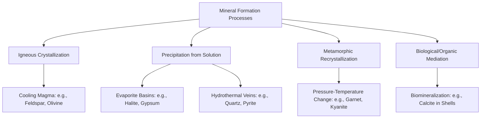

## Definition and Properties of Minerals

### Formal Definition of a Mineral

A **mineral** is a naturally occurring, inorganic solid with a definite chemical composition (or a composition that varies within defined limits) and an ordered, crystalline internal atomic structure.

This definition contains five essential criteria, all of which must be satisfied:

1. **Naturally occurring** — formed by geological processes, excluding synthetic or laboratory-created equivalents (e.g., synthetic diamond is chemically and structurally identical to natural diamond but is not classified as a mineral)
2. **Inorganic** — excludes substances produced by biological/organic processes; this criterion is subject to nuance, since some biologically mediated substances (e.g., certain forms of calcite in shells) are treated as minerals or "biominerals" under some classification schemes [Inference: exact conventions vary among mineralogical authorities, and the inorganic/organic boundary is not universally applied with strict rigidity]
3. **Solid** — excludes liquids (e.g., liquid mercury or water are not minerals under strict definition, though ice, as a solid, is classified as a mineral) and gases at standard conditions
4. **Definite chemical composition** — expressible by a specific chemical formula or a formula with defined compositional range (e.g., solid solution series such as olivine, $(Mg,Fe)_2SiO_4$)
5. **Ordered crystalline structure** — atoms are arranged in a repeating, three-dimensional geometric lattice; this distinguishes minerals from amorphous natural solids (e.g., volcanic glass/obsidian, which lacks long-range atomic order and is therefore classified as a mineraloid, not a true mineral)

**Mineraloids** are naturally occurring solids that fail the crystallinity criterion, including obsidian, opal (which has only short-range/partial order), and amber.

### Distinction Between Minerals and Rocks

- A **mineral** is a single, homogeneous crystalline substance with a specific composition and structure
- A **rock** is an aggregate of one or more minerals (or mineraloids/organic material), consolidated into a coherent mass
- Example: granite is a rock composed of the minerals quartz, feldspar, and mica; quartz alone is a mineral

### Chemical Composition Categories

**Native elements**

- Minerals composed of a single element in uncombined form
- Examples: gold ($Au$), copper ($Cu$), sulfur ($S$), diamond and graphite (both pure carbon, $C$, but structurally distinct polymorphs)

**Silicates**

- The most abundant mineral class, comprising roughly 90% of the Earth's crust by volume
- Built around the fundamental building block, the **silicate tetrahedron** ($SiO_4^{4-}$): one silicon atom coordinated with four oxygen atoms in a tetrahedral arrangement
- Subclasses based on tetrahedral linkage (detailed further in the Silicate Structural Classification section below)

**Carbonates**

- Contain the carbonate ion complex ($CO_3^{2-}$)
- Examples: calcite ($CaCO_3$), dolomite ($CaMg(CO_3)_2$)

**Oxides**

- Metal cations bonded with oxygen
- Examples: hematite ($Fe_2O_3$), magnetite ($Fe_3O_4$), corundum ($Al_2O_3$)

**Sulfides**

- Metal cations bonded with sulfur
- Examples: pyrite ($FeS_2$), galena ($PbS$), sphalerite ($ZnS$)

**Sulfates**

- Contain the sulfate ion complex ($SO_4^{2-}$)
- Examples: gypsum ($CaSO_4\cdot 2H_2O$), anhydrite ($CaSO_4$)

**Halides**

- Metal cations bonded with halogen anions
- Examples: halite ($NaCl$), fluorite ($CaF_2$)

**Phosphates**

- Contain the phosphate ion complex ($PO_4^{3-}$)
- Example: apatite ($Ca_5(PO_4)_3(F,Cl,OH)$)

### Silicate Structural Classification

The silicate tetrahedron can link in several geometric patterns, producing distinct silicate subclasses with characteristic physical properties:

| Structure | Linkage Pattern | Si:O Ratio | Example Mineral |
| --- | --- | --- | --- |
| Nesosilicates | Isolated tetrahedra | 1:4 | Olivine |
| Sorosilicates | Paired tetrahedra | 2:7 | Epidote |
| Cyclosilicates | Ring structures | 1:3 | Beryl, tourmaline |
| Inosilicates (single chain) | Continuous single chains | 1:3 | Pyroxene group |
| Inosilicates (double chain) | Continuous double chains | 4:11 | Amphibole group |
| Phyllosilicates | Sheet structures | 2:5 | Mica, clay minerals |
| Tectosilicates | 3D framework, all oxygens shared | 1:2 | Quartz, feldspar |

The degree of tetrahedral polymerization strongly influences physical properties: chain and sheet silicates tend to exhibit pronounced cleavage along the weaker bonding directions between chains/sheets (e.g., mica's perfect basal cleavage), while framework silicates like quartz lack such planes of weakness and instead fracture conchoidally.

### Physical Properties Used in Mineral Identification

**Hardness**

- Resistance to scratching, measured via the **Mohs Hardness Scale** (1–10, relative ordinal scale, not linear in absolute terms)

| Hardness | Mineral | Common Field Test Reference |
| --- | --- | --- |
| 1 | Talc | Easily scratched by fingernail |
| 2 | Gypsum | Scratched by fingernail (~2.5) |
| 3 | Calcite | Scratched by copper penny |
| 4 | Fluorite | Scratched by steel knife |
| 5 | Apatite | Scratched by steel knife (~5.5) |
| 6 | Orthoclase | Scratched by streak plate/steel file |
| 7 | Quartz | Scratches window glass |
| 8 | Topaz | Scratches quartz |
| 9 | Corundum | Scratches topaz |
| 10 | Diamond | Scratches all other minerals |

**Cleavage and fracture**

- **Cleavage**: tendency to break along smooth, flat planes controlled by zones of weaker atomic bonding; described by number of directions and angle between planes (e.g., mica: one direction, perfect; pyroxene: two directions at ~90°; amphibole: two directions at ~56°/124°)
- **Fracture**: breakage along irregular surfaces where no cleavage plane exists; described by texture:
  - **Conchoidal** — smooth, curved surfaces (e.g., quartz, obsidian)
  - **Fibrous** — splintery, thread-like
  - **Uneven/irregular** — rough, non-planar surfaces
  - **Hackly** — jagged, sharp edges (e.g., native metals)

**Luster**

- The quality of light reflected from a mineral's surface
- **Metallic** — opaque, reflective like polished metal (e.g., pyrite, galena)
- **Non-metallic** — further subdivided into: vitreous (glassy, e.g., quartz), pearly (e.g., talc), silky (e.g., fibrous gypsum), resinous (e.g., sphalerite), greasy, adamantine (brilliant, e.g., diamond), and dull/earthy

**Color**

- Often unreliable for identification due to trace element impurities causing variable coloration in the same mineral species (e.g., quartz can be colorless, purple/amethyst, or smoky depending on trace impurities and structural defects)

**Streak**

- The color of a mineral's powder, obtained by scratching it across an unglazed porcelain streak plate
- More diagnostic than surface color, since streak color remains constant even when surface color varies (e.g., hematite always produces a reddish-brown streak regardless of whether the specimen appears black or red)

**Specific gravity (density)**

- Ratio of a mineral's weight to the weight of an equal volume of water
- Diagnostic range: most common rock-forming silicates fall between 2.6–3.4; metallic minerals are notably denser (e.g., galena ≈ 7.5, native gold ≈ 19.3)

**Crystal habit**

- The characteristic external shape a mineral tends to form, reflecting its internal structure
- Common habits: cubic (halite, pyrite), prismatic (tourmaline), tabular (mica), acicular/needle-like (natrolite), dendritic (native copper/manganese oxides), botryoidal (grape-like clusters, e.g., hematite), massive (no distinct crystal form)

**Other diagnostic properties**

- **Magnetism** — e.g., magnetite is strongly attracted to a magnet
- **Reaction to acid** — e.g., calcite effervesces (fizzes) vigorously with dilute hydrochloric acid due to $CaCO_3$ decomposition releasing $CO_2$ gas
- **Tenacity** — behavior under stress: brittle (shatters, most silicates), malleable (deforms without breaking, native metals), sectile (cuts into thin shavings, e.g., gypsum), elastic (bends and returns to shape, e.g., mica)
- **Taste** — diagnostic for a small number of soluble minerals (e.g., halite tastes salty)
- **Double refraction** — splitting of a light ray into two rays, visibly demonstrated in optically clear calcite (Iceland spar)
- **Fluorescence/phosphorescence** — emission of visible light under ultraviolet illumination, characteristic of specific minerals such as fluorite (from which the phenomenon derives its name) and some varieties of calcite

### Crystal Systems

All crystalline minerals belong to one of seven crystal systems, defined by the symmetry and relative lengths/angles of their crystallographic axes:

1. **Isometric (cubic)** — three equal axes at 90° (e.g., halite, pyrite, garnet)
2. **Tetragonal** — two equal axes and one different axis, all at 90° (e.g., zircon)
3. **Orthorhombic** — three unequal axes, all at 90° (e.g., olivine, topaz)
4. **Monoclinic** — three unequal axes, two at 90° and one oblique (e.g., orthoclase, gypsum)
5. **Triclinic** — three unequal axes, none at 90° (e.g., plagioclase feldspar, kyanite)
6. **Hexagonal** — four axes (three equal in a plane at 120°, one perpendicular) (e.g., quartz, beryl)
7. **Trigonal (rhombohedral)** — often grouped with hexagonal; three-fold symmetry (e.g., calcite, tourmaline)

### Polymorphism and Isomorphism

**Polymorphism** — the phenomenon where the same chemical composition crystallizes into two or more distinct structures under different physical (pressure/temperature) conditions

- Example: carbon crystallizes as diamond (isometric, formed at high pressure) or graphite (hexagonal, formed at low pressure), producing radically different physical properties from identical chemistry
- Example: $Al_2SiO_5$ forms three polymorphs — kyanite, andalusite, and sillimanite — each stable under different metamorphic pressure-temperature regimes, making them valuable geothermobarometric indicators

**Isomorphism** — different chemical compositions that share the same crystal structure and can substitute for one another (solid solution)

- Example: the olivine series, ranging continuously from forsterite ($Mg_2SiO_4$) to fayalite ($Fe_2SiO_4$), with $Mg^{2+}$ and $Fe^{2+}$ substituting freely due to similar ionic radius and charge

### Diagram: Silicate Tetrahedron Structure (svg_diagram)

<svg xmlns="http://www.w3.org/2000/svg" viewBox="0 0 400 380">
<text x="200" y="30" text-anchor="middle" font-size="16" font-weight="bold" fill="#1a1a1a">Silicate Tetrahedron SiO4 (svg_diagram)</text>

<polygon points="200,80 130,220 270,220" fill="none" stroke="#333" stroke-width="2" />
<line x1="200" y1="80" x2="200" y2="260" stroke="#333" stroke-width="2" stroke-dasharray="4,3" />
<polygon points="130,220 270,220 200,260" fill="#e8d9c5" stroke="#333" stroke-width="2" opacity="0.6" />

<circle cx="200" cy="80" r="18" fill="#e74c3c" stroke="#333" stroke-width="1.5" />
<text x="200" y="85" text-anchor="middle" font-size="12" fill="#fff" font-weight="bold">O</text>
<circle cx="130" cy="220" r="18" fill="#e74c3c" stroke="#333" stroke-width="1.5" />
<text x="130" y="225" text-anchor="middle" font-size="12" fill="#fff" font-weight="bold">O</text>
<circle cx="270" cy="220" r="18" fill="#e74c3c" stroke="#333" stroke-width="1.5" />
<text x="270" y="225" text-anchor="middle" font-size="12" fill="#fff" font-weight="bold">O</text>
<circle cx="200" cy="260" r="18" fill="#e74c3c" stroke="#333" stroke-width="1.5" />
<text x="200" y="265" text-anchor="middle" font-size="12" fill="#fff" font-weight="bold">O</text>

<circle cx="200" cy="185" r="14" fill="#f1c40f" stroke="#333" stroke-width="1.5" />
<text x="200" y="190" text-anchor="middle" font-size="11" fill="#1a1a1a" font-weight="bold">Si</text>

<line x1="200" y1="185" x2="200" y2="80" stroke="#555" stroke-width="1.5" />
<line x1="200" y1="185" x2="130" y2="220" stroke="#555" stroke-width="1.5" />
<line x1="200" y1="185" x2="270" y2="220" stroke="#555" stroke-width="1.5" />
<line x1="200" y1="185" x2="200" y2="260" stroke="#555" stroke-width="1.5" />

<text x="200" y="310" text-anchor="middle" font-size="12" fill="#333">One Si4+ ion bonded to four O2- ions</text>

<text x="200" y="328" text-anchor="middle" font-size="12" fill="#333">Net charge: SiO4(4-)</text>

<text x="200" y="350" text-anchor="middle" font-size="11" fill="#666">Basic unit of all silicate mineral structures</text>

</svg>

### Mineral Formation Environments (Mermaid Diagram)

### Worked Example: Identification Logic

**Problem:** A field sample exhibits a metallic luster, hardness of approximately 6, cubic crystal habit, and a greenish-black streak. Identify the likely mineral using a systematic property-based approach.

**Step 1 — Luster:** Metallic luster narrows the candidate list to native metals, sulfides, and select oxides.

**Step 2 — Hardness:** A hardness of 6 (scratches glass with difficulty, close to orthoclase reference) rules out soft sulfides like galena (hardness ~2.5) and points toward a harder oxide.

**Step 3 — Crystal habit:** Cubic habit is diagnostic of the isometric system.

**Step 4 — Streak:** A greenish-black streak, combined with the above properties, is characteristic of **magnetite** ($Fe_3O_4$), which also typically displays strong magnetism — a confirmatory test.

**Conclusion:** The systematic combination of luster, hardness, crystal system, and streak converges on magnetite, illustrating how diagnostic properties are used jointly rather than in isolation, since no single property is fully diagnostic on its own.

### Common Misconceptions

- **Misconception:** All naturally occurring solids are minerals.

  **Correction:** Organic solids (e.g., coal, amber) and amorphous solids (e.g., volcanic glass) fail the inorganic and/or crystallinity criteria and are excluded or classified separately as mineraloids.
- **Misconception:** Color is a reliable identifying property.

  **Correction:** Trace element impurities frequently alter a mineral's color while streak, hardness, and crystal form remain constant, making color one of the least reliable diagnostic properties.
- **Misconception:** A rock and a mineral are interchangeable terms.

  **Correction:** A rock is an aggregate of minerals (and/or mineraloids); a mineral is a single homogeneous crystalline substance.

### Key Points

- A mineral must be naturally occurring, inorganic, solid, with definite composition and ordered crystal structure
- Silicates dominate the crust and are classified by the polymerization pattern of the $SiO_4^{4-}$ tetrahedron
- Physical properties (hardness, cleavage, luster, streak, specific gravity, crystal habit) are used jointly for identification, since no single property is fully diagnostic
- Polymorphism (same composition, different structure) and isomorphism (different composition, same structure) explain compositional/structural variation within and across mineral groups
- Seven crystal systems classify all crystalline structures by axial symmetry

**Related Topics**

- Crystallography and Symmetry Operations
- Igneous Rock Classification and Bowen's Reaction Series
- Metamorphic Facies and Index Minerals
- Ore Minerals and Economic Geology
- X-Ray Diffraction and Mineral Identification Techniques
- Optical Mineralogy and Polarized Light Microscopy
- Rock-Forming Mineral Groups (Feldspars, Micas, Pyroxenes, Amphiboles)
- Biomineralization Processes