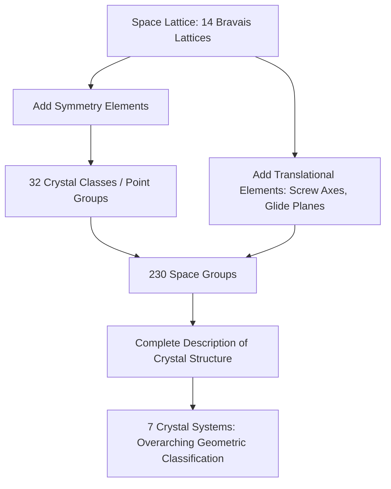

## Crystal Structure and Symmetry

### Fundamental Concepts

**Crystal structure** refers to the ordered, three-dimensional arrangement of atoms, ions, or molecules within a crystalline solid, repeating periodically in all directions. This internal periodicity distinguishes crystalline materials from amorphous solids, which lack long-range order.

**Symmetry** describes the geometric operations that can be applied to a crystal structure such that the structure appears unchanged (maps onto itself) after the operation. Crystal symmetry is the organizing principle behind the classification of all mineral structures into crystal systems, crystal classes, and space groups.

### The Space Lattice and Unit Cell

**Space lattice (crystal lattice)**

- An infinite, three-dimensional array of geometrically equivalent points, each representing an identical atomic environment
- Purely a mathematical/geometric construct describing periodicity; the actual atoms, ions, or molecular groups are attached to (or associated with) each lattice point, forming the **motif** or **basis**
- Crystal structure = lattice + basis

**Unit cell**

- The smallest repeating three-dimensional geometric unit that, when translated repeatedly in three dimensions, reproduces the entire crystal lattice
- Defined by six parameters: three edge lengths ($a$, $b$, $c$) and three interaxial angles ($\alpha$, $\beta$, $\gamma$)
- **Primitive unit cell**: contains lattice points only at the corners (one lattice point per cell when corner-sharing is accounted for)
- **Non-primitive (centered) unit cell**: contains additional lattice points at face centers, body center, or base centers, chosen for convenience when it better reflects the symmetry of the structure

**Bravais lattices**

- There are exactly 14 unique ways to arrange points periodically in three-dimensional space such that every point has an identical environment, known as the 14 Bravais lattices
- These 14 lattices are distributed among the seven crystal systems, with variations including primitive (P), body-centered (I), face-centered (F), and base-centered (C) arrangements, depending on the symmetry constraints of each system

### The Seven Crystal Systems

Crystal systems classify all possible unit cell geometries based on axial length relationships and interaxial angles:

| Crystal System | Axial Lengths | Axial Angles | Example Mineral |
| --- | --- | --- | --- |
| Isometric (Cubic) | $a = b = c$ | $\alpha = \beta = \gamma = 90°$ | Halite, garnet, pyrite |
| Tetragonal | $a = b \neq c$ | $\alpha = \beta = \gamma = 90°$ | Zircon, rutile |
| Orthorhombic | $a \neq b \neq c$ | $\alpha = \beta = \gamma = 90°$ | Olivine, topaz, sulfur |
| Monoclinic | $a \neq b \neq c$ | $\alpha = \gamma = 90°, \beta \neq 90°$ | Orthoclase, gypsum |
| Triclinic | $a \neq b \neq c$ | $\alpha \neq \beta \neq \gamma \neq 90°$ | Plagioclase, kyanite |
| Hexagonal | $a_1 = a_2 = a_3 \neq c$ | Three axes at $120°$ in basal plane, all $90°$ to $c$-axis | Quartz, beryl, apatite |
| Trigonal (Rhombohedral) | Often described with hexagonal axes, or $a = b = c$, $\alpha = \beta = \gamma \neq 90°$ | See above | Calcite, tourmaline, corundum |

[Inference] The classification of trigonal as a distinct seventh system versus a subdivision of the hexagonal system varies somewhat between crystallographic conventions and textbooks; both approaches are used in the mineralogical literature.

### Symmetry Elements and Operations

Symmetry operations move a crystal structure to a position that is indistinguishable from its original configuration. Each operation has a corresponding symmetry element (the geometric entity — point, line, or plane — about which the operation is performed).

**Rotation axes (proper rotation)**

- A crystal possesses an $n$-fold rotation axis if rotating it by $360°/n$ produces an indistinguishable configuration
- Crystallographic restriction theorem: only 1-, 2-, 3-, 4-, and 6-fold rotation axes are compatible with three-dimensional translational periodicity; 5-fold and axes higher than 6-fold (e.g., 7-fold, 8-fold) cannot fill space periodically and therefore do not occur in ideal crystal lattices
- Notation: $1, 2, 3, 4, 6$ (international/Hermann-Mauguin notation)

**Mirror planes ($m$)**

- A plane that divides the crystal into two halves that are mirror images of one another
- Denoted $m$ in Hermann-Mauguin notation

**Center of symmetry (inversion center, $\bar{1}$ or $i$)**

- A point through which every feature of the crystal has an identical, inverted counterpart on the opposite side at equal distance
- A crystal has a center of symmetry if, for every point $(x, y, z)$, there is an equivalent point at $(-x, -y, -z)$

**Rotoinversion axes ($\bar{n}$)**

- A compound operation combining rotation by $360°/n$ with simultaneous inversion through a central point
- Notation: $\bar{1}, \bar{2}, \bar{3}, \bar{4}, \bar{6}$ (note: $\bar{2}$ is equivalent to a mirror plane; $\bar{1}$ is equivalent to a center of symmetry)

**Translation-based operations (relevant to space groups, not point groups)**

- **Screw axes**: combine rotation with translation along the rotation axis
- **Glide planes**: combine reflection with translation parallel to the mirror plane

### The 32 Crystal Classes (Point Groups)

The combination of all possible symmetry elements (rotation axes, mirror planes, inversion centers, rotoinversion axes) that can coexist at a single point in a crystal structure yields exactly **32 distinct crystal classes** (also called point groups), distributed among the seven crystal systems. Each mineral species belongs to one of these 32 classes based on its full symmetry content.

- Each crystal system contains multiple crystal classes, ranging from the lowest possible symmetry (triclinic system, pedial class, symmetry content = none/only identity) to the highest possible symmetry (isometric system, hexoctahedral class, containing the maximum combination of rotation axes, mirror planes, and inversion center)
- The **hexoctahedral class** ($4/m\ \bar{3}\ 2/m$ in Hermann-Mauguin notation) represents the holohedral (maximum symmetry) class of the isometric system and is exhibited by minerals such as galena and native gold

### Hermann-Mauguin Notation System

Crystal classes are denoted using a standardized symbolic shorthand indicating the symmetry elements present along key crystallographic directions:

- Numbers indicate rotation axes ($1, 2, 3, 4, 6$)
- A bar over a number indicates a rotoinversion axis (e.g., $\bar{4}$)
- The letter $m$ indicates a mirror plane
- A slash (e.g., $4/m$) indicates a mirror plane perpendicular to the stated rotation axis
- Example: the notation $4/m\ 2/m\ 2/m$ describes a tetragonal crystal class with a 4-fold axis, a perpendicular mirror plane, and two additional sets of 2-fold axes each with perpendicular mirrors

### Space Groups

- Combining the 32 crystallographic point groups with the 14 Bravais lattices, and further incorporating translational symmetry elements (screw axes and glide planes), yields exactly **230 unique space groups**
- Every crystalline material's complete structural symmetry corresponds to exactly one of these 230 space groups
- Space group determination is typically achieved through X-ray diffraction analysis, since it requires precise knowledge of atomic positions within the unit cell, which is not resolvable through simple visual/morphological crystal inspection alone

### Diagram: Rotation Axis Symmetry Examples (svg_diagram)

<svg xmlns="http://www.w3.org/2000/svg" viewBox="0 0 600 260">
<text x="300" y="25" text-anchor="middle" font-size="16" font-weight="bold" fill="#1a1a1a">Crystallographic Rotation Axes (svg_diagram)</text>

<g>
<circle cx="90" cy="130" r="60" fill="none" stroke="#ccc" stroke-width="1" />
<polygon points="90,80 110,150 70,150" fill="#7fb3d5" stroke="#333" stroke-width="1.5" />
<polygon points="90,180 70,110 110,110" fill="#7fb3d5" stroke="#333" stroke-width="1.5" opacity="0.6" />
<line x1="90" y1="70" x2="90" y2="190" stroke="#e74c3c" stroke-width="1.5" stroke-dasharray="3,2" />
<text x="90" y="220" text-anchor="middle" font-size="12" fill="#333">2-fold axis</text>
<text x="90" y="236" text-anchor="middle" font-size="10" fill="#666">180° repeat</text>
</g>

<g>
<circle cx="240" cy="130" r="60" fill="none" stroke="#ccc" stroke-width="1" />
<polygon points="240,80 265,155 215,155" fill="#82c99a" stroke="#333" stroke-width="1.5" />
<polygon points="240,80 265,155 215,155" fill="#82c99a" stroke="#333" stroke-width="1.5" transform="rotate(120 240 130)" opacity="0.6" />
<polygon points="240,80 265,155 215,155" fill="#82c99a" stroke="#333" stroke-width="1.5" transform="rotate(240 240 130)" opacity="0.4" />
<line x1="240" y1="70" x2="240" y2="190" stroke="#e74c3c" stroke-width="1.5" stroke-dasharray="3,2" />
<text x="240" y="220" text-anchor="middle" font-size="12" fill="#333">3-fold axis</text>
<text x="240" y="236" text-anchor="middle" font-size="10" fill="#666">120° repeat</text>
</g>

<g>
<circle cx="390" cy="130" r="60" fill="none" stroke="#ccc" stroke-width="1" />
<rect x="370" y="80" width="40" height="30" fill="#f0b27a" stroke="#333" stroke-width="1.5" />
<rect x="370" y="80" width="40" height="30" fill="#f0b27a" stroke="#333" stroke-width="1.5" transform="rotate(90 390 130)" opacity="0.7" />
<rect x="370" y="80" width="40" height="30" fill="#f0b27a" stroke="#333" stroke-width="1.5" transform="rotate(180 390 130)" opacity="0.5" />
<rect x="370" y="80" width="40" height="30" fill="#f0b27a" stroke="#333" stroke-width="1.5" transform="rotate(270 390 130)" opacity="0.3" />
<line x1="390" y1="70" x2="390" y2="190" stroke="#e74c3c" stroke-width="1.5" stroke-dasharray="3,2" />
<text x="390" y="220" text-anchor="middle" font-size="12" fill="#333">4-fold axis</text>
<text x="390" y="236" text-anchor="middle" font-size="10" fill="#666">90° repeat</text>
</g>

<g>
<circle cx="530" cy="130" r="60" fill="none" stroke="#ccc" stroke-width="1" />
<polygon points="530,85 545,110 545,150 530,175 515,150 515,110" fill="#c39bd3" stroke="#333" stroke-width="1.5" />
<line x1="530" y1="70" x2="530" y2="190" stroke="#e74c3c" stroke-width="1.5" stroke-dasharray="3,2" />
<text x="530" y="220" text-anchor="middle" font-size="12" fill="#333">6-fold axis</text>
<text x="530" y="236" text-anchor="middle" font-size="10" fill="#666">60° repeat</text>
</g>
</svg>

### Structural Hierarchy Summary (Mermaid Diagram)

### Symmetry and Physical Property Relationships

- **Neumann's Principle**: the symmetry elements of any physical property of a crystal must include at least the symmetry elements of the crystal's point group; physical properties cannot have lower symmetry than the crystal structure itself, though they may have higher symmetry
- This principle explains why properties such as cleavage, optical behavior (birefringence), and piezoelectricity are directly governed by crystal symmetry class
- **Piezoelectricity** (electrical polarization under mechanical stress) can only occur in crystal classes lacking a center of symmetry (21 of the 32 crystal classes lack an inversion center; quartz, belonging to a non-centrosymmetric trigonal class, is a classic example exploited in oscillator technology)
- **Optical isotropy vs. anisotropy**: minerals in the isometric system are optically isotropic (light travels at the same velocity in all directions), while minerals in all other (non-isometric) crystal systems are optically anisotropic, exhibiting birefringence (double refraction)

### Crystal Habit vs. Crystal Structure

- **Crystal structure** is the fixed, intrinsic atomic-scale symmetry and periodicity, determined by chemical bonding and ionic packing
- **Crystal habit** is the external, macroscopic shape a crystal develops, which can vary considerably depending on growth conditions (rate of growth, available space, chemical environment) even though the underlying atomic symmetry remains constant
- Example: pyrite (isometric system) can develop as cubes, octahedra, or pyritohedra (12-sided forms) depending on growth conditions, all while retaining the same fundamental crystal structure and symmetry class

### Worked Example: Determining Symmetry Content

**Problem:** A mineral specimen exhibits three mutually perpendicular 4-fold rotation axes, four 3-fold rotation axes along the cube diagonals, six 2-fold axes along the face diagonals, a center of symmetry, and mirror planes both parallel and diagonal to the cube faces. Identify the crystal system and general symmetry classification.

**Step 1 — Axial analysis:** Three mutually perpendicular 4-fold axes immediately indicate the isometric (cubic) system, since only the cubic system permits three equivalent, mutually perpendicular 4-fold axes.

**Step 2 — Additional symmetry:** The presence of four 3-fold axes along the cube body diagonals is also diagnostic of the isometric system (these correspond to the cube's four space diagonals).

**Step 3 — Center of symmetry and mirror planes:** Combined with a center of symmetry and multiple mirror plane sets, this represents the maximum possible symmetry content for any crystal.

**Conclusion:** This symmetry content corresponds to the **hexoctahedral class** ($4/m\ \bar{3}\ 2/m$), the holohedral class of the isometric system — the highest possible symmetry of any of the 32 crystal classes. Minerals such as galena, halite, and native gold belong to this class.

### Common Misconceptions

- **Misconception:** Crystal habit (external shape) directly reveals the crystal system.

  **Correction:** While often correlated, growth conditions can distort external habit; true symmetry classification requires analysis of internal atomic arrangement (e.g., via X-ray diffraction), not external shape alone.
- **Misconception:** All crystals with cube-like external shapes belong to the isometric system.

  **Correction:** External cubic appearance is suggestive but not definitive; the classification depends on actual internal symmetry content, verified through methods such as optical or X-ray analysis.
- **Misconception:** 5-fold symmetry can occur in mineral crystal structures.

  **Correction:** The crystallographic restriction theorem excludes 5-fold (and higher than 6-fold, other than multiples) rotational symmetry in periodic crystal lattices, since such symmetry cannot tile 3D space without gaps; 5-fold and related symmetries are instead associated with quasicrystals, a distinct structural category outside conventional crystallography.

### Key Points

- Crystal structure combines a space lattice with a repeating atomic motif
- There are 14 Bravais lattices, 7 crystal systems, 32 crystal classes (point groups), and 230 space groups
- Symmetry operations include rotation, reflection, inversion, and rotoinversion; translational operations (screw axes, glide planes) apply at the space group level
- The crystallographic restriction theorem limits rotational symmetry to 1-, 2-, 3-, 4-, and 6-fold axes
- Physical properties (optical behavior, piezoelectricity, cleavage) are governed by and cannot have lower symmetry than the crystal's point group (Neumann's Principle)

**Related Topics**

- X-Ray Diffraction and Crystal Structure Determination
- Optical Mineralogy: Birefringence and the Polarizing Microscope
- Crystal Habit and Twinning
- Silicate Structural Classification
- Piezoelectricity and Applications in Technology
- Quasicrystals and Non-Periodic Structures
- Miller Indices and Crystallographic Planes
- Polymorphism and Phase Transitions in Minerals