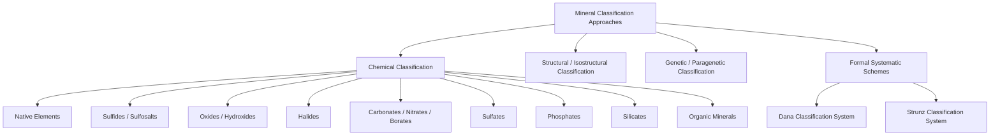

## Mineral Classification Systems

### Purpose and Basis of Classification

Mineral classification systems provide a structured framework for organizing the thousands of recognized mineral species based on shared characteristics. The dominant and most widely adopted scheme in modern mineralogy is **chemical classification**, which groups minerals primarily by their dominant anion or anionic complex, since this criterion correlates strongly with crystal structure, physical properties, and geological occurrence. Historical and supplementary classification approaches (structural, genetic, and Dana/Strunz systematic schemes) coexist with and complement the chemical approach.

### Chemical Classification: The Primary System

Chemical classification divides minerals into classes based on the dominant anion or anionic group present in the structure. This is the system most commonly taught and applied in introductory and advanced mineralogy alike.

**1. Native Elements**

- Minerals composed of a single element in uncombined, elemental form
- Subdivided into metals, semimetals, and nonmetals
- Examples: gold ($Au$), silver ($Ag$), copper ($Cu$), sulfur ($S$), diamond and graphite (both carbon, $C$, but structurally distinct polymorphs)

**2. Sulfides**

- Metal (or semimetal) cations bonded with sulfide anion ($S^{2-}$)
- Often economically important as ore minerals
- Examples: pyrite ($FeS_2$), galena ($PbS$), sphalerite ($ZnS$), chalcopyrite ($CuFeS_2$)

**3. Sulfosalts**

- A specialized subclass structurally related to sulfides, containing a semimetal (such as arsenic, antimony, or bismuth) in combination with sulfur and a metal
- Example: tetrahedrite ($Cu_{12}Sb_4S_{13}$)

**4. Oxides and Hydroxides**

- Metal cations bonded with oxygen ($O^{2-}$) or hydroxide ($OH^-$)
- Examples: hematite ($Fe_2O_3$), magnetite ($Fe_3O_4$), corundum ($Al_2O_3$), goethite ($FeO(OH)$)

**5. Halides**

- Metal cations bonded with halogen anions (fluoride, chloride, bromide, iodide)
- Examples: halite ($NaCl$), fluorite ($CaF_2$), sylvite ($KCl$)

**6. Carbonates**

- Contain the planar carbonate anionic group ($CO_3^{2-}$)
- Examples: calcite ($CaCO_3$), dolomite ($CaMg(CO_3)_2$), malachite ($Cu_2CO_3(OH)_2$)

**7. Nitrates**

- Contain the nitrate anionic group ($NO_3^-$)
- Example: nitratine (soda niter, $NaNO_3$)
- Relatively rare due to the high solubility of nitrate minerals, restricting their occurrence to arid evaporite environments

**8. Borates**

- Contain boron-oxygen anionic complexes
- Example: borax ($Na_2B_4O_7\cdot 10H_2O$)

**9. Sulfates**

- Contain the tetrahedral sulfate anionic group ($SO_4^{2-}$)
- Examples: gypsum ($CaSO_4\cdot 2H_2O$), anhydrite ($CaSO_4$), barite ($BaSO_4$)

**10. Phosphates (and related Arsenates, Vanadates)**

- Contain tetrahedral phosphate ($PO_4^{3-}$) or structurally analogous anionic groups
- Example: apatite ($Ca_5(PO_4)_3(F,Cl,OH)$)

**11. Silicates**

- The most abundant and structurally diverse class, comprising approximately 90% of the Earth's crust by volume
- Built around the silicate tetrahedron ($SiO_4^{4-}$), further subdivided by tetrahedral polymerization pattern (see Silicate Subclassification below)

**12. Organic Minerals**

- A minor class comprising naturally occurring crystalline compounds containing organic (carbon-hydrogen based) anionic groups, formed through geological rather than biological processes
- Example: whewellite (calcium oxalate, $CaC_2O_4\cdot H_2O$)
- [Inference] The classification of "organic minerals" as a formal category is sometimes debated given the general inorganic criterion in the standard mineral definition; most authorities treat this as a narrowly defined exception for specific crystalline organic compounds of geological (not biological) origin

### Silicate Subclassification (Structural Basis)

Because silicates are so structurally diverse, they receive a dedicated substructure based on the linkage pattern of $SiO_4^{4-}$ tetrahedra:

| Subclass | Tetrahedral Linkage | Example |
| --- | --- | --- |
| Nesosilicates | Isolated (independent) tetrahedra | Olivine |
| Sorosilicates | Paired tetrahedra (shared one oxygen) | Epidote |
| Cyclosilicates | Closed ring structures | Beryl, tourmaline |
| Inosilicates | Single or double chains | Pyroxene (single), amphibole (double) |
| Phyllosilicates | Continuous sheets | Mica, clay minerals |
| Tectosilicates | Three-dimensional framework (all oxygens shared) | Quartz, feldspar |

### Structural (Isostructural) Classification

An alternative, complementary approach classifies minerals by shared crystal structure type regardless of chemical composition, grouping minerals that are **isostructural** (share the same atomic packing arrangement).

- Example: the **halite structure type** groups minerals sharing the same cubic close-packed arrangement, including halite ($NaCl$), galena ($PbS$), and periclase ($MgO$), despite belonging to different chemical classes (halide, sulfide, and oxide respectively)
- Example: the **spinel structure type** ($AB_2O_4$ general formula) groups a wide range of oxide minerals with the same framework, including spinel itself ($MgAl_2O_4$) and magnetite ($Fe_3O_4$)
- This approach is particularly useful for understanding solid solution behavior, cation substitution, and predicting physical properties from structural analogy

### Genetic (Paragenetic) Classification

An older, process-based approach classifies minerals according to their mode of geological origin rather than composition or structure:

- **Primary (magmatic) minerals**: crystallize directly from cooling magma (e.g., olivine, pyroxene, feldspar)
- **Secondary (hydrothermal/hypogene) minerals**: precipitate from hot aqueous fluids circulating through rock, often in veins (e.g., quartz, many sulfide ore minerals)
- **Supergene minerals**: form near the surface through weathering and oxidation of pre-existing minerals (e.g., malachite and azurite forming from the alteration of primary copper sulfides)
- **Metamorphic minerals**: form or recrystallize in response to pressure-temperature changes in existing rock (e.g., garnet, kyanite, staurolite)
- **Sedimentary/evaporitic minerals**: precipitate from evaporating surface waters or accumulate through sedimentary processes (e.g., halite, gypsum)
- **Biogenic minerals**: formed through biological mediation (e.g., calcite/aragonite in shells, apatite in bone and teeth)

This system is valuable for interpreting geological history from mineral assemblages but is less useful as a rigorous taxonomic tool since a single mineral species can form through multiple genetic pathways (e.g., calcite forms through magmatic, hydrothermal, metamorphic, sedimentary, and biogenic processes alike).

### The Dana and Strunz Systematic Classifications

Two formalized, comprehensive systematic schemes underpin most professional mineralogical reference works and databases:

**Dana Classification System**

- Originally developed by James Dwight Dana in the 19th century (first published 1837) and periodically revised since
- Organizes minerals hierarchically by chemical composition first, then by structural similarity within each compositional class
- Assigns each mineral a unique numerical "Dana number" (e.g., format such as 76.1.3.2) reflecting its position within the classification hierarchy
- Widely used in North American mineralogical literature and databases

**Strunz Classification System**

- Developed by Karl Hugo Strunz, first published 1941, and periodically revised (a widely used revision is associated with Ernest H. Nickel's later contributions)
- Similar in principle to the Dana system, organizing minerals by chemical composition and structural type, but with a different hierarchical numbering and grouping convention
- Assigns a "Strunz number" (alphanumeric-numeric code, e.g., format such as 4.CB.05)
- Predominant in European mineralogical literature and is the classification backbone used by major mineralogical databases such as Mindat and the International Mineralogical Association's official mineral list

[Inference] The precise class boundaries and numbering details of both the Dana and Strunz systems have been revised multiple times since their original publication; specific numerical codes for individual minerals should be verified against current editions or the official IMA-CNMNC (Commission on New Minerals, Nomenclature and Classification) database rather than assumed static.

### Diagram: Hierarchy of Mineral Classification Approaches (Mermaid Diagram)

### Diagram: Silicate Structural Subclasses by Polymerization (svg_diagram)

<svg xmlns="http://www.w3.org/2000/svg" viewBox="0 0 640 300">
<text x="320" y="25" text-anchor="middle" font-size="16" font-weight="bold" fill="#1a1a1a">Silicate Polymerization Spectrum (svg_diagram)</text>

<g>
<circle cx="70" cy="120" r="14" fill="#e74c3c" stroke="#333" />
<text x="70" y="160" text-anchor="middle" font-size="10">Isolated</text>
<text x="70" y="174" text-anchor="middle" font-size="10">Nesosilicate</text>
<text x="70" y="188" text-anchor="middle" font-size="9" fill="#666">Olivine</text>
</g>

<g>
<circle cx="170" cy="120" r="14" fill="#e74c3c" stroke="#333" />
<circle cx="198" cy="120" r="14" fill="#e74c3c" stroke="#333" />
<line x1="184" y1="120" x2="184" y2="120" stroke="#333" />
<text x="184" y="160" text-anchor="middle" font-size="10">Paired</text>
<text x="184" y="174" text-anchor="middle" font-size="10">Sorosilicate</text>
<text x="184" y="188" text-anchor="middle" font-size="9" fill="#666">Epidote</text>
</g>

<g>
<circle cx="280" cy="120" r="12" fill="#e74c3c" stroke="#333" />
<circle cx="305" cy="120" r="12" fill="#e74c3c" stroke="#333" />
<circle cx="330" cy="120" r="12" fill="#e74c3c" stroke="#333" />
<circle cx="355" cy="120" r="12" fill="#e74c3c" stroke="#333" />
<text x="317" y="160" text-anchor="middle" font-size="10">Single Chain</text>
<text x="317" y="174" text-anchor="middle" font-size="10">Inosilicate</text>
<text x="317" y="188" text-anchor="middle" font-size="9" fill="#666">Pyroxene</text>
</g>

<g>
<circle cx="440" cy="105" r="10" fill="#e74c3c" stroke="#333" />
<circle cx="460" cy="105" r="10" fill="#e74c3c" stroke="#333" />
<circle cx="480" cy="105" r="10" fill="#e74c3c" stroke="#333" />
<circle cx="450" cy="125" r="10" fill="#e74c3c" stroke="#333" />
<circle cx="470" cy="125" r="10" fill="#e74c3c" stroke="#333" />
<circle cx="490" cy="125" r="10" fill="#e74c3c" stroke="#333" />
<text x="465" y="160" text-anchor="middle" font-size="10">Sheet</text>
<text x="465" y="174" text-anchor="middle" font-size="10">Phyllosilicate</text>
<text x="465" y="188" text-anchor="middle" font-size="9" fill="#666">Mica</text>
</g>

<g>
<circle cx="560" cy="100" r="9" fill="#e74c3c" stroke="#333" />
<circle cx="580" cy="100" r="9" fill="#e74c3c" stroke="#333" />
<circle cx="600" cy="100" r="9" fill="#e74c3c" stroke="#333" />
<circle cx="570" cy="118" r="9" fill="#e74c3c" stroke="#333" />
<circle cx="590" cy="118" r="9" fill="#e74c3c" stroke="#333" />
<circle cx="560" cy="136" r="9" fill="#e74c3c" stroke="#333" />
<circle cx="580" cy="136" r="9" fill="#e74c3c" stroke="#333" />
<circle cx="600" cy="136" r="9" fill="#e74c3c" stroke="#333" />
<text x="580" y="160" text-anchor="middle" font-size="10">3D Framework</text>
<text x="580" y="174" text-anchor="middle" font-size="10">Tectosilicate</text>
<text x="580" y="188" text-anchor="middle" font-size="9" fill="#666">Quartz</text>
</g>
<line x1="40" y1="230" x2="620" y2="230" stroke="#999" stroke-width="1" />
<polygon points="620,230 610,225 610,235" fill="#999" />
<text x="330" y="250" text-anchor="middle" font-size="11" fill="#333">Increasing degree of tetrahedral polymerization / Si:O ratio approaches 1:2</text>
</svg>

### Comparative Summary of Classification Approaches

| Approach | Organizing Principle | Primary Use Case | Limitation |
| --- | --- | --- | --- |
| Chemical | Dominant anion/anionic group | Standard teaching and general reference | Groups chemically similar but structurally diverse minerals together |
| Structural (isostructural) | Shared atomic packing arrangement | Understanding solid solution and property prediction | Crosses chemical class boundaries, less intuitive for beginners |
| Genetic | Mode of geological formation | Interpreting geological/petrogenetic history | Single species can form via multiple pathways; not a rigorous taxonomy |
| Dana System | Composition, then structure (hierarchical) | Formal reference numbering, North American tradition | Historical revisions can create numbering inconsistencies across editions |
| Strunz System | Composition, then structure (hierarchical, alternate scheme) | Formal reference numbering, European tradition, major databases | Different numbering from Dana; requires familiarity with the specific scheme |

### Worked Example: Classifying an Unknown Mineral

**Problem:** A specimen has the chemical formula $CuFeS_2$ and metallic luster. Determine its chemical classification and structural subclass placement.

**Step 1 — Identify the dominant anion:** The formula contains sulfur ($S^{2-}$) bonded with two different metal cations (copper and iron).

**Step 2 — Chemical class assignment:** Since sulfur is the dominant anion, and the compound consists of metal cations without the semimetal-plus-sulfur "sulfosalt" pattern, this places the mineral in the **sulfide class**.

**Step 3 — Cross-check with known species:** The formula $CuFeS_2$ corresponds to **chalcopyrite**, a major copper ore mineral.

**Step 4 — Note on further classification:** Under the Strunz system, chalcopyrite falls within class 2 (sulfides), and under structural classification, it is isostructural with a sphalerite-derived superstructure, reflecting its close structural relationship to the sulfide sphalerite ($ZnS$) framework.

**Conclusion:** Chemical classification places chalcopyrite firmly within the sulfide class based on its dominant anion, while structural classification further reveals its relationship to the broader sphalerite structural family — demonstrating how the different classification approaches provide complementary, not redundant, information.

### Common Misconceptions

- **Misconception:** All classification systems will assign a mineral to the same "type" of grouping.

  **Correction:** Chemical, structural, and genetic classifications answer different questions and can group the same mineral quite differently depending on which criterion is applied.
- **Misconception:** The Dana and Strunz numbers are interchangeable or convertible by simple formula.

  **Correction:** The two systems use independently developed hierarchies and numbering conventions; a mineral's Dana number and Strunz number bear no direct mathematical relationship to one another.
- **Misconception:** Genetic classification is sufficient as a primary taxonomic system.

  **Correction:** Because many mineral species form through multiple distinct geological processes, genetic origin is better suited to interpreting geological history than to serving as the primary identification/classification framework.

### Key Points

- Chemical classification, based on the dominant anion, is the primary system used in modern mineralogy, dividing minerals into classes such as silicates, oxides, sulfides, and carbonates
- Silicates receive further subclassification based on tetrahedral polymerization pattern
- Structural (isostructural) classification groups minerals by shared atomic packing regardless of composition
- Genetic classification organizes minerals by mode of formation but is not a rigorous standalone taxonomy
- The Dana and Strunz systems are the two dominant formal systematic reference schemes, each with independent hierarchical numbering

**Related Topics**

- Silicate Structural Classification and the Silicate Tetrahedron
- Crystal Structure and Symmetry
- Ore Minerals and Economic Geology
- Isostructural Series and Solid Solution
- Mindat and IMA-CNMNC Official Mineral Databases
- Paragenesis and Mineral Assemblage Interpretation
- Weathering Processes and Supergene Mineral Formation
- Physical and Optical Properties Used in Mineral Identification