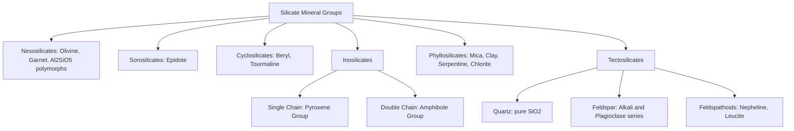

## Silicate Mineral Groups

### Overview and Significance

Silicate minerals constitute the largest and most geologically important mineral class, comprising approximately 90% of the Earth's crust by volume and over 90% of common rock-forming minerals. All silicates are built from the fundamental structural unit, the **silicate tetrahedron** ($SiO_4^{4-}$): a central silicon cation ($Si^{4+}$) coordinated with four oxygen anions ($O^{2-}$) arranged tetrahedrally. The manner in which these tetrahedra link together — by sharing oxygen atoms at their corners — determines the silicate subclass, and this structural linkage pattern directly governs the physical properties, cleavage behavior, and geological occurrence of each mineral group.

### Structural Classification Recap

| Subclass | Linkage | Si:O Ratio | Representative Group |
| --- | --- | --- | --- |
| Nesosilicates | Isolated tetrahedra | 1:4 | Olivine, garnet |
| Sorosilicates | Paired tetrahedra | 2:7 | Epidote |
| Cyclosilicates | Ring structures | 1:3 | Beryl, tourmaline |
| Inosilicates (single chain) | Continuous single chains | 1:3 | Pyroxene |
| Inosilicates (double chain) | Continuous double chains | 4:11 | Amphibole |
| Phyllosilicates | Continuous sheets | 2:5 | Mica, clay minerals |
| Tectosilicates | 3D framework | 1:2 | Feldspar, quartz, feldspathoids |

### Nesosilicates (Island Silicates)

**Structure:** Individual $SiO_4^{4-}$ tetrahedra are not linked to one another; each tetrahedron is bonded only to surrounding metal cations, which provide charge balance and structural cohesion.

**Olivine Group**

- General formula: $(Mg,Fe)_2SiO_4$, a continuous solid solution series between forsterite ($Mg_2SiO_4$) and fayalite ($Fe_2SiO_4$)
- Crystal system: orthorhombic
- Physical properties: hardness 6.5–7, vitreous luster, conchoidal fracture (no cleavage planes, consistent with the absence of chain/sheet weaknesses), typically olive-green color
- Occurrence: a major constituent of mafic and ultramafic igneous rocks (basalt, peridotite); a principal mineral of the upper mantle

**Garnet Group**

- General formula: $X_3Y_2(SiO_4)_3$, where $X$ = divalent cations (Mg, Fe, Mn, Ca) and $Y$ = trivalent cations (Al, Fe, Cr)
- Crystal system: isometric
- Physical properties: hardness 6.5–7.5, vitreous to resinous luster, no cleavage, conchoidal to uneven fracture
- Common end-members: almandine ($Fe_3Al_2Si_3O_{12}$), pyrope ($Mg_3Al_2Si_3O_{12}$), grossular ($Ca_3Al_2Si_3O_{12}$), andradite ($Ca_3Fe_2Si_3O_{12}$)
- Occurrence: characteristic index mineral of regional metamorphic rocks (schist, gneiss); also found in some igneous rocks

**Aluminosilicate Polymorphs**

- Kyanite, andalusite, and sillimanite: all share the formula $Al_2SiO_5$ but form distinct polymorphs stable under different pressure-temperature conditions
- Valuable as geothermobarometric indicators in metamorphic petrology, since each polymorph's stability field constrains the pressure and temperature of formation

### Sorosilicates (Double Island Silicates)

**Structure:** Two tetrahedra share a single bridging oxygen, forming a paired unit ($Si_2O_7^{6-}$).

**Epidote Group**

- General formula (epidote): $Ca_2(Al,Fe)_3(SiO_4)(Si_2O_7)O(OH)$
- Crystal system: monoclinic
- Physical properties: hardness 6–7, vitreous luster, one direction of perfect cleavage, characteristic yellow-green ("pistachio green") color
- Occurrence: common in low- to medium-grade regional and contact metamorphic rocks, and as an alteration product of plagioclase and mafic minerals

This subclass is comparatively rare among common rock-forming minerals relative to nesosilicates, inosilicates, and tectosilicates.

### Cyclosilicates (Ring Silicates)

**Structure:** Tetrahedra link in closed rings, most commonly six-membered rings ($Si_6O_{18}^{12-}$), through shared oxygens.

**Beryl**

- Formula: $Be_3Al_2Si_6O_{18}$
- Crystal system: hexagonal
- Physical properties: hardness 7.5–8, vitreous luster, indistinct cleavage, hexagonal prismatic crystal habit
- Gem varieties: emerald (green, colored by trace chromium/vanadium), aquamarine (blue-green, colored by trace iron), morganite (pink)

**Tourmaline Group**

- Complex borosilicate formula, generally: $XY_3Z_6(BO_3)_3Si_6O_{18}(OH,F)_4$, with extensive compositional variation
- Crystal system: trigonal
- Physical properties: hardness 7–7.5, vitreous luster, no cleavage, striated prismatic crystals, often exhibits pronounced pyroelectric and piezoelectric properties due to its non-centrosymmetric structure
- Occurrence: common accessory mineral in granitic pegmatites and metamorphic rocks

### Inosilicates: Single-Chain (Pyroxene Group)

**Structure:** Tetrahedra link in a continuous single chain, with each tetrahedron sharing two of its four oxygens with adjacent tetrahedra.

**General characteristics**

- General formula: $XYSi_2O_6$, where $X$ = Ca, Na, Mg, Fe (larger cations) and $Y$ = Mg, Fe, Al, Cr (smaller cations)
- Crystal systems: orthorhombic (orthopyroxenes, e.g., enstatite-ferrosilite series) or monoclinic (clinopyroxenes, e.g., augite, diopside)
- Physical properties: hardness 5–6.5, two directions of cleavage intersecting at approximately 87°/93° (near right angles), stubby prismatic crystal habit
- Key members: augite (the most common pyroxene, in mafic igneous rocks), diopside, enstatite, jadeite, spodumene
- Occurrence: major constituent of basalt, gabbro, and peridotite; also found in some high-grade metamorphic rocks

### Inosilicates: Double-Chain (Amphibole Group)

**Structure:** Tetrahedra link in a continuous double chain, formed by cross-linking two single chains, producing a more complex repeating unit.

**General characteristics**

- General formula (hornblende, a common example): complex, approximately $Ca_2(Mg,Fe,Al)_5(Al,Si)_8O_{22}(OH)_2$
- Crystal systems: monoclinic (most common, e.g., hornblende) or orthorhombic (e.g., anthophyllite)
- Physical properties: hardness 5–6, two directions of cleavage intersecting at approximately 56°/124° (a key distinguishing feature from pyroxene's near-90° cleavage), elongated prismatic to needle-like crystal habit
- Contains essential hydroxyl ($OH^-$) groups within the structure, distinguishing amphiboles from the anhydrous pyroxenes
- Key members: hornblende (most common), tremolite, actinolite, glaucophane, riebeckite (asbestiform varieties of some amphibole species are associated with health hazards upon inhalation)
- Occurrence: common in intermediate igneous rocks (diorite, andesite) and amphibolite-facies metamorphic rocks

**Pyroxene vs. Amphibole Cleavage Distinction**

This cleavage-angle difference is one of the most frequently tested diagnostic distinctions in introductory mineralogy, since pyroxene and amphibole can otherwise appear visually similar (both commonly dark-colored, prismatic minerals).

### Phyllosilicates (Sheet Silicates)

**Structure:** Tetrahedra link in continuous two-dimensional sheets, with each tetrahedron sharing three of its four oxygens with neighbors, producing a strongly layered structure. Sheets are typically bonded to adjacent octahedral cation layers (forming composite "TO" or "TOT" layer structures) and stacked with weaker bonding between sheet packages.

**Mica Group**

- Muscovite: $KAl_2(AlSi_3O_{10})(OH)_2$ — light-colored ("white mica")
- Biotite: $K(Mg,Fe)_3(AlSi_3O_{10})(OH)_2$ — dark-colored ("black mica")
- Crystal system: monoclinic
- Physical properties: hardness 2–3, one direction of perfect (basal) cleavage producing thin, flexible, elastic sheets — a direct structural consequence of strong bonding within sheets and weak bonding between them
- Occurrence: widespread in igneous, metamorphic, and some sedimentary/detrital settings

**Clay Mineral Group**

- Includes kaolinite ($Al_2Si_2O_5(OH)_4$), illite, montmorillonite/smectite group
- Crystal system: typically monoclinic or triclinic, though often very fine-grained (cryptocrystalline), complicating direct crystallographic observation without specialized techniques (e.g., X-ray diffraction)
- Physical properties: very low hardness (1–2.5), earthy/dull luster, perfect basal cleavage (though rarely visible at hand-sample scale due to fine grain size), plastic when wet
- Occurrence: primary product of chemical weathering of silicate minerals (especially feldspars); dominant constituent of soils and mudrocks/shales

**Serpentine Group and Chlorite**

- Serpentine: $Mg_3Si_2O_5(OH)_4$, forms through hydrothermal alteration of olivine and pyroxene in ultramafic rocks
- Chlorite: complex hydrous magnesium-iron-aluminum silicate, common in low-grade metamorphic rocks

### Tectosilicates (Framework Silicates)

**Structure:** Tetrahedra link in a fully three-dimensional framework, with every oxygen shared between two tetrahedra, yielding the lowest silicon-to-oxygen ratio (1:2) among all silicate subclasses. Some tectosilicates (feldspars) substitute aluminum for silicon in a fraction of tetrahedral sites, requiring additional cations for charge balance.

**Quartz**

- Formula: $SiO_2$ (pure silica, no aluminum substitution)
- Crystal system: trigonal (a subdivision sometimes grouped with hexagonal)
- Physical properties: hardness 7 (a key reference point on the Mohs scale), vitreous to greasy luster, no cleavage, conchoidal fracture, exceptional chemical and mechanical durability
- Occurrence: extremely widespread in igneous (especially felsic), metamorphic, and sedimentary rocks (notably as the dominant mineral in sandstone due to its resistance to weathering)

**Feldspar Group (the most abundant mineral group in the crust)**

*Alkali (Potassium) Feldspar*

- Orthoclase and microcline: $KAlSi_3O_8$
- Crystal system: monoclinic (orthoclase) or triclinic (microcline)
- Physical properties: hardness 6, two directions of cleavage at approximately 90°, typically pink, white, or gray

*Plagioclase Feldspar*

- A continuous solid solution series between albite ($NaAlSi_3O_8$) and anorthite ($CaAl_2Si_2O_8$)
- Crystal system: triclinic
- Physical properties: hardness 6, two directions of cleavage at approximately 86°/94°, frequently displays fine striations (parallel lines) on cleavage surfaces due to polysynthetic twinning — a key diagnostic feature distinguishing plagioclase from alkali feldspar
- Compositional range (by percent anorthite content) is subdivided into albite, oligoclase, andesine, labradorite, bytownite, and anorthite

**Feldspathoid Group**

- Chemically similar to feldspars but silica-undersaturated (lower $SiO_2$ content), forming instead of feldspar in silica-poor magmas
- Examples: nepheline ($NaAlSiO_4$), leucite ($KAlSi_2O_6$)
- Occurrence: restricted to silica-undersaturated igneous rocks; feldspathoids and quartz are mutually incompatible and essentially never coexist in the same rock, since excess silica would react with feldspathoids to form feldspar

### Diagram: Silicate Group Property Comparison (svg_diagram)

<svg xmlns="http://www.w3.org/2000/svg" viewBox="0 0 640 340">
<text x="320" y="25" text-anchor="middle" font-size="16" font-weight="bold" fill="#1a1a1a">Cleavage Angle Comparison: Pyroxene vs Amphibole (svg_diagram)</text>

<g>
<text x="160" y="60" text-anchor="middle" font-size="13" font-weight="bold" fill="#333">Pyroxene (Inosilicate - single chain)</text>
<rect x="80" y="80" width="160" height="160" fill="none" stroke="#333" stroke-width="1" />
<line x1="90" y1="90" x2="230" y2="90" stroke="#2980b9" stroke-width="3" />
<line x1="90" y1="90" x2="90" y2="230" stroke="#2980b9" stroke-width="3" />
<path d="M 110 90 A 20 20 0 0 0 90 110" fill="none" stroke="#c0392b" stroke-width="2" />
<text x="125" y="115" font-size="12" fill="#c0392b">~87°/93°</text>
<text x="160" y="270" text-anchor="middle" font-size="11" fill="#333">Near-perpendicular cleavage</text>
<text x="160" y="286" text-anchor="middle" font-size="10" fill="#666">e.g., Augite, Diopside</text>
</g>

<g>
<text x="480" y="60" text-anchor="middle" font-size="13" font-weight="bold" fill="#333">Amphibole (Inosilicate - double chain)</text>
<rect x="400" y="80" width="160" height="160" fill="none" stroke="#333" stroke-width="1" />
<line x1="410" y1="160" x2="550" y2="105" stroke="#27ae60" stroke-width="3" />
<line x1="410" y1="160" x2="550" y2="215" stroke="#27ae60" stroke-width="3" />
<path d="M 445 148 A 25 25 0 0 0 445 172" fill="none" stroke="#c0392b" stroke-width="2" />
<text x="455" y="165" font-size="12" fill="#c0392b">~56°/124°</text>
<text x="480" y="270" text-anchor="middle" font-size="11" fill="#333">Oblique cleavage</text>
<text x="480" y="286" text-anchor="middle" font-size="10" fill="#666">e.g., Hornblende, Tremolite</text>
</g>
</svg>

### Diagram: Silicate Group Relationships (Mermaid Diagram)

### Worked Example: Group Identification from Properties

**Problem:** A dark green-black mineral sample shows two cleavage directions intersecting at approximately 56° and 124°, hardness of 5.5, and elongated prismatic crystal habit. Identify the silicate subclass and likely mineral group.

**Step 1 — Cleavage angle analysis:** The 56°/124° cleavage intersection is the diagnostic signature of double-chain inosilicates (amphibole), distinctly different from the near-90° cleavage of single-chain inosilicates (pyroxene).

**Step 2 — Hardness check:** A hardness of 5.5 is consistent with the amphibole group's typical range (5–6), further supporting this classification.

**Step 3 — Crystal habit:** Elongated prismatic habit is typical of amphibole's chain-based structure.

**Conclusion:** The combination of oblique cleavage angle, moderate hardness, dark color, and prismatic habit identifies this specimen as a member of the **amphibole group**, most likely **hornblende**, the most common amphibole species in intermediate igneous and metamorphic rocks.

### Common Misconceptions

- **Misconception:** Pyroxene and amphibole can be reliably distinguished by color alone.

  **Correction:** Both groups commonly appear dark green to black due to iron and magnesium content; the cleavage angle (87°/93° vs. 56°/124°) is the definitive distinguishing property, not color.
- **Misconception:** All feldspars are chemically identical.

  **Correction:** Feldspars are divided into a potassium-rich alkali feldspar series and a distinct plagioclase (sodium-calcium) solid solution series, with different compositions, twinning behavior, and diagnostic striations.
- **Misconception:** Quartz and feldspathoids can occur together in the same igneous rock.

  **Correction:** Feldspathoids form only in silica-undersaturated conditions and are chemically incompatible with free quartz, since any excess silica would react to convert feldspathoid into feldspar.

### Key Points

- All silicates are built from the $SiO_4^{4-}$ tetrahedron; the linkage pattern between tetrahedra defines seven structural subclasses
- Cleavage behavior is directly controlled by tetrahedral linkage: isolated/framework structures show poor cleavage, while chain/sheet structures show pronounced, direction-specific cleavage
- Pyroxene (single chain, ~90° cleavage) and amphibole (double chain, 56°/124° cleavage) are commonly confused but distinguished by cleavage angle
- Feldspar (both alkali and plagioclase series) is the most abundant mineral group in the Earth's crust
- Mica's perfect basal cleavage and phyllosilicate sheet structure produce its characteristic thin, flexible sheets

**Related Topics**

- Definition and Properties of Minerals
- Crystal Structure and Symmetry
- Mineral Classification Systems
- Igneous Rock Classification and Bowen's Reaction Series
- Metamorphic Facies and Index Minerals
- Weathering and Clay Mineral Formation
- Optical Mineralogy and Polarized Light Microscopy
- Ultramafic Rocks and Serpentinization Processes