## Nonsilicate Mineral Groups

### Overview and Significance

Nonsilicate minerals are those whose structure is not built around the silicate tetrahedron ($SiO_4^{4-}$). While silicates dominate the crust by volume (approximately 90%), nonsilicate mineral groups hold outsized economic, industrial, and geological importance, supplying the majority of the world's metallic ores, construction materials, evaporite resources, and fertilizer components. Nonsilicates are organized chemically by their dominant anion or anionic complex, mirroring the same classification logic applied to silicates, but with fundamentally distinct anion chemistry.

### Native Elements

**Structure and general characteristics:** Composed of a single element in uncombined, elemental form, without ionic bonding to a different element.

**Metals**

- Gold ($Au$): isometric, hardness 2.5–3, highly malleable and ductile, exceptional resistance to oxidation/corrosion, specific gravity ~19.3
- Silver ($Ag$): isometric, hardness 2.5–3, malleable, tarnishes to form a black silver sulfide coating upon exposure to sulfur compounds
- Copper ($Cu$): isometric, hardness 2.5–3, malleable, oxidizes to form green copper carbonate/oxide coatings (patina)
- Platinum ($Pt$): isometric, hardness 4–4.5, extremely dense (specific gravity ~14–19), highly resistant to corrosion

**Semimetals and Nonmetals**

- Sulfur ($S$): orthorhombic, hardness 1.5–2.5, resinous luster, brittle, characteristic yellow color, forms around volcanic fumaroles and in evaporite/sedimentary sequences associated with bacterial reduction of sulfates
- Diamond ($C$): isometric, hardness 10 (the hardness reference maximum), adamantine luster, perfect octahedral cleavage, forms under extreme pressure in the mantle and is transported to the surface via kimberlite pipes
- Graphite ($C$): hexagonal, hardness 1–2, greasy feel, one direction of perfect cleavage, forms in metamorphic environments; a polymorph of carbon sharing diamond's composition but with an entirely different (sheet-based, weakly bonded) structure, producing radically contrasting physical properties

### Sulfides

**Structure:** Metal (or semimetal) cations bonded with sulfide anion ($S^{2-}$). Sulfides are geologically and economically critical, since the majority of the world's base and precious metal ores occur as sulfide minerals.

**Pyrite ($FeS_2$)**

- Crystal system: isometric
- Physical properties: hardness 6–6.5, metallic luster, brass-yellow color, cubic or pyritohedral crystal habit, no cleavage
- Nicknamed "fool's gold" due to superficial visual resemblance to gold, though readily distinguished by hardness (pyrite scratches glass; gold does not) and by streak (pyrite: greenish-black; gold: golden-yellow)
- Occurrence: extremely widespread across igneous, metamorphic, sedimentary, and hydrothermal environments

**Galena ($PbS$)**

- Crystal system: isometric
- Physical properties: hardness 2.5, metallic luster, high specific gravity (~7.5), perfect cubic cleavage in three directions, gray-black color and streak
- The principal ore of lead

**Sphalerite ($ZnS$)**

- Crystal system: isometric
- Physical properties: hardness 3.5–4, resinous to adamantine luster, six directions of perfect cleavage, variable color (yellow-brown to black) depending on iron content
- The principal ore of zinc

**Chalcopyrite ($CuFeS_2$)**

- Crystal system: tetragonal
- Physical properties: hardness 3.5–4, metallic luster, brass-yellow color (often with iridescent tarnish), no cleavage
- The most economically important copper ore mineral globally

**Cinnabar ($HgS$)**

- Crystal system: trigonal
- Physical properties: hardness 2–2.5, adamantine to dull luster, distinctive red color and red streak
- The principal ore of mercury; historically significant as a pigment source (vermillion)

### Oxides and Hydroxides

**Structure:** Metal cations bonded directly with oxygen ($O^{2-}$, in oxides) or with the hydroxide complex ($OH^-$, in hydroxides).

**Hematite ($Fe_2O_3$)**

- Crystal system: trigonal
- Physical properties: hardness 5–6.5 (variable with habit), metallic to earthy luster, reddish-brown streak (a highly diagnostic property, constant regardless of surface color/luster variation), no cleavage
- A principal ore of iron; also the primary pigment responsible for red coloration in many sedimentary rocks and soils

**Magnetite ($Fe_3O_4$)**

- Crystal system: isometric (spinel structure group)
- Physical properties: hardness 5.5–6.5, metallic luster, black color and streak, strongly magnetic (a highly diagnostic property distinguishing it from other iron oxides)
- An important iron ore; also significant in paleomagnetic studies due to its capacity to record the Earth's magnetic field orientation at the time of rock formation

**Corundum ($Al_2O_3$)**

- Crystal system: trigonal
- Physical properties: hardness 9 (second only to diamond on the Mohs scale), vitreous to adamantine luster, no cleavage (parting may mimic cleavage)
- Gem varieties: ruby (red, colored by trace chromium), sapphire (blue and other colors, colored by trace iron and titanium)

**Goethite ($FeO(OH)$)**

- Crystal system: orthorhombic
- Physical properties: hardness 5–5.5, yellowish-brown streak, commonly forms botryoidal or massive habits
- A major constituent of "limonite," an informal field term for a mixture of hydrated iron oxide minerals

### Halides

**Structure:** Metal cations bonded with halogen anions (fluoride $F^-$, chloride $Cl^-$, bromide $Br^-$, or iodide $I^-$).

**Halite ($NaCl$)**

- Crystal system: isometric
- Physical properties: hardness 2–2.5, vitreous luster, perfect cubic cleavage in three directions, distinctive salty taste, readily soluble in water
- Forms through evaporation of saline water bodies (evaporite deposits)

**Fluorite ($CaF_2$)**

- Crystal system: isometric
- Physical properties: hardness 4 (a Mohs scale reference point), vitreous luster, perfect octahedral cleavage in four directions, highly variable color (purple, green, yellow, blue, colorless) due to trace impurities and structural defects, frequently exhibits fluorescence under ultraviolet light (the phenomenon of fluorescence is named after this mineral)
- Common in hydrothermal veins, often associated with sulfide ore deposits

**Sylvite ($KCl$)**

- Crystal system: isometric
- Physical properties: hardness 2, perfect cubic cleavage, bitter/salty taste (more bitter than halite)
- Forms in evaporite sequences, often intergrown with halite; an important source of potassium for fertilizer production

### Carbonates

**Structure:** Contain the planar, triangular carbonate anionic group ($CO_3^{2-}$).

**Calcite ($CaCO_3$)**

- Crystal system: trigonal
- Physical properties: hardness 3 (a Mohs scale reference point), vitreous luster, perfect rhombohedral cleavage in three directions, vigorous effervescence with dilute hydrochloric acid, exhibits pronounced double refraction in optically clear varieties (Iceland spar)
- The principal constituent of limestone and marble; also a major biomineral in shells, coral skeletons, and some invertebrate exoskeletons

**Dolomite ($CaMg(CO_3)_2$)**

- Crystal system: trigonal
- Physical properties: hardness 3.5–4, similar rhombohedral cleavage to calcite, effervesces with dilute hydrochloric acid only when powdered (slower/weaker reaction than calcite when massive) — a key diagnostic distinction between the two minerals
- Forms the rock dolostone, often through the diagenetic alteration (dolomitization) of pre-existing limestone

**Malachite ($Cu_2CO_3(OH)_2$) and Azurite ($Cu_3(CO_3)_2(OH)_2$)**

- Both are secondary (supergene) copper carbonate minerals forming through weathering/oxidation of primary copper sulfide deposits
- Malachite: distinctive banded green color; azurite: distinctive deep blue color
- Both serve as visual indicator minerals for near-surface copper mineralization in exploration geology

### Sulfates

**Structure:** Contain the tetrahedral sulfate anionic group ($SO_4^{2-}$).

**Gypsum ($CaSO_4\cdot 2H_2O$)**

- Crystal system: monoclinic
- Physical properties: hardness 2 (the Mohs scale reference minimum-adjacent point), vitreous to pearly/silky luster, one direction of perfect cleavage plus two additional cleavage directions, can be scratched by a fingernail
- Forms primarily through evaporation of saline water; the primary raw material for plaster and drywall/gypsum board

**Anhydrite ($CaSO_4$)**

- Crystal system: orthorhombic
- Physical properties: hardness 3–3.5, vitreous to pearly luster, three directions of cleavage at right angles
- The anhydrous equivalent of gypsum, commonly associated with it in evaporite sequences and interconvertible with gypsum depending on water availability and burial conditions

**Barite ($BaSO_4$)**

- Crystal system: orthorhombic
- Physical properties: hardness 3–3.5, notably high specific gravity (~4.5) for a nonmetallic mineral, vitreous to pearly luster, perfect cleavage
- Used industrially as a drilling mud additive in petroleum exploration due to its high density

### Phosphates

**Structure:** Contain the tetrahedral phosphate anionic group ($PO_4^{3-}$).

**Apatite Group**

- General formula: $Ca_5(PO_4)_3(F,Cl,OH)$, with fluorapatite, chlorapatite, and hydroxylapatite as the respective end-members
- Crystal system: hexagonal
- Physical properties: hardness 5 (a Mohs scale reference point), vitreous luster, poor cleavage
- Occurrence: widespread accessory mineral in igneous and metamorphic rocks; the principal source mineral for phosphate fertilizers; also the primary mineral constituent of vertebrate bone and tooth enamel (as a biomineral)

### Borates and Nitrates

**Borax ($Na_2B_4O_7\cdot 10H_2O$)**

- Crystal system: monoclinic
- Physical properties: hardness 2–2.5, vitreous to earthy luster, distinctive sweetish-alkaline taste, readily soluble in water
- Forms in evaporite deposits within closed desert basins; industrially significant in glass, ceramics, and detergent manufacturing

**Nitratine (Soda Niter, $NaNO_3$)**

- Crystal system: trigonal
- Physical properties: hardness 1.5–2, vitreous luster, highly soluble, cool/cooling taste
- Rare, restricted almost exclusively to extremely arid evaporite environments (historically significant in Chile's Atacama Desert as a natural nitrate fertilizer/explosive precursor source) due to the high solubility limiting preservation in wetter climates

### Diagram: Nonsilicate Classes and Economic Roles (Mermaid Diagram)

```mermaid
flowchart TD
    A[Nonsilicate Mineral Classes] --> B[Native Elements]
    A --> C[Sulfides]
    A --> D[Oxides / Hydroxides]
    A --> E[Halides]
    A --> F[Carbonates]
    A --> G[Sulfates]
    A --> H[Phosphates]
    A --> I[Borates / Nitrates]
    B --> B1[Gold, Silver, Copper, Diamond, Graphite]
    C --> C1[Pyrite, Galena, Sphalerite, Chalcopyrite, Cinnabar]
    C --> C2[Primary Source: Base and Precious Metal Ores]
    D --> D1[Hematite, Magnetite, Corundum, Goethite]
    D --> D2[Primary Source: Iron Ore, Gemstones]
    E --> E1[Halite, Fluorite, Sylvite]
    E --> E2[Primary Source: Evaporite Salts, Fertilizer]
    F --> F1[Calcite, Dolomite, Malachite, Azurite]
    F --> F2[Primary Source: Limestone, Marble, Cu Indicator]
    G --> G1[Gypsum, Anhydrite, Barite]
    G --> G2[Primary Source: Plaster, Drilling Mud]
    H --> H1[Apatite Group]
    H --> H2[Primary Source: Fertilizer, Biomineral]
```

### Diagram: Diagnostic Property Comparison — Common Ore Sulfides (svg_diagram)

<svg xmlns="http://www.w3.org/2000/svg" viewBox="0 0 640 300">
<text x="320" y="25" text-anchor="middle" font-size="16" font-weight="bold" fill="#1a1a1a">Sulfide Ore Mineral Comparison (svg_diagram)</text>

<g>
<rect x="40" y="60" width="120" height="120" fill="#d4ac0d" stroke="#333" stroke-width="1.5" />
<text x="100" y="200" text-anchor="middle" font-size="12" font-weight="bold">Pyrite</text>
<text x="100" y="216" text-anchor="middle" font-size="10">Hardness: 6-6.5</text>
<text x="100" y="230" text-anchor="middle" font-size="10">Streak: greenish-black</text>
<text x="100" y="244" text-anchor="middle" font-size="10">Habit: cubic</text>
</g>

<g>
<rect x="200" y="60" width="120" height="120" fill="#5d6d7e" stroke="#333" stroke-width="1.5" />
<text x="260" y="200" text-anchor="middle" font-size="12" font-weight="bold">Galena</text>
<text x="260" y="216" text-anchor="middle" font-size="10">Hardness: 2.5</text>
<text x="260" y="230" text-anchor="middle" font-size="10">Streak: gray-black</text>
<text x="260" y="244" text-anchor="middle" font-size="10">Cleavage: cubic</text>
</g>

<g>
<rect x="360" y="60" width="120" height="120" fill="#8b5a2b" stroke="#333" stroke-width="1.5" />
<text x="420" y="200" text-anchor="middle" font-size="12" font-weight="bold">Sphalerite</text>
<text x="420" y="216" text-anchor="middle" font-size="10">Hardness: 3.5-4</text>
<text x="420" y="230" text-anchor="middle" font-size="10">Luster: resinous</text>
<text x="420" y="244" text-anchor="middle" font-size="10">Cleavage: 6 directions</text>
</g>

<g>
<rect x="520" y="60" width="80" height="120" fill="#c9a227" stroke="#333" stroke-width="1.5" />
<text x="560" y="200" text-anchor="middle" font-size="12" font-weight="bold">Chalcopyrite</text>
<text x="560" y="216" text-anchor="middle" font-size="10">Hardness: 3.5-4</text>
<text x="560" y="230" text-anchor="middle" font-size="10">Softer than pyrite</text>
</g>
</svg>

### Worked Example: Distinguishing Calcite from Dolomite

**Problem:** Two carbonate rock samples appear visually similar (both light-colored, rhombohedral cleavage). Determine which is calcite-dominated (limestone) and which is dolomite-dominated (dolostone) using a simple field test.

**Step 1 — Apply dilute hydrochloric acid to an unbroken surface of each sample.**

**Step 2 — Observe reaction:** One sample effervesces vigorously and immediately, releasing visible $CO_2$ bubbles.

**Step 3 — Interpretation:** Vigorous, immediate effervescence indicates dominant **calcite** ($CaCO_3$), which reacts readily with dilute acid due to the relative ease of breaking the $Ca-CO_3$ bond structure.

**Step 4 — Test the second sample:** The second sample shows little or no visible reaction on the unbroken surface.

**Step 5 — Confirm with powdered test:** Scratching the second sample to produce powder and reapplying acid to the powder produces a weak, delayed effervescence.

**Conclusion:** The differential acid reaction — vigorous on unbroken calcite versus weak/delayed on powdered dolomite — is the standard field diagnostic distinguishing the two carbonate minerals, reflecting the greater structural stability imparted by magnesium substitution in the dolomite lattice.

### Common Misconceptions

- **Misconception:** Pyrite and gold can be distinguished by color alone.

  **Correction:** Both exhibit a similar brass/golden metallic color, but streak (pyrite: greenish-black; gold: golden-yellow) and hardness (pyrite scratches glass; gold does not) provide definitive distinction.
- **Misconception:** Diamond and graphite, sharing identical chemical composition, should have similar physical properties.

  **Correction:** As polymorphs, their structural arrangement (three-dimensional covalent network in diamond versus weakly bonded sheets in graphite) — not composition — governs their vastly different hardness, cleavage, and conductivity properties.
- **Misconception:** All carbonate rocks are calcite (limestone).

  **Correction:** Dolostone, composed primarily of dolomite, is texturally and visually similar to limestone but chemically and diagnostically distinct, requiring an acid test (preferably on powder) for confident field identification.

### Key Points

- Nonsilicate minerals are classified chemically by dominant anion: native elements, sulfides, oxides/hydroxides, halides, carbonates, sulfates, phosphates, borates, and nitrates
- Sulfides supply the majority of the world's base and precious metal ores (pyrite, galena, sphalerite, chalcopyrite)
- Streak, hardness, and acid reactivity are key diagnostic tools distinguishing visually similar nonsilicate minerals (pyrite vs. gold; calcite vs. dolomite)
- Evaporite minerals (halite, gypsum, sylvite, borax, nitratine) form through evaporation of saline waters and are economically vital for salts, fertilizers, and industrial chemicals
- Polymorphism (diamond/graphite) demonstrates that structure, not composition alone, governs physical properties

**Related Topics**

- Definition and Properties of Minerals
- Mineral Classification Systems
- Ore Deposits and Economic Geology
- Evaporite Environments and Sedimentary Processes
- Weathering and Supergene Enrichment of Ore Deposits
- Biomineralization: Calcite, Aragonite, and Apatite in Organisms
- Paleomagnetism and Magnetite as a Recording Mineral
- Gemology and Trace-Element Coloration in Minerals