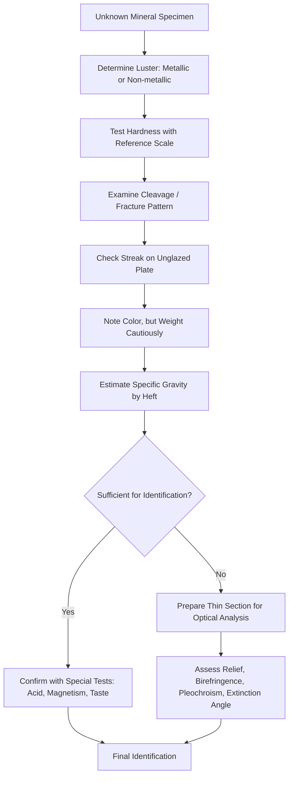

## Physical and Optical Identification Properties

### Overview and Diagnostic Philosophy

Mineral identification relies on a systematic evaluation of measurable and observable properties, since no single property is fully diagnostic in isolation for most mineral species. Properties are broadly divided into two categories: **physical properties**, observable through direct hand-sample examination (hardness, cleavage, luster, color, streak, specific gravity, crystal habit, and related mechanical/tactile characteristics), and **optical properties**, which require examination of a mineral's interaction with transmitted or polarized light, typically via a petrographic (polarizing) microscope on thin sections. Effective identification combines multiple properties in sequence, narrowing the range of candidate minerals at each step.

### Hardness

**Definition:** Resistance of a mineral's surface to scratching, reflecting the strength of atomic/ionic bonding within the crystal structure.

**Mohs Hardness Scale:** A relative ordinal scale (1–10) established by Friedrich Mohs in 1812, based on which minerals can scratch which others. It is not a linear scale in absolute terms; the difference in absolute hardness between adjacent Mohs values increases substantially toward the top of the scale (e.g., the gap between corundum at 9 and diamond at 10 is far greater in absolute terms than between talc at 1 and gypsum at 2).

| Mohs Value | Reference Mineral | Common Field Test Equivalent |
| --- | --- | --- |
| 1 | Talc | Easily scratched by fingernail |
| 2 | Gypsum | Scratched by fingernail (~2.5) |
| 2.5 | — | Fingernail |
| 3 | Calcite | Scratched by copper penny |
| 3.5 | — | Copper penny |
| 4 | Fluorite | Scratched by steel knife blade |
| 5 | Apatite | Scratched with difficulty by steel knife |
| 5.5 | — | Steel knife/glass plate |
| 6 | Orthoclase | Scratched by steel file, scratches glass with difficulty |
| 6.5 | — | Steel file |
| 7 | Quartz | Scratches window glass and steel easily |
| 8 | Topaz | Scratches quartz |
| 9 | Corundum | Scratches topaz |
| 10 | Diamond | Scratches all other minerals |

**Practical hardness testing procedure:**

1. Select a fresh, unweathered surface of the specimen (weathering rinds can produce misleadingly low hardness readings)
2. Attempt to scratch the specimen with a reference object of known hardness (fingernail ≈ 2.5, copper penny ≈ 3.5, glass/steel knife ≈ 5.5, steel file ≈ 6.5)
3. Confirm a genuine scratch by wiping away any powder residue and checking for a permanent groove, distinguishing a true scratch from a superficial powder streak left by the softer testing tool
4. Bracket the hardness by testing both directions (does the specimen scratch the tool, or does the tool scratch the specimen) to narrow the value

**Caution:** Hardness can vary directionally on some minerals (a property called **anisotropic hardness**), most notably kyanite, which has a hardness of approximately 5 along its length and approximately 7 across its width — a distinctive diagnostic feature in itself.

### Cleavage and Fracture

**Cleavage:** The tendency of a mineral to break along smooth, planar surfaces controlled by planes of weaker atomic bonding within the crystal structure. Described by the number of cleavage directions, the angles between them, and the quality (perfect, good, fair, poor).

| Cleavage Quality | Description |
| --- | --- |
| Perfect | Smooth, easily produced, mirror-like surfaces (e.g., mica) |
| Good | Distinct but slightly less smooth surfaces (e.g., feldspar) |
| Fair/Poor | Discernible but irregular partial planes (e.g., beryl) |
| None | No preferred breakage planes; breaks via fracture instead |

**Common cleavage geometries and diagnostic examples:**

- One direction: mica (basal cleavage, producing thin sheets)
- Two directions at ~90°: pyroxene, feldspar
- Two directions at oblique angles (~56°/124°): amphibole
- Three directions at 90° (cubic cleavage): halite, galena
- Three directions, not at 90° (rhombohedral cleavage): calcite, dolomite
- Four directions (octahedral cleavage): fluorite, diamond
- Six directions (dodecahedral cleavage): sphalerite

**Fracture:** Breakage along irregular surfaces where no cleavage plane exists, occurring in a direction unrelated to internal structural weakness.

- **Conchoidal**: smooth, curved, shell-like surfaces (e.g., quartz, obsidian)
- **Fibrous/splintery**: elongated, thread-like breakage (e.g., some amphibole varieties)
- **Hackly**: jagged, sharp edges typical of native metals (e.g., copper)
- **Uneven/irregular**: rough, non-planar surfaces (most common fracture type for minerals lacking cleavage)
- **Earthy**: crumbly, soil-like breakage (e.g., some clay minerals)

**Distinguishing cleavage from crystal faces:** Cleavage planes are repeated parallel surfaces produced by breaking the specimen, appearing as multiple parallel, stepped, or reflective planes across a broken face; crystal faces are original growth surfaces present on an unbroken, naturally terminated crystal. A specimen can display both simultaneously, and confusing the two is a common source of misidentification for students.

### Luster

**Definition:** The quality and intensity of light reflected from a mineral's surface, governed by the mineral's refractive index, surface texture, and atomic bonding character.

**Metallic luster:** Opaque minerals that reflect light similarly to polished metal (e.g., pyrite, galena, magnetite, native gold and copper). Typically associated with minerals possessing metallic or covalent bonding involving transition metals.

**Non-metallic luster subcategories:**

- **Vitreous (glassy):** most common non-metallic luster (e.g., quartz, calcite, most silicates)
- **Pearly:** iridescent, pearl-like sheen, typically on cleavage surfaces (e.g., talc, muscovite)
- **Silky:** fine fibrous sheen (e.g., fibrous gypsum/satin spar, chrysotile asbestos)
- **Resinous:** resembling resin or amber (e.g., sphalerite, sulfur)
- **Greasy:** appears coated in oil or grease (e.g., some nepheline, massive quartz)
- **Adamantine:** exceptionally brilliant, diamond-like (e.g., diamond, cerussite, some corundum)
- **Dull/Earthy:** matte, non-reflective surface (e.g., kaolinite, some limonite)
- **Submetallic:** intermediate between metallic and non-metallic, often seen in minerals with partial oxidation/tarnish

### Color

**Reliability considerations:** Color is often the least reliable diagnostic property for mineral identification, due to two distinct causes of color variability:

- **Idiochromatic minerals:** color is intrinsic to the essential chemical composition and remains largely constant (e.g., malachite's green color derives from its essential copper content and is diagnostic)
- **Allochromatic minerals:** color arises from trace element impurities or structural defects unrelated to the essential formula, causing wide color variation within a single species (e.g., quartz varieties: colorless rock crystal, purple amethyst from trace iron plus irradiation, smoky quartz from natural irradiation-induced structural defects, pink rose quartz, all sharing identical essential $SiO_2$ composition)

Color-causing mechanisms include: trace transition-metal impurities (chromium producing red in ruby, green in emerald), crystal structural defects (color centers), and physical phenomena such as thin-film interference or light scattering from microscopic inclusions.

### Streak

**Definition:** The color of a mineral's powder, typically obtained by scratching the specimen across an unglazed porcelain streak plate (which has a hardness of approximately 6.5–7, limiting the technique's usefulness for harder minerals that instead only scratch the plate).

**Diagnostic value:** Streak is more reliable than surface color because the powdered form typically shows a more consistent, intrinsic color regardless of surface variation. A classic diagnostic example is hematite, which can appear black, silvery-gray, or reddish on its surface depending on habit and oxidation state, yet invariably produces a reddish-brown streak.

**Limitation:** Streak testing is only meaningful for minerals softer than the streak plate; minerals harder than approximately 7 (e.g., quartz, topaz, corundum) simply scratch the plate itself and produce no diagnostic powder streak.

### Specific Gravity

**Definition:** The ratio of a mineral's mass to the mass of an equal volume of water at standard conditions (a dimensionless number, since it is a ratio).

**Typical ranges:**

- Common rock-forming silicates: approximately 2.6–3.4 (e.g., quartz ≈ 2.65, feldspar ≈ 2.55–2.76, olivine ≈ 3.2–4.4)
- Common nonmetallic minerals: variable, generally below 4 (e.g., calcite ≈ 2.71, gypsum ≈ 2.3)
- Metallic/heavy minerals: substantially higher (e.g., barite ≈ 4.5, galena ≈ 7.5, native gold ≈ 15.6–19.3 depending on purity)

**Field estimation technique ("heft"):** Experienced observers can qualitatively estimate relative specific gravity by hand, comparing the "heaviness" of a specimen relative to its apparent size — a mineral that feels unexpectedly heavy for its size (e.g., galena, barite) signals a high specific gravity worth further testing.

**Precise laboratory measurement:** Typically performed using a Jolly balance or hydrostatic (Archimedes') weighing method, comparing a specimen's weight in air versus its weight when fully submerged in water, since the buoyant force loss corresponds directly to the volume of displaced water.

### Other Diagnostic Physical Properties

**Tenacity:** A mineral's behavior under stress (bending, crushing, breaking, or cutting).

- **Brittle:** shatters into fragments (most silicates)
- **Malleable:** can be hammered into thin sheets without breaking (native metals)
- **Sectile:** can be cut into thin shavings with a knife (e.g., gypsum, native copper)
- **Ductile:** can be drawn into wire (native metals)
- **Elastic:** bends and springs back to original shape when released (e.g., mica)
- **Flexible:** bends but does not return to original shape (e.g., chlorite, talc)

**Magnetism:** A small number of minerals exhibit natural magnetic attraction, most notably magnetite (strongly magnetic) and to a lesser degree pyrrhotite (weakly to moderately magnetic).

**Reaction to dilute hydrochloric acid:** Carbonate minerals react with acid to release $CO_2$ gas (effervescence); calcite reacts vigorously on any fresh surface, while dolomite requires powdering for a visible (weaker) reaction — a key diagnostic distinction between the two most common carbonate minerals.

**Taste:** Diagnostic for a limited number of soluble minerals (e.g., halite: salty; sylvite: more bitter/salty than halite).

**Feel:** Some minerals have a distinctive tactile quality (e.g., talc: soapy/greasy feel; kaolinite: often described as having a distinctive "clay" texture when moistened).

**Fluorescence and phosphorescence:** Emission of visible light under ultraviolet illumination (fluorescence, ceasing when the UV source is removed) or continued emission after the UV source is removed (phosphorescence). Diagnostic for specific mineral varieties (e.g., some fluorite, calcite, scheelite) but not a universal or predictable property across a mineral species, since fluorescence often depends on trace activator elements present in only some specimens.

### Optical Properties (Petrographic/Thin-Section Identification)

Optical properties become essential when hand-sample physical properties are insufficient to distinguish minerals, particularly for fine-grained rocks requiring microscopic examination. These properties are assessed using a **petrographic microscope**, which illuminates a thin section (a rock slice ground to a standard thickness of 30 micrometers) with plane-polarized or cross-polarized transmitted light.

**Refractive index ($n$)**

- The ratio of the speed of light in a vacuum to its speed within the mineral, governing how strongly light bends upon entering the mineral
- Higher refractive index generally correlates with higher relief (the apparent contrast/prominence of a mineral's outline against its surrounding mounting medium or adjacent grains) under the microscope

**Relief**

- The visual prominence of a mineral grain's outline in plane-polarized light, resulting from the refractive index contrast between the mineral and its surrounding medium
- Categorized qualitatively as low, moderate, high, or very high relief (e.g., quartz: low relief; garnet: high relief; a consequence of garnet's substantially higher refractive index)

**Birefringence (double refraction)**

- The numerical difference between a mineral's highest and lowest refractive indices, arising from optical anisotropy in all non-isometric crystal systems
- Under cross-polarized light, birefringence produces characteristic **interference colors**, visualized on a reference chart (the Michel-Lévy interference color chart) that relates interference color to birefringence value and thin-section thickness
- Isometric minerals (e.g., garnet, halite) are optically isotropic and show no birefringence, appearing dark ("extinct") under crossed polars regardless of stage rotation

**Pleochroism**

- A change in color or intensity of color observed in a mineral under plane-polarized light as the microscope stage is rotated, caused by differential light absorption along different crystallographic directions
- Diagnostic for certain colored anisotropic minerals (e.g., biotite mica exhibits strong pleochroism, shifting between pale and dark brown; tourmaline and hornblende are also commonly pleochroic)

**Extinction angle**

- The angle through which the microscope stage must be rotated (from a reference crystallographic direction, such as a cleavage trace) to bring a mineral grain to its dark ("extinct") position under crossed polars
- Diagnostic value depends on crystal system: minerals in the orthorhombic, tetragonal, and hexagonal systems typically show **parallel extinction** (extinction aligned with cleavage or crystal edges), while monoclinic and triclinic minerals commonly show **inclined (oblique) extinction**, useful for distinguishing similar-appearing silicate groups (e.g., distinguishing pyroxene from amphibole in thin section)

**Twinning (optical)**

- Repeated, systematic intergrowth of two or more crystal segments of the same mineral in a symmetrical, non-random orientation, visible under crossed polars as adjacent domains with contrasting extinction positions
- Polysynthetic (repeated lamellar) twinning is strongly diagnostic of plagioclase feldspar, producing a characteristic striped appearance under crossed polars

### Diagram: Systematic Identification Workflow (Mermaid Diagram)

### Diagram: Interference Color and Birefringence Relationship (svg_diagram)

<svg xmlns="http://www.w3.org/2000/svg" viewBox="0 0 600 260">
<text x="300" y="25" text-anchor="middle" font-size="16" font-weight="bold" fill="#1a1a1a">Birefringence and Interference Color Trend (svg_diagram)</text>
<rect x="50" y="70" width="80" height="120" fill="#4a4a4a" />
<text x="90" y="200" text-anchor="middle" font-size="10">1st order gray</text>
<text x="90" y="214" text-anchor="middle" font-size="9" fill="#666">Low birefringence</text>
<text x="90" y="228" text-anchor="middle" font-size="9" fill="#666">e.g., Quartz</text>
<rect x="150" y="70" width="80" height="120" fill="#d4b483" />
<text x="190" y="200" text-anchor="middle" font-size="10">1st order yellow</text>
<rect x="250" y="70" width="80" height="120" fill="#c0392b" />
<text x="290" y="200" text-anchor="middle" font-size="10">1st order red</text>
<text x="290" y="214" text-anchor="middle" font-size="9" fill="#666">e.g., Feldspar</text>
<rect x="350" y="70" width="80" height="120" fill="#3498db" />
<text x="390" y="200" text-anchor="middle" font-size="10">2nd order blue</text>
<rect x="450" y="70" width="80" height="120" fill="#27ae60" />
<text x="490" y="200" text-anchor="middle" font-size="10">2nd order green</text>
<text x="490" y="214" text-anchor="middle" font-size="9" fill="#666">e.g., Olivine</text>
<rect x="530" y="70" width="40" height="120" fill="#f1c40f" />
<text x="550" y="200" text-anchor="middle" font-size="9">High order</text>
<line x1="50" y1="220" x2="570" y2="220" stroke="#333" stroke-width="1" />
<polygon points="570,220 560,215 560,225" fill="#333" />
<text x="300" y="245" text-anchor="middle" font-size="11" fill="#333">Increasing birefringence and interference order</text>
</svg>

### Worked Example: Full Diagnostic Sequence

**Problem:** A translucent, colorless mineral specimen shows a vitreous luster, no visible cleavage, conchoidal fracture, and scratches a glass plate readily. Under the petrographic microscope, it shows low relief, low first-order gray birefringence, and parallel extinction relative to prism faces. Identify the mineral.

**Step 1 — Hand-sample properties:** Vitreous luster with no cleavage and conchoidal fracture strongly suggests a tectosilicate (framework structure lacking planes of weakness).

**Step 2 — Hardness test:** Scratching glass readily (glass ≈ 5.5) places the hardness at approximately 7 or higher, consistent with the quartz reference point on the Mohs scale.

**Step 3 — Optical properties:** Low relief indicates a refractive index close to the mounting medium's typical value; low first-order gray birefringence is characteristic of minerals with small differences between maximum and minimum refractive indices.

**Step 4 — Extinction behavior:** Parallel extinction relative to prism faces is consistent with a mineral in a crystal system with orthogonal crystallographic axes (hexagonal/trigonal, in this case).

**Conclusion:** The combination of hardness ~7, vitreous luster, absence of cleavage, conchoidal fracture, low relief, low birefringence, and parallel extinction converges on **quartz** ($SiO_2$), illustrating how physical hand-sample tests and optical thin-section properties are used complementarily rather than redundantly, since certain silica polymorphs and glass could otherwise appear superficially similar in hand sample alone.

### Common Misconceptions

- **Misconception:** Color is the most useful property for mineral identification.

  **Correction:** Streak, hardness, and cleavage are generally far more diagnostic, since color frequently varies due to trace impurities (allochromatic coloration) even within a single mineral species.
- **Misconception:** Cleavage planes and crystal faces are the same feature.

  **Correction:** Crystal faces are original growth surfaces on an unbroken crystal; cleavage planes are surfaces produced by breaking the mineral along inherent structural weaknesses. Both may be present on the same specimen but represent fundamentally different origins.
- **Misconception:** All minerals will show a diagnostic streak on a streak plate.

  **Correction:** Minerals harder than the streak plate itself (approximately hardness 7) simply scratch the plate rather than leaving a powder streak, making the technique inapplicable for minerals such as quartz, topaz, and corundum.

### Key Points

- Hardness, cleavage, luster, color, streak, and specific gravity form the core hand-sample diagnostic toolkit, used jointly rather than in isolation
- Streak is generally more reliable than surface color, though limited to minerals softer than the streak plate
- Cleavage angle and direction count are highly diagnostic and structurally controlled (e.g., pyroxene ~90° vs. amphibole 56°/124°)
- Optical properties (relief, birefringence, pleochroism, extinction angle) extend identification capability to fine-grained or visually ambiguous specimens via petrographic microscopy
- Special tests (acid reaction, magnetism, taste, fluorescence) provide confirmatory diagnostic value for specific mineral groups

**Related Topics**

- Definition and Properties of Minerals
- Crystal Structure and Symmetry
- Silicate Mineral Groups
- Nonsilicate Mineral Groups
- Petrographic Microscopy and Thin Section Preparation
- The Michel-Lévy Interference Color Chart
- Mineral Classification Systems
- X-Ray Diffraction as a Confirmatory Identification Method