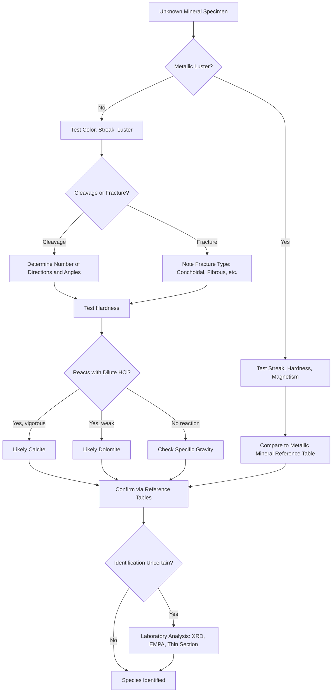

## Mineral Identification Techniques

### Overview

Mineral identification is the systematic process of determining a mineral's identity by observing and testing its physical, chemical, optical, and crystallographic properties. Because minerals are defined by fixed chemical compositions and ordered atomic structures, each species expresses a reproducible set of properties that can be measured or observed with simple field tools or laboratory instruments. Identification typically proceeds from quick, non-destructive field tests toward more precise, instrument-based laboratory methods when greater certainty is required.

### Diagnostic Physical Properties

#### Color

Color is the most immediately visible property but is often the least reliable for identification, since trace element impurities, structural defects, and inclusions can shift a mineral's color dramatically. Quartz, for example, occurs in colorless, purple (amethyst), yellow (citrine), and smoky brown varieties despite identical composition. Color is most useful for minerals with metallic luster or consistently idiochromatic (self-colored) species such as malachite (green) or azurite (blue).

#### Streak

Streak is the color of a mineral's powder, obtained by scraping the specimen across an unglazed porcelain plate (a "streak plate," hardness ~7). Streak is more diagnostic than surface color because it is less affected by minor impurities. Hematite consistently produces a reddish-brown streak regardless of whether the hand specimen is black, silver, or red. Streak testing is ineffective for minerals harder than the streak plate itself, since the plate scratches the specimen instead of powdering it.

#### Luster

Luster describes how a mineral's surface reflects light and is classified into two broad categories:

- **Metallic luster**: opaque, reflective like polished metal (e.g., galena, pyrite)
- **Non-metallic luster**: subdivided into vitreous (glassy, e.g., quartz), pearly (e.g., talc, muscovite cleavage faces), silky (fibrous aggregates, e.g., gypsum var. satin spar), resinous (e.g., sphalerite), greasy (e.g., nepheline), adamantine (brilliant, e.g., diamond), and dull/earthy (e.g., kaolinite)

#### Hardness (Mohs Scale)

Hardness measures a mineral's resistance to scratching, tested by comparing a specimen against reference minerals or common tools of known hardness. The Mohs scale is an ordinal (relative) scale, not a linear measure of absolute hardness.

| Mohs Value | Reference Mineral | Common Field Comparator |
| --- | --- | --- |
| 1 | Talc | — |
| 2 | Gypsum | Fingernail (~2.5) |
| 3 | Calcite | Copper penny (~3.5) |
| 4 | Fluorite | — |
| 5 | Apatite | Glass plate, knife blade (~5.5) |
| 6 | Orthoclase Feldspar | Steel file (~6.5) |
| 7 | Quartz | — |
| 8 | Topaz | — |
| 9 | Corundum | — |
| 10 | Diamond | — |

Testing procedure: attempt to scratch the unknown mineral with a reference material of known hardness. If the reference scratches the unknown, the unknown's hardness is lower; if the unknown scratches the reference, its hardness is higher. Bracket the value by testing successive reference points until the transition is found. [Unverified] Absolute hardness (measured via indentation methods such as Vickers) does not scale linearly with the Mohs scale; the interval between corundum (9) and diamond (10) is disproportionately large compared to lower intervals.

#### Cleavage and Fracture

Cleavage is the tendency of a mineral to break along planar surfaces corresponding to zones of weaker atomic bonding, typically parallel to planes of weakness in the crystal lattice. Cleavage is described by the number of directions and the angles between them:

- **Basal (1 direction)**: mica group — splits into thin, flexible sheets
- **Cubic (3 directions at 90°)**: halite, galena
- **Rhombohedral (3 directions not at 90°)**: calcite — produces rhombohedron-shaped fragments
- **Octahedral (4 directions)**: fluorite, diamond
- **Prismatic (2 directions)**: amphibole (~124°/56°), pyroxene (~87°/93°)

Fracture describes breakage along non-planar, irregular surfaces and occurs in minerals lacking cleavage or when breakage cuts across cleavage planes:

- **Conchoidal**: smooth, curved surfaces resembling shell interiors (quartz, obsidian)
- **Fibrous/splintery**: elongated, thread-like breaks (asbestos minerals)
- **Hackly**: jagged, sharp edges (native copper)
- **Uneven/irregular**: rough surfaces with no consistent pattern (most rock-forming silicates)

Distinguishing cleavage from fracture is critical: cleavage produces flat, often reflective planes that repeat at consistent angles across multiple fragments of the same specimen, while fracture surfaces are irregular and non-repeating.

#### Specific Gravity (Density)

Specific gravity (SG) is the ratio of a mineral's mass to the mass of an equal volume of water, and it is measured using a hydrostatic (Jolly) balance or simple pycnometer methods:

$$SG = \frac{W_{air}}{W_{air} - W_{water}}$$

where $W_{air}$ is the specimen's weight in air and $W_{water}$ is its apparent weight when fully submerged in water. Most rock-forming silicates fall between 2.6–3.5, while metallic ores are notably denser: galena (~7.5), barite (~4.5), and native gold (~19.3). SG is especially useful for distinguishing visually similar minerals, such as separating barite (heavy, non-metallic) from calcite or gypsum (both lighter).

#### Crystal Habit and Form

Habit describes the characteristic external shape a mineral tends to grow into, which reflects its internal crystal structure combined with growth conditions:

- **Cubic**: halite, pyrite (also forms striated cubes)
- **Prismatic/columnar**: tourmaline, beryl
- **Tabular/platy**: barite, mica
- **Botryoidal**: grape-like rounded masses (hematite, malachite)
- **Dendritic**: branching, tree-like growths (native copper, manganese oxides)
- **Acicular**: needle-like crystals (natrolite, rutile)
- **Massive**: no discernible crystal form, common in fine-grained aggregates

### Chemical and Reactive Tests

#### Acid Reaction Test

Carbonate minerals react with dilute hydrochloric acid (typically 5–10%) through the reaction:

$$CaCO_3 + 2HCl \rightarrow CaCl_2 + H_2O + CO_2\uparrow$$

Calcite effervesces vigorously with cold dilute HCl, while dolomite reacts only weakly unless powdered or the acid is warmed — this differential reactivity is the standard field test to distinguish the two carbonates.

#### Taste and Feel

Halite has a distinctly salty taste, and sylvite (KCl) tastes bitter/salty, a useful distinction in evaporite sequences. Talc feels distinctly greasy or soapy to the touch due to weak interlayer bonding along its basal cleavage, while kaolinite feels earthy or slightly gritty.

#### Magnetism

Magnetite is strongly attracted to a hand magnet, while pyrrhotite shows weak-to-moderate magnetism depending on its iron/sulfur stoichiometry. Most rock-forming silicates and carbonates show no magnetic response, making this a fast screening test for iron-oxide-rich specimens.

#### Fluorescence

Some minerals fluoresce under ultraviolet light due to trace activator elements (commonly manganese, uranium, or rare earth elements) within the crystal lattice. Fluorite (from which the phenomenon takes its name) frequently fluoresces blue-violet under longwave UV, and scheelite fluoresces bright blue-white, which is used as a prospecting tool for tungsten ores. [Unverified] Fluorescence response is highly variable even within a single species and depends on the specific trace-element content of the sample, so absence of fluorescence does not rule out a species identification.

### Optical Mineralogy (Petrographic Methods)

For precise identification beyond hand-specimen tests, mineralogists prepare thin sections (~30 micrometers thick) and examine them under a polarizing (petrographic) microscope. Key optical properties include:

- **Relief**: the apparent contrast between a mineral grain and its mounting medium, reflecting the difference in refractive index
- **Birefringence**: the difference between a mineral's maximum and minimum refractive indices, observed as interference colors under crossed polarized light
- **Pleochroism**: a change in absorption color as the microscope stage is rotated, seen in minerals with strongly anisotropic light absorption (e.g., biotite, tourmaline)
- **Extinction angle**: the angle between a crystal's cleavage/elongation direction and the position of extinction under crossed polars, diagnostic for distinguishing pyroxenes from amphiboles

$$\Delta n = n_{max} - n_{min}$$

where $\Delta n$ is birefringence and $n_{max}$, $n_{min}$ are the maximum and minimum refractive indices measured within the section.

### Instrumental and Laboratory Techniques

#### X-ray Diffraction (XRD)

XRD is the definitive method for identifying a mineral's crystal structure by measuring the angles and intensities of X-rays diffracted from a powdered or single-crystal sample. Diffraction follows Bragg's Law:

$$n\lambda = 2d\sin\theta$$

where $n$ is an integer, $\lambda$ is the X-ray wavelength, $d$ is the interplanar spacing, and $\theta$ is the angle of incidence. The resulting diffraction pattern acts as a structural fingerprint, matched against reference databases (such as the International Centre for Diffraction Data's Powder Diffraction File) to confirm species identity, particularly for fine-grained or cryptocrystalline minerals that cannot be identified visually.

#### X-ray Fluorescence (XRF) and Electron Microprobe Analysis (EMPA)

XRF and EMPA determine elemental composition by measuring characteristic X-rays emitted when a sample is bombarded with X-rays (XRF) or a focused electron beam (EMPA). These methods quantify major, minor, and trace element concentrations, allowing precise classification of solid-solution mineral series (such as the plagioclase feldspar series, olivine series, or garnet group) based on measured end-member proportions.

#### Scanning Electron Microscopy (SEM)

SEM provides high-resolution imaging of crystal habit, surface textures, and intergrowth relationships at magnifications far beyond optical microscopy, and when coupled with energy-dispersive X-ray spectroscopy (EDS), it enables simultaneous imaging and semi-quantitative elemental analysis of micron-scale mineral grains.

### Systematic Identification Workflow

### Identification Flowchart (Field Method Summary)

<svg xmlns="http://www.w3.org/2000/svg" viewBox="0 0 900 500" font-family="Helvetica, Arial, sans-serif">
<text x="450" y="30" text-anchor="middle" font-size="18" font-weight="bold" fill="#1a1a1a">Mineral Identification Decision Path (svg_diagram)</text>
<rect x="370" y="55" width="160" height="45" rx="6" fill="#e8eef7" stroke="#33475b" stroke-width="1.5" />
<text x="450" y="82" text-anchor="middle" font-size="13" fill="#1a1a1a">Unknown Specimen</text>
<line x1="450" y1="100" x2="450" y2="130" stroke="#33475b" stroke-width="1.5" />
<polygon points="450,130 540,165 450,200 360,165" fill="#fdf3d8" stroke="#8a6d1a" stroke-width="1.5" />
<text x="450" y="169" text-anchor="middle" font-size="12" fill="#1a1a1a">Metallic Luster?</text>
<line x1="360" y1="165" x2="220" y2="165" stroke="#33475b" stroke-width="1.5" />
<text x="290" y="158" text-anchor="middle" font-size="11" fill="#555">No</text>
<rect x="120" y="145" width="200" height="45" rx="6" fill="#e8eef7" stroke="#33475b" stroke-width="1.5" />
<text x="220" y="172" text-anchor="middle" font-size="12" fill="#1a1a1a">Color, Streak, Luster</text>
<line x1="540" y1="165" x2="680" y2="165" stroke="#33475b" stroke-width="1.5" />
<text x="610" y="158" text-anchor="middle" font-size="11" fill="#555">Yes</text>
<rect x="590" y="145" width="200" height="45" rx="6" fill="#e8eef7" stroke="#33475b" stroke-width="1.5" />
<text x="690" y="172" text-anchor="middle" font-size="12" fill="#1a1a1a">Streak + Magnetism Test</text>
<line x1="220" y1="190" x2="220" y2="220" stroke="#33475b" stroke-width="1.5" />
<rect x="120" y="220" width="200" height="45" rx="6" fill="#e8eef7" stroke="#33475b" stroke-width="1.5" />
<text x="220" y="247" text-anchor="middle" font-size="12" fill="#1a1a1a">Cleavage / Fracture</text>
<line x1="220" y1="265" x2="220" y2="295" stroke="#33475b" stroke-width="1.5" />
<rect x="120" y="295" width="200" height="45" rx="6" fill="#e8eef7" stroke="#33475b" stroke-width="1.5" />
<text x="220" y="322" text-anchor="middle" font-size="12" fill="#1a1a1a">Hardness (Mohs Test)</text>
<line x1="220" y1="340" x2="220" y2="370" stroke="#33475b" stroke-width="1.5" />
<rect x="120" y="370" width="200" height="45" rx="6" fill="#e8eef7" stroke="#33475b" stroke-width="1.5" />
<text x="220" y="397" text-anchor="middle" font-size="12" fill="#1a1a1a">Acid Reaction / SG Test</text>
<line x1="690" y1="190" x2="690" y2="370" stroke="#33475b" stroke-width="1.5" />
<line x1="320" y1="392" x2="590" y2="392" stroke="#33475b" stroke-width="1.5" stroke-dasharray="4,3" />
<line x1="220" y1="415" x2="450" y2="440" stroke="#33475b" stroke-width="1.5" />
<line x1="690" y1="392" x2="450" y2="440" stroke="#33475b" stroke-width="1.5" />
<rect x="330" y="440" width="240" height="45" rx="6" fill="#dff3e3" stroke="#1f6b3a" stroke-width="1.5" />
<text x="450" y="467" text-anchor="middle" font-size="12" fill="#1a1a1a">Match to Reference / Lab Confirm</text>
</svg>

### Common Diagnostic Test Combinations

| Mineral | Streak | Hardness | Cleavage/Fracture | Distinguishing Test |
| --- | --- | --- | --- | --- |
| Calcite | White | 3 | Rhombohedral cleavage | Vigorous HCl effervescence |
| Dolomite | White | 3.5–4 | Rhombohedral cleavage | Weak/no HCl reaction unless powdered |
| Halite | White | 2.5 | Cubic cleavage | Salty taste |
| Gypsum | White | 2 | Basal cleavage (flexible, non-elastic) | Scratched by fingernail |
| Muscovite | White | 2–2.5 | Perfect basal cleavage | Splits into thin elastic sheets |
| Biotite | White/gray | 2.5–3 | Perfect basal cleavage | Dark color, elastic sheets |
| Magnetite | Black | 5.5–6.5 | No cleavage, conchoidal fracture | Strongly magnetic |
| Hematite | Reddish-brown | 5–6 | No cleavage, uneven fracture | Streak regardless of surface color |
| Pyrite | Greenish-black | 6–6.5 | No cleavage, conchoidal fracture | Brassy color, cubic crystals, no malleability |
| Galena | Gray | 2.5 | Cubic cleavage (perfect) | High specific gravity (~7.5) |
| Fluorite | White | 4 | Octahedral cleavage | Fluoresces under UV; color variable |
| Talc | White | 1 | Basal cleavage | Greasy feel, scratched by fingernail |
| Quartz | White (or none on hard surfaces) | 7 | No cleavage, conchoidal fracture | Vitreous luster, scratches glass |

### Practical Example: Working Through an Unknown Specimen

**Example:** A field geologist collects a white, translucent mineral with a vitreous luster. Streak testing produces a white streak (uninformative, as expected for most light-colored minerals). Hardness testing shows the specimen is scratched by a copper penny but scratches a fingernail, placing hardness at approximately 3. The specimen shows rhombohedral cleavage, breaking into small blocks with non-90° angles. A drop of dilute HCl produces immediate, vigorous bubbling. Based on this combination — hardness 3, rhombohedral cleavage, and vigorous acid reaction — the specimen is identified as **calcite**. If the acid reaction had instead been weak or absent, dolomite or another carbonate would be the more likely candidate, warranting a powdered-sample retest with acid.

### Common Sources of Misidentification

- Relying on color alone, especially for minerals prone to impurity-driven color variation (quartz, fluorite, corundum)
- Confusing fracture surfaces with true cleavage planes, particularly in fine-grained or altered specimens
- Testing hardness on a weathered or coated surface rather than a fresh break, which can yield artificially low readings
- Misapplying the acid test on carbonate rocks composed of fine intergrown calcite and dolomite, where a single drop may give an ambiguous result
- Assuming metallic luster always indicates a genuine ore mineral, when tarnished or oxidized surfaces on non-metallic minerals can mimic a submetallic appearance

**Next Steps**

- Crystal systems and symmetry classification
- Silicate mineral classification (framework, chain, sheet, and isolated tetrahedra structures)
- Petrographic microscopy and thin-section preparation techniques
- Ore mineral identification and economic mineralogy
- Mineral chemistry and solid-solution series
- Rock-forming mineral associations in igneous, sedimentary, and metamorphic contexts