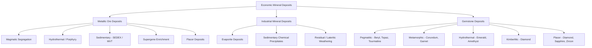

## Gemstones and Economic Minerals

### Overview

Gemstones and economic minerals are naturally occurring mineral (or mineraloid) materials valued for aesthetic, industrial, or commercial purposes. Gemstones are prized primarily for beauty, durability, and rarity when cut and polished for ornamental use, while economic minerals encompass the broader category of ore minerals and industrial minerals extracted for their metal content, chemical properties, or physical utility. Both categories are evaluated using overlapping frameworks: mineralogical identification, quality grading, formation environment, and market/industrial application.

### Gemstone Fundamentals

#### The 4 Cs of Gemstone Quality (Diamond Grading Framework)

The diamond industry's grading framework, developed by the Gemological Institute of America (GIA), has become the standard reference model applied loosely across colored gemstones as well:

- **Carat**: unit of mass equal to 200 milligrams ($1\ ct = 0.2\ g$); larger stones are disproportionately rarer and more valuable per carat
- **Cut**: the quality of proportions, symmetry, and polish that determines how effectively a stone returns light to the viewer's eye
- **Color**: for diamonds, graded on a scale from colorless (D) to light yellow/brown (Z); for colored gemstones, hue, saturation, and tone are evaluated instead
- **Clarity**: the presence, size, and visibility of internal inclusions and external blemishes, graded from Flawless (FL) to Included (I3) in diamonds

#### Essential Gemstone Properties

- **Refractive Index (RI)**: measures how strongly a material bends light; higher RI generally produces greater brilliance. Diamond has an RI of approximately 2.42, while quartz is approximately 1.54–1.55
- **Dispersion**: the splitting of white light into spectral colors ("fire"), quantified as the difference in refractive index between red and violet wavelengths
- **Hardness (Mohs Scale)**: durability against scratching; gem-quality material for jewelry generally requires hardness ≥ 7 to resist daily wear (corundum = 9, diamond = 10)
- **Toughness**: resistance to breaking, chipping, or cleaving, which is distinct from hardness — jade is notably tough despite moderate hardness (6–7) due to its interlocking fibrous structure
- **Specific Gravity**: density relative to water, used alongside RI as a diagnostic identification tool
- **Pleochroism**: the property of showing different colors when viewed from different crystallographic directions, diagnostic for minerals like tanzanite and iolite

#### Origin and Formation Environments

Gemstones form across the full range of geological environments:

- **Igneous/pegmatitic**: beryl (emerald, aquamarine), tourmaline, topaz, and spodumene varieties crystallize from volatile-rich residual melts in pegmatites
- **Metamorphic**: ruby and sapphire (corundum) form in metamorphosed limestones (marbles) and metasomatic zones; garnet forms in regionally metamorphosed schists and gneisses
- **Hydrothermal**: emerald deposits (notably in Colombia) form via hydrothermal fluids interacting with black shales; amethyst forms in hydrothermal veins and vugs
- **Kimberlitic/deep mantle**: diamond crystallizes at depths of 150–200 km under extreme pressure-temperature conditions and is transported to the surface via kimberlite and lamproite pipe eruptions
- **Sedimentary/placer**: physically resistant and chemically stable gem minerals (diamond, sapphire, garnet, zircon) accumulate in alluvial and placer deposits after weathering out of primary host rocks

### Major Gemstone Species

#### Diamond

Diamond is a cubic allotrope of pure carbon, with each carbon atom covalently bonded to four neighbors in a tetrahedral lattice, producing exceptional hardness (Mohs 10) and thermal conductivity. Diamonds form in the mantle under pressures exceeding roughly 4.5 GPa and temperatures around 1000–1300°C, and are brought to the surface rapidly via kimberlite pipe eruptions that preserve the metastable diamond structure. Color variants arise from trace impurities and structural defects: nitrogen substitution produces yellow tints (Type Ib/Ia), boron substitution produces blue color (Type IIb), and structural lattice distortion produces pink or brown "fancy" colors.

#### Corundum (Ruby and Sapphire)

Corundum ($Al_2O_3$) is the second-hardest natural mineral (Mohs 9). Red corundum colored by chromium substitution is classified as **ruby**; all other colors are classified as **sapphire**, with blue sapphire (colored by iron and titanium) being the most commercially prominent. Corundum typically forms in metamorphosed carbonate rocks (marble-hosted rubies, as in Myanmar's Mogok region) or in metamorphic/metasomatic basaltic-associated environments (as in Australian and Thai sapphire deposits).

#### Beryl Group (Emerald, Aquamarine, Morganite)

Beryl ($Be_3Al_2Si_6O_{18}$) is a cyclosilicate whose color varieties depend on trace element substitution: chromium and/or vanadium produce **emerald** (green), iron produces **aquamarine** (blue) and **heliodor** (yellow), and manganese produces **morganite** (pink). Emerald commonly forms in hydrothermal veins where beryllium-bearing pegmatitic fluids interact with chromium-bearing host rocks such as black shale (Colombia) or ultramafic rocks (Zambia, Brazil).

#### Quartz Varieties

Quartz ($SiO_2$) is chemically simple but produces numerous gem varieties through trace element inclusion and irradiation effects: **amethyst** (purple, iron-related color centers), **citrine** (yellow-orange, often heat-treated amethyst), **smoky quartz** (brown-gray, natural irradiation), **rose quartz** (pink, trace titanium or microscopic mineral inclusions), and **agate/chalcedony** (cryptocrystalline banded varieties).

#### Garnet Group

Garnet is a solid-solution silicate group with the general formula $X_3Y_2(SiO_4)_3$, where the X and Y sites accommodate varying divalent and trivalent cations. Common gem species include pyrope (Mg-Al), almandine (Fe-Al), spessartine (Mn-Al), grossular (Ca-Al), and andradite (Ca-Fe). Garnet's isomorphous substitution series means gem color spans nearly the entire visible spectrum depending on end-member proportions.

#### Feldspar Group Gems

**Moonstone** (orthoclase or albite-rich alkali feldspar) exhibits adularescence, a billowy light effect caused by light scattering off exsolution lamellae within the crystal structure. **Labradorite** displays labradorescence, an iridescent play of color caused by thin-film interference at compositional lamellae boundaries within the plagioclase structure.

### Treatments and Synthetics

#### Common Gemstone Enhancement Treatments

- **Heat treatment**: applied to corundum, zircon, and quartz varieties to improve color or clarity by altering trace-element oxidation states
- **Irradiation**: used to produce or intensify color in topaz (blue), diamond (fancy colors), and quartz varieties
- **Fracture filling**: glass or resin filling of surface-reaching fractures in ruby and emerald to improve apparent clarity
- **Diffusion treatment**: surface-level introduction of coloring elements (commonly titanium or beryllium) into corundum under high heat to alter color

[Unverified] Disclosure standards for treatments vary by jurisdiction and trade association; treatment history should be independently verified through certified gemological laboratory reports (e.g., GIA, AGL) rather than assumed from visual inspection alone.

#### Synthetic and Simulant Gem Materials

Synthetic gemstones share the same chemical composition and crystal structure as their natural counterparts but are laboratory-grown (e.g., Verneuil flame-fusion synthetic corundum, hydrothermal synthetic emerald, and chemical-vapor-deposition or high-pressure-high-temperature synthetic diamond). Simulants, by contrast, merely resemble a gemstone visually without sharing its composition (e.g., cubic zirconia and moissanite as diamond simulants). Distinguishing natural, synthetic, and simulant material typically requires laboratory testing of inclusion patterns, trace element chemistry, and spectroscopic response.

### Economic Minerals: Classification Framework

Economic minerals are broadly divided into **metallic ore minerals** (mined primarily for their metal content) and **industrial (non-metallic) minerals** (valued for physical or chemical properties rather than metal extraction).

#### Metallic Ore Minerals

| Mineral | Formula | Metal Extracted | Primary Deposit Type |
| --- | --- | --- | --- |
| Hematite | $Fe_2O_3$ | Iron | Banded iron formations, sedimentary |
| Magnetite | $Fe_3O_4$ | Iron | Igneous/magmatic segregation, BIFs |
| Chalcopyrite | $CuFeS_2$ | Copper | Porphyry copper, hydrothermal |
| Bornite | $Cu_5FeS_4$ | Copper | Hydrothermal, supergene enrichment |
| Sphalerite | $ZnS$ | Zinc | Sedimentary-exhalative, Mississippi Valley-type |
| Galena | $PbS$ | Lead | Hydrothermal veins, MVT deposits |
| Bauxite (mineraloid mixture) | $Al(OH)_3 / AlO(OH)$ | Aluminum | Lateritic weathering profiles |
| Cassiterite | $SnO_2$ | Tin | Pegmatitic, hydrothermal, placer |
| Native Gold | $Au$ | Gold | Hydrothermal veins, placer |
| Molybdenite | $MoS_2$ | Molybdenum | Porphyry deposits |

#### Ore Formation Processes

- **Magmatic segregation**: dense ore minerals (chromite, magnetite, platinum-group minerals) crystallize early from a cooling magma and settle by gravity into layered concentrations
- **Hydrothermal deposition**: metal-bearing fluids circulate through fractured rock, precipitating ore minerals as pressure, temperature, or chemistry changes along the flow path
- **Porphyry systems**: large-volume, low-to-moderate grade deposits formed by fluids exsolving from cooling felsic to intermediate intrusions, hosting the majority of the world's copper and molybdenum production
- **Sedimentary-exhalative (SEDEX) and Mississippi Valley-Type (MVT)**: base metal sulfides precipitate from basinal brines either onto the seafloor (SEDEX) or within carbonate host rocks (MVT)
- **Supergene enrichment**: near-surface weathering and groundwater circulation redistribute and concentrate metals from a lower-grade primary (hypogene) ore zone into a richer secondary zone
- **Placer concentration**: mechanical weathering and fluvial or coastal sorting concentrate dense, chemically resistant minerals (gold, cassiterite, ilmenite) in stream and beach sediments

#### Industrial (Non-Metallic) Minerals

| Mineral | Formula | Primary Industrial Use |
| --- | --- | --- |
| Halite | $NaCl$ | De-icing, chemical feedstock, food processing |
| Gypsum | $CaSO_4 \cdot 2H_2O$ | Drywall/plasterboard, cement retarder |
| Kaolinite | $Al_2Si_2O_5(OH)_4$ | Ceramics, paper coating, refractories |
| Sylvite | $KCl$ | Potash fertilizer |
| Phosphate minerals (apatite group) | $Ca_5(PO_4)_3(F,Cl,OH)$ | Fertilizer (phosphoric acid production) |
| Barite | $BaSO_4$ | Drilling mud weighting agent |
| Talc | $Mg_3Si_4O_{10}(OH)_2$ | Cosmetics, ceramics, paper filler |
| Fluorite | $CaF_2$ | Steelmaking flux, hydrofluoric acid production |
| Graphite | $C$ | Refractories, lubricants, battery anodes |
| Sulfur (native) | $S$ | Sulfuric acid production, fertilizer manufacture |

### Ore Grade and Economic Viability

The economic viability of an ore deposit depends on the interaction between ore grade (concentration of the target metal, typically expressed in weight percent or grams per tonne) and market, technical, and infrastructural factors. Key concepts include:

- **Cut-off grade**: the minimum ore grade at which extraction remains economically viable given current commodity prices, mining costs, and processing recovery rates
- **Tonnage-grade relationship**: an inverse relationship generally exists between deposit tonnage and average ore grade — very large deposits (porphyry copper) tend to have comparatively low grades, while smaller high-grade deposits (some vein-hosted gold systems) can still be economically attractive
- **Strip ratio**: for open-pit mining, the ratio of waste rock volume that must be removed per unit volume of ore extracted, directly affecting mining cost
- [Inference] Because cut-off grade is directly tied to fluctuating commodity prices, a deposit considered sub-economic during a price downturn may become economically viable during a price upswing without any change in the deposit's geology

### Mineral Deposit Classification Diagram

### Basic Gem Testing and Identification Workflow

**Example:** A jeweler receives an unidentified transparent blue stone set in a ring and needs a preliminary, non-destructive assessment before sending it for laboratory certification. Using a refractometer, the stone shows a refractive index reading of approximately 1.76–1.77 with birefringence, consistent with corundum rather than glass or synthetic spinel (both of which read as singly refractive). A specific gravity test (hydrostatic weighing) yields approximately 4.0, matching corundum's expected range (3.95–4.10). Under magnification, the stone shows curved, banded color zoning rather than the angular growth zoning typical of synthetic flame-fusion corundum, suggesting a natural origin. Based on this combination of tests, the stone is preliminarily identified as natural blue sapphire, pending confirmatory spectroscopic analysis at a gemological laboratory to rule out treatment or diffusion.

### Environmental and Ethical Considerations in Extraction

- **Conflict minerals**: certain economic minerals (notably tin, tantalum, tungsten, and gold — the "3TG" minerals) have been associated with financing armed conflict in some source regions, prompting international supply chain due diligence frameworks
- **Artisanal and small-scale mining (ASM)**: informal extraction, common in gemstone and gold mining in developing regions, can present distinct labor, safety, and environmental management challenges compared to industrial-scale operations
- **Tailings management**: fine-grained waste material from ore processing requires long-term containment to prevent acid mine drainage and heavy metal contamination of surrounding watersheds
- [Unverified] Certification schemes (such as the Kimberley Process for diamonds) vary in scope and enforcement effectiveness across jurisdictions, and coverage gaps have been the subject of ongoing industry and regulatory debate

**Next Steps**

- Crystallography and the structural basis of gem optical properties
- Ore deposit models and plate tectonic settings of mineralization
- Gemological instrumentation (refractometer, spectroscope, polariscope use)
- Mining and mineral processing methods (comminution, flotation, leaching)
- Mineral resource classification and reserve estimation standards (e.g., JORC, NI 43-101)
- Placer geology and heavy mineral sand deposits