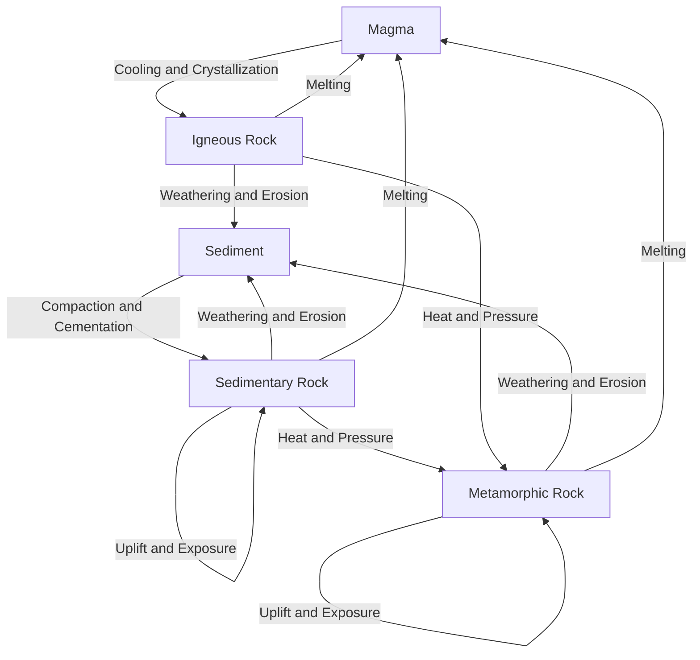

## The Rock Cycle

### Overview

The rock cycle is the conceptual model describing the continuous transformation of Earth materials among the three fundamental rock classes — igneous, sedimentary, and metamorphic — driven by internal (tectonic, thermal) and external (atmospheric, hydrospheric, biological) processes. No rock is permanent: given sufficient time and the right conditions, any rock can be converted into any other rock type, either directly or through intermediate stages. The cycle has no fixed starting point and no required sequence; pathways can bypass stages entirely (e.g., a sedimentary rock can be metamorphosed and later melted without ever becoming a different sedimentary rock first).

### The Three Rock Classes

#### Igneous Rocks

Igneous rocks form from the cooling and solidification of molten rock material (magma below the surface, lava above it). They are subdivided by cooling environment:

- **Intrusive (plutonic)**: crystallizes slowly beneath the surface, producing coarse-grained (phaneritic) textures with interlocking crystals visible to the naked eye (e.g., granite, gabbro, diorite)
- **Extrusive (volcanic)**: crystallizes rapidly at or near the surface, producing fine-grained (aphanitic) or glassy textures due to limited time for crystal growth (e.g., basalt, rhyolite, obsidian)

#### Sedimentary Rocks

Sedimentary rocks form through the accumulation, compaction, and cementation of weathered rock fragments, dissolved chemical constituents, or organic material at or near Earth's surface. Three primary formation pathways exist:

- **Clastic (detrital)**: mechanical accumulation of rock and mineral fragments (clasts) produced by weathering and erosion, later compacted and cemented (e.g., sandstone, shale, conglomerate)
- **Chemical**: precipitation of dissolved ions directly from aqueous solution, often driven by evaporation or saturation changes (e.g., rock salt, gypsum, some limestones)
- **Biochemical/organic**: accumulation of biologically derived material, including shell fragments, skeletal debris, and plant matter (e.g., fossiliferous limestone, coal, chert derived from siliceous organisms)

#### Metamorphic Rocks

Metamorphic rocks form when pre-existing rock (the "protolith") is subjected to heat, pressure, and/or chemically active fluids sufficient to alter its mineralogy, texture, or structure while remaining in the solid state (i.e., without complete melting). Metamorphism is classified by the dominant driving mechanism:

- **Regional (dynamothermal) metamorphism**: occurs over large areas due to combined heat and directed pressure, typically associated with mountain-building (orogenic) events at convergent plate boundaries (e.g., schist, gneiss)
- **Contact (thermal) metamorphism**: occurs where a rock is heated by proximity to an intruding magma body, with limited spatial extent and minimal directed pressure (e.g., marble from limestone, hornfels from shale)
- **Dynamic (cataclastic) metamorphism**: occurs due to mechanical shearing stress along fault zones, with limited thermal involvement (e.g., mylonite)

### Processes Driving Rock Transformation

#### Melting and Crystallization

Partial or complete melting of any rock type produces magma, which subsequently cools and crystallizes into igneous rock. Melting is controlled by pressure, temperature, and volatile (particularly water) content, following relationships described by a rock's solidus and liquidus curves. Fractional crystallization during cooling progressively changes the residual melt's composition as early-forming minerals are removed, a process central to the differentiation of magma into diverse igneous rock types (Bowen's Reaction Series).

#### Weathering and Erosion

Weathering breaks down rock at or near Earth's surface through mechanical (physical) and chemical processes:

- **Mechanical weathering**: physical disintegration without chemical change, including frost wedging, thermal expansion/contraction, salt crystallization, and biological root action
- **Chemical weathering**: decomposition through reactions such as hydrolysis, oxidation, dissolution, and carbonation, which alter mineral composition (e.g., feldspar weathering to clay minerals)

Erosion then transports weathered material via gravity, water, wind, or ice to sites of deposition, where it accumulates as sediment.

#### Compaction, Lithification, and Cementation

Loose sediment is converted into solid sedimentary rock (lithification) through:

- **Compaction**: the weight of overlying sediment expels pore water and reduces void space between grains
- **Cementation**: dissolved minerals (commonly silica, calcite, or iron oxide) precipitate within pore spaces, binding grains together into a coherent rock

#### Heat and Pressure (Metamorphism)

When temperature and/or pressure exceed the stability conditions of a protolith's original minerals, but remain below the rock's melting point, existing minerals recrystallize or react to form new mineral assemblages stable under the new conditions. This can also produce foliation — planar alignment of platy or elongate minerals (such as mica) perpendicular to the direction of maximum compressive stress — a hallmark texture of regionally metamorphosed rocks.

#### Uplift and Exposure

Tectonic uplift, combined with erosion of overlying material, brings deeply buried igneous or metamorphic rocks back to the surface, where they become subject to weathering and can supply sediment for new sedimentary rocks, closing the loop of the cycle.

### Complete Rock Cycle Pathways

### The Rock Cycle as a Closed System Diagram

<svg xmlns="http://www.w3.org/2000/svg" viewBox="0 0 800 700" font-family="Helvetica, Arial, sans-serif">
<text x="400" y="30" text-anchor="middle" font-size="18" font-weight="bold" fill="#1a1a1a">The Rock Cycle (svg_diagram)</text>
<circle cx="400" cy="150" r="70" fill="#f4b183" stroke="#8c4a1a" stroke-width="2" />
<text x="400" y="145" text-anchor="middle" font-size="14" fill="#1a1a1a">Magma /</text>
<text x="400" y="163" text-anchor="middle" font-size="14" fill="#1a1a1a">Lava</text>
<circle cx="650" cy="350" r="75" fill="#a9d18e" stroke="#375623" stroke-width="2" />
<text x="650" y="345" text-anchor="middle" font-size="14" fill="#1a1a1a">Igneous</text>
<text x="650" y="363" text-anchor="middle" font-size="14" fill="#1a1a1a">Rock</text>
<circle cx="400" cy="580" r="75" fill="#ffe699" stroke="#7f6000" stroke-width="2" />
<text x="400" y="575" text-anchor="middle" font-size="14" fill="#1a1a1a">Sediment /</text>
<text x="400" y="593" text-anchor="middle" font-size="14" fill="#1a1a1a">Sedimentary Rock</text>
<circle cx="150" cy="350" r="75" fill="#b4a7d6" stroke="#4c3a7a" stroke-width="2" />
<text x="150" y="345" text-anchor="middle" font-size="14" fill="#1a1a1a">Metamorphic</text>
<text x="150" y="363" text-anchor="middle" font-size="14" fill="#1a1a1a">Rock</text>
<path d="M 460,190 L 610,300" fill="none" stroke="#333" stroke-width="2" marker-end="url(#arrow)" />
<text x="560" y="230" font-size="11" fill="#333">Cooling / Crystallization</text>
<path d="M 620,415 L 460,540" fill="none" stroke="#333" stroke-width="2" marker-end="url(#arrow)" />
<text x="580" y="500" font-size="11" fill="#333">Weathering / Erosion</text>
<path d="M 340,540 L 190,415" fill="none" stroke="#333" stroke-width="2" marker-end="url(#arrow)" />
<text x="200" y="500" font-size="11" fill="#333">Heat and Pressure</text>
<path d="M 190,300 L 340,190" fill="none" stroke="#333" stroke-width="2" marker-end="url(#arrow)" />
<text x="200" y="230" font-size="11" fill="#333">Melting</text>
<path d="M 220,390 Q 400,470 580,390" fill="none" stroke="#333" stroke-width="1.5" stroke-dasharray="5,4" marker-end="url(#arrow)" />
<text x="400" y="465" text-anchor="middle" font-size="11" fill="#333">Melting (metamorphic to magma)</text>
<path d="M 680,290 Q 750,420 500,560" fill="none" stroke="#333" stroke-width="1.5" stroke-dasharray="5,4" marker-end="url(#arrow)" />
<text x="700" y="450" font-size="11" fill="#333">Weathering / Erosion</text>
<path d="M 120,290 Q 50,420 300,560" fill="none" stroke="#333" stroke-width="1.5" stroke-dasharray="5,4" marker-end="url(#arrow)" />
<text x="60" y="450" font-size="11" fill="#333">Uplift / Weathering</text>
</svg>

### Tectonic Setting as the Engine of the Rock Cycle

Plate tectonics provides the primary driving mechanism linking rock cycle processes across geologic time and space:

- **Divergent boundaries**: decompression melting of upwelling mantle material generates basaltic magma, producing new oceanic igneous crust at mid-ocean ridges
- **Convergent boundaries**: subduction introduces water into the mantle wedge, lowering the melting point of mantle rock (flux melting) and generating magma that produces volcanic arcs; collision zones generate the heat and directed pressure responsible for regional metamorphism and mountain-building
- **Transform boundaries**: lateral shearing along fault zones produces localized dynamic (cataclastic) metamorphism
- **Passive margins and basins**: tectonically quiet settings favor long-term sediment accumulation and burial, providing conditions for lithification and, with sufficient burial depth, subsequent metamorphism

### Rates and Timescales of Rock Cycle Processes

Rock cycle processes operate across vastly different timescales:

- Lava cooling to form fine-grained extrusive igneous rock can occur within hours to years
- Sediment compaction and cementation into sedimentary rock typically spans thousands to millions of years, depending on burial rate and pore fluid chemistry
- Regional metamorphism associated with mountain-building can require tens of millions of years, tied to the duration of orogenic events
- [Inference] Because subduction recycles oceanic crust back into the mantle over tens to hundreds of millions of years, the average oceanic crust is geologically young compared to the oldest preserved continental crust, which can exceed 4 billion years in age

### Worked Example: Tracing a Rock Cycle Pathway

**Example:** Consider a parcel of basalt (extrusive igneous rock) exposed on the ocean floor at a mid-ocean ridge. Over millions of years, this basalt is buried by accumulating marine sediment and eventually subducted at a convergent margin. Under increasing temperature and pressure during subduction, the basalt's original minerals (plagioclase feldspar and pyroxene) become unstable and recrystallize into new metamorphic minerals stable at higher pressure, producing a metamorphic rock such as blueschist or eclogite. If subduction-zone fluids trigger flux melting of the overlying mantle wedge, the resulting magma may rise to feed a volcanic arc, crystallizing into new igneous rock at the surface — completing a full pathway from igneous rock, through metamorphism, back to magma and new igneous rock, without ever passing through a sedimentary stage.

### Common Misconceptions

- The rock cycle is not a fixed, one-directional sequence; any rock type can transition directly into any other, and stages can be skipped entirely
- Metamorphism does not require melting — by definition, metamorphic rocks form in the solid state; if melting occurs, the material is no longer undergoing metamorphism but is instead generating new magma
- Sediment and sedimentary rock are related but distinct stages; lithification (compaction and cementation) is required to convert loose sediment into coherent sedimentary rock
- The rock cycle does not imply that rock material is conserved in fixed proportions among the three classes at all times; tectonic and surface processes can transiently concentrate rock formation in one class over others depending on the geologic setting

**Related Topics**

- Igneous rock classification and Bowen's Reaction Series
- Sedimentary structures and depositional environments
- Metamorphic facies and pressure-temperature-time (P-T-t) paths
- Plate tectonics and the Wilson Cycle
- Weathering processes and soil formation
- Radiometric dating and geologic timescales