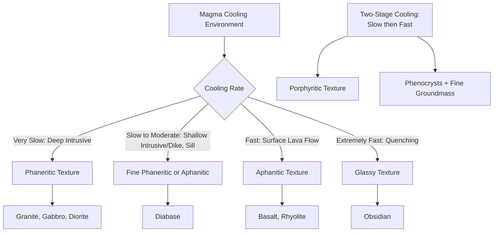

## Magma Generation and Igneous Textures

### Overview

Magma generation refers to the physical and chemical processes by which solid rock in the crust or mantle transitions into molten or partially molten material, while igneous textures describe the crystalline or glassy fabric that results when that magma cools and solidifies. Texture is a direct record of a rock's cooling history — grain size, crystal shape, and fabric arrangement reveal the rate of cooling, the presence of dissolved volatiles, and whether crystallization occurred in one stage or multiple stages.

### Mechanisms of Magma Generation

Rock does not require external heating to melt; melting can be triggered by changing any of the three variables that control a rock's melting point: temperature, pressure, and volatile content.

#### Decompression Melting

When solid mantle rock rises (as in upwelling beneath a mid-ocean ridge or a mantle plume), pressure decreases while temperature remains nearly constant because the rise is rapid relative to the timescale of heat conduction. Since a rock's solidus temperature decreases with decreasing pressure, the rock can cross its solidus and begin to melt without any addition of heat. This is the dominant melt-generation mechanism at divergent plate boundaries and intraplate hotspots.

#### Flux Melting (Volatile-Induced Melting)

The addition of volatiles — primarily water — to mantle rock lowers its solidus temperature substantially, allowing melting to occur at a lower temperature than would otherwise be required. At convergent margins, the subducting oceanic plate releases water from hydrous minerals (such as serpentine and amphibole) as it is heated and compressed with depth; this water rises into the overlying mantle wedge and triggers flux melting, generating the magmas that feed volcanic arcs.

#### Heat-Induced (Thermal) Melting

Direct addition of heat can also drive melting, most commonly where hot mantle-derived magma intrudes into and heats surrounding crustal rock, or where anomalously high heat flow (such as above a mantle plume) directly raises crustal or lithospheric mantle temperatures above the solidus. This mechanism is particularly important for generating crustal melts (producing felsic magmas) in continental settings.

#### Partial Melting

Rocks are composed of multiple mineral phases, each with a different melting temperature. As a rock is heated, minerals with the lowest melting points melt first, while others remain solid — a process called partial melting. The resulting melt is chemically distinct from (typically more felsic/silica-enriched than) the original source rock, since low-melting-point mineral components are preferentially incorporated into the liquid. The degree of partial melting (the percentage of the source rock that melts) directly controls the composition of the resulting magma: low degrees of partial melting produce more felsic melts, while higher degrees of partial melting produce melts closer in composition to the bulk source rock.

$$T_{solidus} = f(P, X_{H_2O})$$

where solidus temperature is a function of pressure ($P$) and volatile content, particularly water content ($X_{H_2O}$).

### Magma Composition and Classification

Magmas are broadly classified by silica ($SiO_2$) content, which correlates strongly with viscosity, eruptive behavior, and mineral assemblage upon crystallization:

| Magma Type | Silica Content | Viscosity | Typical Source |
| --- | --- | --- | --- |
| Ultramafic | <45% | Very low | Rare; high-degree mantle melting |
| Mafic | 45–52% | Low | Mantle decompression melting (basalt) |
| Intermediate | 52–63% | Moderate | Mixed mantle/crustal, subduction zones (andesite) |
| Felsic | >63% | High | Crustal melting, fractional crystallization (rhyolite/granite) |

Higher silica content promotes greater polymerization of silicate tetrahedra within the melt, increasing viscosity and inhibiting the escape of dissolved gases — a key factor controlling whether a volcanic eruption is effusive (mafic, low viscosity) or explosive (felsic, high viscosity, gas-trapping).

### Magmatic Differentiation

#### Bowen's Reaction Series

Bowen's Reaction Series describes the sequence in which minerals crystallize from a cooling mafic magma, organized into two parallel branches:

- **Discontinuous branch**: minerals crystallize in a stepwise sequence with distinct crystal structures at each stage — olivine, then pyroxene, then amphibole, then biotite mica, as temperature decreases
- **Continuous branch**: plagioclase feldspar crystallizes continuously, progressively changing composition from calcium-rich (anorthite) at high temperature to sodium-rich (albite) at lower temperature through continuous solid-solution substitution

Both branches converge toward the lower-temperature felsic minerals (potassium feldspar, muscovite, quartz), which crystallize last.

#### Fractional Crystallization

As minerals crystallize from a cooling magma, if the crystals are physically separated from the remaining liquid (by settling, filter pressing, or other mechanisms), the composition of the residual melt is progressively altered because it is depleted in the elements incorporated into the removed crystals. This process, called fractional crystallization, is a principal mechanism generating a wide compositional range of igneous rocks from a single parental magma without requiring multiple distinct magma sources.

#### Assimilation and Magma Mixing

Rising magma can incorporate ("assimilate") portions of the wall rock it intrudes, altering its composition, and separate magma batches of different composition can mix if they occupy the same magma chamber, both processes contributing additional compositional diversity beyond fractional crystallization alone.

### Igneous Textures

#### Crystallinity-Based Textures

- **Phaneritic**: coarse-grained texture with crystals large enough to be identified with the naked eye (typically >1 mm), resulting from slow cooling at depth (intrusive/plutonic environments)
- **Aphanitic**: fine-grained texture with crystals too small to identify without magnification, resulting from rapid cooling at or near the surface (extrusive/volcanic environments)
- **Glassy (vitreous)**: no crystalline structure at all, resulting from cooling so rapid that atoms are not given sufficient time to organize into an ordered lattice (e.g., obsidian)
- **Porphyritic**: a texture containing two distinct crystal size populations — larger crystals (phenocrysts) embedded in a finer-grained or glassy groundmass — recording a two-stage cooling history in which slow cooling at depth allowed early crystal growth, followed by rapid cooling (e.g., during eruption) that quenched the remaining melt

#### Textures Related to Volatile Content and Emplacement

- **Vesicular**: contains rounded or elongated cavities (vesicles) formed by trapped gas bubbles exsolving from magma as pressure decreases during ascent and eruption (e.g., scoria, pumice)
- **Pyroclastic (fragmental)**: composed of broken rock and glass fragments explosively ejected during violent eruptions, later consolidated (e.g., tuff, volcanic breccia)
- **Pegmatitic**: exceptionally coarse-grained texture (crystals often exceeding several centimeters) resulting from crystallization in a volatile-rich, low-viscosity residual melt that allows for rapid ion mobility and unusually large crystal growth

#### Special and Diagnostic Textures

- **Ophitic**: elongated plagioclase laths are partially to fully enclosed within larger pyroxene crystals, indicating plagioclase began crystallizing before pyroxene (common in diabase/dolerite)
- **Pilotaxitic/trachytic**: fine, aligned microlites of feldspar showing a flow-aligned fabric, recording magma flow direction during cooling
- **Spherulitic**: radiating, fan-like clusters of acicular crystals (often feldspar or silica minerals) that nucleate from a single point, typically forming during devitrification of volcanic glass
- **Poikilitic**: large host crystals enclose numerous smaller crystals of a different mineral in random orientation, without the specific elongate alignment seen in ophitic texture

### Cooling Rate and Texture Relationship

### Igneous Texture Comparison Chart

<svg xmlns="http://www.w3.org/2000/svg" viewBox="0 0 900 420" font-family="Helvetica, Arial, sans-serif">
<text x="450" y="28" text-anchor="middle" font-size="18" font-weight="bold" fill="#1a1a1a">Igneous Textures by Cooling Rate (svg_diagram)</text>
<line x1="80" y1="360" x2="820" y2="360" stroke="#333" stroke-width="2" />
<text x="450" y="390" text-anchor="middle" font-size="13" fill="#333">Increasing Cooling Rate →</text>
<rect x="90" y="150" width="140" height="180" fill="#d9d2e9" stroke="#4c3a7a" stroke-width="1.5" />
<text x="160" y="170" text-anchor="middle" font-size="12" font-weight="bold" fill="#1a1a1a">Phaneritic</text>
<circle cx="120" cy="200" r="10" fill="#8e7cc3" />
<circle cx="150" cy="230" r="12" fill="#8e7cc3" />
<circle cx="185" cy="200" r="9" fill="#8e7cc3" />
<circle cx="200" cy="250" r="11" fill="#8e7cc3" />
<circle cx="140" cy="280" r="10" fill="#8e7cc3" />
<text x="160" y="345" text-anchor="middle" font-size="11" fill="#333">Deep Intrusive</text>
<rect x="255" y="150" width="140" height="180" fill="#cfe2f3" stroke="#1155cc" stroke-width="1.5" />
<text x="325" y="170" text-anchor="middle" font-size="12" font-weight="bold" fill="#1a1a1a">Porphyritic</text>
<circle cx="290" cy="220" r="14" fill="#3d85c6" />
<circle cx="350" cy="260" r="13" fill="#3d85c6" />
<g fill="#a9c9e8">
<circle cx="270" cy="180" r="2" /><circle cx="300" cy="190" r="2" /><circle cx="330" cy="175" r="2" />
<circle cx="360" cy="195" r="2" /><circle cx="380" cy="220" r="2" /><circle cx="280" cy="250" r="2" />
<circle cx="320" cy="300" r="2" /><circle cx="370" cy="290" r="2" /><circle cx="290" cy="310" r="2" />
</g>
<text x="325" y="345" text-anchor="middle" font-size="11" fill="#333">Two-Stage Cooling</text>
<rect x="420" y="150" width="140" height="180" fill="#fce5cd" stroke="#b45f06" stroke-width="1.5" />
<text x="490" y="170" text-anchor="middle" font-size="12" font-weight="bold" fill="#1a1a1a">Aphanitic</text>
<g fill="#e69138">
<circle cx="440" cy="185" r="2.5" /><circle cx="460" cy="200" r="2.5" /><circle cx="480" cy="180" r="2.5" />
<circle cx="500" cy="210" r="2.5" /><circle cx="520" cy="190" r="2.5" /><circle cx="540" cy="205" r="2.5" />
<circle cx="445" cy="230" r="2.5" /><circle cx="470" cy="245" r="2.5" /><circle cx="495" cy="225" r="2.5" />
<circle cx="515" cy="250" r="2.5" /><circle cx="535" cy="235" r="2.5" /><circle cx="450" cy="270" r="2.5" />
<circle cx="480" cy="285" r="2.5" /><circle cx="510" cy="270" r="2.5" /><circle cx="530" cy="290" r="2.5" />
<circle cx="460" cy="310" r="2.5" /><circle cx="500" cy="305" r="2.5" /><circle cx="525" cy="315" r="2.5" />
</g>
<text x="490" y="345" text-anchor="middle" font-size="11" fill="#333">Surface Lava Flow</text>
<rect x="585" y="150" width="140" height="180" fill="#333333" stroke="#000" stroke-width="1.5" />
<text x="655" y="170" text-anchor="middle" font-size="12" font-weight="bold" fill="#ffffff">Glassy</text>
<text x="655" y="250" text-anchor="middle" font-size="10" fill="#cccccc">(no crystalline</text>
<text x="655" y="265" text-anchor="middle" font-size="10" fill="#cccccc">structure)</text>
<text x="655" y="345" text-anchor="middle" font-size="11" fill="#333">Instant Quench</text>
<rect x="750" y="150" width="140" height="180" fill="#f4cccc" stroke="#990000" stroke-width="1.5" />
<text x="820" y="170" text-anchor="middle" font-size="12" font-weight="bold" fill="#1a1a1a">Vesicular</text>
<circle cx="790" cy="200" r="10" fill="none" stroke="#990000" stroke-width="1.5" />
<circle cx="830" cy="220" r="8" fill="none" stroke="#990000" stroke-width="1.5" />
<circle cx="800" cy="250" r="6" fill="none" stroke="#990000" stroke-width="1.5" />
<circle cx="850" cy="260" r="9" fill="none" stroke="#990000" stroke-width="1.5" />
<circle cx="815" cy="290" r="7" fill="none" stroke="#990000" stroke-width="1.5" />
<circle cx="780" cy="300" r="5" fill="none" stroke="#990000" stroke-width="1.5" />
<text x="820" y="345" text-anchor="middle" font-size="11" fill="#333">Gas Escape During Ascent</text>
</svg>

### Worked Example: Interpreting a Porphyritic Texture

**Example:** A hand specimen shows large, well-formed plagioclase crystals (phenocrysts, several millimeters in size) embedded within a very fine-grained, dark gray groundmass. This porphyritic texture indicates a two-stage cooling history: the rock began crystallizing slowly at depth within a magma chamber, allowing the plagioclase phenocrysts sufficient time to grow to visible size while the surrounding melt remained largely liquid. The magma was then erupted or intruded rapidly to a shallow depth or the surface, quenching the remaining melt into a fine-grained groundmass before it could develop large crystals. This texture is diagnostic of magmas that experienced a change in cooling environment partway through crystallization, commonly seen in andesite and dacite porphyries associated with subduction-zone volcanism.

### Common Misconceptions

- Grain size in igneous rocks reflects cooling rate, not necessarily magma composition — a mafic magma can produce either coarse-grained gabbro (slow cooling) or fine-grained basalt (fast cooling) despite identical bulk chemistry
- Partial melting does not produce a melt with the same composition as the source rock; the melt is systematically enriched in lower-melting-point (typically more felsic) components
- Porphyritic texture is not caused by two different magmas mixing; it results from a single magma experiencing two distinct cooling rates during its crystallization history
- Volcanic glass (such as obsidian) is not a mineral, since it lacks the ordered atomic structure required by the mineral definition — it is classified as a mineraloid

**Next Steps**

- Volcanic eruption styles and their relationship to magma viscosity
- Igneous rock classification (QAPF diagram, TAS diagram)
- Plutons, batholiths, and intrusive body geometry
- Phase diagrams and the lever rule in magmatic systems
- Volatile exsolution and explosive eruption dynamics
- Magma chamber processes: convection, crystal settling, and cumulate formation