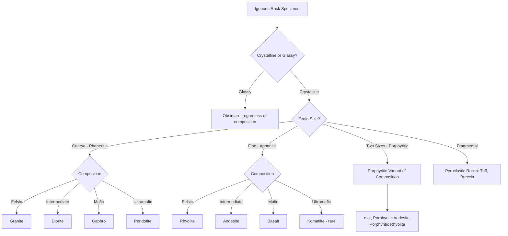

## Classification of Igneous Rocks

### Overview

Igneous rock classification systems organize rocks according to two primary, largely independent variables: **mineralogical/chemical composition** (the proportions of felsic versus mafic minerals, or equivalently silica content) and **texture** (grain size and crystal habit, which record cooling history). A complete igneous rock name conveys both attributes simultaneously — for example, granite (coarse-grained, felsic) and rhyolite (fine-grained, felsic) share essentially the same chemical composition but differ entirely in texture and therefore in name.

### The Two Classification Axes

#### Compositional Axis (Felsic to Ultramafic)

Composition is most commonly organized along a continuum from silica-rich (felsic) to silica-poor, iron-magnesium-rich (ultramafic) end members:

| Compositional Category | Approx. $SiO_2$ Content | Dominant Minerals | Color Index |
| --- | --- | --- | --- |
| Felsic | >63% | Quartz, K-feldspar, Na-plagioclase, muscovite | Light-colored (leucocratic) |
| Intermediate | 52–63% | Plagioclase (intermediate), amphibole, biotite | Medium-colored (mesocratic) |
| Mafic | 45–52% | Ca-plagioclase, pyroxene, olivine | Dark-colored (melanocratic) |
| Ultramafic | <45% | Olivine, pyroxene (little to no feldspar) | Very dark (melanocratic/ultramafic) |

**Color index** — the percentage of dark (mafic) minerals in a rock by volume — serves as a practical field proxy for composition when precise mineral identification is impractical, since felsic rocks are consistently lighter in overall appearance than mafic and ultramafic rocks.

#### Textural Axis (Cooling History)

Texture is classified primarily by crystal size, which reflects cooling rate (see also "Magma Generation and Igneous Textures"):

- **Phaneritic** (coarse-grained, crystals visible to the naked eye): slow cooling at depth, intrusive/plutonic origin
- **Aphanitic** (fine-grained, crystals not visible without magnification): rapid cooling at or near the surface, extrusive/volcanic origin
- **Porphyritic**: two distinct crystal sizes (phenocrysts in a finer groundmass), recording a two-stage cooling history
- **Glassy**: no crystalline structure, resulting from near-instantaneous cooling
- **Pyroclastic/fragmental**: composed of explosively ejected rock and glass fragments
- **Pegmatitic**: exceptionally coarse crystals grown from a volatile-rich residual melt

### The Intrusive-Extrusive Rock Pairs

Because texture and composition are independent variables, most compositional categories have both a coarse-grained (intrusive) and fine-grained (extrusive) equivalent, formed from chemically similar magma cooling at different rates:

| Composition | Intrusive (Coarse-Grained) | Extrusive (Fine-Grained) |
| --- | --- | --- |
| Felsic | Granite | Rhyolite |
| Intermediate | Diorite | Andesite |
| Mafic | Gabbro | Basalt |
| Ultramafic | Peridotite | Komatiite (rare) |

[Unverified] Komatiite is an ultramafic volcanic rock that required exceptionally high mantle temperatures to erupt as lava; it is understood to be far more common in Archean-aged terranes than in younger geologic settings, consistent with a hotter early Earth mantle, though the precise eruption mechanics remain an active area of petrological research.

### The QAPF Classification Diagram

For phaneritic (coarse-grained, plutonic) rocks, the International Union of Geological Sciences (IUGS) QAPF diagram provides a standardized classification based on the relative volume percentages of four mineral groups, recalculated to sum to 100%:

- **Q**: Quartz
- **A**: Alkali feldspar (orthoclase, microcline, sanidine, and albite-rich plagioclase)
- **P**: Plagioclase feldspar (more calcic than albite)
- **F**: Feldspathoids (nepheline, leucite; minerals that form instead of feldspar in silica-undersaturated melts)

Because quartz and feldspathoids are mutually exclusive in a single rock (quartz forms under silica-saturated conditions, feldspathoids under silica-undersaturated conditions), the QAPF diagram is drawn as two triangles sharing the A-P edge, with Q at one apex and F at the opposite apex. Rocks are plotted based on the relative proportions of these minerals, and named according to which field of the diagram they fall into:

- High Q, high A: granite
- High Q, high P: granodiorite/tonalite
- Low Q, high A: syenite
- Low Q, high P: diorite
- No Q, high F: foid-bearing rocks (e.g., nepheline syenite)

#### TAS Diagram (Total Alkali-Silica)

For volcanic (extrusive) rocks, where fine grain size or glassy texture often prevents direct mineral identification and point-counting, classification instead relies on whole-rock chemical analysis plotted on the Total Alkali-Silica (TAS) diagram, which plots total alkali content ($Na_2O + K_2O$, weight %) against silica content ($SiO_2$, weight %). This chemistry-based approach yields fields corresponding to basalt, andesite, dacite, rhyolite, and related rock types, and is the standard classification method when petrographic mineral identification is impractical.

### Igneous Rock Classification Flowchart

### QAPF Diagram Structure (svg_diagram)

<svg xmlns="http://www.w3.org/2000/svg" viewBox="0 0 800 500" font-family="Helvetica, Arial, sans-serif">
<text x="400" y="28" text-anchor="middle" font-size="18" font-weight="bold" fill="#1a1a1a">QAPF Diagram Structure (svg_diagram)</text>
<polygon points="400,60 220,340 580,340" fill="#eef3fb" stroke="#33475b" stroke-width="2" />
<text x="400" y="50" text-anchor="middle" font-size="14" font-weight="bold" fill="#1a1a1a">Q</text>
<text x="200" y="360" text-anchor="middle" font-size="14" font-weight="bold" fill="#1a1a1a">A</text>
<text x="600" y="360" text-anchor="middle" font-size="14" font-weight="bold" fill="#1a1a1a">P</text>
<polygon points="220,340 580,340 400,460" fill="#fdf3e0" stroke="#33475b" stroke-width="2" />
<text x="400" y="485" text-anchor="middle" font-size="14" font-weight="bold" fill="#1a1a1a">F</text>
<line x1="290" y1="180" x2="510" y2="180" stroke="#8a8a8a" stroke-width="1" stroke-dasharray="3,3" />
<text x="400" y="150" text-anchor="middle" font-size="12" fill="#1a1a1a">Granite</text>
<line x1="260" y1="270" x2="540" y2="270" stroke="#8a8a8a" stroke-width="1" stroke-dasharray="3,3" />
<text x="330" y="250" text-anchor="middle" font-size="11" fill="#1a1a1a">Granodiorite</text>
<text x="470" y="250" text-anchor="middle" font-size="11" fill="#1a1a1a">Tonalite</text>

<text x="290" y="320" text-anchor="middle" font-size="11" fill="`#1a1a1a`">Syenite</text>

<text x="500" y="320" text-anchor="middle" font-size="11" fill="`#1a1a1a`">Diorite</text>

<text x="400" y="410" text-anchor="middle" font-size="12" fill="`#1a1a1a`">Foid Syenite /</text>

<text x="400" y="425" text-anchor="middle" font-size="12" fill="`#1a1a1a`">Foid Diorite</text>

</svg>

### Special Igneous Rock Categories

#### Pegmatites

Pegmatites are exceptionally coarse-grained igneous rocks, typically granitic in bulk composition, formed from volatile-rich (particularly water- and fluorine-rich) residual melts remaining after most of a magma body has crystallized. The elevated volatile content dramatically lowers melt viscosity and increases ion mobility, permitting individual crystals to grow to sizes ranging from several centimeters to, in exceptional cases, meters in length.

#### Pyroclastic Rocks

Pyroclastic (fragmental) rocks are classified separately from crystalline igneous textures because their defining characteristic is fragmentation during explosive eruption rather than progressive crystallization from a cooling melt. Classification is based on the size of ejected fragments (pyroclasts):

- **Ash** (<2 mm): consolidates to form tuff
- **Lapilli** (2–64 mm): consolidates to form lapilli tuff
- **Blocks/bombs** (>64 mm): angular (blocks) or aerodynamically shaped while still molten (bombs); consolidate to form volcanic breccia or agglomerate

#### Layered and Cumulate Rocks

Some intrusive igneous bodies, particularly large mafic-ultramafic layered intrusions, display cumulate textures in which early-crystallizing, dense minerals (such as olivine or chromite) settle gravitationally and accumulate in distinct layers within the magma chamber, producing rhythmically layered rock sequences that record the progressive fractional crystallization history of the intrusion.

### Worked Example: Classifying a Hand Specimen

**Example:** A hand specimen is coarse-grained with individually visible crystals (phaneritic texture), indicating slow cooling and an intrusive origin. Visual mineral estimation shows approximately 25% quartz (glassy, no cleavage), 35% pink alkali feldspar (blocky, two cleavage planes at ~90°), 30% white plagioclase feldspar (showing fine striations on cleavage faces), and 10% dark biotite mica. Because quartz is present in significant proportion alongside both feldspar types, with alkali feldspar exceeding plagioclase, this mineral assemblage plots within the granite field of the QAPF diagram. Combined with its phaneritic texture, the specimen is classified as **granite**. If the same mineral proportions occurred in a fine-grained, aphanitic specimen instead, the equivalent classification would be **rhyolite**.

### Common Misconceptions

- Rock names are not determined by color alone; while color index is a useful proxy, precise classification (especially in the QAPF and TAS systems) depends on quantitative mineral or chemical proportions, and some felsic rocks can appear deceptively dark due to minor mafic mineral content or alteration
- Granite and rhyolite (and other intrusive-extrusive pairs) are not different rock types in a compositional sense; they represent the same magma composition crystallized under different cooling conditions
- Pegmatite is not a compositional category in the same sense as granite or gabbro; it is fundamentally a textural classification (based on exceptionally large grain size) that happens to occur most commonly, though not exclusively, in granitic compositions
- Obsidian's classification does not depend on silica content in the way crystalline rocks do, since its defining characteristic is the complete absence of crystalline structure regardless of the magma's original chemistry

**Next Steps**

- Bowen's Reaction Series and magmatic differentiation
- Plutonic body geometry: batholiths, stocks, dikes, and sills
- Volcanic landforms and eruption style classification
- Whole-rock geochemical analysis techniques (XRF, ICP-MS)
- Layered mafic intrusions and economic mineral deposits (e.g., Bushveld Complex)
- Petrographic microscopy for igneous rock identification