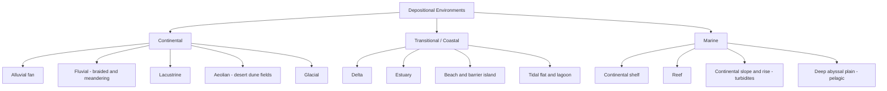

## Sedimentary Processes and Depositional Environments

### Overview

Sedimentary processes govern the weathering, erosion, transport, deposition, and lithification of material at or near Earth's surface, producing sedimentary rocks that record environmental conditions at the time of deposition. Depositional environments are the physical, chemical, and biological settings — continental, transitional, and marine — where sediment accumulates, each imparting a distinctive suite of textures, structures, and compositions to the resulting rock. Together, these processes and environments form the basis for reconstructing past landscapes, climates, and tectonic settings (facies analysis).

### Sediment Sources and Weathering

**Key Points**

- Sedimentary material originates from the mechanical and chemical breakdown of pre-existing rocks (igneous, metamorphic, or older sedimentary), volcanic ejecta, biological activity, or direct chemical precipitation from water.
- **Physical (mechanical) weathering** disaggregates rock without changing mineral composition, via frost wedging, thermal expansion/contraction, salt crystallization, and biological root action.
- **Chemical weathering** alters mineral composition through hydrolysis, oxidation, dissolution, and carbonation, generally more intense in warm, humid climates. Hydrolysis of feldspars to clay minerals is a dominant pathway controlling the composition of siliciclastic sediment.
- The **Goldich stability series** (a mirror of Bowen's reaction series) predicts that minerals crystallizing at higher temperatures (olivine, Ca-plagioclase) weather faster than those crystallizing at lower temperatures (quartz, muscovite), so quartz-dominated sediment reflects intense or prolonged weathering.

### Sediment Transport Mechanisms

**Key Points**

- Transport agents include water (rivers, waves, currents), wind, ice (glaciers), and gravity (mass wasting).
- Clastic (detrital) particles move by traction (rolling/sliding along the bed), saltation (short hops), and suspension (carried within the fluid), depending on grain size and flow velocity.
- The **Hjulström-Sundborg diagram** relates flow velocity to grain size, showing separate thresholds for erosion, transport, and deposition; fine clay requires higher velocity to erode than to keep in transport, because cohesive electrostatic forces bind clay particles together.
- Transport distance and energy progressively modify grains through **sorting** (grouping by size), **rounding** (abrasion of sharp edges), and **compositional maturity** (survival of the most stable mineral, chiefly quartz).

**Textural Maturity**

Textural and compositional maturity increase with transport distance and reworking:

| Maturity Stage | Sorting | Rounding | Composition |
| --- | --- | --- | --- |
| Immature | Poor | Angular | Mixed, includes unstable minerals |
| Submature | Moderate | Subangular | Some unstable minerals removed |
| Mature | Well sorted | Subrounded–rounded | Mostly stable minerals |
| Supermature | Very well sorted | Well rounded | Nearly pure quartz |

### Deposition and Lithification

**Key Points**

- Deposition occurs when transport energy drops below the threshold needed to keep particles in motion (settling velocity exceeds turbulent lift).
- **Diagenesis** encompasses all physical, chemical, and biological changes after deposition but before metamorphism, including:
  - **Compaction**: reduction of pore space under overburden pressure
  - **Cementation**: precipitation of minerals (calcite, silica, iron oxide) in pore spaces, binding grains together
  - **Recrystallization**: reorganization of mineral fabric without compositional change
  - **Authigenesis**: in-situ formation of new minerals (e.g., glauconite, pyrite)
- **Lithification** is the cumulative result of diagenesis that converts loose sediment into coherent rock.

### Depositional Environment Classification

Depositional environments are broadly grouped into three realms based on their relationship to sea level and dominant transport agents.

### Continental Environments

**Alluvial Fans**

Cone-shaped deposits forming where a stream exits a confined valley onto a lower-gradient plain, typically at mountain fronts in arid to semi-arid climates. Dominated by debris flows and sheet floods, producing poorly sorted, angular, coarse conglomerate and breccia with a matrix-supported fabric.

**Fluvial (River) Systems**

- **Braided rivers**: high sediment load relative to discharge, low sinuosity, multiple shifting channels separated by bars; deposits are coarse-grained, poorly sorted sand and gravel with cross-bedding.
- **Meandering rivers**: single sinuous channel with point bars on the inside of bends and overbank floodplain deposits; produces classic **fining-upward sequences** from basal channel-lag gravel through cross-bedded sand to top fine-grained floodplain mud, often capped by paleosols.

**Lacustrine (Lake) Environments**

Quiet-water settings favoring fine-grained, often finely laminated sediment. Seasonal variation in sediment supply and biological productivity can produce **varves** — paired light (mineral-rich, high-energy season) and dark (organic-rich, low-energy season) laminae.

**Aeolian (Desert) Environments**

Wind-driven transport and deposition produce well-sorted, well-rounded, frosted quartz sand in dune fields. Large-scale **cross-bedding** (dune foresets) at high angles (up to ~30-34°, the angle of repose for dry sand) is diagnostic.

**Glacial Environments**

Ice transport produces poorly sorted, unstratified **till** with striated, faceted clasts in a fine matrix, while glaciofluvial meltwater reworks and sorts material into outwash deposits (stratified sand and gravel).

### Transitional (Coastal) Environments

**Deltas**

Form where a river enters a standing body of water (ocean or lake) and deposits its sediment load as flow velocity decreases. Classic Gilbert-type deltas show a threefold structure:

- **Topset beds**: subhorizontal, deposited on the delta plain
- **Foreset beds**: steeply dipping, deposited on the advancing delta front
- **Bottomset beds**: fine-grained, gently dipping, deposited in the basin ahead of the delta

Delta morphology reflects the relative dominance of river, wave, and tidal energy (river-dominated/birdfoot, wave-dominated/arcuate, tide-dominated/estuarine).

**Estuaries**

Drowned river valleys where fresh and saline water mix; characterized by tidal flats, mixed clastic-organic mud, and brackish-water fauna.

**Beach and Barrier Island Systems**

Wave-dominated coastlines with well-sorted, well-rounded sand shaped by swash and backwash; landward-fining sequences transition from beach sand into lagoonal mud behind barrier islands.

**Tidal Flats and Lagoons**

Low-energy, periodically exposed settings recording tidal rhythmicity. **Herringbone cross-stratification** (opposing dip directions from reversing tidal currents) and **mud cracks** (subaerial exposure) are diagnostic sedimentary structures.

### Marine Environments

**Continental Shelf**

Shallow (typically <200 m), wave- and tide-influenced setting; sediment ranges from nearshore sand to offshore mud, with carbonate shelves forming in warm, clastic-poor, shallow tropical waters.

**Reefs**

Wave-resistant, organically constructed carbonate buildups (coral, algae) forming in warm (typically >18°C), shallow, clear, sunlit tropical to subtropical waters; associated with fore-reef talus breccia and back-reef lagoonal carbonate mud.

**Continental Slope and Rise**

Steeper gradient below the shelf break; gravity-driven sediment gravity flows (turbidity currents) transport shelf sediment into deep water, depositing **turbidites** — graded beds recording the classic **Bouma sequence** (Ta–Te divisions, from basal graded sand to upper pelagic mud) as flow energy wanes.

**Deep Marine (Abyssal) Environments**

Below the reach of most terrigenous input and turbidity currents; dominated by slow, continuous **pelagic sedimentation** — biogenic ooze (calcareous or siliceous microfossil tests) above the relevant compensation depth, and fine clay ("red clay") below it, where the **carbonate compensation depth (CCD)** marks the level at which calcium carbonate dissolution exceeds supply.

### Diagnostic Sedimentary Structures

| Structure | Formation Process | Typical Environment |
| --- | --- | --- |
| Planar cross-bedding | Migration of straight-crested dunes/bars | Fluvial, aeolian |
| Trough cross-bedding | Migration of sinuous-crested dunes | Fluvial, shallow marine |
| Herringbone cross-stratification | Reversing tidal currents | Tidal flat |
| Graded bedding | Waning-energy settling (density-sorted) | Turbidite, storm deposit |
| Ripple marks (symmetrical) | Oscillatory wave action | Shallow marine, lake margin |
| Ripple marks (asymmetrical) | Unidirectional current | Fluvial, tidal channel |
| Mud cracks | Desiccation upon subaerial exposure | Tidal flat, floodplain, playa |
| Varves | Seasonal depositional cycles | Lacustrine, glaciolacustrine |
| Bioturbation | Organism burrowing/reworking | Shallow marine, tidal flat |

**Illustration: Bouma Sequence in a Turbidite Bed (svg_diagram)**

<svg xmlns="http://www.w3.org/2000/svg" viewBox="0 0 360 400" font-family="sans-serif">
<text x="180" y="20" font-size="14" font-weight="bold" text-anchor="middle">Bouma Sequence (svg_diagram)</text>
<rect x="100" y="40" width="120" height="30" fill="#a3c9e0" stroke="#333" />
<text x="230" y="60" font-size="12">Te - Pelagic mud</text>
<rect x="100" y="70" width="120" height="30" fill="#c7b8a3" stroke="#333" />
<text x="230" y="90" font-size="12">Td - Laminated silt</text>
<rect x="100" y="100" width="120" height="40" fill="#e0c9a3" stroke="#333" />
<text x="230" y="123" font-size="12">Tc - Ripple cross-laminated sand</text>
<rect x="100" y="140" width="120" height="40" fill="#e6d3a3" stroke="#333" />
<text x="230" y="163" font-size="12">Tb - Planar-laminated sand</text>
<polygon points="100,180 220,180 210,240 110,240" fill="#d9a441" stroke="#333" />
<text x="230" y="215" font-size="12">Ta - Graded, massive sand</text>
<line x1="100" y1="240" x2="220" y2="240" stroke="#333" stroke-width="2" />
<text x="60" y="245" font-size="11" text-anchor="end">Base of bed</text>
<line x1="90" y1="40" x2="90" y2="240" stroke="#333" stroke-width="1" />
<polygon points="90,40 85,50 95,50" fill="#333" />
<text x="60" y="140" font-size="11" text-anchor="middle" transform="rotate(-90 60 140)">Decreasing energy ↑</text>
</svg>

### Facies and Walther's Law

A **sedimentary facies** is a body of rock characterized by a distinctive combination of lithology, sedimentary structures, and fossil content reflecting a specific depositional process or environment. **Walther's Law** states that facies found in vertical (stratigraphic) succession, without a depositional break, must also have originally been adjacent to one another laterally — allowing geologists to infer lateral environmental relationships (e.g., shoreline migration) from a single vertical rock sequence. This principle underlies interpretation of **transgressive** (sea-level rise, environments migrate landward, producing a fining/deepening-upward succession) and **regressive** (sea-level fall, environments migrate seaward, producing a coarsening/shallowing-upward succession) sequences.

### Practical Example

**Example**

A vertical outcrop section shows, from base to top: (1) massive matrix-supported conglomerate, (2) trough cross-bedded coarse sandstone, (3) planar-laminated fine sandstone with symmetrical ripples, (4) laminated black shale with marine fossils. Applying Walther's Law, this coarsening-to-fining-upward transition from alluvial fan/braided fluvial through nearshore to offshore marine facies records a **transgression** — a landward migration of the shoreline as relative sea level rose, drowning the fluvial system.

### Related Topics

- Clastic sediment classification (grain size scales, conglomerate/sandstone/mudrock)
- Carbonate rock classification (Dunham and Folk classification schemes)
- Diagenesis and burial history (porosity-depth relationships, pressure solution)
- Sequence stratigraphy (systems tracts, sea-level curves)
- Paleocurrent analysis and provenance studies
- Stable isotope geochemistry as an environmental proxy ($\delta^{18}O$, $\delta^{13}C$)
- Biostratigraphy and trace fossil (ichnofacies) analysis
- Basin analysis and tectonic controls on sedimentation