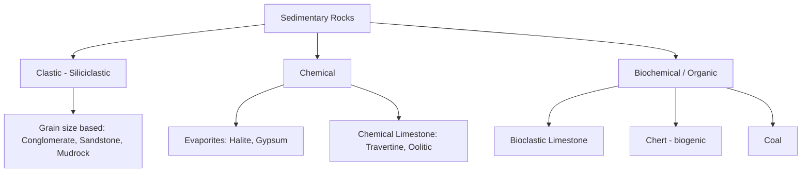

## Classification of Sedimentary Rocks

### Overview

Sedimentary rocks are classified according to their origin into three principal categories: **clastic (detrital)**, formed from lithified fragments of pre-existing rock; **chemical**, formed from minerals precipitated directly from solution; and **biochemical/organic**, formed from the accumulation of biologically derived material. Within each category, further subdivision relies on grain size, composition, texture, and depositional fabric.

### Primary Classification Scheme

### Clastic (Siliciclastic) Rocks

**Key Points**

- Classified primarily by **grain size** using the **Udden-Wentworth scale**, then subdivided by sorting, rounding, and composition.
- Named for the dominant clast size present, even in mixed sediments.

**Udden-Wentworth Grain Size Scale**

| Grain Size | Diameter Range | Sediment Name | Rock Name |
| --- | --- | --- | --- |
| Boulder | >256 mm | Gravel | Conglomerate (rounded) / Breccia (angular) |
| Cobble | 64-256 mm | Gravel | Conglomerate / Breccia |
| Pebble | 4-64 mm | Gravel | Conglomerate / Breccia |
| Granule | 2-4 mm | Gravel | Conglomerate / Breccia |
| Sand | 1/16-2 mm | Sand | Sandstone |
| Silt | 1/256-1/16 mm | Mud | Siltstone |
| Clay | <1/256 mm | Mud | Claystone / Shale (if fissile) |

**Conglomerate and Breccia**

Composed of gravel-sized clasts (>2 mm) in a finer matrix or cement. **Conglomerate** has rounded clasts (indicating significant transport/abrasion); **breccia** has angular clasts (indicating minimal transport, e.g., talus, fault gouge, or collapse deposits). Clast composition and roundness are used to infer provenance and transport distance.

**Sandstone Classification**

Sandstone is subdivided compositionally using a ternary (triangular) diagram with **quartz, feldspar, and lithic (rock) fragments** as end members, and texturally by matrix content:

- **Quartz arenite**: >90% quartz; reflects high textural and compositional maturity (extensive weathering/reworking, e.g., aeolian or beach environments)
- **Arkose**: >25% feldspar; reflects short transport from a granitic/gneissic source, often in arid climates that limit chemical weathering
- **Litharenite**: >25% rock fragments; reflects a volcanic, sedimentary, or metamorphic source terrain
- **Wacke (e.g., graywacke)**: any of the above compositions but with >15% clay/silt matrix, indicating rapid deposition with poor sorting (e.g., turbidites)
- **Arenite**: <15% matrix, indicating better sorting and winnowing

**Illustration: QFL Sandstone Classification Triangle (svg_diagram)**

<svg xmlns="http://www.w3.org/2000/svg" viewBox="0 0 400 380" font-family="sans-serif" font-size="12">
<text x="200" y="20" font-size="14" font-weight="bold" text-anchor="middle">QFL Ternary Diagram (svg_diagram)</text>
<polygon points="200,50 50,320 350,320" fill="none" stroke="#333" stroke-width="2" />
<text x="200" y="42" text-anchor="middle" font-weight="bold">Q (Quartz)</text>
<text x="35" y="335" text-anchor="middle" font-weight="bold">F (Feldspar)</text>
<text x="365" y="335" text-anchor="middle" font-weight="bold">L (Lithics)</text>
<line x1="125" y1="185" x2="275" y2="185" stroke="#888" stroke-dasharray="4" />
<text x="200" y="120" text-anchor="middle">Quartz Arenite</text>
<text x="110" y="260" text-anchor="middle">Arkose</text>
<text x="290" y="260" text-anchor="middle">Litharenite</text>
<text x="200" y="300" text-anchor="middle" font-style="italic">(Sublabels: Subarkose / Sublitharenite near dashed line)</text>
</svg>

**Mudrocks**

Finest-grained clastic rocks (>50% silt- and clay-sized particles), forming in low-energy settings. Subdivided by fissility (splitting along bedding planes):

- **Shale**: fissile, splits into thin layers
- **Mudstone**: blocky, non-fissile
- **Siltstone**: dominantly silt-sized grains

### Chemical Sedimentary Rocks

**Key Points**

- Form by inorganic precipitation of minerals from saturated aqueous solutions, typically driven by evaporation or temperature/pressure changes.

**Evaporites**

Form by progressive evaporation of restricted water bodies (marine or lacustrine), with minerals precipitating in a fixed sequence governed by relative solubility:

1. Calcite/dolomite (least soluble, precipitates first)
2. **Gypsum** (CaSO₄·2H₂O)
3. **Halite** (NaCl)
4. Potassium and magnesium salts (most soluble, precipitate last)

**Chemical Limestones**

- **Travertine**: precipitated from groundwater or hot springs, often around cave formations (speleothems) or spring terraces, controlled by CO₂ degassing that shifts carbonate equilibrium.
- **Oolitic limestone**: composed of **ooids** — spherical grains with concentric calcite (or aragonite) layers precipitated around a nucleus in warm, shallow, wave-agitated water.

### Biochemical and Organic Sedimentary Rocks

**Key Points**

- Formed through biological extraction of dissolved ions (especially Ca²⁺, CO₃²⁻, SiO₂) to build skeletal material, or through accumulation of organic matter.

**Bioclastic (Skeletal) Limestone**

Composed of shell, coral, and other skeletal fragments (calcite or aragonite). The **Dunham classification** is the standard scheme for describing limestone texture based on the presence and abundance of mud matrix versus grains and whether grains are in mutual contact:

| Dunham Class | Description |
| --- | --- |
| Mudstone | <10% grains, mud-supported |
| Wackestone | >10% grains, mud-supported |
| Packstone | Grain-supported, with mud matrix |
| Grainstone | Grain-supported, no mud (winnowed) |
| Boundstone | Original components bound together during deposition (e.g., reef framework) |

**Biogenic Chert**

Forms from accumulation and diagenetic recrystallization of siliceous microfossil tests (radiolaria, diatoms), typically in deep marine settings below the CCD or in areas of high biological silica productivity (upwelling zones).

**Coal**

Forms from accumulation and compaction of plant material in low-oxygen (anoxic), waterlogged swamp/mire environments that inhibit decomposition. Progressive burial and heat drive a maturation series with increasing carbon content and decreasing volatile/moisture content: peat → lignite → sub-bituminous → bituminous → anthracite. [Inference: this maturation sequence is often treated as transitional toward low-grade metamorphism at the anthracite stage, since anthracite formation typically involves elevated temperature and pressure beyond simple diagenesis.]

### Diagenesis and Its Role in Classification

Diagenetic processes can significantly modify original rock character, sometimes crossing classification boundaries:

- **Dolomitization**: replacement of calcite by dolomite (Ca,Mg carbonate) via Mg²⁺-rich fluid interaction, converting limestone to dolostone
- **Silicification**: replacement of original material by silica, sometimes producing chert nodules within limestone
- **Cementation**: precipitation of calcite, silica, or iron oxide cement in clastic rocks, influencing final rock name and porosity

### Practical Example

**Example**

A hand sample shows well-rounded, well-sorted, frosted quartz grains with negligible matrix and no feldspar or lithic fragments. Applying the QFL scheme, this classifies as a **quartz arenite**, indicating high compositional and textural maturity consistent with prolonged transport and reworking (e.g., an aeolian dune or mature beach deposit), distinguishing it from an arkose or litharenite that would point to a nearby, less-weathered source terrain.

### Related Topics

- Sedimentary processes and depositional environments
- Diagenesis and burial history (compaction, cementation, porosity evolution)
- Carbonate diagenesis (dolomitization, dissolution, karst)
- Sequence stratigraphy and facies models
- Petrographic thin-section analysis (point counting for QFL determination)
- Coal rank and organic maturation (vitrinite reflectance)
- Provenance analysis and tectonic setting discrimination diagrams