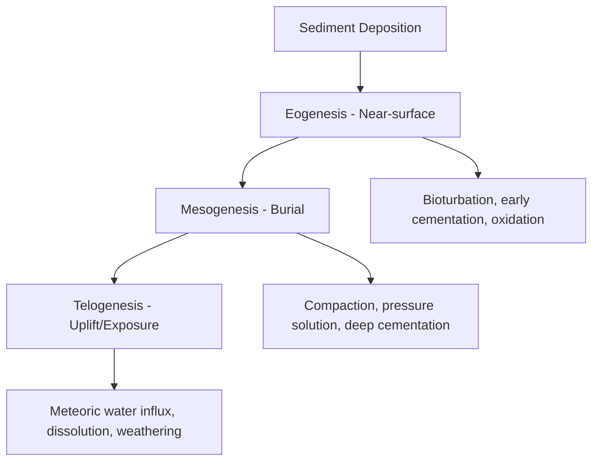

## Diagenesis and Lithification

### Overview

Diagenesis encompasses the sum of physical, chemical, and biological changes that affect sediment and sedimentary rock after initial deposition but before metamorphism (conventionally bounded at roughly 150-200°C and depths of a few kilometers, beyond which metamorphic recrystallization begins). Lithification is the cumulative outcome of diagenesis by which loose, unconsolidated sediment is transformed into a coherent, indurated sedimentary rock. Diagenesis is subdivided into stages by burial depth and controls porosity, permeability, mineralogy, and fabric — factors of direct importance to hydrocarbon reservoir quality and groundwater aquifer behavior.

### Stages of Diagenesis

**Key Points**

- Diagenesis is commonly divided into three overlapping realms based on burial depth and dominant fluid chemistry.

- **Eogenesis (early/near-surface diagenesis)**: occurs at shallow depth, strongly influenced by depositional (marine, meteoric, or mixed) pore water chemistry, bioturbation, and early cementation.
- **Mesogenesis (burial diagenesis)**: occurs as sediment is progressively buried, dominated by compaction, pressure solution, and cementation from evolved formation waters under increasing temperature and pressure.
- **Telogenesis (uplift diagenesis)**: occurs when previously buried rock is uplifted and re-exposed to meteoric (near-surface, fresh) water circulation, often causing dissolution and secondary porosity development.

### Physical Diagenetic Processes

**Compaction**

As overburden accumulates, grains are pressed closer together, reducing pore space and expelling pore fluids upward. Compaction is especially significant in fine-grained, high-initial-porosity sediments (muds can lose over 60% of their original volume during compaction, versus a much smaller reduction in coarse sand). [Inference: exact compaction magnitudes vary considerably with mineralogy, grain shape, and burial rate, so specific percentage figures should be treated as representative rather than universal.]

**Pressure Solution**

At grain contacts under high effective stress, mineral solubility increases locally (a manifestation of the Riecke's principle relationship between stress and solubility), causing dissolution at contact points and producing sutured or stylolitic grain boundaries. Dissolved material may reprecipitate nearby as cement, making pressure solution both a porosity-destroying and a cement-source process.

### Chemical Diagenetic Processes

**Cementation**

Precipitation of authigenic (in-situ formed) minerals within pore spaces from circulating pore fluids, binding grains together and reducing porosity. Common cements include:

- **Calcite cement**: common in both carbonate and clastic rocks; often the first and most abundant cement in many settings
- **Silica cement** (quartz overgrowths, chalcedony): typical in quartz-rich sandstones, precipitating in optical continuity with the host grain
- **Iron oxide/hydroxide cement** (hematite, goethite): imparts red/brown coloration, generally indicating oxidizing conditions
- **Dolomite cement**: precipitates from Mg-enriched fluids, often associated with mixing zones or evaporitic settings

**Dissolution**

Undersaturated pore fluids (commonly meteoric water during telogenesis) dissolve unstable grains or earlier cements, creating **secondary porosity** that can significantly enhance reservoir quality despite occurring after initial lithification.

**Recrystallization**

Reorganization of a mineral's crystal structure or grain size without a change in overall mineral composition, commonly seen in carbonate rocks where fine-grained (micritic) carbonate mud recrystallizes to coarser sparry calcite, and in the transformation of aragonite (metastable) to the more stable calcite polymorph.

**Replacement**

One mineral is dissolved while a different mineral simultaneously precipitates in its place, often preserving the original textural outline (pseudomorphism). Common examples include:

- **Dolomitization**: replacement of calcite/aragonite by dolomite via Mg²⁺-bearing fluids
- **Silicification**: replacement of carbonate or organic material by silica, forming chert nodules or silicified fossils
- **Pyritization**: replacement under anoxic, sulfate-reducing conditions, common in organic-rich marine muds

**Authigenesis**

Formation of entirely new minerals in place within the sediment, distinct from cementation of pore space; common authigenic minerals include glauconite (marine, low-oxygen, slow-deposition indicator), pyrite, and certain clay minerals (illite, chlorite) formed from the alteration of precursor clays or volcanic ash under burial conditions.

### Biological Diagenetic Processes

**Bioturbation**

Reworking of sediment by burrowing and feeding organisms, which can destroy primary sedimentary structures (lamination), homogenize sediment fabric, and locally alter pore water chemistry (introducing oxygen into otherwise reducing sediment via burrow irrigation).

**Microbial Mediation**

Bacterial activity, particularly sulfate reduction in anoxic marine sediments, drives redox reactions that promote pyrite and certain carbonate cement precipitation, and organic matter decay that influences pore water pH and alkalinity.

### Clay Mineral Diagenesis

A well-documented burial diagenetic reaction in mudrocks is the progressive transformation of **smectite to illite** with increasing temperature (illustrated below), releasing bound interlayer water and silica that can migrate to become cement in adjacent sandstone beds. This reaction is widely used as a geothermometer/burial-history indicator in sedimentary basins.

### Porosity Evolution with Burial

**Illustration: Porosity-Depth Relationship (svg_diagram)**

<svg xmlns="http://www.w3.org/2000/svg" viewBox="0 0 380 320" font-family="sans-serif" font-size="12">
<text x="190" y="20" font-size="14" font-weight="bold" text-anchor="middle">Porosity vs. Burial Depth (svg_diagram)</text>
<line x1="60" y1="280" x2="340" y2="280" stroke="#333" stroke-width="1.5" />
<line x1="60" y1="280" x2="60" y2="40" stroke="#333" stroke-width="1.5" />
<text x="200" y="305" text-anchor="middle">Porosity (%) →</text>
<text x="30" y="160" text-anchor="middle" transform="rotate(-90 30 160)">Depth →</text>
<path d="M 320 45 C 250 90, 200 150, 140 220 C 110 250, 90 265, 70 275" fill="none" stroke="#1a6fa3" stroke-width="2.5" />
<text x="330" y="45" font-size="11" text-anchor="end">Shallow / High porosity</text>
<text x="90" y="290" font-size="11">Deep / Low porosity</text>
<line x1="180" y1="130" x2="230" y2="130" stroke="#c0392b" stroke-dasharray="3" />
<text x="235" y="133" font-size="11" fill="#c0392b">Secondary porosity spike (dissolution)</text>
</svg>

Porosity generally decreases with depth due to compaction and cementation, though secondary dissolution events (during telogenesis or organic acid generation from maturing kerogen) can locally reverse this trend and enhance porosity at depth, which is why porosity-depth curves are treated as general trends rather than fixed laws. [Inference: the specific depth and magnitude of any secondary porosity spike is basin- and lithology-dependent and cannot be generalized without local data.]

### Lithification Summary

**Key Points**

- Lithification is not a single discrete event but the cumulative product of the compaction, cementation, and recrystallization processes described above.
- The degree of lithification (and thus final rock hardness/coherence) depends on original sediment composition, pore fluid chemistry, burial depth/temperature/pressure history, and time.
- Different lithologies lithify via different dominant mechanisms: coarse clastics primarily through cementation, fine muds primarily through compaction, and carbonate sediments through a combination of cementation, recrystallization, and dissolution-reprecipitation.

### Practical Example

**Example**

A sandstone reservoir buried to 3 km shows quartz overgrowth cement occluding most primary porosity (mesogenetic effect). Subsequent tectonic uplift exposes the unit to meteoric water circulation, which selectively dissolves feldspar grains and some early calcite cement, generating secondary moldic and intragranular porosity (telogenetic effect). The resulting rock has lower porosity than at initial deposition but a porosity distribution and pore geometry substantially different from what burial alone would predict — illustrating why reservoir quality assessment requires reconstructing the full diagenetic history rather than depth alone.

### Related Topics

- Classification of sedimentary rocks (compositional and textural controls on diagenetic pathways)
- Sedimentary processes and depositional environments (initial porosity and pore fluid controls)
- Carbonate diagenesis and karst systems
- Petroleum reservoir characterization (porosity, permeability, diagenetic history)
- Clay mineralogy and burial geothermometry (smectite-illite transition)
- Sequence stratigraphy (unconformities as telogenetic exposure surfaces)
- Basin thermal history and maturation modeling