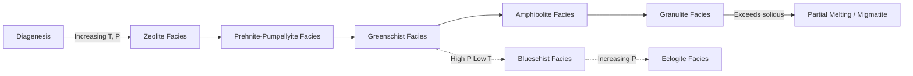

## Metamorphism and Metamorphic Grade

### Definition and Fundamental Concept

Metamorphism is the solid-state transformation of pre-existing rocks (protoliths) through changes in mineralogy, texture, and/or chemical composition, driven by conditions of temperature, pressure, and fluid activity that differ from those under which the original rock formed. The defining constraint is that these changes occur without the rock undergoing complete melting; if melting becomes pervasive, the process transitions into igneous petrogenesis (anatexis).

Metamorphism operates within a bounded thermal and pressure range:

- **Lower limit**: approximately 150–200°C, marking the transition from diagenesis (compaction, cementation, low-temperature mineral changes in sediments) to true metamorphism
- **Upper limit**: the solidus temperature of the rock, beyond which partial melting produces migmatites and ultimately magmas

### Agents of Metamorphism

Three principal agents drive metamorphic change, typically acting in combination:

**Temperature**

- Increases with depth via the geothermal gradient (~25–30°C/km average, highly variable by tectonic setting)
- Accelerates reaction kinetics, enabling recrystallization and the breakdown of unstable mineral assemblages
- Heat sources include regional burial, magmatic intrusions, and frictional heating along fault zones

**Pressure**

- **Lithostatic (confining) pressure**: equal in all directions, arising from the weight of overlying rock; drives densification and phase transitions (e.g., graphite to diamond)
- **Directed (differential) stress**: unequal stress applied along a preferred axis, common in tectonically active settings; responsible for developing planar and linear fabrics (foliation, lineation)

**Chemically Active Fluids**

- Primarily H₂O and CO₂, sourced from pore fluids, dehydration reactions, or magmatic exsolution
- Act as catalysts for ion mobility, dramatically accelerating recrystallization rates
- Enable metasomatism when fluids introduce or remove chemical components, altering bulk composition beyond simple isochemical recrystallization

### Types of Metamorphism

**Regional (Dynamothermal) Metamorphism**

- Affects large crustal volumes, typically associated with orogenic (mountain-building) belts and convergent plate boundaries
- Combines elevated temperature, elevated pressure, and strong differential stress
- Produces well-developed foliated fabrics (slate, schist, gneiss) over broad areas measured in hundreds to thousands of square kilometers

**Contact (Thermal) Metamorphism**

- Localized around igneous intrusions; heat is the dominant agent, with minimal directed stress
- Produces a **contact aureole**, a zone of progressively altered rock surrounding the pluton, with grade decreasing outward
- Typically produces non-foliated hornfels-type textures due to the absence of significant differential stress

**Dynamic (Cataclastic) Metamorphism**

- Localized along fault zones and shear zones; dominated by mechanical deformation (differential stress) with limited thermal input
- Produces textures ranging from brittle cataclasite (fault gouge, breccia) to ductile mylonite, depending on depth and strain rate

**Hydrothermal Metamorphism**

- Driven by circulation of hot, chemically reactive fluids, commonly along mid-ocean ridges and in geothermal systems
- Often accompanied by significant metasomatism (e.g., seafloor alteration of basalt to greenstone/spilite)

**Burial Metamorphism**

- Occurs in thick sedimentary basins from the weight of overlying strata alone, without significant tectonic stress
- Represents the lowest-grade transition zone between diagenesis and regional metamorphism

**Impact Metamorphism (Shock Metamorphism)**

- Instantaneous, extremely high-pressure, high-temperature transformation from hypervelocity meteorite impacts
- Produces diagnostic indicators such as shatter cones and high-pressure polymorphs (e.g., coesite, stishovite)

### Textural Response: Foliation and Fabric

Differential stress combined with recrystallization produces characteristic metamorphic fabrics through three principal mechanisms: mechanical rotation of platy/elongate grains into alignment, pressure solution (dissolution at high-stress grain contacts and reprecipitation at low-stress sites), and recrystallization with a preferred crystallographic growth orientation.

**Foliated textures** (progressive grade sequence for pelitic protoliths):

- **Slaty cleavage**: very fine-grained, splits along flat planes (slate)
- **Phyllitic texture**: fine-grained with a silky sheen from sub-microscopic mica (phyllite)
- **Schistosity**: visible, aligned platy minerals (mica, chlorite) giving a pronounced sheen (schist)
- **Gneissic banding**: coarse segregation into alternating felsic (quartz-feldspar) and mafic (biotite-amphibole) bands (gneiss)

**Non-foliated textures** occur when protoliths lack platy minerals or differential stress is negligible:

- **Granoblastic**: equant, interlocking crystals (marble, quartzite)
- **Hornfelsic**: fine-grained, dense, produced by contact metamorphism

### Metamorphic Grade

Metamorphic grade describes the intensity of metamorphism a rock has experienced, expressed primarily as a function of the peak temperature and pressure attained, rather than the duration of metamorphism. Grade is assessed through:

1. **Index minerals**: minerals stable only within specific P-T windows, used to map metamorphic intensity across a terrane
2. **Mineral assemblages**: the complete coexisting mineral set, interpreted via petrogenetic grids and phase equilibria
3. **Textural coarsening**: grain size generally increases with grade due to Ostwald ripening and enhanced diffusion

**Barrovian Index Minerals** (classic sequence for pelitic rocks, low-to-high grade):

| Grade | Index Mineral | Approx. Temperature |
| --- | --- | --- |
| Very low | Chlorite | ~200–300°C |
| Low | Biotite | ~300–450°C |
| Medium | Garnet | ~450–550°G |
| Medium-high | Staurolite | ~550–600°C |
| High | Kyanite | ~600–650°C |
| Very high | Sillimanite | ~650–800°C |

*[Unverified: exact temperature boundaries above are approximate and shift depending on pressure, bulk composition, and the specific geothermal gradient of the terrane; they should be treated as illustrative rather than fixed thresholds.]*

**Isograds**: lines on a geologic map connecting points of first appearance of an index mineral, representing the mapped surface intersection of a metamorphic reaction boundary. Isograds are named for the mineral whose appearance they mark (e.g., the "garnet isograd").

**Metamorphic Facies**: an alternative, more rigorous classification scheme based on the total mineral assemblage a rock of a given bulk composition develops under specific P-T conditions, independent of protolith-specific index minerals. Named facies include (in order of increasing grade/pressure):

- Zeolite facies
- Prehnite-pumpellyite facies
- Greenschist facies
- Amphibolite facies
- Granulite facies
- Blueschist facies (high P, low T — subduction settings)
- Eclogite facies (very high P — deep subduction)

### Metamorphic Grade vs. Facies: Key Distinction

**Key Points**

- **Grade** is a relative, qualitative-to-semiquantitative concept describing intensity (low/medium/high), traditionally tied to index minerals in a specific protolith (classically pelitic/shaly rocks).
- **Facies** is a compositionally general framework: any rock of any bulk composition metamorphosed under the same P-T conditions falls into the same facies, even though it develops a different mineral assemblage (e.g., a basalt and a shale in greenschist facies produce different minerals but formed under the same conditions).
- Facies boundaries are calibrated experimentally and thermodynamically via phase equilibria, offering more rigorous P-T resolution than qualitative grade alone.

### P-T-t Paths and Metamorphic Series

Rocks do not experience a single static P-T condition; they follow a **pressure-temperature-time (P-T-t) path** through the crust, typically involving burial (prograde path), peak metamorphism, and exhumation (retrograde path).

Two classic paired metamorphic series reflect different tectonic settings:

**Barrovian-type (medium-pressure) series**

- Associated with continental collision zones (e.g., Scottish Highlands, type locality)
- Sequence: chlorite → biotite → garnet → staurolite → kyanite → sillimanite
- Reflects a moderate geothermal gradient typical of thickened continental crust

**Buchan-type (low-pressure) series**

- Associated with contact-dominated or volcanic arc settings with elevated heat flow
- Produces andalusite rather than kyanite at equivalent grade, reflecting lower pressure at a given temperature

**Paired metamorphic belts** at convergent margins juxtapose a high-pressure/low-temperature blueschist belt (subduction zone, cold slab) with a low-pressure/high-temperature belt (volcanic arc side), a classic diagnostic of ancient subduction systems.

### Prograde vs. Retrograde Metamorphism

- **Prograde metamorphism**: increasing grade with progressive burial and heating; dehydration reactions dominate (releasing H₂O and CO₂ as volatiles), driving the rock toward denser, more anhydrous mineral assemblages. Prograde mineral assemblages are generally well-preserved because reaction rates increase with rising temperature.
- **Retrograde metamorphism**: decreasing grade during exhumation and cooling. Retrograde reactions are commonly incomplete or absent because reaction kinetics slow sharply as temperature drops and free water (needed for hydration reactions) is often no longer available, allowing peak (prograde) assemblages to be preserved metastably at the surface — the basis for reconstructing a rock's metamorphic history.

### Worked Example: Progressive Metamorphism of Shale

**Example**

A shale protolith subjected to increasing regional metamorphism follows this sequence:

$$\text{Shale} \xrightarrow{\text{low grade}} \text{Slate} \xrightarrow{} \text{Phyllite} \xrightarrow{} \text{Schist} \xrightarrow{\text{high grade}} \text{Gneiss} \xrightarrow{\text{partial melting}} \text{Migmatite}$$

At each step, clay minerals dehydrate and recrystallize into progressively coarser, higher-temperature phases (illite/kaolinite → chlorite/muscovite → biotite → garnet → sillimanite/K-feldspar), while foliation intensity and grain size both increase, until incipient partial melting at the gneiss-migmatite transition marks the practical upper limit of metamorphism.

### Reaction Diagram (svg_diagram)

<svg xmlns="http://www.w3.org/2000/svg" viewBox="0 0 800 340" font-family="Helvetica, Arial, sans-serif">
<text x="400" y="25" text-anchor="middle" font-size="16" font-weight="bold">Progressive Regional Metamorphism of a Pelitic Protolith (svg_diagram)</text>
<line x1="40" y1="180" x2="760" y2="180" stroke="#333" stroke-width="2" marker-end="url(#arrow)" />
<text x="400" y="205" text-anchor="middle" font-size="13" fill="#333">Increasing Temperature &amp; Pressure (Grade) →</text>
<g>
<rect x="40" y="90" width="90" height="60" rx="6" fill="#cfe8cf" stroke="#4a7a4a" />
<text x="85" y="115" text-anchor="middle" font-size="12" font-weight="bold">Shale</text>
<text x="85" y="132" text-anchor="middle" font-size="10">Protolith</text>
</g>
<g>
<rect x="170" y="90" width="90" height="60" rx="6" fill="#b9dcb9" stroke="#4a7a4a" />
<text x="215" y="115" text-anchor="middle" font-size="12" font-weight="bold">Slate</text>
<text x="215" y="132" text-anchor="middle" font-size="10">Chlorite</text>
</g>
<g>
<rect x="300" y="90" width="90" height="60" rx="6" fill="#a3d0a3" stroke="#4a7a4a" />
<text x="345" y="115" text-anchor="middle" font-size="12" font-weight="bold">Phyllite</text>
<text x="345" y="132" text-anchor="middle" font-size="10">Biotite</text>
</g>
<g>
<rect x="430" y="90" width="90" height="60" rx="6" fill="#8cc48c" stroke="#4a7a4a" />
<text x="475" y="112" text-anchor="middle" font-size="12" font-weight="bold">Schist</text>
<text x="475" y="128" text-anchor="middle" font-size="10">Garnet,</text>
<text x="475" y="142" text-anchor="middle" font-size="10">Staurolite</text>
</g>
<g>
<rect x="560" y="90" width="90" height="60" rx="6" fill="#6fb86f" stroke="#4a7a4a" />
<text x="605" y="112" text-anchor="middle" font-size="12" font-weight="bold">Gneiss</text>
<text x="605" y="128" text-anchor="middle" font-size="10">Kyanite,</text>
<text x="605" y="142" text-anchor="middle" font-size="10">Sillimanite</text>
</g>
<g>
<rect x="670" y="220" width="100" height="60" rx="6" fill="#e8b3b3" stroke="#7a4a4a" />
<text x="720" y="245" text-anchor="middle" font-size="12" font-weight="bold">Migmatite</text>
<text x="720" y="262" text-anchor="middle" font-size="10">Partial Melt</text>
</g>
<line x1="650" y1="150" x2="700" y2="218" stroke="#333" stroke-width="1.5" marker-end="url(#arrow)" />

<text x="85" y="240" text-anchor="middle" font-size="10" font-style="italic">Very Low</text>

<text x="215" y="240" text-anchor="middle" font-size="10" font-style="italic">Low</text>

<text x="345" y="240" text-anchor="middle" font-size="10" font-style="italic">Low-Med</text>

<text x="475" y="240" text-anchor="middle" font-size="10" font-style="italic">Medium</text>

<text x="605" y="240" text-anchor="middle" font-size="10" font-style="italic">High</text>

</svg>

### Metamorphic P-T Regimes (Facies) Diagram

### Common Protolith-to-Metamorphic-Rock Pathways

| Protolith | Low Grade | Medium Grade | High Grade |
| --- | --- | --- | --- |
| Shale/Mudstone | Slate | Phyllite / Schist | Gneiss |
| Sandstone (quartz-rich) | — | Quartzite | Quartzite |
| Limestone/Dolostone | — | Marble | Marble |
| Basalt | Greenschist | Amphibolite | Granulite / Eclogite |
| Granite | — | Gneiss (augen) | Gneiss |

### Common Misconceptions

**Key Points**

- Metamorphic grade is not a measure of time spent metamorphosing; it reflects peak P-T conditions attained, not duration.
- Foliation is not universal to all metamorphic rocks; it depends on the presence of platy/elongate minerals and directed stress — marble and quartzite are commonly non-foliated even at high grade.
- Metamorphism is solid-state; textures reflecting flow (e.g., migmatite leucosomes) mark the transitional boundary into partial melting, not "extreme metamorphism" in the strict definitional sense.
- Contact metamorphism does not require high pressure; its hallmark is a steep, localized thermal gradient around an intrusion.

### Related Topics

- Phase equilibria and petrogenetic grids in metamorphic petrology
- Metamorphic facies series and geothermal gradient interpretation
- Barrovian vs. Buchan metamorphic zonation in field mapping
- Metasomatism and skarn formation
- Retrograde metamorphism and fluid-mediated re-equilibration
- Subduction zone metamorphism: blueschist-eclogite transitions
- Geothermobarometry: quantitative P-T estimation from mineral compositions
- Migmatite formation and the transition to anatexis
- Structural geology of foliation, cleavage, and shear zones
- The rock cycle: linking metamorphic, igneous, and sedimentary processes