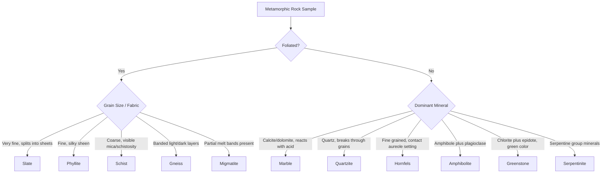

## Classification of Metamorphic Rocks

### Fundamental Basis of Classification

Metamorphic rocks are classified using a dual-criterion system, unlike igneous rocks (classified primarily on mineralogy/texture) or sedimentary rocks (classified primarily on grain size/composition). The two primary axes are:

1. **Texture/Fabric** — whether the rock is foliated or non-foliated, and the specific character of that fabric
2. **Mineral Composition** — the dominant mineral assemblage, which reflects both protolith bulk chemistry and metamorphic grade

A rock's full descriptive name typically combines both: for example, "garnet-mica schist" specifies texture (schist) and diagnostic minerals (garnet, mica).

### Primary Textural Divide: Foliated vs. Non-Foliated

**Foliated Rocks**

Foliation arises when platy (mica, chlorite) or elongate (amphibole) minerals grow or rotate into a preferred orientation under differential stress. Foliated rocks form a textural progression tied to increasing grain size and grade:

| Rock | Grain Size | Fabric Description | Typical Grade |
| --- | --- | --- | --- |
| Slate | Very fine (invisible to naked eye) | Dull, flat, splits into thin sheets (slaty cleavage) | Very low |
| Phyllite | Fine | Silky/satiny sheen from sub-visible mica | Low |
| Schist | Medium–coarse | Visible, strongly aligned platy minerals; pronounced sheen | Medium |
| Gneiss | Coarse | Segregated light/dark compositional banding | Medium–high |
| Migmatite | Coarse | Mixed metamorphic/igneous-textured bands (partial melt) | Very high (anatectic) |

**Non-Foliated Rocks**

Non-foliated textures occur when either the protolith lacks platy minerals (e.g., quartz-rich sandstone, calcite-rich limestone) or differential stress was minimal (e.g., contact metamorphism):

| Rock | Protolith | Diagnostic Texture |
| --- | --- | --- |
| Marble | Limestone/dolostone | Granoblastic, interlocking calcite/dolomite crystals |
| Quartzite | Quartz sandstone | Granoblastic, interlocking quartz crystals, fractures through grains rather than around them |
| Hornfels | Shale/mudstone (contact metamorphism) | Fine-grained, dense, splintery |
| Amphibolite | Basalt/gabbro | Granoblastic to weakly foliated; dominated by amphibole + plagioclase |
| Greenstone | Basaltic volcanic rocks | Fine-grained, green (chlorite/epidote/actinolite-rich) |
| Anthracite | Bituminous coal | Hard, lustrous, high carbon content |

### Foliation Subtypes in Detail

**Key Points**

- **Slaty cleavage**: planar fracture surfaces from parallel alignment of microscopic clay/mica minerals; grain size below optical resolution.
- **Schistosity**: coarser, visible alignment of platy minerals (muscovite, biotite, chlorite) producing a strong reflective sheen on foliation surfaces.
- **Gneissic banding**: segregation of felsic minerals (quartz, feldspar) into light bands and mafic minerals (biotite, hornblende) into dark bands, often with evidence of ductile flow folding.
- **Lineation**: a linear (rather than planar) fabric produced by alignment of elongate minerals (e.g., amphibole needles) or elongated mineral aggregates; can occur with or without foliation.
- **Augen texture**: large, eye-shaped feldspar porphyroclasts wrapped by finer foliated matrix, common in deformed granitic gneisses.

### Classification by Protolith and Compositional Series

Metamorphic rocks are also grouped by protolith affinity, since bulk chemistry constrains which mineral assemblages can form regardless of grade:

**Pelitic (aluminous/clay-rich) series** — derived from shale/mudstone

- Progression: slate → phyllite → schist → gneiss
- Diagnostic index minerals: chlorite, biotite, garnet, staurolite, kyanite/andalusite/sillimanite (Al₂SiO₅ polymorphs)

**Quartzo-feldspathic series** — derived from sandstone, granite, rhyolite

- Products: quartzite (from quartz sandstone), granitic gneiss (from granite/rhyolite)
- Relatively inert under isochemical metamorphism due to high proportion of stable quartz/feldspar

**Calcareous (carbonate) series** — derived from limestone, dolostone

- Products: marble (pure carbonate), calc-silicate rock (impure carbonate with SiO₂/Al₂O₃ producing wollastonite, tremolite, diopside)

**Mafic series** — derived from basalt, gabbro

- Progression with grade: greenschist (chlorite, epidote, actinolite) → amphibolite (hornblende, plagioclase) → granulite (pyroxene, plagioclase) → eclogite (garnet, omphacite, at high pressure)

**Ultramafic series** — derived from peridotite, dunite

- Product: serpentinite (serpentine group minerals, from hydration of olivine/pyroxene)

**Carbonaceous series** — derived from organic-rich sediment/coal

- Progression: peat → lignite → bituminous coal → anthracite → graphite (with increasing grade, essentially a metamorphic rank sequence of its own)

### Classification Flowchart

### Diagnostic Mineral Identification Table

| Mineral | Composition Family | Rock(s) Typically Found In | Diagnostic Significance |
| --- | --- | --- | --- |
| Chlorite | Phyllosilicate | Slate, greenschist | Very low to low grade |
| Muscovite | Phyllosilicate | Phyllite, schist | Low to medium grade, pelitic |
| Biotite | Phyllosilicate | Schist, gneiss | Low-medium grade onward |
| Garnet | Nesosilicate | Schist, amphibolite, eclogite | Medium to very high grade |
| Staurolite | Nesosilicate | Schist | Medium-high grade, pelitic only |
| Kyanite | Al₂SiO₅ polymorph | Schist, gneiss | High grade, high pressure |
| Sillimanite | Al₂SiO₅ polymorph | Gneiss | Very high grade |
| Andalusite | Al₂SiO₅ polymorph | Hornfels, schist | Low pressure regime (contact/Buchan) |
| Talc | Phyllosilicate | Soapstone (from ultramafics) | Low grade, Mg-rich |
| Serpentine | Phyllosilicate | Serpentinite | Hydration of ultramafic rock |
| Wollastonite | Inosilicate | Calc-silicate rock | Impure carbonate, high T |
| Tremolite–Actinolite | Amphibole | Marble, greenschist | Low-medium grade, mafic/calcareous |
| Hornblende | Amphibole | Amphibolite | Medium-high grade, mafic |
| Omphacite | Pyroxene (clinopyroxene) | Eclogite | Very high pressure |

### Field Identification Workflow

**Example**

When classifying an unknown metamorphic hand sample in the field or lab, apply this sequence:

1. Test for foliation by observing whether the rock splits along planar surfaces or shows visible mineral banding/alignment.
2. If foliated, assess grain size and mineral visibility to place it on the slate–phyllite–schist–gneiss continuum.
3. If non-foliated, test hardness and acid reactivity (marble effervesces with dilute HCl; quartzite does not and is harder than a steel knife blade).
4. Identify any diagnostic index minerals (garnet, staurolite, kyanite, sillimanite) to further refine grade and protolith inference.
5. Cross-reference color and mineral assemblage against protolith series (pelitic, mafic, calcareous, ultramafic) to complete the classification.

### Special and Transitional Rock Types

**Key Points**

- **Mylonite**: a fine-grained, foliated rock produced by ductile shearing along fault zones; distinct from cataclasite (brittle, unfoliated fault rock) because it forms via dynamic recrystallization rather than fracturing.
- **Cataclasite/Fault Breccia**: non-foliated, formed by brittle fracturing without significant recrystallization, common in shallow fault zones.
- **Blueschist**: fine-grained, blue-tinted (glaucophane-bearing) rock indicating high-pressure/low-temperature metamorphism typical of subduction zone environments.
- **Eclogite**: coarse-grained, garnet + omphacite-bearing, indicating very high pressure metamorphism of mafic protoliths, often associated with deeply subducted oceanic crust.
- **Skarn**: a calc-silicate rock formed by metasomatic reaction between an igneous intrusion and adjacent carbonate country rock, notable for its mineralogically distinct, often ore-bearing assemblages (garnet, pyroxene, wollastonite).

### Nomenclature Conventions

Standard petrographic naming conventions combine modifiers with a base rock name, arranged in increasing abundance toward the rock name itself:

$$\text{[accessory mineral]-[minor mineral]-[dominant mineral]} + \text{[textural base name]}$$

**Example**: "Staurolite-garnet-mica schist" indicates a schist whose primary visible platy minerals are micas, with garnet more abundant than staurolite, staurolite present as an accessory — read left to right in increasing abundance of the base term but with modifiers ordered by increasing abundance from left to right up to the rock name.

### Common Misconceptions

**Key Points**

- Foliation is a textural response to differential stress, not a direct indicator of metamorphic grade by itself; grade must be assessed via mineral assemblage, since low-grade slate and non-foliated hornfels can form at similar temperatures under different stress regimes.
- Marble and limestone are not interchangeable terms; marble specifically denotes the metamorphosed, recrystallized equivalent with characteristic interlocking calcite crystals, often losing original sedimentary structures like fossils and bedding.
- Not all banded rocks are gneisses; compositional banding can also be inherited from sedimentary bedding (relict layering) and should be distinguished from metamorphic segregation banding through field and microstructural context.
- Schist and gneiss are texturally, not compositionally, defined terms; a "granitic gneiss" and a "pelitic gneiss" can have very different bulk compositions while sharing the same textural classification.

### Related Topics

- Metamorphic facies and P-T conditions of formation
- Index minerals and Barrovian/Buchan metamorphic zonation
- Structural geology: foliation, lineation, and shear sense indicators
- Protolith reconstruction from metamorphic mineral assemblages
- Metasomatism and skarn ore deposits
- Contact metamorphic aureoles and hornfels facies series
- Fault rock classification: cataclasite–mylonite series
- Petrographic microscopy techniques for metamorphic rock identification
- The rock cycle: pathways between metamorphic, igneous, and sedimentary rocks