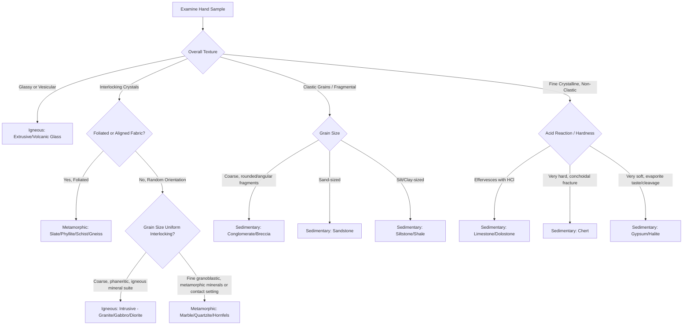

## Rock Identification in the Field

### Purpose and Scope

Field rock identification is the systematic process of determining a rock's category (igneous, sedimentary, or metamorphic) and specific type using observations and simple tests available outside the laboratory — hand lens, streak plate, dilute hydrochloric acid, steel knife/nail, and unaided visual/tactile inspection. It relies on macroscopic texture, mineralogy, structure, and field context (outcrop relationships) rather than thin-section petrography or geochemical analysis, which are laboratory-based confirmatory tools rather than field techniques.

### General Field Workflow

The identification process follows a consistent decision sequence regardless of eventual rock category:

1. **Establish field context**: note outcrop geometry, bedding/layering, contact relationships with adjacent rock, and overall landscape setting (these often narrow the category before the hand sample is even examined closely).
2. **Determine overall texture category**: crystalline/interlocking, clastic/fragmental, or glassy — this is the primary branch point separating igneous, sedimentary, and metamorphic pathways.
3. **Assess grain size**: coarse (visible crystals/grains), fine (not resolvable by eye), or glassy (no crystal structure).
4. **Test hardness and reactivity**: steel knife scratch test (~5.5 on Mohs scale) and dilute HCl acid test for carbonate content.
5. **Identify constituent minerals**: using color, luster, cleavage, and hardness of visible grains or crystals.
6. **Note structural/textural fabric**: foliation, bedding, vesicles, or massive/structureless character.
7. **Synthesize to rock name**: cross-reference all observations against classification criteria for the inferred rock category.

### Primary Textural Triage

**Key Points**

- **Crystalline, interlocking texture with random mineral orientation** → likely igneous (phaneritic/aphanitic) or non-foliated metamorphic (granoblastic); distinguish by presence of foliation, contact metamorphic setting, or diagnostic metamorphic minerals.
- **Crystalline texture with planar/aligned fabric (foliation)** → metamorphic.
- **Clastic (fragmental) texture with visible grains cemented together** → sedimentary (clastic).
- **Non-clastic, chemically/biochemically precipitated texture** (e.g., fine crystalline carbonate, evaporite) → sedimentary (chemical/biochemical).
- **Glassy, non-crystalline texture** → igneous (volcanic glass, e.g., obsidian) — glass does not occur naturally as a stable sedimentary or metamorphic texture.
- **Vesicular (bubble-textured) or frothy texture** → igneous, extrusive (e.g., scoria, pumice).

### Igneous Rock Field Identification

**Key diagnostic sequence**: grain size → color/composition → texture

| Grain Size | Origin Inference | Composition Clue (Color) | Example Rocks |
| --- | --- | --- | --- |
| Coarse (phaneritic) | Slow cooling, intrusive | Light = felsic; dark = mafic/ultramafic | Granite, diorite, gabbro, peridotite |
| Fine (aphanitic) | Fast cooling, extrusive | Light = felsic; dark = mafic | Rhyolite, andesite, basalt |
| Glassy | Very rapid cooling/quenching | Usually dark, glossy | Obsidian |
| Vesicular | Gas escape during eruption | Variable | Pumice (felsic, floats), scoria (mafic) |
| Pyroclastic/fragmental | Explosive eruption, ash/debris | Variable | Tuff, volcanic breccia |
| Porphyritic (two grain sizes) | Two-stage cooling history | Variable | Porphyritic andesite, porphyritic granite |

**Example**

A hand sample showing large, visible interlocking crystals of pink feldspar, clear quartz, and black biotite, with no preferred orientation, is field-identified as granite: coarse grain size indicates slow intrusive cooling, and the light overall color plus quartz content indicates felsic composition.

### Sedimentary Rock Field Identification

**Clastic Sedimentary Rocks** (classified by grain size, per the Udden-Wentworth scale)

| Grain Size | Rock Name (rounded) | Rock Name (angular) |
| --- | --- | --- |
| Coarse (>2 mm) | Conglomerate | Breccia |
| Sand (1/16–2 mm) | Sandstone | Sandstone |
| Silt (1/256–1/16 mm) | Siltstone | Siltstone |
| Clay (<1/256 mm) | Shale/Mudstone (fissile/blocky) | — |

**Chemical/Biochemical Sedimentary Rocks** (identified by mineral composition and acid reactivity)

| Rock | Diagnostic Test/Feature |
| --- | --- |
| Limestone | Vigorous effervescence with dilute HCl; often contains visible fossils |
| Dolostone | Effervesces with HCl only when powdered/scratched (unlike limestone) |
| Rock Gypsum | Very soft (scratched by fingernail, Mohs 2), evaporite setting |
| Rock Salt (Halite) | Salty taste, cubic cleavage, evaporite setting |
| Chert | Very hard (scratches steel), conchoidal fracture, fine-grained |
| Coal | Black, low density, combustible, organic-rich setting |

Sedimentary rocks are further diagnosed through **structural features** unique to the category: bedding/stratification, ripple marks, mud cracks, cross-bedding, and fossil content — none of which occur in igneous or (non-relict) metamorphic rocks.

### Metamorphic Rock Field Identification

The primary field branch point is foliated vs. non-foliated (see the Classification of Metamorphic Rocks reference for the full decision tree). Field-specific diagnostic shortcuts:

- **Splits into flat sheets, dull luster** → slate
- **Splits into sheets, silky/satiny sheen** → phyllite
- **Visible, aligned platy minerals, strong sheen** → schist
- **Banded light/dark layering, granular** → gneiss
- **Reacts vigorously with HCl, softer than steel knife** → marble
- **Does not react with HCl, harder than steel knife, breaks through grains** → quartzite
- **Green color, fine-grained, associated with mafic volcanic terrane** → greenstone
- **Occurs in a zone surrounding an igneous intrusion, fine-grained, dense** → hornfels
- **Found along a fault zone, foliated and fine-grained** → mylonite; if unfoliated and fragmental → cataclasite

### Field Identification Decision Flowchart

### Essential Field Tests Reference

| Test | Tool | What It Reveals |
| --- | --- | --- |
| Scratch test | Steel knife/nail (Mohs ~5.5), fingernail (Mohs 2.5) | Relative hardness of minerals/rock matrix |
| Acid test | Dilute (~10%) HCl | Presence of carbonate minerals (calcite reacts readily, dolomite reacts when powdered) |
| Streak test | Unglazed porcelain streak plate | True color of a mineral's powder, useful for opaque/metallic minerals |
| Magnetism test | Hand magnet | Presence of magnetite or other ferromagnetic minerals |
| Taste test | Direct (only for known-safe evaporites) | Distinguishes halite (salty) from other evaporite minerals |
| Fizz/effervescence observation | Visual + HCl | Distinguishes limestone from similar-looking non-carbonate rocks |

### Field Context Clues Beyond the Hand Sample

**Key Points**

- **Bedding and stratification** in outcrop strongly indicate a sedimentary origin, even if the individual hand sample texture is ambiguous.
- **Cross-cutting relationships** (a rock body cutting across layering of another) indicate the cross-cutting body is igneous (intrusive) and younger than the host rock.
- **Contact aureoles** (a zone of altered rock immediately surrounding an igneous body) indicate contact metamorphism and predict hornfels-type textures nearby.
- **Regional structural trends** (foliation planes, fold patterns visible at outcrop scale) support a regional metamorphic setting and help distinguish tectonic foliation from sedimentary bedding.
- **Vesicles concentrated near the top of a flow unit** support a volcanic (extrusive igneous) origin over a plutonic one.

### Common Field Misidentification Pitfalls

**Key Points**

- Relict sedimentary bedding can be mistaken for gneissic banding; check for evidence of metamorphic mineral growth (mica, garnet) cross-cutting the layering, which indicates true metamorphic segregation rather than inherited bedding.
- Weathered rock surfaces (rinds, staining, exfoliation) frequently obscure true color and texture; always break a fresh surface with a rock hammer before assessing color and grain characteristics.
- Chert and quartzite can both scratch steel and appear superficially similar; quartzite typically shows a granular, sugary texture on close inspection and may retain relict sedimentary grain boundaries, while chert is cryptocrystalline with conchoidal fracture.
- Dolostone is easily mistaken for limestone in the field; the diagnostic difference is that dolostone only effervesces with dilute HCl when the surface is scratched or powdered, while limestone effervesces on an unmarked surface.
- Porphyritic igneous texture (large crystals in a fine matrix) should not be confused with a poorly sorted sedimentary conglomerate; the matrix-to-clast relationship (interlocking crystalline matrix vs. cemented fragmental matrix) is the distinguishing feature.

### Related Topics

- Mohs hardness scale and mineral identification techniques
- Classification of Igneous Rocks (texture and composition)
- Classification of Sedimentary Rocks (clastic and chemical)
- Classification of Metamorphic Rocks (foliated and non-foliated)
- Outcrop-scale structural geology: bedding, foliation, and cross-cutting relationships
- Weathering processes and their effect on rock surface appearance
- Use of the hand lens and field petrographic techniques
- The rock cycle: field evidence for igneous, sedimentary, and metamorphic transitions