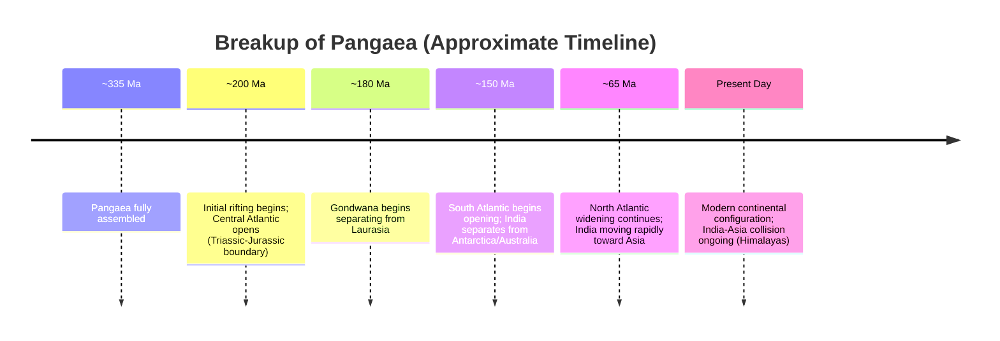

## Continental Drift Theory

### Definition and Historical Origin

Continental Drift Theory proposes that Earth's continents were once joined together as a single supercontinent and subsequently separated, drifting to their present positions over geologic time. The theory was formally articulated by German meteorologist and geophysicist Alfred Wegener, who published his comprehensive case in *Die Entstehung der Kontinente und Ozeane* ("The Origin of Continents and Oceans") in 1915, though earlier scholars (including Abraham Ortelius in 1596 and Antonio Snider-Pellegrini in 1858) had noted the apparent jigsaw-fit of continental coastlines.

Wegener proposed that all present-day continents were once assembled into a single landmass he named **Pangaea** ("all Earth"), surrounded by a single global ocean, **Panthalassa**. He hypothesized that Pangaea began rifting apart roughly 200 million years ago (near the Triassic–Jurassic boundary), with fragments drifting to their current configuration.

### Lines of Evidence Presented by Wegener

**Key Points**

- **Coastline fit**: the continental margins of South America and Africa, and to a lesser degree other continents, fit together like puzzle pieces when repositioned, particularly when matched along the continental shelf edge rather than the modern coastline.
- **Fossil correlation**: identical fossil species of organisms incapable of transoceanic travel were found on now widely separated continents:
  - *Mesosaurus* (a freshwater reptile) — found only in matching strata of South America and Africa
  - *Glossopteris* (a seed fern) — found across South America, Africa, India, Antarctica, and Australia
  - *Cynognathus* and *Lystrosaurus* (land-dwelling reptiles) — found across similarly separated southern continents
- **Rock and mountain belt continuity**: matching rock sequences, ages, and structural trends of mountain belts on separated continents align when the continents are reassembled (e.g., the Appalachian belt of eastern North America correlates with mountain belts in Greenland, Scotland, and Scandinavia).
- **Paleoclimatic evidence**: glacial striations, till deposits, and glacial sedimentary sequences of the same age found in regions now located in tropical or temperate zones (South America, Africa, India, Australia, Antarctica) suggest these continents were once positioned near a single ancient south polar region, and their present dispersed, differently-oriented striation directions align when reassembled into Pangaea.

### Why Continental Drift Was Initially Rejected

**Key Points**

- Wegener could not identify a physically plausible **mechanism** capable of moving entire continents through oceanic crust; his suggested drivers (tidal forces, Earth's rotation/centrifugal effect) were shown by contemporary physicists to be many orders of magnitude too weak.
- Wegener proposed that continents "plowed" through oceanic crust like ships through ice, a mechanism inconsistent with the known mechanical strength of oceanic crust at the time.
- The geological establishment, dominated at the time by proponents of a static, permanent continents-and-ocean-basins model, viewed the fossil and rock correlations as potentially explained by now-submerged land bridges rather than lateral continental movement.
- Wegener was an outsider to mainstream geology (trained in astronomy and meteorology), which contributed to resistance from the geological community, though this was a secondary sociological factor rather than the primary scientific objection.

### The Missing Mechanism: Bridging to Plate Tectonics

Continental Drift Theory remained a marginalized hypothesis for several decades until independent lines of mid-20th-century evidence supplied a viable mechanism, transforming the idea into the modern, universally accepted theory of plate tectonics:

- **Paleomagnetism** — studies of magnetized minerals in rock, beginning in the 1950s, revealed apparent polar wander paths that differed between continents, best explained by the continents themselves having moved rather than the pole
- **Seafloor spreading** — proposed by Harry Hess (1960s), demonstrating that new oceanic crust forms at mid-ocean ridges and spreads laterally, providing the physical mechanism Wegener lacked
- **Magnetic striping of the ocean floor** — symmetric, mirror-image patterns of magnetic polarity reversal recorded in oceanic crust on either side of mid-ocean ridges, confirmed by Vine and Matthews (1963), providing direct, datable proof of seafloor spreading
- **Global seismicity patterns** — the discovery that earthquakes concentrate along narrow, continuous belts (mid-ocean ridges, subduction zones, transform faults) delineated the boundaries of rigid lithospheric plates

$$\text{Continental Drift (Wegener, 1915)} \;+\; \text{Seafloor Spreading (Hess, 1960s)} \;\rightarrow\; \text{Plate Tectonics (1960s–present)}$$

### Continental Drift vs. Plate Tectonics: Key Distinction

**Key Points**

- **Continental Drift** described *what* was observed to happen (continents have moved and were once joined) but lacked a physically coherent driving mechanism.
- **Plate Tectonics** explains *how and why* it happens: rigid lithospheric plates, comprising both continental and oceanic crust together with the uppermost rigid mantle, move atop the semi-plastic asthenosphere, driven primarily by mantle convection, slab pull, and ridge push forces.
- A crucial refinement: in plate tectonics, it is not continents "plowing through" static ocean floor (Wegener's flawed mechanism), but entire rigid plates — continental and oceanic crust together — moving as coherent units, with oceanic crust being continuously created at ridges and destroyed at subduction zones.

### Supercontinent Cycle Context

Pangaea was not a singular, one-time event but the most recent in a proposed recurring cycle of supercontinent assembly and breakup, termed the **Wilson Cycle**, extending Wegener's original insight to Earth's deeper geologic history:

| Supercontinent | Approximate Age of Assembly | Notes |
| --- | --- | --- |
| Vaalbara | ~3.6–2.8 billion years ago | *[Unverified: existence and configuration remain debated among researchers due to limited preserved rock record]* |
| Kenorland | ~2.7 billion years ago | Archean-Proterozoic boundary supercontinent |
| Columbia (Nuna) | ~1.8 billion years ago | Paleoproterozoic |
| Rodinia | ~1.1 billion years ago | Neoproterozoic; breakup linked to Cryogenian glaciations |
| Pannotia | ~0.6 billion years ago | Short-lived, late Neoproterozoic |
| Pangaea | ~335–175 million years ago (assembled–began rifting) | Most recent; directly documented by Wegener's evidence |

### Reconstruction Diagram: Pangaea Breakup Sequence

### Evidence Correlation Illustration (svg_diagram)

<svg xmlns="http://www.w3.org/2000/svg" viewBox="0 0 800 380" font-family="Helvetica, Arial, sans-serif">
<text x="400" y="25" text-anchor="middle" font-size="16" font-weight="bold">Evidence for Continental Drift: Fossil and Glacial Correlation Across Gondwana (svg_diagram)</text>
<ellipse cx="400" cy="210" rx="330" ry="150" fill="#f0e6d2" stroke="#8a7355" stroke-width="1.5" stroke-dasharray="4,3" />
<text x="400" y="70" text-anchor="middle" font-size="12" font-style="italic">Reassembled Gondwana (schematic, not to scale)</text>
<g>
<ellipse cx="250" cy="230" rx="90" ry="70" fill="#c9a876" stroke="#7a5c3a" />
<text x="250" y="230" text-anchor="middle" font-size="12" font-weight="bold">South America</text>
</g>
<g>
<ellipse cx="420" cy="220" rx="95" ry="80" fill="#b89968" stroke="#7a5c3a" />
<text x="420" y="220" text-anchor="middle" font-size="12" font-weight="bold">Africa</text>
</g>
<g>
<ellipse cx="560" cy="150" rx="55" ry="45" fill="#c9a876" stroke="#7a5c3a" />
<text x="560" y="150" text-anchor="middle" font-size="11" font-weight="bold">India</text>
</g>
<g>
<ellipse cx="600" cy="280" rx="60" ry="45" fill="#b89968" stroke="#7a5c3a" />
<text x="600" y="280" text-anchor="middle" font-size="11" font-weight="bold">Antarctica</text>
</g>
<g>
<ellipse cx="680" cy="200" rx="50" ry="40" fill="#c9a876" stroke="#7a5c3a" />
<text x="680" y="200" text-anchor="middle" font-size="11" font-weight="bold">Australia</text>
</g>
<circle cx="230" cy="215" r="5" fill="#3a6b3a" />
<circle cx="400" cy="200" r="5" fill="#3a6b3a" />
<circle cx="545" cy="140" r="5" fill="#3a6b3a" />
<circle cx="610" cy="270" r="5" fill="#3a6b3a" />
<circle cx="665" cy="195" r="5" fill="#3a6b3a" />
<text x="400" y="345" text-anchor="middle" font-size="11" fill="#3a6b3a">● Glossopteris fossil occurrences (matched across continents)</text>
<line x1="260" y1="255" x2="270" y2="270" stroke="#333" stroke-width="2" />
<line x1="270" y1="270" x2="285" y2="260" stroke="#333" stroke-width="2" />
<line x1="430" y1="260" x2="440" y2="278" stroke="#333" stroke-width="2" />
<text x="360" y="365" text-anchor="middle" font-size="11" fill="#333">Glacial striation directions align when continents are reassembled</text>
</svg>

### Common Misconceptions

**Key Points**

- Continental Drift Theory and Plate Tectonic Theory are not the same theory under different names; Continental Drift was Wegener's original hypothesis, later validated and mechanistically explained by the broader framework of plate tectonics.
- Wegener's theory was not rejected for lack of evidence, but because he could not provide a physically credible driving mechanism consistent with known crustal strength; the observational evidence (fossils, rock correlation, glacial striations) he presented was substantially correct.
- Pangaea was not the only supercontinent in Earth's history; it is the most recent in a longer proposed sequence of supercontinent cycles extending back through the Precambrian.
- The continents do not "float" on liquid magma; the mechanism involves rigid plates moving atop the ductile, solid (not liquid) asthenosphere, driven by mantle convection and plate-boundary forces.

### Related Topics

- Plate Tectonics: mechanisms of plate motion (ridge push, slab pull, mantle convection)
- Seafloor Spreading and Mid-Ocean Ridges
- Paleomagnetism and Magnetic Reversal Stratigraphy
- Types of Plate Boundaries (divergent, convergent, transform)
- The Wilson Cycle and Supercontinent Reconstruction
- Paleoclimatology and Glacial Evidence in the Rock Record
- Structural Geology of Orogenic (Mountain) Belts
- Gondwana and Laurasia: the Two Halves of Pangaea